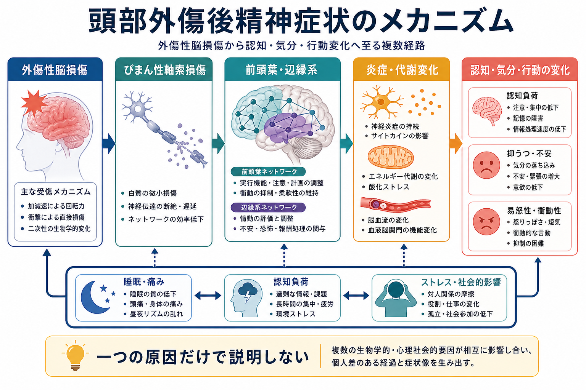
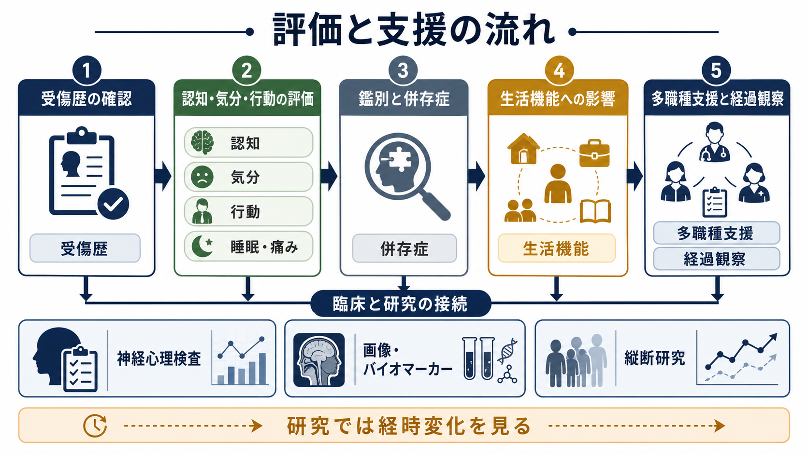

# 頭部外傷後精神症状とは何か

## 要点

- 頭部外傷後精神症状とは、外傷性脳損傷や脳震盪のあとに現れる、注意・記憶・処理速度などの認知変化、抑うつ・不安・易怒性などの気分変化、衝動性・無関心・社会的判断の変化などの行動変化をまとめて扱う臨床的な見方である[1][2]。
- 症状は「脳の損傷だけ」でも「心理的ショックだけ」でも説明しにくい。軸索損傷、前頭葉・辺縁系ネットワークの変化、炎症・代謝変化、睡眠障害、痛み、社会参加の低下が相互に影響する[3][4]。
- 軽症頭部外傷でも、数日から数週間の頭痛、疲労、集中困難、情緒不安定、睡眠変化は珍しくない。多くは改善するが、一部では長引き、[[うつ病とは何か]]、[[不安症群とは何か]]、[[PTSDとは何か]]、物質使用、慢性疼痛などとの鑑別・併存評価が必要になる[1][5]。
- 本記事は教育・研究目的の概説であり、個別の診断や治療指示ではない。症状が急に悪化する、けいれん、強い混乱、意識障害、片側の脱力などがある場合は救急評価が優先される[1]。

## この記事で答える問い

1. 頭部外傷後精神症状は、どのような症状群を指すのか。
2. なぜ認知・気分・行動が同時に変化しうるのか。
3. 一次性の精神疾患、[[器質性精神病とは何か]]、[[身体疾患による気分障害とは何か]]とはどう見分けるのか。
4. 臨床・研究では、どのような評価軸で理解すればよいのか。

## まず結論

頭部外傷後精神症状は、頭部外傷のあとに「性格が変わった」「怒りっぽくなった」「集中できない」「気分が落ち込む」「眠れない」「仕事や学業に戻りにくい」といった形で見えることが多い。重要なのは、これを単一の精神疾患名に急いで回収しないことである。外傷の重症度、受傷前の精神・発達・睡眠・物質使用歴、急性期の意識障害や健忘、画像所見、痛み、疲労、家族・職場環境、補償や訴訟の文脈まで含めて、時間経過の中で整理する必要がある[2][6]。

軽症外傷では、症状が本人にも周囲にも見えにくいことがある。CDC は、軽症TBI・脳震盪の症状が「感じ方・考え方・行動・睡眠」にまたがり、受傷直後だけでなく数時間から数日後に出ることがあると整理している[1]。したがって、頭部外傷後精神症状の理解では、受傷直後の神経学的危険徴候と、数日から数か月にわたる認知・情動・生活機能の変化を分けて考える。

## 背景

外傷性脳損傷（traumatic brain injury; TBI）は、外力によって脳機能が障害される状態である。臨床的には、意識消失、外傷後健忘、意識変容、神経学的異常、画像上の頭蓋内損傷などを手がかりに、軽症・中等症・重症へ分類されることが多い[2]。ただし、精神症状の強さは重症度だけでは決まらない。軽症でも、疲労、頭痛、睡眠の乱れ、集中困難、不安が重なれば生活機能は大きく落ちる。一方、重症外傷後でも、環境調整とリハビリテーションにより症状の意味づけや機能回復が進むことがある。

精神医学的には、頭部外傷後の症状は複数のレベルに分かれる。第一に、注意、記憶、処理速度、実行機能などの認知変化がある。第二に、抑うつ、不安、PTSD症状、情動失禁、易怒性などの気分・情動変化がある。第三に、脱抑制、衝動性、攻撃性、無関心、病識低下、社会的判断の変化などの行動変化がある[3][6]。

この分け方は便宜的であり、現実には重なり合う。たとえば処理速度が落ちると、会話や仕事についていけず不安が増える。不眠や疼痛が続くと、注意力が落ち、易怒性が増す。抑うつが強いと、記憶力そのものが低下したように感じられる。したがって「認知症状か気分症状か」ではなく、相互作用する症状ネットワークとして見るほうが実践的である[6]。

## 基本概念

### 外傷後症状と精神症状

外傷後に見られる症状は、身体症状、認知症状、情動症状、睡眠症状にまたがる。CDC の整理では、頭痛、めまい、光や音への過敏、疲労、集中困難、記憶困難、思考の遅さ、不安、易怒性、悲しさ、睡眠過多・不眠などが代表的である[1]。精神症状と呼ぶときも、身体症状や睡眠を切り離さないことが重要である。

### 一次性精神疾患との関係

頭部外傷後に[[うつ病とは何か]]、[[不安症群とは何か]]、[[PTSDとは何か]]に相当する症状が出ることはある。しかし、外傷後の抑うつや不安は、脳ネットワークの障害、痛み、睡眠、失職・休学、社会的孤立、事故記憶、受傷前の脆弱性が重なって生じることが多い[5][7]。そのため、診断名だけで原因を決めるのではなく、受傷前後の変化と機能障害を並べて評価する。

### 「性格が変わった」と見える症状

前頭葉・眼窩前頭皮質・辺縁系・白質ネットワークの障害は、抑制、報酬処理、情動調整、社会的判断に影響しうる。周囲からは「怒りっぽい」「こだわる」「無関心」「空気が読めない」「約束を守れない」と見えることがある[3][6]。これは道徳性の問題として片づけるより、実行機能、疲労、刺激過敏、病識低下、環境負荷の組み合わせとして理解するほうが支援につながる。

## 仕組み

### 1. 軸索損傷とネットワーク効率の低下

頭部外傷では、衝撃や加減速によって白質線維が引き伸ばされ、びまん性軸索損傷または微細な外傷性軸索障害が起こりうる。注意、記憶、処理速度、実行機能は広い脳ネットワークの協調に依存するため、局所の損傷が小さく見えても、ネットワーク効率の低下として症状が現れることがある[4]。

### 2. 神経代謝カスケード

脳震盪や軽症TBIでは、細胞膜の伸展、イオン流動、グルタミン酸放出、エネルギー需要の増加、ミトコンドリア機能の変化が連鎖し、急性期の認知低下や疲労、光過敏、頭痛の背景になりうる[4]。この段階では、画像検査で明確な異常が見えなくても症状が成立しうる。

### 3. 炎症・血液脳関門・二次損傷

一次損傷のあとには、神経炎症、血液脳関門の変化、酸化ストレス、代謝変化などの二次的プロセスが生じる。これらは急性期から慢性期まで、頭痛、疲労、認知負荷への弱さ、気分変化に関わる可能性がある[4]。ただし、個々の症状を一つの分子機序だけに還元できる段階ではない。

### 4. 心理社会的要因との相互作用

事故は身体損傷であると同時に、恐怖、喪失、役割変化、経済的不安を伴う出来事でもある。受傷後に仕事量を戻しすぎる、睡眠が崩れる、頭痛を我慢する、周囲から理解されない、といった条件が重なると、症状は維持されやすい[6]。逆に、症状の説明、段階的な活動再開、環境調整、家族・職場との共有は、二次的な悪循環を弱める支援になる。

## 図解

1枚目の図は、外傷性脳損傷から認知・気分・行動変化へ至る複数経路を示している。重要なのは、びまん性軸索損傷、前頭葉・辺縁系ネットワーク、炎症・代謝変化、睡眠・痛み・ストレスが並列に働く点である。

2枚目の図は、評価と支援の流れを示している。受傷歴の確認、認知・気分・行動・睡眠・痛みの評価、鑑別と併存症、生活機能への影響、多職種支援と経過観察を一つの流れとして扱う。

## 臨床・研究との接続

### 評価で見るべき軸

評価では、少なくとも次の軸を分けて記録する。

| 軸 | 見る内容 |
|---|---|
| 受傷情報 | 日時、外力、意識消失、外傷後健忘、画像所見、けいれん、反復受傷 |
| 認知 | 注意、処理速度、記憶、実行機能、病識、疲労による変動 |
| 気分・不安 | 抑うつ、不安、PTSD症状、易怒性、希死念慮 |
| 行動 | 脱抑制、衝動性、攻撃性、無関心、社会的判断 |
| 身体・睡眠 | 頭痛、めまい、疼痛、視覚過敏、睡眠障害 |
| 併存・鑑別 | 薬物、アルコール、発達特性、既往精神疾患、内分泌・神経疾患 |
| 生活機能 | 学業、就労、家事、運転、対人関係、家族負担 |

VA/DoD の軽症TBIガイドラインは、受傷後7日を超えて症状が続く場合、症状に応じた評価と管理、教育、段階的な活動、併存する睡眠・疼痛・精神症状への対応を重視している[2]。これは「頭部外傷後精神症状」という広い現象を、単一の治療対象ではなく、機能回復のための複数課題として扱う視点である。

### 抑うつ・PTSD・自殺リスク

TBI後の抑うつは頻度が高く、回復と生活機能に影響する。韓国の全国縦断研究では、TBI経験者は対照群より後のうつ病リスクが高く、特に受傷後1年でリスク上昇が大きかった[7]。また、TBI後の大うつ病とPTSDの予測因子を扱った系統的レビューでは、受傷前の精神疾患、女性、低教育、外傷後症状の強さなど、複数のリスク因子が検討されている[8]。研究知見は集団レベルの傾向であり、個人の発症を決めつけるものではないが、フォローアップで気分・不安・自殺リスクを見落とさない根拠になる。

### 治療研究の読み方

薬物療法や心理社会的介入の研究は増えているが、TBI後の精神症状は異質性が高い。抗うつ薬のメタ解析では、前後比較では改善が見える一方、プラセボ対照試験だけでは明確な優位性が一貫しないなど、研究デザインにより結論が変わる[5]。したがって、臨床では「TBI後だからこの薬」という単純化ではなく、標的症状、認知副作用、けいれんリスク、睡眠、疼痛、リハビリテーションとの整合性を慎重に見る。

## よくある誤解

### 誤解1: 画像に異常がなければ症状は心理的なものだけである

軽症TBIや脳震盪では、通常のCTやMRIで明確な異常が見えないことがある。しかし、神経代謝変化や微細な軸索障害、睡眠・痛み・疲労の影響により症状は起こりうる[1][4]。画像所見は重要だが、症状の有無を単独で決める検査ではない。

### 誤解2: 精神症状があるなら一次性精神疾患である

頭部外傷後に[[うつ病とは何か]]や[[不安症群とは何か]]の診断基準を満たすことはあるが、それだけで外傷との関係が消えるわけではない。外傷、心理的ストレス、疼痛、睡眠、社会的役割の変化、受傷前の脆弱性が重なるため、一次性か二次性かを一回で割り切るより、経過と要因を更新しながら見る。

### 誤解3: 怒りっぽさや無関心は本人の性格の問題である

易怒性、衝動性、無関心、病識低下は、前頭葉・辺縁系ネットワークや実行機能、疲労、環境負荷と関連しうる[3][6]。責任を免除するという意味ではなく、支援可能な認知・環境要因として分解することが重要である。

### 誤解4: 安静にしていれば必ずよくなる

急性期の休息は重要だが、長期の完全安静が常に最善とは限らない。軽症TBI後の持続症状では、教育、症状に応じた段階的活動、睡眠・疼痛・気分症状の評価、必要に応じたリハビリテーションが検討される[2]。

## 関連ノート

### 既存ノート

- [[PTSDとは何か]]
- [[うつ病とは何か]]
- [[不安症群とは何か]]
- [[不眠障害とは何か]]
- [[器質性精神病とは何か]]
- [[身体疾患による気分障害とは何か]]
- [[統合失調症の認知機能障害とは何か]]

### 今後の作成候補

- 外傷性脳損傷とは何か
- 高次脳機能障害とは何か
- 脳震盪後症候群とは何か
- 前頭葉症候群とは何か
- 神経心理検査とは何か
- 頭部外傷後のリハビリテーションとは何か

### MOC更新候補

- `content/00_MOC/` 配下の精神医学・神経科学関連MOCに、本記事を「神経精神医学」「器質性・身体疾患関連精神症状」「高次脳機能」の接点として追加する候補。

## 理解チェック

1. 頭部外傷後精神症状を、認知・気分・行動・睡眠・身体症状に分けると、それぞれどのような例があるか。
2. 画像検査で明確な異常がない軽症TBIでも症状が残りうる理由は何か。
3. TBI後の抑うつや不安を、一次性精神疾患だけで説明しないほうがよい理由は何か。
4. 家族や職場が「性格が変わった」と感じる症状を、どのような評価軸に分解できるか。
5. 臨床研究を読むとき、TBI後精神症状の異質性はどのような問題を生むか。

## 参考文献

[1] Centers for Disease Control and Prevention. Symptoms of Mild TBI and Concussion. 2025. https://www.cdc.gov/traumatic-brain-injury/signs-symptoms/index.html

[2] Department of Veterans Affairs and Department of Defense. *VA/DoD Clinical Practice Guideline for the Management and Rehabilitation of Post-Acute Mild Traumatic Brain Injury*. 2021. https://www.healthquality.va.gov/guidelines/rehab/mtbi/

[3] Howlett JR, Nelson LD, Stein MB. Mental health consequences of traumatic brain injury. *Biological Psychiatry*. 2022;91(5):413-420. https://doi.org/10.1016/j.biopsych.2021.09.024

[4] Giza CC, Hovda DA. The new neurometabolic cascade of concussion. *Neurosurgery*. 2014;75(Suppl 4):S24-S33. https://pmc.ncbi.nlm.nih.gov/articles/PMC4479139/

[5] Kreitzer N, Ancona R, McCullumsmith C, et al. The effect of antidepressants on depression after traumatic brain injury: a meta-analysis. *Journal of Head Trauma Rehabilitation*. 2019;34(3):E47-E54. https://doi.org/10.1097/HTR.0000000000000439

[6] Arciniegas DB. Addressing neuropsychiatric disturbances during rehabilitation after traumatic brain injury: current and future methods. *Dialogues in Clinical Neuroscience*. 2011;13(3):325-345. https://doi.org/10.31887/DCNS.2011.13.2/darciniegas

[7] Choi Y, Kim EY, Sun J, et al. Incidence of depression after traumatic brain injury: a nationwide longitudinal study of 2.2 million adults. *Journal of Neurotrauma*. 2022;39(5-6):390-397. https://doi.org/10.1089/neu.2021.0111

[8] Cnossen MC, Scholten AC, Lingsma HF, et al. Predictors of major depression and posttraumatic stress disorder following traumatic brain injury: a systematic review and meta-analysis. *Journal of Neuropsychiatry and Clinical Neurosciences*. 2017;29(3):206-224. https://doi.org/10.1176/appi.neuropsych.16090165

## 未解決問題

- TBI後の精神症状を、脳損傷、心理的外傷、疼痛、睡眠、社会的要因へどの程度分解できるかは、個人レベルではまだ不確実性が大きい。
- 軽症TBI後の持続症状に対して、どの介入をどのタイミングで組み合わせるべきかは、症状プロファイル別の研究がさらに必要である。
- 画像・血液バイオマーカー・神経心理検査を、日常臨床の予後予測にどう統合するかは発展途上である。
