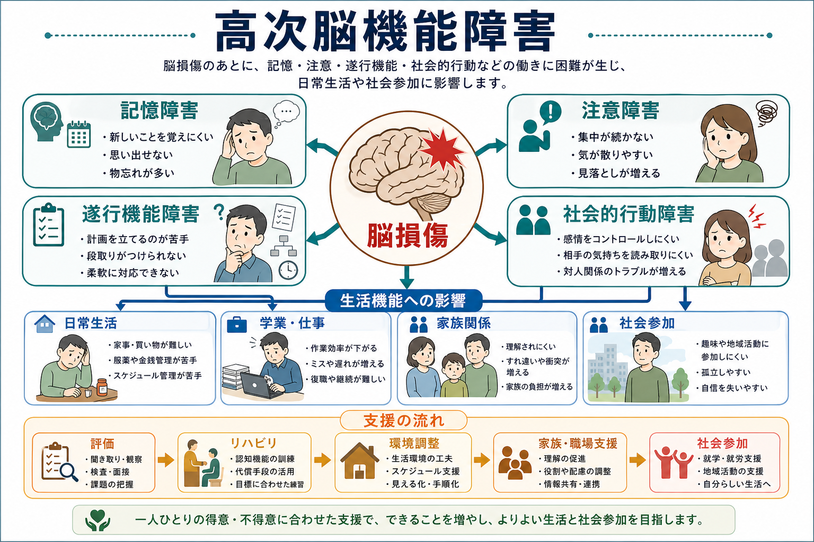
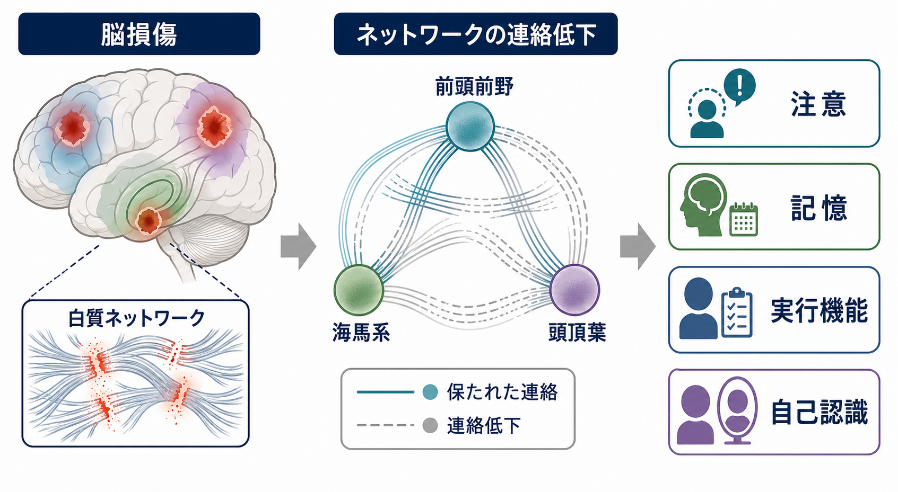
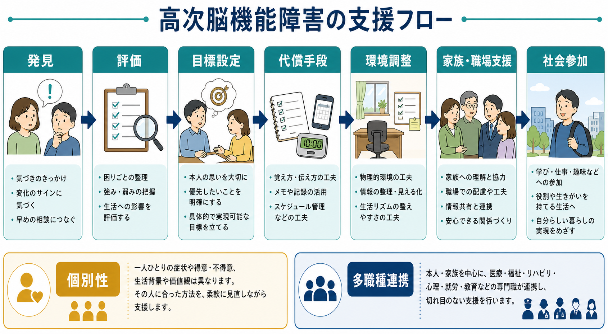

# 高次脳機能障害とは何か

## 要点

- 高次脳機能障害は、病気や事故による脳の器質的病変のあとに、[[記憶障害とは何か|記憶障害]]、[[注意障害とは何か|注意障害]]、遂行機能障害、社会的行動障害、失語・失行・失認などが残り、日常生活や社会生活に制約が生じる状態を指す[1][2]。
- 日本では、学術的には脳損傷に起因する認知障害全般を含む広い概念であり、行政的には支援を必要とする一群を見えやすくするための実践的カテゴリーとして発展してきた[2][3]。
- 外見から分かりにくく、本人も困難を自覚しにくいことがあるため、「怠け」「性格」「やる気」の問題と誤解されやすい[1][4]。
- 仕組みは単一部位の損傷だけでなく、前頭前野、側頭葉・海馬系、頭頂葉、白質ネットワークを含む広い連絡の低下として理解するとよい[5][6]。
- 支援は、検査点数だけでなく生活場面の困りごとを見て、代償手段、環境調整、家族・職場支援、多職種連携を組み合わせる[5][8]。

## この記事で答える問い

この記事では、高次脳機能障害を「脳が傷ついた後の認知機能の問題」とだけ説明せず、どのような症状が、どのような生活上の困難として現れ、なぜ評価と支援が必要になるのかを整理する。教育・研究目的の概説であり、個別の診断や治療方針を示すものではない。

## まず結論

高次脳機能障害は、脳損傷後に「覚える」「集中する」「段取りを組む」「感情や対人行動を調整する」といった高次の情報処理がうまく働かなくなる状態である。重要なのは、症状名よりも生活機能である。短い面接や検査室では目立たなくても、買い物、服薬、金銭管理、通学・就労、家族関係、約束、交通機関の利用などで困難が表面化する。

したがって、評価では[[認知機能検査は何を測っているのか|認知機能検査]]、[[MSEで認知機能をどう評価するか|精神状態診察での認知機能評価]]、本人の訴え、家族・支援者からの情報、生活場面の観察を統合して読む必要がある。支援では「できないことを指摘する」よりも、できる条件を設計し直すことが中心になる。

## 背景

高次脳機能障害の原因には、外傷性脳損傷、脳卒中、脳炎、低酸素脳症、脳腫瘍、手術後の損傷などが含まれる。日本の高次脳機能障害者支援法では、疾病または事故による脳の器質的病変に起因すると認められる記憶障害、注意障害、遂行機能障害、社会的行動障害、失語、失行、失認、その他の認知機能障害として定義され、全国で約23万人と推計されている[1]。

この概念が重要なのは、医学的な障害名であると同時に、支援の入口でもあるからである。国立障害者リハビリテーションセンターの解説では、学術用語としては脳損傷に起因する認知障害全般を含むが、支援モデル事業では、記憶、注意、遂行機能、社会的行動などの障害によって生活適応に困難をもつ一群を行政的に「高次脳機能障害」と呼ぶ整理が行われた[2][3]。

## 基本概念

代表的な症状は、以下の四つに分けると理解しやすい。

| 領域 | 典型的な現れ方 | 生活場面での困りごと |
|---|---|---|
| 記憶障害 | 新しい出来事を覚えにくい、同じ質問を繰り返す、物の置き場所を忘れる | 服薬、予定、金銭、通院、仕事の手順が保ちにくい |
| 注意障害 | 集中が続かない、ミスが増える、同時処理で混乱する | 作業が遅くなる、事故リスクが上がる、会話を追いにくい |
| 遂行機能障害 | 計画、優先順位、段取り、柔軟な切り替えが難しい | 約束に間に合わない、家事や仕事を始められない、途中で破綻する |
| 社会的行動障害 | 易怒性、脱抑制、こだわり、意欲低下、相手の気持ちの読み取りにくさ | 家族関係、職場適応、対人トラブル、孤立に影響する |

失語、失行、失認、半側空間無視などの巣症状も、高次脳機能障害の広い学術的範囲に入る。行政的・支援実務上の文脈では、特に記憶、注意、遂行機能、社会的行動の障害と生活制約の組み合わせが重視される[2][4]。

## 仕組み

高次脳機能は、一つの「高次脳機能中枢」だけで担われるものではない。記憶には海馬系と前頭葉、注意には前頭・頭頂ネットワークや覚醒系、遂行機能には前頭前野と皮質下回路、社会的認知には前頭側頭ネットワークや情動処理系が関わる。外傷性脳損傷では、びまん性の損傷や白質連絡の障害が起こりやすく、注意や情報処理速度の低下が臨床上よく問題になる[6]。

このため、症状と病変部位を一対一に対応させすぎると見誤る。小さな損傷でも、ネットワークの要所にあれば生活への影響が大きくなることがある。逆に、画像上の病変が目立っても、代償、環境、支援、本人の戦略によって生活上の困難が軽くなることもある。[[拡散テンソル画像DTIは白質線維をどう可視化するのか|DTI]]や[[トラクトグラフィーとは何か|トラクトグラフィー]]の考え方は、白質連絡として高次脳機能を理解する入口になる。

## 図解

上の概念地図は、高次脳機能障害を「症状領域」と「生活機能」の両面から見るための図である。下の支援フローは、評価から社会参加までを直線的に描いているが、実際には行きつ戻りつする。たとえば、就労再開を目標にしたあとで疲労や注意低下が明らかになり、目標設定、作業量、メモの使い方、周囲への説明を再調整することがある。

## 臨床・研究との接続

臨床では、まず原因疾患と時期を確認する。急性期には[[せん妄とは何か|せん妄]]、意識障害、薬剤、睡眠、疼痛、感染、てんかん、うつ、不安などが認知機能を悪化させることがある。慢性期には、本人の困りごと、家族の観察、仕事や学校での失敗、疲労、環境との相互作用が重要になる。精神医学的には、[[器質性精神病とは何か|器質性精神障害]]、うつ病、PTSD、物質使用、認知症、発達特性との鑑別や併存を考える。

認知リハビリテーションの研究では、注意、記憶、遂行機能、社会的コミュニケーションを対象に、訓練、代償方略、環境調整、目標管理、家族・支援者への介入が検討されてきた。Ciceroneらの系統的レビューは、TBIや脳卒中後の認知リハビリテーションについて、研究デザインを分類しながら推奨を整理している[5]。INCOG 2.0は、外傷性脳損傷後の認知リハビリテーションについて、注意、遂行機能、社会的認知・認知コミュニケーションなどの更新版指針を示している[6][7][8]。

ただし、研究上の介入効果をそのまま個別事例に当てはめることはできない。実践では、本人の目標、病前の役割、家族関係、職場や学校の要求、疲労、身体障害、失語や半側空間無視の有無、地域資源を合わせて、支援を小さく試しながら調整する必要がある。

## よくある誤解

### 誤解1: 外見が普通なら障害は軽い

高次脳機能障害は、麻痺や失明のように外見で分かるとは限らない。むしろ、短時間の会話では自然に見えるのに、長い作業、複数課題、予定管理、対人調整で困難が出ることがある。本人も失敗の理由を説明しにくいため、周囲の理解が遅れやすい[1][4]。

### 誤解2: 記憶障害だけを見ればよい

記憶障害は目立ちやすいが、注意低下、情報処理速度低下、遂行機能障害、病識低下、易疲労性が重なると生活上の失敗は大きくなる。たとえば、メモ帳を持っていても、注意が続かず書き忘れる、段取りが立てられず見返せない、書いたことを行動に移せないことがある。

### 誤解3: 本人の努力不足である

努力だけで改善する問題ではない。もちろん練習や学習は重要だが、認知機能の弱さに合わせて、外部記憶補助、予定の見える化、作業手順の固定、刺激量の調整、休息、周囲の声かけを設計する方が実用的である。INCOGの社会的認知・認知コミュニケーション指針も、本人の生活文脈に合った目標とアウトカム、コミュニケーションパートナーへの支援を重視している[8]。

### 誤解4: 画像検査だけで生活上の困難が決まる

画像は重要だが、生活機能を単独で決めるものではない。病変部位、ネットワーク障害、年齢、教育歴、職業、環境、家族支援、睡眠、気分、身体合併症が影響する。したがって、評価は画像、神経心理検査、面接、生活情報を組み合わせて行う。

## 関連ノート

- [[記憶障害とは何か]]
- [[注意障害とは何か]]
- [[認知機能障害とは何か]]
- [[認知機能検査は何を測っているのか]]
- [[MSEで認知機能をどう評価するか]]
- [[器質性精神病とは何か]]
- [[せん妄とは何か]]
- [[ワーキングメモリとは何か]]
- [[実行機能とは何か]]
- [[社会的認知とは何か]]
- [[拡散テンソル画像DTIは白質線維をどう可視化するのか]]
- [[トラクトグラフィーとは何か]]

## MOC更新候補

- `content/00_MOC/MOC｜症候学.md` の「記憶・高次脳機能」付近
- `content/00_MOC/MOC｜精神医学.md` の器質性精神障害・神経認知障害関連
- `content/00_MOC/MOC｜認知機能.md` のメタ認知と評価、実行機能、社会的認知関連
- 統合ジョブで、疾患・症候群の索引に「器質性・脳損傷後症候群」として配置

## 今後の作成候補

- 遂行機能障害とは何か
- 社会的行動障害とは何か
- 半側空間無視とは何か
- 失語・失行・失認の違い
- 認知リハビリテーションとは何か
- 脳損傷後の病識低下とは何か

## 理解チェック

1. 高次脳機能障害が「外見から分かりにくい」と言われるのはなぜか。
2. 記憶障害、注意障害、遂行機能障害、社会的行動障害は、生活場面でどのように違って現れるか。
3. 高次脳機能障害を単一の脳部位ではなくネットワーク障害として理解する利点は何か。
4. 認知機能検査だけでなく、家族・職場・学校からの情報が重要になるのはなぜか。
5. 支援で「本人の努力」だけに頼ると、どのような問題が起こりやすいか。

## 参考文献

[1] 厚生労働省. (2025). 高次脳機能障害者支援法について. https://www.mhlw.go.jp/stf/newpage_67482.html

[2] 国立障害者リハビリテーションセンター 高次脳機能障害情報・支援センター. 高次脳機能障害を理解する. https://www.rehab.go.jp/brain_fukyu/rikai

[3] 国立障害者リハビリテーションセンター 高次脳機能障害情報・支援センター. 高次脳機能障害に関するよくあるご質問. https://www.rehab.go.jp/brain_fukyu/qa/

[4] 国立障害者リハビリテーションセンター 高次脳機能障害情報・支援センター. 医療について知りたい. https://www.rehab.go.jp/brain_fukyu/how03

[5] Cicerone, K. D., Goldin, Y., Ganci, K., Rosenbaum, A., Wethe, J. V., Langenbahn, D. M., Malec, J. F., Bergquist, T. F., Kingsley, K., Nagele, D., Trexler, L., Fraas, M., Bogdanova, Y., & Harley, J. P. (2019). Evidence-Based Cognitive Rehabilitation: Systematic Review of the Literature From 2009 Through 2014. *Archives of Physical Medicine and Rehabilitation*, 100(8), 1515-1533. https://doi.org/10.1016/j.apmr.2019.02.011

[6] Ponsford, J., Velikonja, D., Janzen, S., Harnett, A., McIntyre, A., Wiseman-Hakes, C., Togher, L., Teasell, R., Kua, A., Patsakos, E., Welch-West, P., & Bayley, M. T. (2023). INCOG 2.0 Guidelines for Cognitive Rehabilitation Following Traumatic Brain Injury, Part II: Attention and Information Processing Speed. *Journal of Head Trauma Rehabilitation*, 38(1), 38-51. https://doi.org/10.1097/HTR.0000000000000839

[7] Jeffay, E., Ponsford, J., Harnett, A., Janzen, S., Patsakos, E., Douglas, J., Kennedy, M., Kua, A., Teasell, R., Welch-West, P., Bayley, M., & Green, R. (2023). INCOG 2.0 Guidelines for Cognitive Rehabilitation Following Traumatic Brain Injury, Part III: Executive Functions. *Journal of Head Trauma Rehabilitation*, 38(1), 52-64. https://doi.org/10.1097/HTR.0000000000000834

[8] Togher, L., Douglas, J., Turkstra, L. S., Welch-West, P., Janzen, S., Harnett, A., Kennedy, M., Kua, A., Patsakos, E., Ponsford, J., Teasell, R., Bayley, M. T., & Wiseman-Hakes, C. (2023). INCOG 2.0 Guidelines for Cognitive Rehabilitation Following Traumatic Brain Injury, Part IV: Cognitive-Communication and Social Cognition Disorders. *Journal of Head Trauma Rehabilitation*, 38(1), 65-82. https://doi.org/10.1097/HTR.0000000000000835
