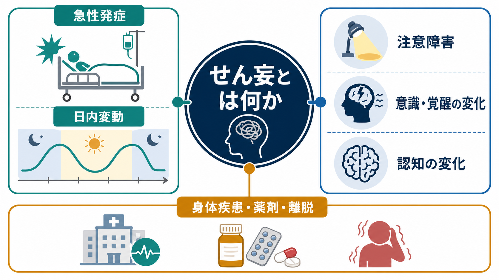
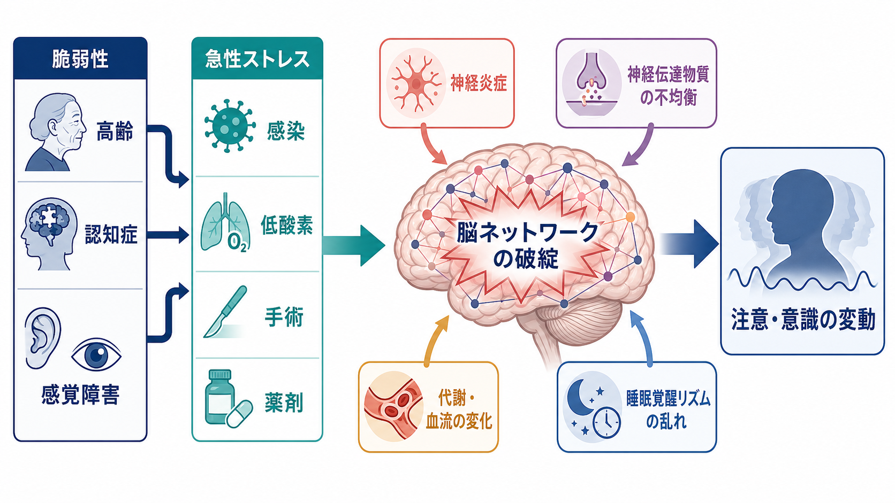
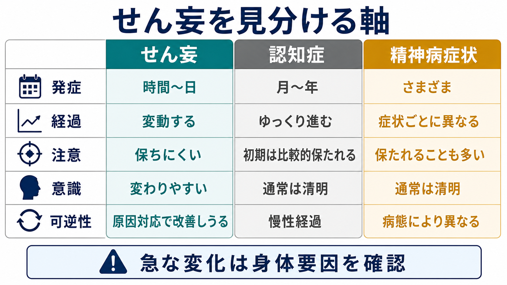

# せん妄とは何か

## 要点

- せん妄は、時間から数日の単位で出現し、1日の中でも変動する[[意識障害はどのように評価されるのか|意識・覚醒]]と[[注意とは何か|注意]]の障害を中心とする症候群である。
- 核になるのは「急に」「変動し」「注意が保てず」「意識・覚醒水準が変わり」「認知や知覚にも波及する」ことである[1]。
- 原因は単一ではなく、脳の脆弱性に感染、低酸素、手術、薬剤、離脱、代謝異常などの急性ストレスが重なって生じることが多い[2][3]。
- 過活動型だけでなく、静かで眠そうに見える低活動型もあり、後者は見逃されやすい[2]。
- 本記事は教育・研究目的の概説であり、個別の診断や治療指示ではない。

## この記事で答える問い

1. せん妄は、単なる「混乱」や「認知症の悪化」と何が違うのか。
2. なぜ注意障害と意識・覚醒の変動が中心症候になるのか。
3. せん妄を理解するとき、どのような身体要因・薬剤要因・脳ネットワーク要因を考えるべきか。

## まず結論

せん妄とは、身体疾患、薬剤、物質中毒・離脱、手術、代謝異常、感染などを背景として、脳が急性に情報を統合しにくくなった状態である。DSM-5 では、注意と意識・環境への気づきの障害、短期間での発症と日内変動、追加の認知障害、既存の神経認知障害だけでは説明できないこと、身体疾患や薬剤などとの関連が重視される[1]。

臨床的には、「昨日までと違う」「時間帯で良くなったり悪くなったりする」「会話はできるが注意が続かない」「見当識や知覚が揺れる」という時間的パターンが重要である。これは慢性的に進む[[認知機能低下はどのように評価するのか|認知機能低下]]や、意識が清明なまま妄想・幻覚が前景に立つ精神病症状とは、観察の軸が異なる。

## 背景

せん妄は高齢者、重症身体疾患、術後、ICU、長期ケア施設でよく問題になるが、若年者でも重い身体ストレスや薬物・離脱などがあれば起こりうる。NICE ガイドラインは、入院・長期ケアの場で、65歳以上、認知機能障害または認知症、股関節骨折、重症疾患をリスク因子として評価することを推奨している[2]。

重要なのは、せん妄が「精神症状」だけで完結する現象ではない点である。背景には、感染、脱水、低酸素、疼痛、睡眠障害、薬剤負荷、感覚遮断、環境変化などが重なる。したがって、せん妄の観察は精神状態の記述でありながら、同時に身体状態の急変を見つける窓にもなる[2][3]。

## 基本概念

### 急性発症と変動

せん妄は、数か月から年単位で徐々に進む状態ではなく、通常は時間から数日の単位で出現する。さらに、同じ日でも朝は会話が成立し、夕方以降に混乱や不穏が強まるように、重症度が波打つ。NICE も、数時間から数日の範囲での変化や変動を、せん妄を疑う重要な指標としている[2]。

### 注意障害

注意障害はせん妄の中核である。話題を追えない、質問を途中で失う、簡単な課題を続けられない、周囲の刺激にすぐ逸れる、逆に反応が鈍くなるといった形で現れる。これは[[持続的注意とは何か|持続的注意]]、[[選択的注意はどのように働くのか|選択的注意]]、[[ワーキングメモリとは何か|ワーキングメモリ]]が一時的に支えにくくなる状態として理解できる。

### 意識・覚醒の変化

DSM-5 では「awareness」、すなわち環境への気づきや見当識の低下が注意障害と並んで重視される[1]。実際には、眠そうで反応が遅い、過覚醒で落ち着かない、問いかけへの反応が場面ごとに変わるなど、覚醒水準の上下として見える。低活動型では、静かで問題が少ないように見えるため、せん妄として認識されにくい[2]。

### 認知・知覚・睡眠への波及

せん妄では、記憶、見当識、言語、視空間認知、知覚にも障害が及ぶことがある[1]。幻視、錯覚、睡眠覚醒リズムの乱れ、気分の不安定さ、不安や恐怖もみられうる[4]。ただし、これらはせん妄の「飾り」ではなく、注意と意識・覚醒の変動を背景にした全体的な情報統合の揺らぎとして捉えると理解しやすい。

## 仕組み

せん妄の機序は単一の経路では説明しにくい。現在のレビューでは、神経炎症、脳血管・灌流の変化、代謝異常、神経伝達物質の不均衡、睡眠覚醒リズムの破綻、脳ネットワーク結合性の低下など、複数の過程が相互作用すると考えられている[4]。

脳の側に高齢、認知症、感覚障害、脳血管障害、既往のせん妄などの脆弱性があると、同じ感染や手術でも、注意・覚醒ネットワークが崩れやすくなる。系統的レビューでは、せん妄は機能的ネットワークの破綻、リスク因子は構造的結合性やネットワーク効率の低下と関連する可能性が示されている[5]。これは、せん妄を「一つの神経伝達物質の過不足」だけでなく、脆弱なネットワークが急性ストレスで統合を失う状態として見る視点を支える。

薬剤も重要である。抗コリン作用をもつ薬剤、鎮静薬、オピオイド、ステロイド、複数薬剤の相互作用、腎機能・肝機能低下による薬物濃度上昇などは、せん妄の誘因になりうる[4]。この点は[[薬剤性精神症状とは何か]]と強く関係する。

## 図解

せん妄を見分けるときは、症状名よりも「時間経過」と「注意・意識の状態」を見る。認知症は月から年の単位で進むことが多く、初期には意識は清明であることが多い。一方、せん妄では時間から日の単位で変化し、日内で揺れ、注意が保ちにくくなる[1][2]。

## 臨床・研究との接続

臨床では、せん妄を「診断名を当てる」だけでなく、急性の脳機能変化を示す警告信号として扱う。NICE は、せん妄を示す変化があれば、4AT などの適切なツールで評価し、ICU や術後回復室では CAM-ICU または ICDSC を用いることを推奨している[2]。

CAM は、非精神科臨床家がせん妄を検出しやすくするために開発された評価法であり、急性発症と変動、注意障害、思考のまとまりにくさ、意識水準の変化を重視する[6]。CAM / CAM-ICU のメタ解析では、特異度は高い一方で感度には限界があり、スクリーニング結果だけで臨床判断を置き換えるべきではないとされる[7]。

ICU 領域では、せん妄は人工呼吸期間、ICU 滞在、死亡、身体機能障害、長期認知障害と関連する重要なアウトカムである。PADIS ガイドラインは、疼痛、鎮静、せん妄、不動、睡眠を切り離さず扱う枠組みを提示している[8]。これは、せん妄が「脳だけの問題」ではなく、身体管理、環境、睡眠、活動性、薬剤調整と連動する症候であることを示している。

研究面では、せん妄は計測が難しい対象でもある。症状が変動し、評価時刻、評価者、覚醒水準、既存の認知症、鎮静、身体拘束、ICU 環境などに影響されるためである。そのため、研究では DSM 基準、CAM、CAM-ICU、ICDSC、4AT など、どの定義・尺度でせん妄を捉えているかを確認する必要がある。

## よくある誤解

### 「暴れる状態だけがせん妄である」

誤りである。過活動型では不穏、焦燥、幻覚、攻撃性が目立つことがあるが、低活動型では眠気、無関心、反応の遅さ、活動性低下が前景に立つ。低活動型は見逃されやすく、NICE も注意を促している[2]。

### 「認知症があれば、急な混乱もすべて認知症の進行である」

認知症はせん妄のリスク因子だが、急性に悪化し日内変動する場合は、せん妄が重なっている可能性を考える必要がある[3][4]。認知症とせん妄は排他的ではなく、併存しうる。

### 「せん妄は精神科だけで扱う問題である」

せん妄は精神症状として観察されるが、多くの場合は身体疾患、薬剤、環境、睡眠、疼痛、代謝、感染などと結びつく。したがって、身体医学、看護、リハビリテーション、家族からの情報、精神医学的評価が接続される領域である。

## 関連ノート

- [[意識障害はどのように評価されるのか]]
- [[覚醒と意識内容は何が違うのか]]
- [[注意とは何か]]
- [[持続的注意とは何か]]
- [[認知機能低下はどのように評価するのか]]
- [[薬剤性精神症状とは何か]]
- [[MSEで認知機能をどう評価するか]]
- [[鑑別診断とは何か]]

## MOC更新候補

- `content/00_MOC/MOC｜精神医学.md`
- `content/00_MOC/MOC｜認知機能.md`
- `content/00_MOC/MOC｜意識・自己・身体性.md`

並列生成ジョブとの競合を避けるため、本記事では MOC 本体は更新していない。

## 理解チェック

1. せん妄で「急性発症」と「日内変動」が重要なのはなぜか。
2. 低活動型せん妄が見逃されやすい理由は何か。
3. せん妄と認知症を区別するとき、時間経過・注意・意識のどこを見るべきか。
4. せん妄を脳ネットワークの破綻として見ると、薬剤、感染、睡眠障害、低酸素をどのように統合して理解できるか。

## 未解決問題

- せん妄の多様な原因を、どこまで共通の脳ネットワーク障害として説明できるか。
- 神経炎症、神経伝達物質、睡眠覚醒リズム、脳血流・代謝のどれが、どの患者群で主要な経路になるのか。
- 低活動型せん妄を、日常臨床でより早く、過剰診断を避けながら検出するにはどの評価法が最も実用的か。
- せん妄後の長期認知機能低下が、どの程度まで既存脆弱性の反映で、どの程度までせん妄そのものの影響なのか。

## 参考文献

[1] Meagher, D. J., Morandi, A., Inouye, S. K., et al. (2014). The DSM-5 criteria, level of arousal and delirium diagnosis: inclusiveness is safer. *BMC Medicine*, 12, 141. https://doi.org/10.1186/s12916-014-0141-2

[2] National Institute for Health and Care Excellence. (2023). *Delirium: prevention, diagnosis and management in hospital and long-term care* (NICE guideline CG103). https://www.nice.org.uk/guidance/cg103

[3] Inouye, S. K., Westendorp, R. G. J., & Saczynski, J. S. (2014). Delirium in elderly people. *The Lancet*, 383(9920), 911-922. https://doi.org/10.1016/S0140-6736(13)60688-1

[4] Wilson, J. E., Mart, M. F., Cunningham, C., et al. (2020). Delirium. *Nature Reviews Disease Primers*, 6, 90. https://doi.org/10.1038/s41572-020-00223-4

[5] van Montfort, S. J. T., van Dellen, E., Stam, C. J., et al. (2019). Brain network disintegration as a final common pathway for delirium: a systematic review and qualitative meta-analysis. *NeuroImage: Clinical*, 23, 101809. https://doi.org/10.1016/j.nicl.2019.101809

[6] Inouye, S. K., van Dyck, C. H., Alessi, C. A., et al. (1990). Clarifying confusion: the confusion assessment method. A new method for detection of delirium. *Annals of Internal Medicine*, 113(12), 941-948. https://doi.org/10.7326/0003-4819-113-12-941

[7] Shi, Q., Warren, L., Saposnik, G., & Macdermid, J. C. (2013). Confusion assessment method: a systematic review and meta-analysis of diagnostic accuracy. *Neuropsychiatric Disease and Treatment*, 9, 1359-1370. https://doi.org/10.2147/NDT.S49520

[8] Devlin, J. W., Skrobik, Y., Gelinas, C., et al. (2018). Clinical practice guidelines for the prevention and management of pain, agitation/sedation, delirium, immobility, and sleep disruption in adult patients in the ICU. *Critical Care Medicine*, 46(9), e825-e873. https://doi.org/10.1097/CCM.0000000000003299
