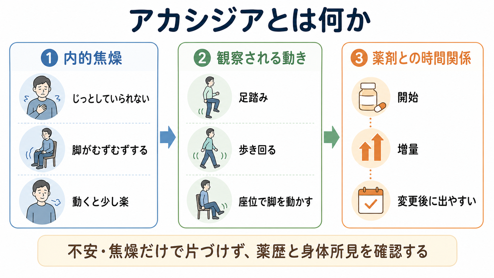
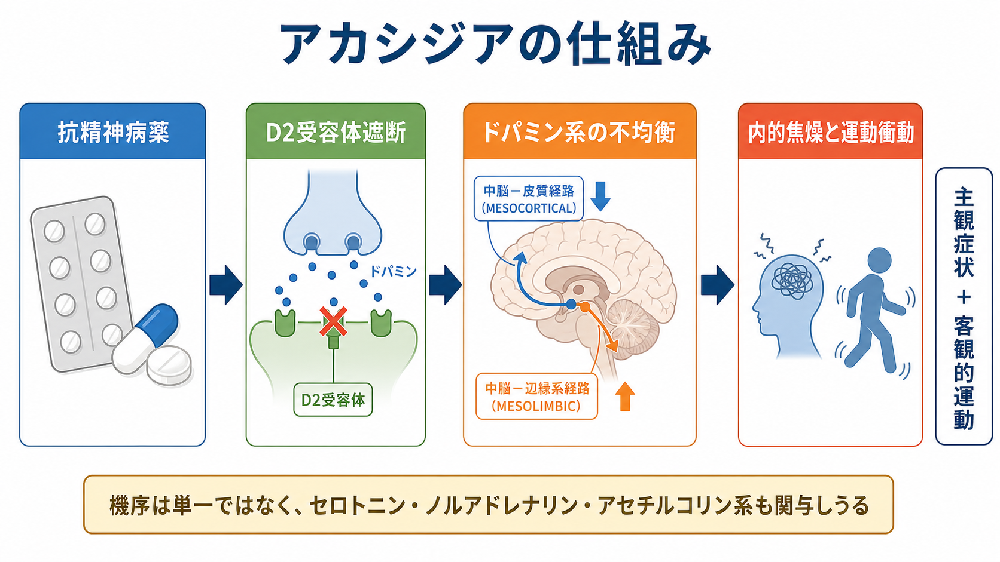
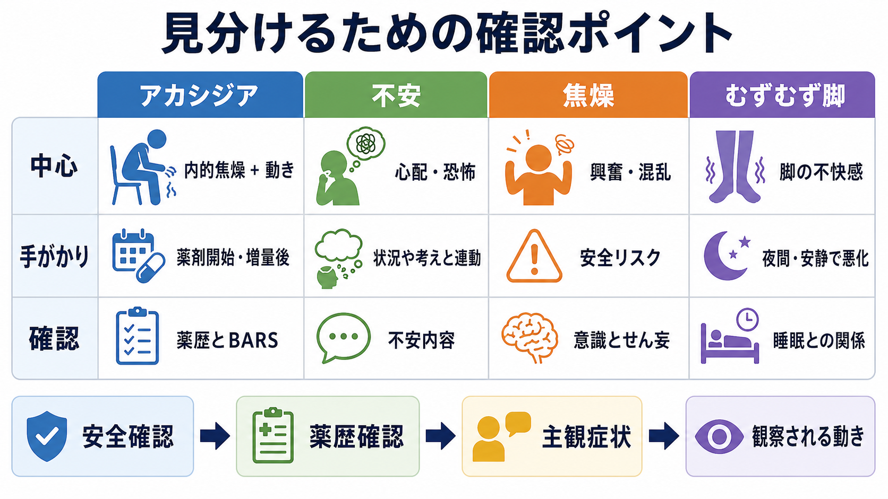

# アカシジアとは何か

## 要点

- アカシジアは、主に抗精神病薬などの薬剤に関連して生じる「じっとしていられない」内的焦燥と、足踏み・歩き回り・座位で脚を動かすなどの客観的な運動落ち着かなさを特徴とする神経精神医学的症候群である[1][2]。
- 中核は単なる[[不安とは何か|不安]]や[[焦燥とは何か|焦燥]]ではなく、「動かずにいることが苦痛で、動くと少し軽くなる」という主観症状と、観察可能な運動の組み合わせにある[1][3]。
- 抗精神病薬の開始、増量、切り替え、急な中止や併用薬の変化のあとに出現しやすい。抗うつ薬、制吐薬などでも起こりうるが、臨床研究の中心は抗精神病薬誘発性アカシジアである[1][2]。
- 評価では薬歴と時間関係、主観的な内的焦燥、客観的な運動、苦痛の程度を分けて確認する。Barnes Akathisia Rating Scale（BARS）は、観察される動き、主観的な落ち着かなさ、苦痛、全体重症度を評価する代表的尺度である[3]。
- 本記事は教育・研究目的の整理であり、個別の診断や治療指示ではない。疑われる場合は、薬剤の自己判断での中止ではなく、処方者に早めに相談する必要がある。

## この記事で答える問い

1. アカシジアは、ふつうの落ち着かなさや不安と何が違うのか。
2. なぜ抗精神病薬などの薬剤で、内的焦燥と動きたい衝動が出るのか。
3. [[せん妄とは何か]]、[[躁状態とは何か]]、[[多動とは何か]]、むずむず脚症候群とはどう見分けるのか。
4. 臨床や研究では、どのように評価し、どこに限界があるのか。

## まず結論

アカシジアは、「落ち着きがない人」という性格記述ではなく、薬剤曝露と時間的に結びついて出現しやすい、強い内的焦燥と運動衝動の症候である。本人は「体の内側から急かされる」「座っていると耐えがたい」「脚を動かさずにいられない」と表現することがある。外からは、座位で脚を組み替える、足を踏み鳴らす、立ったり座ったりする、廊下を歩き回る、体重を左右に移すといった動きとして見える[1][2]。

重要なのは、主観と客観の両方を確認することである。外から歩き回って見えても、[[せん妄とは何か|せん妄]]、疼痛、離脱、躁状態、パニック、環境刺激への反応などでも同様の行動は起こる。逆に、本人が強い苦痛を訴えていても、診察室では動きを抑えていることがある。したがって「不安そう」「そわそわしている」だけで終わらせず、薬歴、発症時期、主観症状、観察される運動、危険性を分けて読む必要がある[1][3]。

## 背景

アカシジアという語は、ギリシア語由来の「座っていられない」という意味に由来するとされる。抗精神病薬の導入後、錐体外路症状の一つとして臨床的に問題になってきたが、[[焦燥とは何か|焦燥]]、不安、病状悪化、服薬拒否と誤解されやすい[1]。

抗精神病薬誘発性アカシジアは、治療継続の困難、苦痛の増大、服薬アドヒアランス低下と関連しうる[2][4]。自殺関連行動との関係については、症例報告や小規模研究では懸念が示されてきた一方、体系的レビューでは利用可能な研究数が少なく、因果関係を確定できるほどの証拠は不足している。ただし、強い苦痛や衝動性を伴いうるため、希死念慮や安全性の確認を軽視しないことが推奨される[7]。

## 基本概念

### 主観症状

主観症状は、アカシジアの中心である。典型的には、内的な落ち着かなさ、いらだち、むずむず感、緊張、動かずにいられない衝動、座っていることへの耐えがたさとして語られる。下肢に強く感じることが多いが、全身の焦燥として訴えられることもある[1][2]。

この主観症状は、通常の[[不安とは何か|不安]]と重なる表現をとる。違いは、不安の中心が「心配内容」や「恐怖対象」にあるとは限らず、むしろ身体の内側から動かされるような切迫感として経験されやすい点である。

### 客観的な運動

観察される運動には、座位で脚を動かす、足を組み替える、足踏みする、立ったり座ったりする、体重を左右に移す、歩き回るなどがある[1][3]。これらは[[多動とは何か|多動]]とも似て見えるが、アカシジアでは「動いていないと苦しい」「動くと少し楽」という主観が前景に出やすい。

### 薬剤との時間関係

典型的には、抗精神病薬の開始後、急な増量後、薬剤変更後、あるいは錐体外路症状を起こしやすい薬剤負荷のあとに出現する[1][2]。急性アカシジアは治療初期に出やすいが、対応されないまま持続することもある。薬歴を見ずに「不穏」「病状悪化」とだけ解釈すると、原因薬剤の増量によって悪化する可能性がある。

## 仕組み

アカシジアの機序は単一ではない。もっともよく説明に使われるのは、抗精神病薬によるドパミンD2受容体遮断と、それに伴う運動系・報酬系・情動系の不均衡である[1][2]。ただし、臨床的なアカシジアは、単純な「ドパミン不足」だけでは説明しきれない。

ドパミン系の変化に加えて、セロトニン、ノルアドレナリン、アセチルコリン、GABA系などの関与も議論されている[1][6]。この多系統性は、補助薬の研究結果が一枚岩でないこととも対応する。たとえば、β遮断薬、抗コリン薬、5-HT2A拮抗作用をもつ薬剤、ベンゾジアゼピン、ビタミンB6などが研究されてきたが、証拠の質や効果推定にはばらつきがある[1][4][5][6]。

したがって、機序は「抗精神病薬がドパミンを遮断するから脚が動く」という単純な一本道ではなく、薬剤、神経伝達、運動衝動、苦痛、不安、認知的制御、観察される行動が重なった症候として理解する方がよい。

## 図解

上の1枚目は、アカシジアを「内的焦燥」「観察される動き」「薬剤との時間関係」の三つに分けて示している。2枚目は、抗精神病薬、D2受容体遮断、ドパミン系の不均衡、内的焦燥と運動衝動という代表的な機序仮説を示している。

3枚目は鑑別の入口である。アカシジアは、[[不安とは何か|不安]]、[[焦燥とは何か|焦燥]]、むずむず脚症候群、[[せん妄とは何か|せん妄]]などと重なって見える。表面的な「そわそわ」ではなく、中心症状、出現タイミング、薬歴、意識状態、睡眠との関係を分けて確認する必要がある。

## 臨床・研究との接続

### 評価

臨床では、まず安全性を確認する。強い苦痛、衝動性、自傷他害リスク、[[せん妄とは何か|せん妄]]、重い身体疾患、薬物中毒・離脱が疑われる場合は、アカシジアだけに狭めて考えない。

次に薬歴を確認する。抗精神病薬の開始・増量・切り替え、制吐薬、抗うつ薬、気分安定薬、抗パーキンソン薬、ベンゾジアゼピンの変更、アルコールや物質使用、服薬中断を時間軸で並べる。薬剤性を疑ううえでは、症状がいつ始まり、薬剤変更とどの程度近いかが大きな手がかりになる[1][2]。

BARSは、薬剤誘発性アカシジアの評価に使われる代表的尺度である。観察される落ち着かなさ、主観的な落ち着かなさ、苦痛、全体重症度を評価し、疑似アカシジアや重症度の区別にも使われる[3]。研究では、症例定義とアウトカムの一貫性を保つために、こうした尺度の利用が重要になる。

### 対応の考え方

ガイドラインは、抗精神病薬誘発性アカシジアに対して、まず原因となる薬剤負荷の見直し、すなわち用量調整、多剤併用の整理、アカシジアを起こしにくい薬剤への切り替えを検討し、そのうえで補助薬を個別に考えるという順序を示している[1]。ただし、これは個別判断を要する医療行為であり、本人が自己判断で急に中止することは危険である。

補助薬については、古くからプロプラノロールなどの中枢作用性β遮断薬が研究されてきたが、Cochraneレビューは利用できる証拠が限られると評価している[4]。抗コリン薬についても、アカシジア単独への確かな試験証拠は弱く、パーキンソニズムを伴う場合など文脈を分けて考える必要がある[5]。近年のネットワークメタ解析では、ミルタザピン、ビタミンB6、ビペリデンなどが有効性と忍容性の面で上位に示されたが、対象試験は15件492名と規模が限られ、投与量や期間も研究条件に依存する[6]。

### 研究上の論点

研究上の難しさは、アカシジアが主観症状と観察行動の両方を必要とする点にある。本人が言語化できない場合、鎮静されている場合、病状により不安や焦燥が強い場合、尺度得点だけで単純に分類しにくい。また、急性期、慢性、遅発性、離脱性アカシジアを同じものとして扱うと、機序や治療反応が混ざってしまう。

治療研究では、短期間の小規模試験が多く、長期転帰、再発、服薬継続、生活機能、主観的苦痛の変化が十分に検討されていない。安全性を含めた実臨床での判断に使うには、症状改善だけでなく、眠気、低血圧、認知機能、精神症状への影響も含めて評価する必要がある[1][6]。

## よくある誤解

### 誤解1: アカシジアは「不安が強いだけ」である

不安と重なることは多いが、アカシジアでは「じっとしていられない身体的切迫感」と薬剤との時間関係が重要である。心配内容が乏しくても、強い内的焦燥と運動衝動があれば、薬剤性の可能性を確認する必要がある。

### 誤解2: 歩き回っていなければアカシジアではない

軽症例や診察場面では、本人が動きを抑えていることがある。足趾を動かす、脚を組み替える、手をもむ、体重を移すなど、目立たない運動として出ることもある[1][3]。主観的苦痛を聞かなければ見逃される。

### 誤解3: 病状悪化なので抗精神病薬を増やせばよい

アカシジアを精神病性の不穏や焦燥と誤認すると、原因薬剤の増量で悪化することがある。もちろん病状悪化と併存することもあるため、薬歴、精神症状、意識状態、身体疾患を分けて評価する必要がある。

### 誤解4: アカシジアは必ず自殺を引き起こす

強い苦痛を伴うため安全確認は重要である。しかし、体系的レビューでは、抗精神病薬誘発性アカシジアと自殺関連行動の因果関係を確定するには証拠が不足している[7]。過小評価も過大評価も避け、苦痛と安全性を具体的に確認するのが実践的である。

## 関連ノート

- [[焦燥とは何か]]
- [[不安とは何か]]
- [[多動とは何か]]
- [[せん妄とは何か]]
- [[躁状態とは何か]]
- [[軽躁状態とは何か]]
- [[睡眠障害とは何か]]
- [[精神運動制止とは何か]]

### MOC更新候補

- 並列ジョブとの衝突を避けるため、本タスクではMOC本体を更新しない。
- バッチ統合時に、精神医学・症候学・精神薬理学関連のMOCへ `[[アカシジアとは何か]]` の追加を検討する。

### 関連ノート候補

- 抗精神病薬とは何か
- 錐体外路症状とは何か
- 薬剤性運動症状とは何か
- Barnes Akathisia Rating Scaleとは何か
- むずむず脚症候群とは何か

## 理解チェック

1. アカシジアを「不安」や「焦燥」とだけ見なすと、どのような評価上の見落としが起こるか。
2. 薬剤開始・増量・切り替えとの時間関係を確認する理由は何か。
3. BARSでは、主観症状と客観的運動をどのように分けて評価するか。
4. アカシジアとむずむず脚症候群を見分けるとき、睡眠や安静との関係はどのような手がかりになるか。
5. アカシジアと自殺関連行動の関係について、強く言えることと言えないことは何か。

## 未解決問題

- 急性、慢性、遅発性、離脱性アカシジアが同じ機序で説明できるのかは十分に整理されていない。
- 主観的苦痛、運動衝動、客観的運動、服薬継続、生活機能を同時に測る研究デザインはまだ限られている。
- 補助薬の比較研究は小規模・短期間のものが多く、長期安全性や実臨床での優先順位には不確実性が残る。
- 自殺関連行動との関係は臨床的に重要だが、現時点では因果関係を確定する十分なデータがない。

## 参考文献

[1] Pringsheim, T., Gardner, D., Addington, D., Martino, D., Morgante, F., Ricciardi, L., Poole, N., Remington, G., Edwards, M., Carson, A., & Barnes, T. R. E. (2018). The assessment and treatment of antipsychotic-induced akathisia. *The Canadian Journal of Psychiatry*, 63(11), 719-729. https://doi.org/10.1177/0706743718760288

[2] Salem, H., Nagpal, C., Pigott, T., & Teixeira, A. L. *Akathisia*. In *StatPearls*. StatPearls Publishing. https://www.ncbi.nlm.nih.gov/books/NBK519543/

[3] Barnes, T. R. E. (1989). A rating scale for drug-induced akathisia. *The British Journal of Psychiatry*, 154(5), 672-676. https://doi.org/10.1192/bjp.154.5.672

[4] Barnes, T. R. E., Soares-Weiser, K., & Bacaltchuk, J. (2004). Central action beta-blockers versus placebo for neuroleptic-induced acute akathisia. *Cochrane Database of Systematic Reviews*, Issue 4, CD001946. https://doi.org/10.1002/14651858.CD001946.pub2

[5] Rathbone, J., & Soares-Weiser, K. (2006). Anticholinergics for neuroleptic-induced acute akathisia. *Cochrane Database of Systematic Reviews*, Issue 4, CD003727. https://doi.org/10.1002/14651858.CD003727.pub3

[6] Gerolymos, C., Barazer, R., Yon, D. K., Loundou, A., Boyer, L., & Fond, G. (2024). Drug efficacy in the treatment of antipsychotic-induced akathisia: A systematic review and network meta-analysis. *JAMA Network Open*, 7(3), e241527. https://doi.org/10.1001/jamanetworkopen.2024.1527

[7] Kalniunas, A., Chakrabarti, I., Mandalia, R., Munjiza, J., & Pappa, S. (2021). The relationship between antipsychotic-induced akathisia and suicidal behaviour: A systematic review. *Neuropsychiatric Disease and Treatment*, 17, 3489-3497. https://doi.org/10.2147/NDT.S337785
