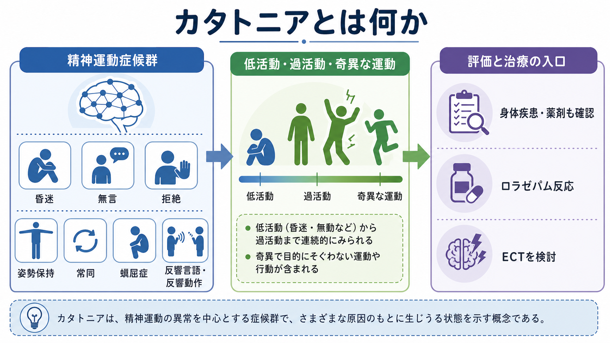
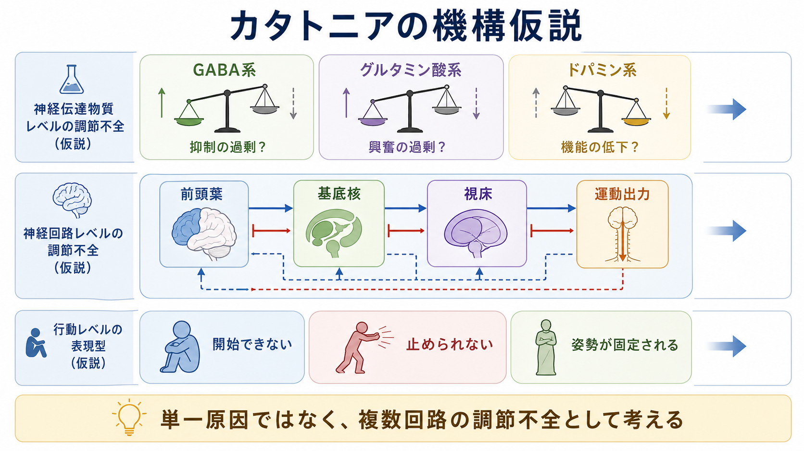
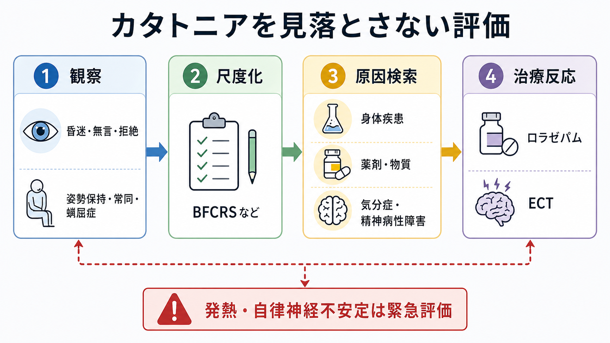

# カタトニアとは何か

## 要点

- カタトニアは、意識や思考内容そのものの病名ではなく、運動、発話、姿勢、反応性、反復行動、自律神経症状がまとまって変化する**精神運動症候群**である[1][2]。
- 典型的には、昏迷、無言、拒絶、姿勢保持、蝋屈症、常同、反響言語、反響動作などがみられる。DSM-5-TR では 12 項目のうち 3 項目以上を重視する整理が広く使われる[1][3]。
- かつては統合失調症と強く結びつけて考えられたが、現在は気分症、精神病性障害、神経疾患、身体疾患、自己免疫性脳炎、薬剤・物質関連状態などにまたがる横断的な病態として理解される[2][4]。
- 機序は単一原因ではなく、GABA、グルタミン酸、ドパミン系、および前頭葉・基底核・視床を含む運動制御回路の調節不全として仮説化されている[4][5]。
- 臨床的には見逃すと脱水、栄養障害、血栓、横紋筋融解、悪性カタトニアなどのリスクがあるため、観察、尺度化、身体・神経学的評価、治療反応の確認を組み合わせる[2][6]。

## この記事で答える問い

1. カタトニアは「動かない状態」だけを指すのか。
2. 昏迷、拒絶、常同、蝋屈症などはどのように一つの症候群としてまとまるのか。
3. カタトニアを、[[精神症候学とは何か|精神症候学]]、[[MSEで外観と行動から何を観察するか|MSEの外観と行動]]、[[せん妄とは何か|せん妄]]、神経回路仮説とどう接続して理解すればよいのか。

## まず結論

カタトニアは、「心因性に固まっている」「統合失調症の一症状である」といった単純な現象ではない。むしろ、**動作を始める、止める、姿勢を変える、他者の働きかけに応答する**という基本的な精神運動制御が崩れた状態として理解するとよい。低活動型では昏迷、無言、拒絶、姿勢保持が前景に立ち、過活動型では目的のはっきりしない興奮、常同、反復発話、衝動性が目立つ。両者は固定した別型ではなく、同じ患者で移り変わることもある[1][2]。

重要なのは、カタトニアが観察可能な症候であると同時に、身体疾患や薬剤性、神経疾患、自己免疫性脳炎、非けいれん性てんかん重積などの入口にもなりうる点である[2][6][8]。したがって本記事は教育・研究目的の整理であり、個別症例の診断や治療指示ではない。臨床では、専門職による緊急性評価と総合判断が必要になる。

## 背景

カタトニアは 19 世紀に Kahlbaum によって記載され、その後長く統合失調症の一亜型として扱われてきた。しかし近年の診断体系と臨床研究では、カタトニアは統合失調症に限らず、気分症、神経発達症、身体疾患、神経疾患、自己免疫性・感染性疾患などにも出現する症候群として再位置づけられている[2][4]。この転換は、[[DSMとICDは何が違うのか|DSMとICD]]が疾患分類を固定的な病名だけでなく、横断的な指定子や症候群として扱う方向へ動いてきたこととも関係する。

疫学的には、研究対象や診療場面で推定値が大きく変わる。2024 年の総説では、精神科入院患者では 5-18%、一般身体科入院患者では 3.3% 程度にみられると整理されている[7]。ただし、見逃しや診断手続きの違いが大きいため、数値は「カタトニアがまれではない」ことを示す目安として読むのがよい。

## 基本概念

### 精神運動症候群として見る

カタトニアを理解する鍵は、運動を「筋力」だけでなく、意図、開始、抑制、姿勢、環境への応答として見ることである。たとえば、昏迷は意識が完全に失われていることと同義ではない。無言も、声帯や言語能力だけの問題とは限らない。拒絶は単なる反抗ではなく、働きかけに対する異常な反応性として記述される[1][2]。

この点でカタトニアは、[[精神運動制止とは何か|精神運動制止]]と重なる部分を持つが、同じではない。精神運動制止は主に動作や発話の遅さとして記述されるのに対し、カタトニアでは姿勢保持、蝋屈症、反響現象、常同、拒絶、命令自動など、より特徴的な精神運動徴候がまとまって現れる。

### 代表的な徴候

| 徴候 | 観察の焦点 | 読み方の注意 |
|---|---|---|
| 昏迷 | 自発運動や環境への反応が著しく低い | せん妄、意識障害、神経疾患との鑑別が必要 |
| 無言 | 発話がない、または極端に乏しい | 失語、緘黙、重度抑うつ、意識障害と区別する |
| 拒絶 | 指示や介助への抵抗、反対方向の反応 | 意図的な拒否と決めつけない |
| 姿勢保持 | 不自然な姿勢を保つ | 痛み、筋緊張異常、神経疾患も確認する |
| 蝋屈症 | 他者が作った姿勢が蝋のように保たれる | カタレプシーや筋強剛との関係を観察する |
| 常同 | 目的の乏しい反復運動 | 強迫、チック、常同行動、焦燥との違いを見る |
| 反響言語・反響動作 | 他者の言葉や動作を反復する | 模倣、理解障害、発達特性との文脈を見る |

Bush-Francis Catatonia Rating Scale（BFCRS）は、こうした徴候を系統的に拾い上げるための代表的な評価尺度である。1996 年の原著では、23 項目の評価尺度と 14 項目のスクリーニング項目が提案され、臨床観察を標準化する道具として広く使われている[3]。

## 仕組み

カタトニアの病態はまだ確定していない。現在の理解では、GABA作動性抑制、グルタミン酸作動性興奮、ドパミン系の運動・報酬・意欲調節、および前頭葉・基底核・視床を結ぶループが複合的に関わると考えられている[4][5]。

一つの見方は、運動出力そのものが壊れているというより、**運動を開始する信号、止める信号、姿勢を切り替える信号のゲイン調整が崩れる**というものである。低活動型では「開始できない」ことが前景に立ち、過活動型では「止められない」運動や発話が目立ち、姿勢保持や蝋屈症では「切り替えられない」状態が見える。

GABA は、[[GABAは脳で何をしているのか|GABA]]作動性抑制を通じて神経回路のタイミングと興奮しやすさを調整する。ベンゾジアゼピンへの反応性がカタトニアで重視されることは、GABA系の関与を考える一つの臨床的手がかりになる。ただし、これは「GABAが少ないからカタトニアになる」という単純な説明ではない。グルタミン酸系、ドパミン系、免疫・炎症、身体疾患、薬剤、発達特性が重なりうるため、[[E_Iバランスとは何か|興奮と抑制のバランス]]を含む回路全体の文脈で考える必要がある[4][5]。

## 図解

図 1 は、カタトニアを精神運動症候群として捉える概念地図である。左側に低活動型の代表徴候、中央に低活動・過活動・奇異な運動の連続性、右側に評価と治療反応の入口を置いた。ここでの「治療反応」は診断の一部として観察される情報であり、自己判断で薬剤や治療を選ぶための図ではない。

図 2 は、神経伝達物質、神経回路、行動表現型を三層に分けた仮説図である。前頭葉、基底核、視床、運動出力のループは、動作の開始・抑制・切り替えに関わる。カタトニアでは、このループのどこか一箇所だけでなく、複数の調節点が乱れる可能性がある。

図 3 は、見落としを減らすための臨床評価フローである。観察、尺度化、原因検索、治療反応という順番で並べているが、実際の臨床では緊急性が高い場合、身体管理や原因検索が同時並行で行われる。

## 臨床・研究との接続

### 評価

カタトニアの評価では、まず [[MSEで外観と行動から何を観察するか|外観と行動の観察]]、[[MSEで話し方から何がわかるのか|話し方の観察]]、反応性、姿勢、反復運動、表情、食事・水分摂取、睡眠、自律神経症状を確認する。次に BFCRS などで徴候を尺度化し、変化を追える形にする[2][3]。

同時に、[[せん妄とは何か|せん妄]]、非けいれん性てんかん重積、脳炎、代謝性脳症、薬剤性症候群、神経遮断薬悪性症候群、パーキンソニズム、筋強剛、失語、重度抑うつなどとの鑑別が問題になる[2][6]。特に発熱、頻脈、血圧変動、発汗、筋強剛、意識水準の変動がある場合は、悪性カタトニアや身体疾患を含めた緊急評価が必要になる。

### 治療反応

BAP 2023 ガイドラインは、カタトニアの治療としてベンゾジアゼピン、ECT、身体管理、原因疾患への対応を体系的に整理している[2]。臨床レビューでも、ロラゼパムなどのベンゾジアゼピンと ECT は、カタトニアに対する主要な治療選択肢として繰り返し報告されている[6]。ただし、薬剤量、適応、緊急性、禁忌、身体状態は個別に判断されるため、本記事では治療手順を指示しない。

研究上は、カタトニアは「運動」「意欲」「情動」「反応性」「身体状態」が交差する興味深い症候群である。[[薬物療法は神経回路にどう作用するのか|薬物療法と神経回路]]、脳画像、脳刺激、免疫精神医学、発達精神医学をつなぐ領域として、今後も縦断研究や治療反応研究が必要である[4][7]。

## よくある誤解

### 「カタトニアは統合失調症の症状である」

歴史的には統合失調症と強く結びつけられたが、現在は気分症、精神病性障害、身体疾患、神経疾患、自己免疫性脳炎、薬剤・物質関連状態などにまたがる症候群として扱われる[2][4]。統合失調症だけに限定して考えると、見逃しにつながる。

### 「動かない人だけがカタトニアである」

低活動型の昏迷や無言は有名だが、目的のはっきりしない興奮、常同、反復発話、衝動性などが前景に立つこともある[1][2]。同じ患者で低活動と過活動が入れ替わることもあるため、単一時点の印象だけで判断しない。

### 「拒絶は本人が協力しないだけである」

拒絶や反対反応は、カタトニアの徴候として記述されることがある。もちろん意思表示、恐怖、痛み、文化的背景、トラウマ反応などを丁寧に確認する必要はあるが、観察可能な精神運動徴候として扱うことで、医療的リスクの見落としを減らせる。

### 「ロラゼパムに反応すれば確定、反応しなければ否定である」

ロラゼパム反応は重要な手がかりだが、診断を完全に決める単独検査ではない。反応が乏しい場合でも、重症度、慢性化、原因疾患、薬剤、身体状態、評価タイミングによって解釈が変わる[2][6]。

## 関連ノート

- [[精神症候学とは何か]]
- [[症状と徴候は何が違うのか]]
- [[精神運動制止とは何か]]
- [[MSEで外観と行動から何を観察するか]]
- [[MSEで話し方から何がわかるのか]]
- [[MSEで認知機能をどう評価するか]]
- [[せん妄とは何か]]
- [[DSMとICDは何が違うのか]]
- [[GABAは脳で何をしているのか]]
- [[E_Iバランスとは何か]]
- [[薬物療法は神経回路にどう作用するのか]]

MOC 更新候補: [[MOC｜症候学]] の「症候学の入口」または精神運動症状の近くに追加。

今後の作成候補: 「BFCRSとは何か」「悪性カタトニアとは何か」「ロラゼパムチャレンジとは何か」「ECTとは何か」「神経遮断薬悪性症候群とは何か」。

## 理解チェック

1. カタトニアを「病名」ではなく「精神運動症候群」として捉える利点は何か。
2. 昏迷、無言、拒絶、姿勢保持、蝋屈症、常同は、それぞれどの観察領域に属するか。
3. カタトニアとせん妄が臨床上重なりうるとき、どのような情報を追加で確認すべきか。
4. GABA、グルタミン酸、ドパミン、前頭葉・基底核・視床ループのどれか一つだけで説明しきれない理由は何か。
5. ロラゼパム反応や ECT が重要であっても、個別症例の治療指示として短絡してはいけない理由は何か。

## 参考文献

[1] Iyer, V., Spurling, B. C., & Rizvi, A. (2025). *Catatonia*. StatPearls. NCBI Bookshelf. Last update December 13, 2025. https://www.ncbi.nlm.nih.gov/books/NBK430842/

[2] Rogers, J. P., Oldham, M. A., Fricchione, G., et al. (2023). Evidence-based consensus guidelines for the management of catatonia: Recommendations from the British Association for Psychopharmacology. *Journal of Psychopharmacology, 37*(4), 327-369. https://doi.org/10.1177/02698811231158232

[3] Bush, G., Fink, M., Petrides, G., Dowling, F., & Francis, A. (1996). Catatonia. I. Rating scale and standardized examination. *Acta Psychiatrica Scandinavica, 93*(2), 129-136. https://doi.org/10.1111/j.1600-0447.1996.tb09814.x

[4] Walther, S., Stegmayer, K., Wilson, J. E., & Heckers, S. (2019). Structure and neural mechanisms of catatonia. *The Lancet Psychiatry, 6*(7), 610-619. https://doi.org/10.1016/S2215-0366(18)30474-7

[5] Ariza-Salamanca, D. F., Corrales-Hernández, M. G., Pachón-Londoño, M. J., & Hernández-Duarte, I. (2022). Molecular and cellular mechanisms leading to catatonia: an integrative approach from clinical and preclinical evidence. *Frontiers in Molecular Neuroscience, 15*, 993671. https://doi.org/10.3389/fnmol.2022.993671

[6] Sienaert, P., Dhossche, D. M., Vancampfort, D., De Hert, M., & Gazdag, G. (2014). A clinical review of the treatment of catatonia. *Frontiers in Psychiatry, 5*, 181. https://doi.org/10.3389/fpsyt.2014.00181

[7] Hirjak, D., Rogers, J. P., Wolf, R. C., et al. (2024). Catatonia. *Nature Reviews Disease Primers, 10*, 49. https://doi.org/10.1038/s41572-024-00534-w

[8] Rogers, J. P., Pollak, T. A., Blackman, G., & David, A. S. (2019). Catatonia and the immune system: a review. *The Lancet Psychiatry, 6*(7), 620-630. https://doi.org/10.1016/S2215-0366(19)30190-7

## 未解決問題

- カタトニアの低活動型、過活動型、悪性型を、共通機序と個別機序にどこまで分けられるか。
- BFCRS などの尺度得点を、神経画像、脳波、免疫指標、治療反応とどう対応づけるか。
- せん妄、自己免疫性脳炎、神経発達症、薬剤性症候群と重なる場合、どの評価順序が最も見逃しを減らすか。
- ベンゾジアゼピンや ECT への反応性の違いを、回路・受容体・原因疾患の違いとしてどこまで説明できるか。

## 更新ログ

- 2026-04-28: 初版作成。カタトニアの症候学、神経回路仮説、臨床評価、図解 3 点、参考文献を追加。
