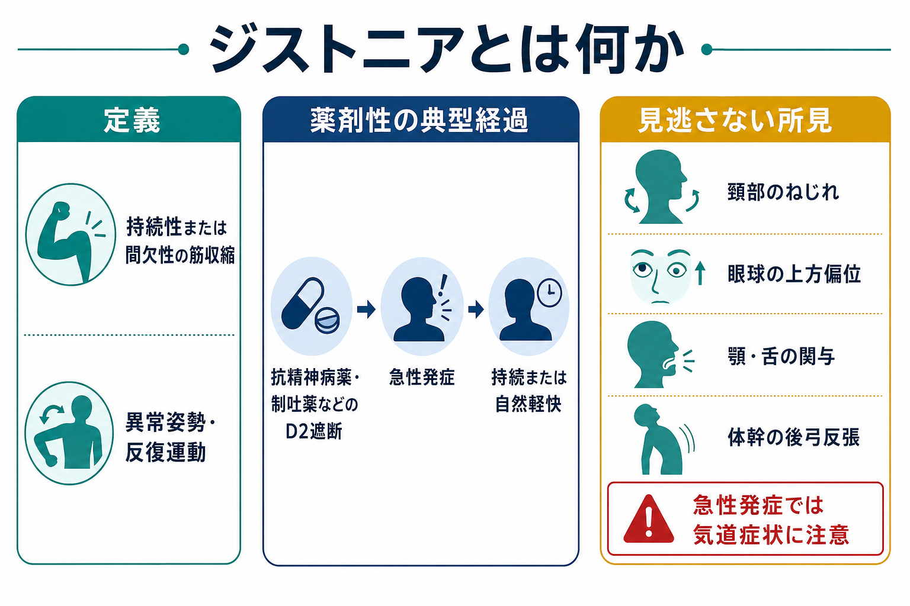
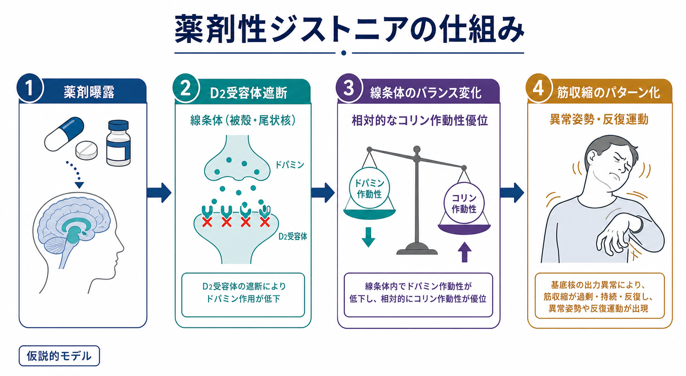
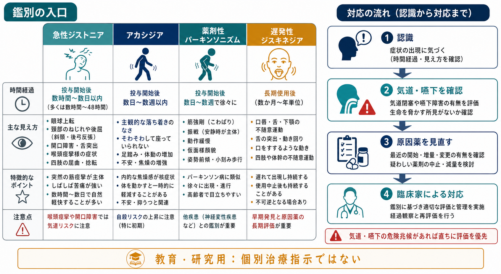

# ジストニアとは何か

## 要点

- ジストニアは、持続性または間欠性の筋収縮により、異常姿勢や反復的・ねじれ様の運動が生じる運動障害である [1]。
- 精神科臨床では、抗精神病薬や制吐薬などのドパミンD2受容体遮断薬による急性副作用として重要である [3][6]。
- 急性薬剤性ジストニアは、投与開始・増量後の数時間から数日以内に出ることが多く、眼球上転、頸部のねじれ、顎・舌・喉頭の筋攣縮、体幹の後弓反張などとして観察される [3][6]。
- 苦痛が強く、本人には「薬で悪くされた」という体験になりやすいため、[[精神症候学とは何か]]だけでなく薬物療法の説明と信頼関係にも関わる [3][5]。
- 喉頭ジストニア、嚥下困難、呼吸困難を疑う所見がある場合は、教育的記述の範囲を超えて緊急評価が必要な身体リスクとして扱う [6]。

## この記事で答える問い

1. ジストニアは、単なる「そわそわ」「震え」「こわばり」と何が違うのか。
2. なぜ抗精神病薬や制吐薬で急性ジストニアが起こるのか。
3. 薬剤性副作用として見たとき、何を観察し、何と鑑別するべきか。

## まず結論

ジストニアは「筋緊張が高い」という一語だけでは足りない。重要なのは、筋収縮が一定のパターンをもち、姿勢や運動をねじれた形に固定したり、反復的に出現させたりする点である [1]。薬剤性副作用としては、D2受容体遮断薬の開始・増量後に急性発症するものが典型で、急に首が傾く、眼球が上を向いて戻りにくい、口が開きにくい、舌が突出する、背中が反る、といった形をとる [3][6]。

したがって評価の入口は、本人の訴えだけでなく、[[症状と徴候は何が違うのか]]という観点で「いつから」「どの薬剤変更の後に」「どの筋群が」「どのパターンで」動いているかを観察することである。これは個別の診断や治療指示ではなく、薬剤性運動症状を整理するための教育・研究用の枠組みである。

## 背景

ジストニアは原発性・遺伝性・二次性など多様な背景をもつが、精神科で見落とされやすいのは薬剤性の急性ジストニアである。抗精神病薬は治療上重要な薬剤である一方、錐体外路症状としてジストニア、アカシジア、薬剤性パーキンソニズム、遅発性ジスキネジアなどを生じうる [5][7]。

急性ジストニアは、症状の見え方が劇的で、本人の不安や恐怖も強い。眼球上転発作や喉の締めつけ感が、[[パニック発作とは何か]]、[[カタトニアとは何か]]、けいれん発作、身体疾患、機能性神経症状などと混同されることもある。薬剤性副作用として整理する意義は、精神症状の悪化と誤認して薬剤をさらに増やすリスクを避ける点にもある [5]。

## 基本概念

### 定義

2013年の国際コンセンサスでは、ジストニアは「持続性または間欠性の筋収縮により、異常でしばしば反復的な運動、姿勢、またはその両方を生じる運動障害」と定義された [2]。2025年の改訂でも、持続性・間欠性の異常運動や姿勢、パターン化、反復性、震え様・ミオクローヌス様に見えること、随意運動で誘発・増悪しうることが重視されている [1]。

臨床的には、次のような観察語で記述すると整理しやすい。

| 観察軸 | 見るポイント |
|---|---|
| 時間経過 | 急性、亜急性、遅発性、発作性、持続性 |
| 分布 | 眼、口顎舌、頸部、体幹、四肢、喉頭 |
| 形 | ねじれ、後屈、側屈、開口、舌突出、眼球上転 |
| 誘因 | 薬剤開始、増量、注射、制吐薬使用、疲労、随意運動 |
| 随伴 | 疼痛、不安、嚥下困難、呼吸困難、アカシジア様焦燥 |

### 薬剤性としての位置づけ

薬剤性ジストニアでは、ドパミン受容体遮断作用をもつ薬剤、特に抗精神病薬と制吐薬が代表的である [3][6]。第一世代抗精神病薬でリスクが高い傾向はあるが、第二世代抗精神病薬でもリスクはゼロではなく、薬剤ごとの用量、投与速度、個人要因、既往歴を合わせて考える必要がある [5][6]。

若年、男性、過去の急性ジストニア、急な増量、高力価D2遮断薬、注射剤使用、物質使用などはリスク因子として挙げられる [3][6]。ただし、これらは確率を上げる要因であり、該当しなければ起こらないという意味ではない。

## 仕組み

急性薬剤性ジストニアの機序は完全に単一ではない。実用的には、線条体を中心とする基底核回路において、D2受容体遮断によりドパミン作動性の調整が急に変化し、相対的にコリン作動性の影響が強まる、というモデルで理解されることが多い [4][6]。

ただし、このモデルは「抗コリン薬が効くことがある」ことを説明しやすい仮説的枠組みであり、全例を説明する完成した機序ではない。近年のレビューでは、感覚入力の処理、運動プログラムの選択、皮質興奮性、基底核出力の異常など、より広い運動制御ネットワークの問題として薬剤性ジストニアを理解する必要が示されている [4]。

## 図解

薬剤性運動症状の鑑別では、時間経過と「主に何が目立つか」を分けると混乱が減る。急性ジストニアは、突然の筋攣縮と異常姿勢が前景に立つ。アカシジアでは内的焦燥と静座困難、薬剤性パーキンソニズムでは筋強剛・振戦・動作緩慢、遅発性ジスキネジアでは長期使用後の口舌顔面を中心とした不随意運動が目立ちやすい [5][7][8]。

## 臨床・研究との接続

臨床では、まず安全性を評価する。喉頭、咽頭、舌、顎のジストニアは、嚥下や気道に関わることがあるため、単なる不快な副作用として片づけない [6]。次に、薬剤開始・増量・剤形変更との時間関係を確認する。急性ジストニアは多くの場合、開始または増量後の早期に出現する [3][6]。

研究上は、ジストニアを「錐体外路症状」の一部として粗くまとめるだけでは不十分である。アカシジア、パーキンソニズム、遅発性ジスキネジアでは、発症時期、主観的苦痛、運動パターン、治療反応、評価尺度が異なる [5][7][8]。薬剤比較研究や副作用評価では、個別の運動症状として測定することが必要になる。

精神症候学との接点では、[[常同行動とは何か]]や[[精神運動制止とは何か]]のような行動観察と混同しないことが重要である。ジストニアは「意味のある行動」ではなく、運動制御の異常として生じる姿勢・筋収縮のパターンである。

## よくある誤解

### 「筋肉が固いなら全部ジストニアである」

違う。筋強剛やパーキンソニズムでは、持続的なこわばりや動作緩慢が目立つ。一方、ジストニアでは、ねじれ、姿勢固定、反復的な筋収縮パターンが中心になる [1][8]。

### 「急に出た奇妙な姿勢は心理的反応である」

薬剤開始・増量後の急な異常姿勢は、薬剤性ジストニアとして評価すべきである [3][6]。見た目が劇的でも、本人が意図しているとは限らない。心理的要因や機能性神経症状との鑑別は必要だが、まず薬剤歴と身体リスクを確認する。

### 「第二世代抗精神病薬なら起こらない」

第二世代抗精神病薬では平均的なリスクが低い薬剤もあるが、薬剤性ジストニアや他の錐体外路症状は起こりうる [5][7]。第一世代・第二世代という大分類だけでなく、薬剤ごとのD2遮断、用量、増量速度、個人リスクを見る。

### 「遅発性ジスキネジアと同じ対応でよい」

急性ジストニアと遅発性ジスキネジアは、時間経過も機序仮説も臨床対応も異なる [5][6]。特に抗コリン薬は急性ジストニアで用いられることがある一方、遅発性ジスキネジアでは悪化に注意が必要とされる [5]。この記事では個別治療指示は扱わず、鑑別の入口として整理する。

## 関連ノート

- [[精神症候学とは何か]]
- [[症状と徴候は何が違うのか]]
- [[カタトニアとは何か]]
- [[常同行動とは何か]]
- [[精神運動制止とは何か]]

関連ノート候補:

- 薬剤性パーキンソニズムとは何か
- アカシジアとは何か
- 遅発性ジスキネジアとは何か
- 錐体外路症状とは何か
- 抗精神病薬の副作用評価

MOC更新候補:

- `content/00_MOC/` 配下の精神医学・症候学・精神薬理関連MOCに、バッチ統合時に追加する。

## 理解チェック

1. ジストニアを「筋緊張の高さ」だけでなく「運動・姿勢のパターン」として記述する理由は何か。
2. 抗精神病薬開始後の眼球上転と頸部後屈を見たとき、薬剤歴として何を確認するか。
3. 急性ジストニア、アカシジア、薬剤性パーキンソニズム、遅発性ジスキネジアを、時間経過と主症状でどう分けるか。
4. 喉頭・咽頭・舌の症状を伴う場合、なぜ安全性評価を優先する必要があるか。

## 未解決問題

- 急性薬剤性ジストニアを予測する個人リスクを、臨床でどこまで定量化できるか。
- D2遮断、コリン作動性変化、感覚運動処理異常を統合する機序モデルは、どの程度治療選択に結びつくか。
- 精神科救急・一般救急で、薬剤性運動症状を効率よく識別する教育ツールをどう設計するか。

## 参考文献

[1] Albanese A, Bhatia KP, Fung VSC, et al. Definition and Classification of Dystonia. *Movement Disorders*. 2025;40(7):1248-1259. https://doi.org/10.1002/mds.30220

[2] Albanese A, Bhatia K, Bressman SB, et al. Phenomenology and classification of dystonia: a consensus update. *Movement Disorders*. 2013;28(7):863-873. https://doi.org/10.1002/mds.25475

[3] van Harten PN, Hoek HW, Kahn RS. Acute dystonia induced by drug treatment. *BMJ*. 1999;319:623-626. https://doi.org/10.1136/bmj.319.7210.623

[4] Loonen AJM, Ivanova SA. Neurobiological mechanisms associated with antipsychotic drug-induced dystonia. *Journal of Psychopharmacology*. 2021;35(1):3-14. https://doi.org/10.1177/0269881120944156

[5] Stroup TS, Gray N. Management of common adverse effects of antipsychotic medications. *World Psychiatry*. 2018;17(3):341-356. https://doi.org/10.1002/wps.20567

[6] Lewis K, O'Day CS. Dystonic Reactions. *StatPearls*. Updated 2026. https://www.ncbi.nlm.nih.gov/books/NBK531466/

[7] Ali T, Sisay M, Tariku M, Mekuria AN, Desalew A. Antipsychotic-induced extrapyramidal side effects: A systematic review and meta-analysis of observational studies. *PLOS ONE*. 2021;16(9):e0257129. https://doi.org/10.1371/journal.pone.0257129

[8] Miller DD, Caroff SN, Davis SM, et al. Extrapyramidal side-effects of antipsychotics in a randomised trial. *British Journal of Psychiatry*. 2008;193(4):279-288. https://doi.org/10.1192/bjp.bp.108.050088
