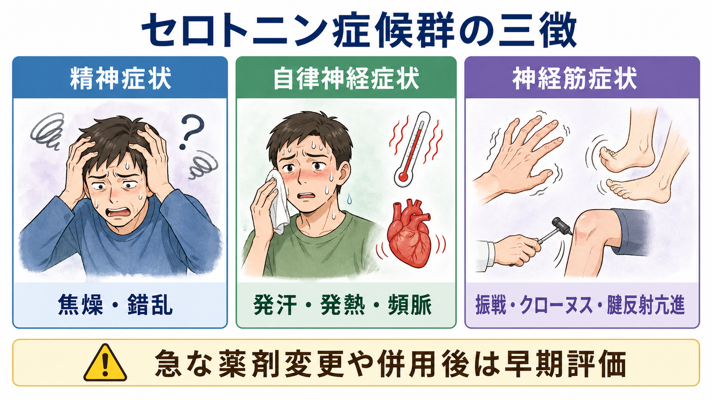
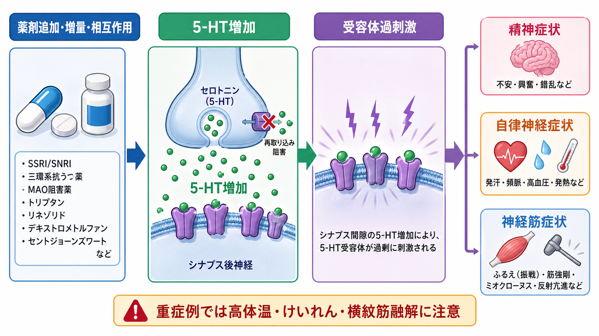
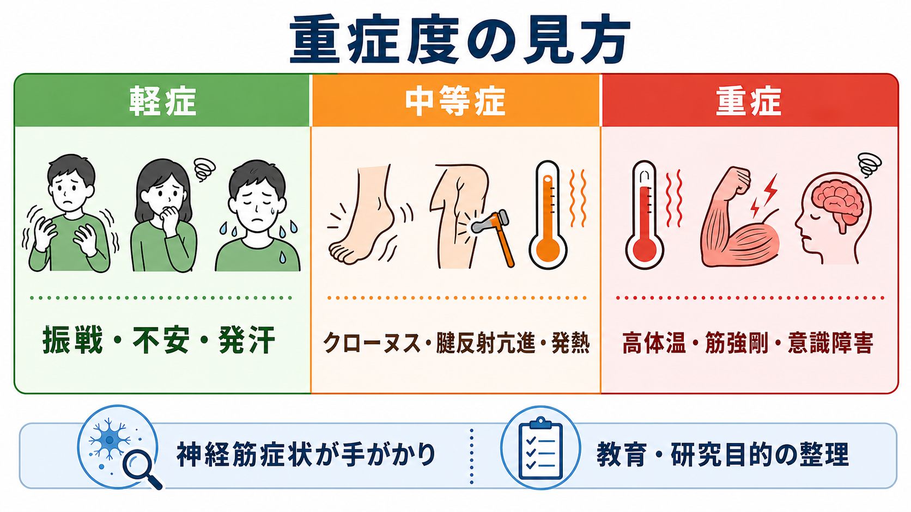

# セロトニン症候群ではどのような症状が出るのか

## 要点

- セロトニン症候群は、セロトニン作動性薬剤の開始、増量、併用、過量服薬、代謝阻害などをきっかけに起こる薬剤性の toxidrome である[1][2]。
- 症状は、**精神症状**、**自律神経症状**、**神経筋症状**の三徴で整理すると見通しがよい[1][3]。
- 診断上の手がかりとして特に重要なのは、振戦、腱反射亢進、誘発性・自発性クローヌス、眼球クローヌスなどの神経筋過活動である[3][4]。
- 重症例では、高体温、筋強剛、けいれん、代謝性アシドーシス、横紋筋融解などが問題になりうるため、教育的整理でも「急速に悪くなりうる症候群」として扱う必要がある[1][5]。

## この記事で答える問い

セロトニン症候群では、どのような症状の組み合わせを見るべきだろうか。単に「セロトニンが多い」と覚えるのではなく、[[セロトニンは気分だけに関わるのか|セロトニン]]が脳、脊髄、末梢臓器にまたがって働くことを踏まえ、精神状態、自律神経、神経筋所見を分けて読む。

## まず結論

セロトニン症候群らしさは、「急な薬剤変化のあとに、落ち着かなさや錯乱、発汗・頻脈・発熱、振戦・クローヌス・腱反射亢進がまとまって出る」ことで高まる。とくにクローヌスと腱反射亢進は、[[せん妄とは何か|せん妄]]、不安、感染症、離脱症状だけでは説明しにくい手がかりになる[3][4]。

## 背景

セロトニン症候群は、SSRI、SNRI、三環系抗うつ薬、MAO阻害薬、トリプタン、リネゾリド、デキストロメトルファン、トラマドール、フェンタニル、リチウム、セントジョーンズワート、一部の違法薬物など、セロトニン系に影響する薬剤・物質で生じうる[1][2][6]。単剤でも起こりうるが、典型的には複数の薬剤が異なる機序でセロトニン伝達を強めるとリスクが高まる[2][5]。

発症時期は重要である。多くは、セロトニン作動性薬剤の開始、増量、併用、過量服薬、代謝を阻害する薬剤追加のあと、数時間から24時間以内に現れるとされる[1][4]。この速さは、数日から数週で進むことが多い神経遮断薬悪性症候群との鑑別にも関わる[1][4]。

## 基本概念

三徴は次のように整理できる。

| 領域 | 代表的な症状・所見 | 読み方 |
|---|---|---|
| 精神症状 | 焦燥、不安、興奮、錯乱、不眠、せん妄 | 「気分の問題」だけでなく、急性の意識・注意変化として見る |
| 自律神経症状 | 発汗、頻脈、高血圧、発熱、散瞳、下痢、悪心・嘔吐 | [[自律神経ネットワークは内臓状態をどう制御するのか|自律神経]]と体温調節の過活動として見る |
| 神経筋症状 | 振戦、ミオクローヌス、腱反射亢進、誘発性クローヌス、眼球クローヌス、筋強剛 | セロトニン症候群を疑ううえで最も特異的な手がかりになりやすい |

Hunter Serotonin Toxicity Criteria は、セロトニン作動性薬剤への曝露を前提に、自然発生クローヌス、誘発性クローヌスと焦燥または発汗、眼球クローヌスと焦燥または発汗、振戦と腱反射亢進、または高体温を伴う筋緊張亢進とクローヌスを重視する[3]。この基準は、毒性学専門家の診断を参照基準とした研究で、Sternbach基準より単純で精度が高い診断規則として提案された[3]。

## 仕組み

仕組みの中心は、[[シナプスとは何か|シナプス]]間隙や受容体レベルでセロトニン作用が過剰になることである。再取り込み阻害、代謝阻害、放出促進、前駆物質増加、受容体刺激、薬物相互作用などの経路があり、どの薬剤がどの経路に関わるかは一つに限られない[1][5]。この点は、[[神経伝達物質はどのように除去されるのか]]や[[薬物療法は神経回路にどう作用するのか]]と接続して理解しやすい。

過剰な5-HT作用は、脳では覚醒、注意、情動、体温調節を乱し、脊髄・運動系では反射と筋活動を高め、末梢では発汗、消化管運動、循環反応に影響する[1][5]。したがって、症状は「精神症状だけ」「身体症状だけ」ではなく、神経系と身体調節が同時に過活動になるパターンとして現れる。

## 図解

軽症では、振戦、不安、発汗、下痢、散瞳、軽い頻脈などが目立つことがある。中等症では、クローヌス、腱反射亢進、発熱、著明な焦燥、血圧変動が前景に出やすい。重症例では、高体温、筋強剛、意識障害、けいれん、横紋筋融解、腎障害、凝固異常などが問題になりうる[1][2][5]。

この重症度整理は、個別の診断や治療指示ではなく、観察の枠組みである。臨床では、薬剤歴、発症時期、身体診察、バイタルサイン、検査での合併症評価、感染症や代謝異常などの除外を合わせて判断する[1][4]。

## 臨床・研究との接続

臨床的には、薬剤歴を細かく確認することが出発点になる。処方薬だけでなく、市販薬、サプリメント、鎮痛薬、咳止め、制吐薬、抗菌薬、片頭痛薬、嗜好品・違法薬物も含める必要がある[1][6]。これは[[物質使用歴はどのように聞くべきか]]や[[精神科診断における除外診断とは何か]]の実践と重なる。

鑑別では、神経遮断薬悪性症候群、悪性高熱症、抗コリン中毒、交感神経刺激薬中毒、感染症、薬物・アルコール離脱、代謝性脳症、[[カタトニアとは何か|カタトニア]]、[[せん妄とは何か|せん妄]]などが問題になる[1][4]。セロトニン症候群では、発症が比較的急で、クローヌスや腱反射亢進などの神経筋過活動が目立つ点が手がかりになる。

研究的には、セロトニン症候群は「薬剤性の過剰セロトニン作用が、精神・自律神経・運動系にどう現れるか」を見る自然実験でもある。ただし、薬剤相互作用、用量、代謝酵素、併存疾患、過量服薬の有無が絡むため、単純なセロトニン濃度だけで症状を説明するのは不十分である[5][7]。

## よくある誤解

### 誤解1: セロトニン症候群は「不安が強いだけ」である

不安や焦燥は重要な症状だが、それだけでセロトニン症候群とはいえない。発汗、発熱、頻脈、下痢、振戦、クローヌス、腱反射亢進などが同時にあるかを見なければならない[1][3]。[[不安とは何か|不安]]の評価だけで閉じず、身体・神経所見を合わせることが重要である。

### 誤解2: 発熱がなければ否定できる

発熱や高体温は重症度を示す重要所見だが、軽症・中等症では目立たないことがある[1][2]。発熱の有無だけでなく、急な薬剤変化、クローヌス、腱反射亢進、発汗、焦燥などの組み合わせで考える。

### 誤解3: SSRIだけを見ればよい

SSRIは代表的な関連薬だが、SNRI、MAO阻害薬、三環系抗うつ薬、トラマドール、リネゾリド、デキストロメトルファン、トリプタン、リチウム、サプリメントなども文脈に入る[1][6]。薬剤リストを狭く見すぎると、相互作用を見落とす。

## 関連ノート

- [[セロトニンは気分だけに関わるのか]]
- [[セロトニン仮説はうつ病をどこまで説明できるのか]]
- [[神経伝達物質はどのように除去されるのか]]
- [[シナプスとは何か]]
- [[薬物療法は神経回路にどう作用するのか]]
- [[自律神経ネットワークは内臓状態をどう制御するのか]]
- [[せん妄とは何か]]
- [[カタトニアとは何か]]
- [[物質使用歴はどのように聞くべきか]]
- [[精神科診断における除外診断とは何か]]

MOC更新候補: `content/00_MOC/` 配下の精神医学・症候学系 MOC に、「薬剤性症候群」「救急で注意する精神・神経症状」「セロトニン関連症状」の項目として追加する。

今後の作成候補: 「神経遮断薬悪性症候群とは何か」「Hunter Serotonin Toxicity Criteriaとは何か」「薬剤性せん妄とは何か」「SSRIの副作用をどう整理するか」。

## 理解チェック

1. セロトニン症候群の三徴を、精神症状・自律神経症状・神経筋症状に分けて説明できるか。
2. クローヌスや腱反射亢進が、なぜ診断上の手がかりとして重視されるのか説明できるか。
3. 神経遮断薬悪性症候群や抗コリン中毒と比べるとき、発症時期、薬剤歴、神経筋所見のどこを見るか。

## 参考文献

[1] Simon LV, Torrico TJ, Keenaghan M. Serotonin Syndrome. *StatPearls*. Last update 2024-03-02. NCBI Bookshelf. https://www.ncbi.nlm.nih.gov/books/NBK482377/

[2] Boyer EW, Shannon M. The serotonin syndrome. *New England Journal of Medicine*. 2005;352(11):1112-1120. https://doi.org/10.1056/NEJMra041867

[3] Dunkley EJC, Isbister GK, Sibbritt D, Dawson AH, Whyte IM. The Hunter Serotonin Toxicity Criteria: simple and accurate diagnostic decision rules for serotonin toxicity. *QJM*. 2003;96(9):635-642. https://doi.org/10.1093/qjmed/hcg109

[4] Merck Manual Professional Edition. Serotonin Syndrome. https://www.merckmanuals.com/professional/injuries-poisoning/heat-illness/serotonin-syndrome

[5] Scotton WJ, Hill LJ, Williams AC, Barnes NM. Serotonin Syndrome: Pathophysiology, Clinical Features, Management, and Potential Future Directions. *International Journal of Tryptophan Research*. 2019;12:1178646919873925. https://doi.org/10.1177/1178646919873925

[6] MedlinePlus Medical Encyclopedia. Serotonin syndrome. https://medlineplus.gov/ency/article/007272.htm

[7] Volpi-Abadie J, Kaye AM, Kaye AD. Serotonin syndrome. *Ochsner Journal*. 2013;13(4):533-540. https://pmc.ncbi.nlm.nih.gov/articles/PMC3865832/

## 未解決問題

- 軽症例は見逃されやすく、発生頻度の正確な推定が難しい。
- 薬剤相互作用、個人差、代謝酵素、併存疾患を含むリスク予測モデルはまだ十分ではない。
- セロトニン毒性を「症候群」として捉えるか「連続的な毒性スペクトラム」として捉えるかには、教育・診断上の整理の違いが残る。
