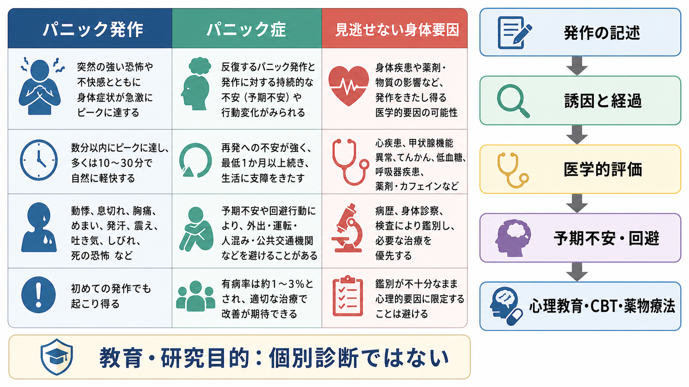

# パニック発作とは何か

## 要点

- パニック発作とは、突然立ち上がる強い恐怖または強い不快感に、動悸、発汗、震え、息苦しさ、胸部不快感、めまい、しびれ、現実感の変化、死や制御不能への恐怖などがまとまって現れる発作である[1][2]。
- パニック発作は症候であり、それ自体が必ずしもパニック症を意味するわけではない。パニック症では、予期しない発作が反復し、少なくとも1か月以上の予期不安または回避行動が続く[1][2]。
- 発作中の身体症状は非常に強く、「心臓発作ではないか」「窒息するのではないか」と感じられることがある。ただし、臨床ではまず身体疾患、薬物・物質、他の精神疾患で説明されないかを評価する必要がある[2][3]。
- 仕組みとしては、内受容感覚、呼吸・心拍などの自律神経反応、恐怖ネットワーク、身体感覚への破局的解釈が短時間で相互増幅する循環として理解しやすい[4][5][6]。
- 本稿は教育・研究目的の整理であり、個別の診断や治療指示ではない。

## この記事で答える問い

1. パニック発作は、単なる強い不安や焦りと何が違うのか。
2. 発作中に、なぜ心臓・呼吸・めまい・しびれのような身体症状が前景化するのか。
3. パニック発作とパニック症はどのように区別されるのか。
4. 臨床・研究では、発作をどのように記述し、どのような点に注意するのか。

## まず結論

パニック発作は、**恐怖が「考え」だけでなく身体全体の警報として立ち上がる短時間の発作**である。ここで重要なのは、「恐怖」「身体感覚」「解釈」「回避」が分離していない点である。たとえば心拍の上昇が「危険な心臓の異常」と解釈されると、恐怖が高まり、呼吸や発汗や筋緊張がさらに増え、その身体感覚が再び危険の証拠として読まれる。この循環は数分単位で急速に強まり、本人には「突然襲ってきた」と感じられる。

一方で、パニック発作は診断名ではない。発作はパニック症だけでなく、特定の恐怖場面、外傷記憶、物質使用、身体疾患、他の不安症や気分症の文脈でも起こりうる[2][3]。したがって症候学的には、発作の有無だけでなく、予期される発作か、予期しない発作か、何を恐れているのか、発作後にどのような予期不安や回避が残るのかを記述する必要がある。

## 背景

パニック発作は臨床でよく遭遇する。米国の代表的疫学研究では、孤立したパニック発作は比較的高頻度に経験される一方、反復する予期しない発作と持続的な予期不安・回避を伴うパニック症はより狭い範囲の診断カテゴリーとして整理される[4]。NIMH も、パニック発作を経験した人すべてがパニック症になるわけではないと明示している[3]。

この区別は臨床的に大きい。救急外来や内科で胸痛、動悸、息苦しさ、めまいとして現れることがあるため、急性冠症候群、不整脈、喘息、甲状腺機能亢進、低血糖、薬物・カフェイン・離脱などの身体要因を見逃してはならない[2]。同時に、身体評価だけで終わると、発作後の予期不安、回避、身体感覚への過注意が残り、生活範囲を狭めることがある。

症候学の観点では、パニック発作は [[精神症候学とは何か]] の中でも、主観的恐怖、観察可能な身体反応、認知的解釈、行動変化が密接に絡む症候である。[[焦燥とは何か]] が「落ち着かなさや行動化」に焦点を当てるのに対し、パニック発作では「急激な恐怖と身体警報」が中心になる。[[気分とは何か]] のような持続的背景状態とも異なり、発作性・急峻性・ピークの形成が特徴である。

## 基本概念

### 定義

DSM-5-TR に基づく整理では、パニック発作は、突然の強い恐怖または不快感が短時間でピークに達し、複数の身体症状・認知症状を伴う発作として扱われる[1][2]。代表的な症状には、動悸、発汗、震え、息切れまたは息苦しさ、窒息感、胸痛または胸部不快感、吐き気、めまい、寒気または熱感、しびれ、現実感消失または離人感、制御不能への恐怖、死への恐怖が含まれる[1][2]。

ここでの「突然」は、必ずしも何の前触れもないという意味だけではない。発作が明確な恐怖対象に結びつく場合もあれば、睡眠中や安静時のように本人には誘因が見えにくい場合もある[2][3]。臨床記述では、外部状況、身体状態、直前の思考、睡眠、物質使用、月経周期、過労、対人ストレスなどを含めて経過を確認する。

### パニック発作とパニック症

パニック発作は「発作の型」であり、パニック症は「発作後の持続的な心配や行動変化まで含む診断カテゴリー」である。パニック症では、反復する予期しないパニック発作に加えて、さらなる発作やその結果への持続的な心配、または発作を避けるための不適応な行動変化が少なくとも1か月続くことが重視される[1][2]。

この区別は、発作を軽く見るためではなく、過剰に診断名へ飛びつかないために重要である。孤立した発作、特定の恐怖場面での発作、身体疾患に伴う発作、物質関連の発作では、必要な評価や支援の焦点が異なる。

### 「予期される発作」と「予期しない発作」

パニック発作は、状況との関係から、予期される発作と予期しない発作に分けて考えられる。たとえば高所、閉所、外傷記憶、特定の身体感覚など、本人にとって意味のある誘因に反応して起こる発作は予期される発作として理解しやすい。一方、明確な誘因なしに突然起こる発作は、本人にとって説明しにくく、「また突然起こるのではないか」という予期不安を生みやすい[2][3]。

## 仕組み

### 身体警報としての発作

パニック発作の体験は、身体の警報反応として理解できる。心拍の増加、呼吸の変化、発汗、筋緊張、胃腸の不快感は、危険に備える反応としては自然な要素である。しかし、これらが「危険の証拠」として強く解釈されると、恐怖がさらに高まり、身体反応も増幅する。

この循環は [[内受容感覚は感情にどう関わるのか]] と深く関係する。内受容感覚とは、心拍、呼吸、胃腸感覚、体温、緊張など、身体内部の状態を脳が読み取る仕組みである。パニック発作では、身体内部の小さな変化が過大に検出され、「これは危険だ」という予測と結びつくことで、恐怖体験が急速に形成される。

### 恐怖ネットワークと内受容

神経科学的には、パニック発作を単一の脳部位だけで説明することはできない。扁桃体、島皮質、前部帯状皮質、前頭前野、脳幹、自律神経系などが、恐怖評価、身体感覚、行動準備、呼吸・心拍制御に関わると考えられる[5]。[[扁桃体過活動は不安症やPTSDにどう関わるのか]]、[[自律神経ネットワークは内臓状態をどう制御するのか]]、[[身体と感情はどのようにつながるのか]] は、この背景理解に役立つ。

ただし、発作を「扁桃体が暴走する」とだけ説明すると単純化しすぎになる。発作は、身体感覚の検出、意味づけ、危険予測、回避学習、環境文脈が組み合わさった現象である。[[恐怖条件づけとは何か]] の観点からは、過去の発作で苦しかった場所や身体感覚が、次の発作を予測する手がかりとして学習されることもある。

### 呼吸と「窒息アラーム」仮説

パニック発作では、息苦しさ、窒息感、過換気、胸部不快感がしばしば中心症状になる。Klein は、予期しないパニックの一部を、窒息を検出する警報系が誤作動する「偽の窒息アラーム」として説明する仮説を提案した[6]。この仮説は、二酸化炭素感受性、呼吸困難感、睡眠中の発作などを説明する枠組みとして影響力を持った。

一方で、この仮説だけでパニック発作全体を説明することはできない。呼吸症状が目立たない発作もあり、認知的解釈、内受容感覚への恐怖、回避学習、対人・生活文脈も重要である[5][7]。したがって本稿では、窒息アラーム仮説を「一部の発作を説明しうる有力な仮説」として扱い、単一原因論としては扱わない。

### 破局的解釈と回避

認知行動モデルでは、心拍や息苦しさなどの身体感覚を「心臓発作」「窒息」「失神」「発狂」「制御不能」と解釈することで恐怖が増幅すると考える[5][7]。このとき、身体感覚そのものが恐怖の対象になる。運動、階段、入浴、カフェイン、人混み、電車、閉所など、身体感覚を高める状況を避けるようになると、短期的には安心しても、長期的には「避けなければ危険」という学習が残りやすい。

この点は [[認知バイアスとは何か]] ともつながる。パニック発作では、身体感覚への注意の偏り、危険解釈、安心確認、回避が一つの循環を作る。発作そのものの時間は短くても、発作を恐れる生活が長く続くと、行動範囲や社会参加が大きく狭まる。

## 図解

上の1枚目は、パニック発作を「突然の恐怖・不快感」「身体症状」「破局的解釈」「回避・予期不安」の概念地図として示している。発作は一つの症状リストではなく、主観的恐怖、身体感覚、認知、行動がまとまった出来事として理解すると見通しがよい。

2枚目は、身体感覚から危険解釈へ、恐怖反応から自律神経反応へ、そして感覚の増幅へ戻る悪循環を示している。これは「気のせい」という意味ではない。むしろ、身体反応が現実に生じ、それが脳内の危険予測と結びつくことで、さらに身体反応が強まるという意味である。

3枚目は、発作の記述、誘因と経過、医学的評価、予期不安・回避、心理教育・CBT・薬物療法への接続を示す。ここで重要なのは、記事本文の範囲が「症候の理解」であり、個別治療の選択ではない点である。実際の対応では、身体疾患の評価、本人の希望、リスク、併存症、生活状況を含めて専門職が判断する必要がある。

## 臨床・研究との接続

### 評価の入口

臨床では、まず発作の時間経過を具体的に聞く。いつ始まり、どのくらいでピークに達し、どのくらいで落ち着いたか。何をしていたか。心拍、呼吸、胸痛、しびれ、めまい、吐き気、現実感の変化、死や制御不能への恐怖はあったか。発作後に、再発への心配、行動制限、救急受診、安心確認、回避が生じたかを確認する[2][3]。

同時に、医学的評価が必要である。初発の強い胸痛、失神、神経症状、呼吸器症状、既往歴、薬物・物質使用、甲状腺疾患、循環器疾患などがある場合、発作を心理的要因だけで説明してはならない[2]。これは、パニック発作を疑うことと身体疾患を評価することが矛盾しないためである。

### 治療研究への接続

パニック症に対しては、認知行動療法、曝露、薬物療法などが研究されてきた[5][8]。とくに内受容曝露は、発作で恐れられる身体感覚を安全な条件で経験し直し、「この感覚は危険そのものではない」と学習する要素として位置づけられる[7]。NICE の成人パニック症ガイドラインも、段階的ケアの中で心理療法や薬物療法を整理している[8]。

ただし、この記事の目的は治療手順を示すことではない。症候学的には、治療研究の前提として、どの身体感覚が恐れられているのか、どの状況が避けられているのか、発作後にどのような予測が残るのかを丁寧に記述することが重要である。

### 研究上の焦点

研究では、パニック発作は複数の水準で扱われる。疫学研究では、孤立した発作、パニック症、広場恐怖、併存症、生活機能障害が区別される[4]。神経科学では、恐怖ネットワーク、内受容、呼吸調節、予測処理、自律神経系が検討される[5][6]。心理学では、身体感覚への恐怖、破局的解釈、回避学習、曝露による再学習が中心になる[7]。

この多層性は [[精神疾患の次元的理解とは何か]] とも接続する。パニック発作は、診断カテゴリーだけでなく、恐怖、不安感受性、内受容、回避、身体疾患との境界という次元からも検討できる。

## よくある誤解

### 誤解1: パニック発作があるなら必ずパニック症である

パニック発作は、パニック症の中心症状になりうるが、それ自体は診断名ではない。特定の恐怖場面、PTSD、社交不安、うつ状態、物質使用、身体疾患など、さまざまな文脈で起こりうる[2][3]。診断では、反復性、予期しない発作、予期不安、回避、鑑別を合わせて見る必要がある。

### 誤解2: 身体検査で異常がなければ「本当の症状」ではない

パニック発作の動悸、息苦しさ、発汗、震え、めまいは、本人にとって実際に起きている身体体験である。身体疾患が否定的だからといって、苦痛が否定されるわけではない。むしろ、身体感覚を危険として読む循環を理解することが重要になる。

### 誤解3: 発作中に落ち着けないのは意志が弱いからである

パニック発作では、恐怖反応、自律神経反応、呼吸、注意、解釈が急速に結びつく。意志の強さだけで説明できるものではない。本人の努力不足として扱うと、羞恥や回避が強まり、評価や支援へのアクセスが遅れることがある。

### 誤解4: パニック発作は危険だから、発作を起こしそうな状況はすべて避けるべきである

身体疾患や安全上のリスクがある場合は別として、パニック発作への過度な回避は、予期不安を維持することがある[5][7]。ただし、回避を減らす作業は個別の評価と支援のもとで行われるべきであり、自己判断で急に負荷をかけることを勧めるものではない。

## 関連ノート

- [[精神症候学とは何か]]
- [[焦燥とは何か]]
- [[気分とは何か]]
- [[扁桃体過活動は不安症やPTSDにどう関わるのか]]
- [[自律神経ネットワークは内臓状態をどう制御するのか]]
- [[内受容感覚は感情にどう関わるのか]]
- [[身体と感情はどのようにつながるのか]]
- [[恐怖条件づけとは何か]]
- [[認知バイアスとは何か]]
- [[精神疾患の次元的理解とは何か]]

今後の作成候補: パニック症とは何か、広場恐怖とは何か、予期不安とは何か、内受容曝露とは何か、身体疾患とパニック発作の鑑別。

MOC更新候補: `content/00_MOC/MOC｜精神医学.md`、`content/00_MOC/MOC｜神経科学と精神疾患.md`、`content/00_MOC/MOC｜意識・自己・身体性.md`。並列ジョブとの競合を避けるため、本タスクでは MOC 本体は更新していない。

## 理解チェック

1. パニック発作とパニック症の違いを、「発作」と「発作後の持続的変化」という観点から説明できるか。
2. 動悸や息苦しさが、どのように恐怖と悪循環を作るのかを説明できるか。
3. パニック発作を疑うときにも、身体疾患や物質関連要因を評価すべき理由を説明できるか。
4. 「予期される発作」と「予期しない発作」の違いを例で説明できるか。
5. 内受容曝露が、なぜパニック症の CBT で重要な要素になりうるのかを説明できるか。

## 未解決問題

- パニック発作の個人差を、内受容感覚、呼吸調節、恐怖学習、予測処理、生活文脈のどの組み合わせで最もよく説明できるか。
- ウェアラブル計測による心拍・呼吸・活動量データは、発作の予測や再発予防にどこまで実用化できるか。
- 予期しない発作と状況依存性の発作は、神経生理学的にどの程度異なる現象なのか。
- 医療現場で、身体疾患の見逃しを避けながら、過剰検査と不安増幅をどう減らすか。

## 参考文献

[1] American Psychiatric Association. (2022). *Diagnostic and Statistical Manual of Mental Disorders, Fifth Edition, Text Revision (DSM-5-TR)*. American Psychiatric Association Publishing. https://doi.org/10.1176/appi.books.9780890425787

[2] Barnhill, J. W. (2026). Panic Attacks and Panic Disorder. *Merck Manual Professional Edition*. https://www.merckmanuals.com/professional/psychiatric-disorders/anxiety-and-stressor-related-disorders/panic-attacks-and-panic-disorder

[3] National Institute of Mental Health. (2026). *Panic Disorder: What You Need to Know*. https://www.nimh.nih.gov/health/publications/panic-disorder-when-fear-overwhelms

[4] Kessler, R. C., Chiu, W. T., Jin, R., Ruscio, A. M., Shear, K., & Walters, E. E. (2006). The epidemiology of panic attacks, panic disorder, and agoraphobia in the National Comorbidity Survey Replication. *Archives of General Psychiatry, 63*(4), 415-424. https://doi.org/10.1001/archpsyc.63.4.415

[5] Roy-Byrne, P. P., Craske, M. G., & Stein, M. B. (2006). Panic disorder. *The Lancet, 368*(9540), 1023-1032. https://doi.org/10.1016/S0140-6736(06)69418-X

[6] Klein, D. F. (1993). False suffocation alarms, spontaneous panics, and related conditions: An integrative hypothesis. *Archives of General Psychiatry, 50*(4), 306-317. https://doi.org/10.1001/archpsyc.1993.01820160076009

[7] Lee, K., Noda, Y., Nakano, Y., Ogawa, S., Kinoshita, Y., Funayama, T., & Furukawa, T. A. (2006). Interoceptive hypersensitivity and interoceptive exposure in patients with panic disorder: Specificity and effectiveness. *BMC Psychiatry, 6*, 32. https://doi.org/10.1186/1471-244X-6-32

[8] National Institute for Health and Care Excellence. (2011, last reviewed 2024). *Generalised anxiety disorder and panic disorder in adults: management* (Clinical guideline CG113). https://www.nice.org.uk/guidance/cg113
