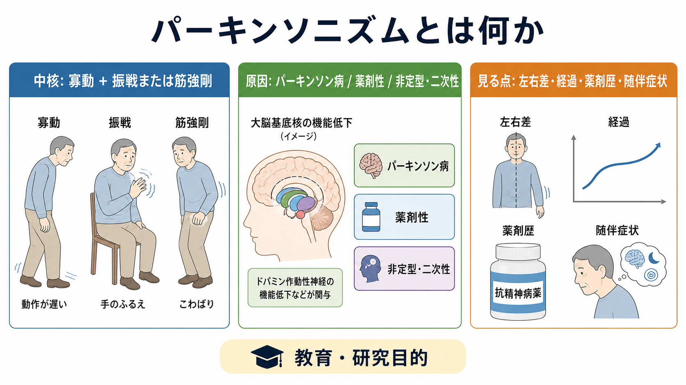
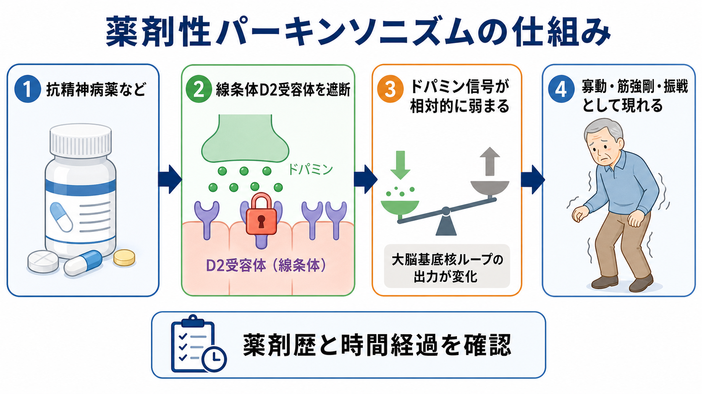
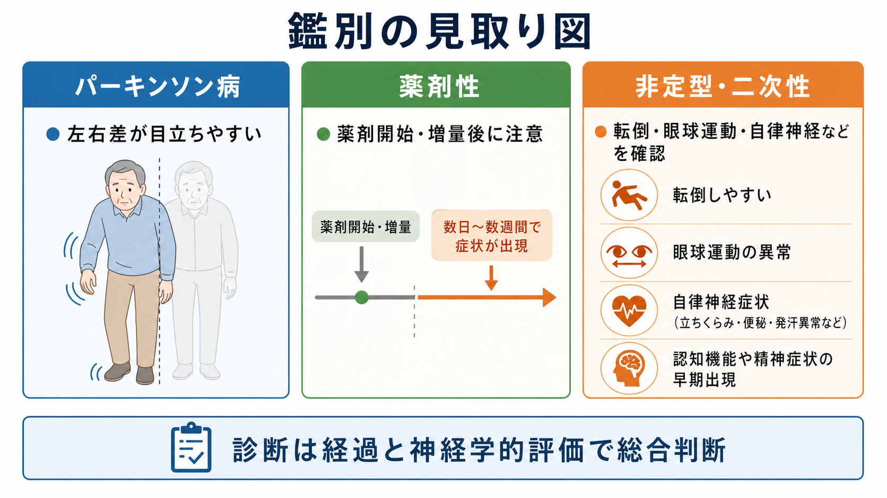

# パーキンソニズムとは何か

## 要点

- パーキンソニズムは、単一の病名ではなく、**寡動・動作緩慢を中心に、静止時振戦または筋強剛を伴う運動症候群**として捉えると理解しやすい。MDS のパーキンソン病診断基準でも、中核は「寡動に、静止時振戦または筋強剛が加わる」ことと整理されている[1]。
- 原因はパーキンソン病だけではない。薬剤性、血管性、正常圧水頭症、進行性核上性麻痺や多系統萎縮症などの非定型パーキンソニズム、その他の二次性原因でも似た運動所見が出る[2][4]。
- 精神科では、抗精神病薬などのドパミンD2受容体遮断に関連する**薬剤性パーキンソニズム**が重要である。薬剤開始・増量後の時間経過、左右差、随伴症状、生活機能への影響を丁寧に見る必要がある[5][6]。
- 本稿は教育・研究目的の整理であり、個別の診断や治療指示ではない。実際の症状評価や薬剤調整は、神経学的診察と処方歴を含む臨床判断に基づく。

## この記事で答える問い

1. パーキンソニズムは、パーキンソン病と同じ意味なのか。
2. 振戦、筋強剛、寡動は、どのような観察所見として現れるのか。
3. 抗精神病薬の副作用としての薬剤性パーキンソニズムは、なぜ起こるのか。
4. 神経疾患、薬剤性、精神症状や他の運動症候をどう区別して考えるとよいのか。

## まず結論

パーキンソニズムとは、「パーキンソン病らしさ」ではなく、**運動が遅く小さくなることを軸にした観察可能な症候群**である。中心にあるのは寡動・動作緩慢で、そこに静止時振戦、筋強剛、姿勢反射障害、歩行のすくみや小刻み歩行などが重なる。NICE も、パーキンソン病でみられる典型的なパーキンソニズムとして、寡動、筋強剛、静止時振戦、姿勢不安定性を挙げている[2]。

ただし、同じ所見があるからといって、原因がパーキンソン病とは限らない。パーキンソン病では黒質ドパミン神経細胞の変性が中心にあり、運動症状だけでなく便秘、睡眠障害、うつ、認知機能変化、自律神経症状などの非運動症状も重要になる[3]。一方、抗精神病薬などによる薬剤性パーキンソニズムでは、線条体のドパミン受容体遮断により、パーキンソン病に似た寡動・筋強剛・振戦が出現しうる[5][6]。

## 背景

パーキンソニズムは、精神医学と神経学の境界でしばしば問題になる。精神科臨床では、抗精神病薬の治療効果と副作用を同時に評価する必要があり、[[不安とは何か]]、[[不眠とは何か]]、[[せん妄とは何か]]のような精神状態の変化と、運動症候としての動作緩慢や筋緊張の変化が同じ場面で観察されることがある。

このとき重要なのは、「元気がない」「動かない」「表情が乏しい」といった印象を、そのまま抑うつ、陰性症状、意欲低下、[[カタトニアとは何か|カタトニア]]などにまとめてしまわないことである。動作開始の遅さ、反復運動の小ささ、筋強剛、静止時振戦、歩幅の短縮、腕振りの減少などを分けて観察すると、薬剤性・神経変性・精神症状の重なりを検討しやすくなる[1][4]。

## 基本概念

### 寡動・動作緩慢

寡動は、動きが少なくなること、動作緩慢は、動きの開始や遂行が遅くなることを指す。診察場面では、指タップや足踏みなどの反復運動が徐々に小さく遅くなる、立ち上がりや方向転換に時間がかかる、表情や腕振りが乏しい、といった形で観察される[1][3]。

日常語の「だるい」「やる気がない」と重なって見えるため、精神症状との鑑別が難しい。[[多動とは何か]]が活動量の過剰や制御の問題として現れるのに対し、パーキンソニズムでは「動きたいかどうか」よりも、運動出力そのものの遅さ・小ささ・硬さを観察する。

### 筋強剛

筋強剛は、他者が関節を動かしたときに、速度に依存しにくい抵抗として感じられる筋緊張の異常である。パーキンソン病では歯車様強剛として記述されることがあり、NINDS も筋の硬さや歯車様の動きを主要症状として説明している[3]。

筋強剛は、痛み、姿勢の変化、書字や着替えの困難、歩行時の腕振り低下としても現れる。緊張、不安、錐体路性の痙縮、カタトニアの姿勢保持とは、観察と神経学的診察で分けて考える必要がある。

### 振戦

パーキンソニズムで典型的に問題になるのは静止時振戦である。手を膝の上に置いているときなど、随意運動をしていない場面で目立ち、動作中には軽くなることがある[3]。ただし、振戦がないパーキンソニズムもあり、振戦だけで診断を決めることはできない[1]。

精神科では、薬剤性振戦、不安に伴う振戦、本態性振戦、離脱や中毒、甲状腺機能異常なども鑑別に入る。したがって、振戦の有無だけでなく、静止時か姿勢時か、左右差、発症時期、薬剤変更との関係を見る。

## 仕組み

### 大脳基底核ループの観点

パーキンソニズムの運動症状は、大脳基底核を含む運動制御ループの変化として理解できる。パーキンソン病では、黒質緻密部のドパミン神経細胞の変性により、線条体へのドパミン入力が低下し、滑らかで目的に沿った運動の調整が難しくなる[3][4]。

この説明は便利だが、「ドパミンが少ないからすべて説明できる」という単純化は避けるべきである。パーキンソン病には非運動症状があり、非定型パーキンソニズムでは自律神経、眼球運動、認知機能、転倒しやすさなどが早期から問題になることがある[2][4]。

### 薬剤性パーキンソニズム

抗精神病薬の多くは、治療効果の一部としてドパミンD2受容体遮断をもつ。しかし、線条体のD2受容体遮断が強くなると、黒質線条体系のドパミン信号が相対的に弱まり、寡動、筋強剛、振戦などの錐体外路症状として現れることがある[5][6]。

薬剤性パーキンソニズムは、薬剤開始や増量から数日から数週の範囲で気づかれることが多いが、症例によっては経過が複雑である。高齢者では抗精神病薬誘発性パーキンソニズムと特発性パーキンソン病の区別が難しく、薬剤中止後も症状が残る場合には潜在する神経変性疾患が表面化した可能性も検討される[6]。

## 図解

1枚目の図は、パーキンソニズムを「症候」「原因」「観察の焦点」に分けて示している。特に、寡動・振戦・筋強剛を症候として確認したうえで、パーキンソン病、薬剤性、非定型・二次性原因を同時に考える点が重要である。

2枚目の図は、薬剤性パーキンソニズムを、抗精神病薬などのD2受容体遮断から大脳基底核ループの出力変化、運動症状への表出として示している。これは病態の要約であり、個別の薬剤変更を指示する図ではない。

3枚目の図は、パーキンソン病、薬剤性、非定型・二次性パーキンソニズムを比較するための見取り図である。左右差、薬剤開始・増量との時間関係、転倒、眼球運動、自律神経症状、認知機能や精神症状の早期出現などを整理する。

## 臨床・研究との接続

### 抗精神病薬副作用として見る

抗精神病薬による錐体外路症状には、パーキンソニズム、アカシジア、急性ジストニア、遅発性ジスキネジアなどが含まれる。観察研究の系統的レビュー・メタ解析では、抗精神病薬関連の錐体外路症状は少なくない頻度で報告され、パーキンソニズムも主要な構成要素として扱われている[7]。

薬剤性パーキンソニズムでは、症状が対称性に出やすい、薬剤開始・増量との時間関係が手がかりになる、といった特徴がしばしば述べられる[4][5]。ただし、臨床では例外も多く、左右差がないから薬剤性、左右差があるからパーキンソン病、という単純な判定はできない。

### 神経疾患として見る

パーキンソン病では、典型的には左右差を伴って始まり、運動症状に加えて非運動症状が経過全体で問題になる[2][3]。MDS 基準は、パーキンソニズムを確認したうえで、支持的特徴、除外基準、レッドフラッグを組み合わせてパーキンソン病らしさを評価する枠組みを提示している[1]。

非定型パーキンソニズムでは、早期転倒、垂直性眼球運動障害、自律神経障害、小脳症状、早期の認知機能変化などが注意点になる[4]。これらは精神症状や生活機能の変化として前景化することもあるため、[[せん妄とは何か|せん妄]]や抑うつ、認知症状だけで説明しきれない運動・自律神経所見を拾うことが大切である。

### 研究上の見方

研究では、パーキンソニズムを「ドパミンだけの問題」と見るより、D2受容体遮断、受容体感受性、シナプス可塑性、酸化ストレス、コリン系やGABA系の関与など、複数の機序の重なりとして検討する流れがある[8]。これは、なぜ同じ薬剤でも症状が出る人と出ない人がいるのか、なぜ高齢者で目立ちやすいのか、なぜ薬剤中止後も残る場合があるのか、という問いにつながる。

## よくある誤解

### 「振戦があればパーキンソン病である」

振戦は重要な手がかりだが、振戦だけでパーキンソン病とは言えない。パーキンソニズムの中核は寡動であり、振戦の種類、安静時か姿勢時か、左右差、薬剤歴、随伴症状を合わせて読む必要がある[1][3]。

### 「抗精神病薬を使っていれば、すべて薬剤性である」

抗精神病薬は薬剤性パーキンソニズムの重要な原因だが、高齢者ではパーキンソン病や非定型パーキンソニズムが併存・顕在化することもある[6]。薬剤歴は強い手がかりである一方、経過観察と神経学的評価が必要になる。

### 「動かないのは陰性症状や抑うつだけで説明できる」

動作緩慢、表情減少、声の小ささ、活動量低下は、陰性症状や抑うつに似て見える。しかし、筋強剛、静止時振戦、歩行の小刻み化、反復運動の減衰があれば、運動症候としてのパーキンソニズムを別に評価する必要がある。[[カタトニアとは何か|カタトニア]]とも重なって見えるため、観察項目を分けることが重要である。

## 関連ノート

- [[カタトニアとは何か]]: 動かない、姿勢を保つ、反応が乏しいといった所見との鑑別。
- [[多動とは何か]]: 活動量の過剰と、運動出力の低下としての寡動を対比する。
- [[不安とは何か]]: 不安に伴う振戦や落ち着かなさと、パーキンソニズムの振戦・アカシジアを分ける。
- [[不眠とは何か]]: 睡眠障害はパーキンソン病の非運動症状や精神状態の変化と関連しうる。
- [[せん妄とは何か]]: 高齢者や身体疾患背景で、認知・注意の変動と運動症候を同時に評価する。

### 関連ノート候補

- 錐体外路症状とは何か
- アカシジアとは何か
- 遅発性ジスキネジアとは何か
- パーキンソン病とは何か
- 大脳基底核とは何か
- 抗精神病薬とドパミンD2受容体

### MOC更新候補

- `content/00_MOC/` の精神医学・症候学関連 MOC に、本記事を「運動症候・薬剤性副作用」の項目として追加する。
- 並列ジョブとの競合を避けるため、本稿では MOC ファイルの直接更新は行わない。

## 理解チェック

1. パーキンソニズムの中核を、振戦ではなく寡動・動作緩慢から説明できるか。
2. パーキンソン病、薬剤性、非定型・二次性パーキンソニズムの違いを、左右差、時間経過、薬剤歴、随伴症状で整理できるか。
3. 抗精神病薬によるD2受容体遮断が、なぜ寡動・筋強剛・振戦に結びつきうるのかを、大脳基底核ループの変化として説明できるか。
4. 抑うつ、陰性症状、カタトニア、せん妄と見分けるために、どの観察所見を追加で確認すべきか。

## 参考文献

[1] Postuma, R. B., Berg, D., Stern, M., et al. (2015). MDS clinical diagnostic criteria for Parkinson's disease. *Movement Disorders, 30*(12), 1591-1601. https://doi.org/10.1002/mds.26424

[2] National Institute for Health and Care Excellence. (2017). *Parkinson's disease in adults: diagnosis and management* (NICE Guideline NG71). https://www.ncbi.nlm.nih.gov/books/n/niceng71/

[3] National Institute of Neurological Disorders and Stroke. (n.d.). *Parkinson's Disease*. https://www.ninds.nih.gov/health-information/disorders/parkinsons-disease

[4] Shrimanker, I., Tadi, P., Schoo, C., & Sánchez-Manso, J. C. (2024). *Parkinsonism*. StatPearls. https://www.ncbi.nlm.nih.gov/books/NBK542224/

[5] Shin, H.-W., & Chung, S. J. (2012). Drug-induced parkinsonism. *Journal of Clinical Neurology, 8*(1), 15-21. https://doi.org/10.3988/jcn.2012.8.1.15

[6] Wisidagama, S., Selladurai, A., Wu, P., Isetta, M., & Serra-Mestres, J. (2021). Recognition and management of antipsychotic-induced parkinsonism in older adults: A narrative review. *Medicines, 8*(6), 24. https://doi.org/10.3390/medicines8060024

[7] Ali, T., Sisay, M., Tariku, M., Mekuria, A. N., & Desalew, A. (2021). Antipsychotic-induced extrapyramidal side effects: A systematic review and meta-analysis of observational studies. *PLoS ONE, 16*(9), e0257129. https://doi.org/10.1371/journal.pone.0257129

[8] Vaiman, E. E., Shnayder, N. A., Khasanova, A. K., et al. (2022). Pathophysiological mechanisms of antipsychotic-induced parkinsonism. *Biomedicines, 10*(8), 2010. https://doi.org/10.3390/biomedicines10082010

## 未解決問題

- 薬剤性パーキンソニズムと、抗精神病薬により顕在化した潜在的パーキンソン病を、早期にどこまで区別できるか。
- 高齢者、認知症、気分障害、統合失調症スペクトラムなど、背景疾患ごとのリスク評価をどのように個別化するか。
- 運動症状、主観的苦痛、精神症状の改善、再発予防を同時に扱う評価尺度と臨床ワークフローをどう設計するか。
