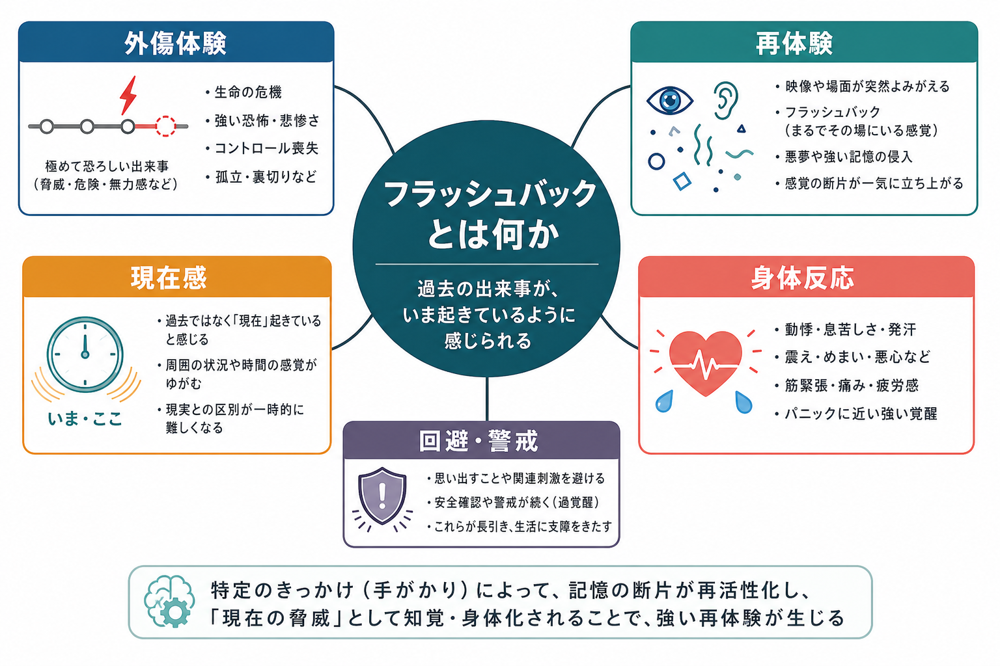
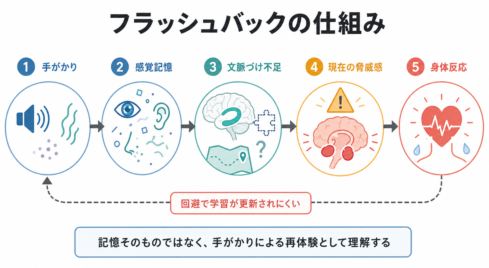

# フラッシュバックとは何か

## 要点

- フラッシュバックとは、外傷体験の記憶が「過去を思い出している」だけでなく、「いま再び起きている」ような現在感を伴って立ち上がる再体験である。DSM-5-TR では PTSD の侵入症状の一部であり、解離反応として現在の周囲への気づきが薄れる場合も含まれる[1]。
- ICD-11 でも PTSD の中核症状は、悪夢やフラッシュバックとしての再体験、回避、現在の脅威感で構成される。再体験は、単なる想起ではなく、強い恐怖や身体反応を伴って「今ここ」に戻される体験として扱われる[2]。
- 仕組みとしては、外傷記憶の感覚断片、文脈づけの弱さ、現在の手がかりへの過敏な反応、身体の警戒反応、回避による学習更新の困難が組み合わさる[3][4]。
- フラッシュバックは診断名ではなく症状である。PTSD で重要だが、解離、物質使用、睡眠関連現象、神経疾患、パニック様の身体反応などとの鑑別も必要になる。
- 本稿は教育・研究目的の整理であり、個別の診断や治療指示ではない。現実の臨床では、安全性、生活機能、併存症、本人の希望を含めて専門職が評価する。

## この記事で答える問い

1. フラッシュバックは、通常の記憶・悪夢・パニック発作と何が違うのか。
2. なぜ過去の外傷体験が「現在の脅威」として感じられるのか。
3. 臨床評価では、どのように聞き取り、どのような鑑別を考えるべきか。
4. 研究では、記憶、情動、身体反応、脳ネットワークのどこに注目しているのか。

## まず結論

フラッシュバックは、外傷記憶の「内容」だけでなく、感覚、情動、身体反応、時間感覚がまとまって現在化する現象である。つまり、「昔のことを思い出してつらい」というより、音、匂い、体の感覚、場所、表情、言葉などの手がかりによって、危険が今ここで再発しているように体験される。

このため本人の中では、記憶と現実の境界が一時的に揺らぎうる。周囲からは数十秒から数分の反応に見えても、本人には強い恐怖、無力感、身体の硬直、発汗、動悸、息苦しさ、逃げたい衝動として現れることがある。[[パニック発作とは何か]]と似た身体反応を伴うこともあるが、中心にあるのは外傷手がかりによる再体験である。

## 背景

PTSD の診断体系では、フラッシュバックは「侵入症状」または「再体験」の一部として位置づけられる。DSM-5-TR は、外傷体験に関連する侵入的記憶、悪夢、解離反応、心理的苦痛、生理的反応を PTSD の症状群に含める[1]。ICD-11 はより簡潔に、再体験、回避、持続的な現在の脅威感を PTSD の中核として整理する[2]。

ただし、フラッシュバックは PTSD だけの所有物ではない。[[トラウマ歴はどのように聞くべきか]]で扱うように、外傷体験の聞き取りでは、本人がその出来事をどう意味づけ、どの手がかりで反応が起き、日常生活がどの程度制限されているかを見る必要がある。症状名だけを確認しても、何が本人の苦痛と機能障害を維持しているかはわからない。

## 基本概念

### 通常の想起との違い

通常の想起では、「これは過去の出来事である」という文脈が比較的保たれる。つらい記憶であっても、時間、場所、出来事の前後関係、現在の自分との距離がある程度ついている。

フラッシュバックでは、この距離が縮む。映像、音、匂い、身体感覚、痛み、姿勢、声の調子のような断片が急に立ち上がり、「いま起きている」という現在感を帯びる。Brewin は PTSD の記憶研究を整理し、フラッシュバックを、言語的・文脈的に整理された記憶だけでなく、感覚的に強い記憶表象と結びつく現象として位置づけている[3]。

### 解離との関係

DSM-5-TR では、フラッシュバックは軽いものから、現在の周囲への気づきが完全に失われるものまで幅がある解離反応として記述される[1]。この点で、[[解離とは認知科学的に何か]]や[[解離症状は脳ネットワークでどう説明できるのか]]と接続する。

ただし、すべてのフラッシュバックが明確な解離を伴うわけではない。本人が「いまは安全だ」と頭では理解していても、身体が強く反応することもある。臨床的には、意識の変容、時間感覚、現実感、記憶の抜け、発作後の疲労などを分けて聞く。

### 悪夢・侵入記憶・反すうとの違い

悪夢は睡眠中の再体験であり、目覚めた後に恐怖や身体反応が残ることがある。侵入記憶は、望まない記憶が突然浮かぶ現象で、フラッシュバックほど現在感や現実感の揺らぎが強くない場合もある。反すうは、出来事や自責を繰り返し考える思考過程であり、感覚断片が現在化するフラッシュバックとは焦点が異なる。

## 仕組み

### 手がかりが感覚記憶を起動する

フラッシュバックは、しばしば特定の手がかりに反応して起こる。音、匂い、光、場所、身体姿勢、他者の表情、季節、ニュース映像、医療処置、対人距離などが、外傷体験の一部と結びついている場合がある。

この手がかりは、本人が意識的に「思い出そう」としなくても働く。Ehlers と Clark の認知モデルでは、外傷後の持続的脅威感は、外傷記憶の性質と、出来事や症状への破局的解釈によって維持されると説明される[4]。たとえば「心拍が上がった」という身体感覚が「また危険が起きる」という解釈に結びつくと、身体反応がさらに強まりやすい。

### 文脈づけの不足

フラッシュバックでは、外傷体験の断片が、時間、場所、出来事の流れ、終わったという情報と結びつきにくいと考えられる。[[海馬回路は記憶をどう形成するのか]]で扱うような文脈記憶の働きが弱いと、記憶は「いつ・どこで終わった出来事か」としてではなく、感覚と脅威の断片として再活性化しやすい。

一方で、これは「記憶が完全に保存されている」という意味ではない。外傷記憶は鮮明な断片と抜け落ちが混在しうる。[[健忘とは何か]]で扱うような記憶の欠落、混乱、順序の曖昧さがあるからといって、体験が虚偽だと単純に判断できるわけではない。

### 脅威ネットワークと身体反応

PTSD の神経回路研究では、扁桃体、海馬、内側前頭前野、前帯状皮質、島皮質、自律神経系などが、脅威検出、文脈づけ、情動制御、身体感覚の統合に関わると考えられている[5]。[[PTSDでは恐怖記憶ネットワークに何が起きているのか]]、[[扁桃体過活動は不安症やPTSDにどう関わるのか]]、[[前頭前野は情動制御にどう関わるのか]]は、この背景理解に役立つ。

ただし、フラッシュバックを「扁桃体の暴走」だけで説明するのは単純化しすぎである。症状は、記憶、注意、予測、身体感覚、回避学習、対人状況が絡む現象である。研究知見は、臨床での理解を助けるが、個々の症状を脳部位だけから直接診断するものではない。

### 回避が短期的には楽にし、長期的には更新を妨げる

フラッシュバックを避けたい反応は自然である。関連する場所、話題、匂い、映像、人混み、身体感覚を避けることで、その瞬間の苦痛は下がる。しかし回避が広がると、「その手がかりは今は安全である」「記憶は過去のものとして位置づけられる」という学習が更新されにくくなる[4][6]。

このため、研究・臨床では、フラッシュバックそのものだけでなく、予期不安、回避、安全確認、睡眠、物質使用、対人関係、仕事や学業への影響も評価する。[[不安とは何か]]や[[ストレス脆弱性モデルとは何か]]とも接続する点である。

## 図解

1枚目は、フラッシュバックを「外傷体験」「再体験」「現在感」「身体反応」「回避・警戒」のまとまりとして示している。重要なのは、フラッシュバックを単なる記憶の再生ではなく、現在の脅威として知覚・身体化される再体験として見ることである。

2枚目は、手がかりから感覚記憶、文脈づけ不足、現在の脅威感、身体反応、回避による学習更新の困難へ進む流れを示している。ここでいう手がかりは、本人にとって意味をもつ刺激であり、外から見て明らかな危険であるとは限らない。

## 臨床・研究との接続

### 評価で聞くこと

臨床評価では、フラッシュバックの有無だけでなく、次の点を具体的に確認する。

| 評価軸 | 確認する内容 |
|---|---|
| 起こり方 | 突然か、特定の手がかりがあるか、睡眠中か覚醒中か |
| 体験内容 | 映像、音、匂い、身体感覚、痛み、声、姿勢、時間感覚 |
| 現在感 | 「過去を思い出す」程度か、「今ここで起きている」感覚があるか |
| 意識・解離 | 周囲への気づき、現実感、記憶の抜け、発作後の混乱 |
| 身体反応 | 動悸、息苦しさ、発汗、震え、硬直、胃腸症状、過覚醒 |
| 行動変化 | 回避、安全確認、外出困難、睡眠障害、対人関係への影響 |
| 鑑別 | 物質使用、睡眠障害、てんかん、パニック発作、精神病症状、身体疾患 |

VA National Center for PTSD も、フラッシュバックや侵入記憶を、PTSD でみられる再体験症状として説明し、本人が現在の環境と過去の記憶を区別しにくくなることがあると整理している[7]。

### 治療研究との接続

NICE ガイドラインは、PTSD に対してトラウマ焦点化 CBT や EMDR を主要な心理療法として推奨している[6]。これらは、単に「忘れる」ことを目指すのではなく、外傷記憶を現在の安全な文脈に位置づけ直し、回避と脅威予測を扱う枠組みをもつ。

ただし、治療選択は症状の重さ、解離、併存症、安全性、生活状況、本人の希望によって変わる。この記事の内容は、個別の治療方法を決めるための指示ではなく、症状理解のための整理である。

## よくある誤解

### 「フラッシュバックは映像が見えることだけである」

映像が中心になることはあるが、音、匂い、身体感覚、痛み、姿勢、感情、切迫感だけが前景化することもある。本人が「映像はない」と言っても、外傷手がかりに対する再体験がないとは限らない。

### 「思い出せるなら回復している」

記憶を語れることと、現在感を伴う再体験が落ち着いていることは別である。語ることができても、特定の場面で身体が強く反応することがある。

### 「フラッシュバックは意志が弱いから起こる」

フラッシュバックは、意志の弱さではなく、外傷後の記憶・注意・身体反応・脅威予測の組み合わせとして理解される。本人の責任として扱うと、恥や回避が強まり、支援につながりにくくなる。

### 「全部 PTSD と考えてよい」

フラッシュバックは PTSD の重要な症状だが、それだけで診断が決まるわけではない。外傷曝露、症状群、持続期間、機能障害、鑑別、併存症を含めた評価が必要である[1][2]。

## 関連ノート

- [[PTSDでは恐怖記憶ネットワークに何が起きているのか]]
- [[トラウマ歴はどのように聞くべきか]]
- [[解離とは認知科学的に何か]]
- [[解離症状は脳ネットワークでどう説明できるのか]]
- [[パニック発作とは何か]]
- [[健忘とは何か]]
- [[不安とは何か]]
- [[海馬回路は記憶をどう形成するのか]]
- [[扁桃体過活動は不安症やPTSDにどう関わるのか]]
- [[前頭前野は情動制御にどう関わるのか]]

## MOC更新候補

- `content/00_MOC/` 配下の精神医学、症候学、PTSD/トラウマ関連 MOC があれば、本記事へのリンク追加候補。
- 並列ジョブとの競合を避けるため、本タスクでは MOC 本体は更新しない。

## 理解チェック

1. フラッシュバックと通常の想起を分ける中心的な特徴は何か。
2. フラッシュバックで身体反応が強くなる理由を、手がかり、現在感、脅威予測の3語を使って説明できるか。
3. フラッシュバックがある人を評価するとき、PTSD 以外にどのような鑑別や併存を考えるべきか。
4. 回避が短期的には苦痛を下げ、長期的には症状維持に関わる理由を説明できるか。

## 未解決問題

- フラッシュバックの主観的な現在感を、実験課題や生理指標でどこまで測定できるか。
- 感覚断片、身体反応、解離、悪夢、侵入記憶をどのように次元的に区別するのが臨床的に有用か。
- トラウマ焦点化治療で、どの患者にどの順序・強度の介入が適しているか。
- 文化、言語、対人関係、社会的安全性がフラッシュバックの語られ方と回復過程にどう影響するか。

## 参考文献

[1] American Psychiatric Association. (2022). *Diagnostic and Statistical Manual of Mental Disorders, Fifth Edition, Text Revision (DSM-5-TR).* American Psychiatric Association Publishing. https://doi.org/10.1176/appi.books.9780890425787

[2] World Health Organization. (2024). *ICD-11 for Mortality and Morbidity Statistics: 6B40 Post traumatic stress disorder.* https://icd.who.int/browse/2024-01/mms/en#2070699808

[3] Brewin, C. R. (2011). The nature and significance of memory disturbance in posttraumatic stress disorder. *Annual Review of Clinical Psychology, 7*, 203-227. https://doi.org/10.1146/annurev-clinpsy-032210-104544

[4] Ehlers, A., & Clark, D. M. (2000). A cognitive model of posttraumatic stress disorder. *Behaviour Research and Therapy, 38*(4), 319-345. https://doi.org/10.1016/S0005-7967(99)00123-0

[5] Shin, L. M., & Liberzon, I. (2010). The neurocircuitry of fear, stress, and anxiety disorders. *Neuropsychopharmacology, 35*, 169-191. https://doi.org/10.1038/npp.2009.83

[6] National Institute for Health and Care Excellence. (2018, updated). *Post-traumatic stress disorder: NICE guideline NG116.* https://www.nice.org.uk/guidance/ng116

[7] U.S. Department of Veterans Affairs, National Center for PTSD. (n.d.). *Understanding PTSD and PTSD Treatment.* https://www.ptsd.va.gov/publications/print/understandingptsd_booklet.pdf
