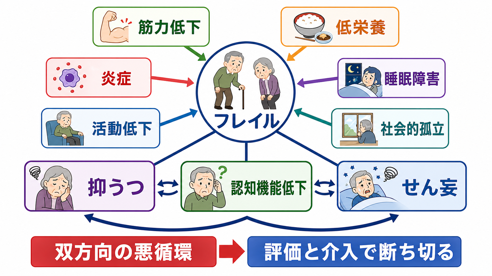
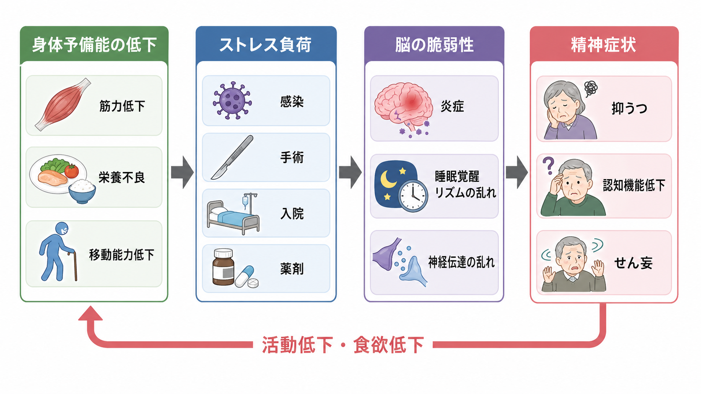
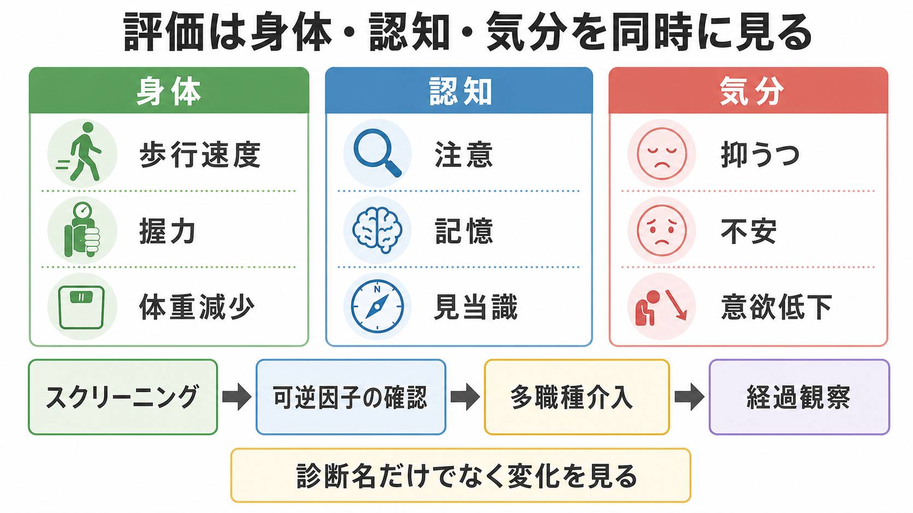

# フレイルと精神症状はどう関係するのか

## 要点

- フレイルは、筋力・持久力・生理的予備能が低下し、感染、入院、薬剤変更、手術などのストレスに弱くなる状態である[1][2]。
- 高齢者の[[抑うつ気分とは何か|抑うつ]]、[[認知機能障害とは何か|認知機能低下]]、[[せん妄とは何か|せん妄]]は、身体疾患と切り離された「こころだけの問題」としてではなく、身体予備能、脳の予備能、生活機能、環境負荷が交差する症候として見る必要がある。
- フレイルと抑うつはしばしば併存し、抑うつがある高齢者ではフレイルのリスクが高いことがメタ解析で示されている[3]。
- 身体的フレイルは認知機能低下と関連し、認知的フレイルは認知症、死亡、入院、障害などの不良転帰を予測する[4][5]。
- 入院高齢者では、フレイルはせん妄発症リスクを高める。メタ解析では、フレイルのある入院高齢者は非フレイル高齢者よりせん妄リスクが高かった[6]。

## この記事で答える問い

1. フレイルは、なぜ抑うつ・認知機能低下・せん妄と結びつきやすいのか。
2. 精神症状を見たとき、身体的脆弱性をどのように評価に組み込めばよいのか。
3. 「高齢だから仕方ない」「認知症だから仕方ない」と見逃さないために、どのような観察点が重要か。

## まず結論

フレイルと精神症状の関係は、一方向の因果ではなく「双方向の悪循環」として理解するとよい。身体予備能が低下すると、感染、脱水、疼痛、睡眠障害、入院環境、薬剤負荷などへの耐性が下がり、脳は注意・覚醒・記憶・気分を安定して保ちにくくなる。その結果として、[[意欲低下とは何か|意欲低下]]、食欲低下、活動量低下、[[睡眠障害とは何か|睡眠障害]]、[[注意障害とは何か|注意障害]]、[[見当識障害とは何か|見当識障害]]が現れやすい。

逆に、抑うつやせん妄が生じると、食事量、運動量、服薬管理、対人交流、リハビリ参加が低下し、フレイルがさらに進む。このため臨床では、精神症状だけを記述するのではなく、「歩けていたか」「食べられていたか」「眠れていたか」「薬剤が変わったか」「急に注意が保てなくなったか」を同時に見る。

## 背景

高齢者の精神症状は、若年成人で想定される精神疾患カテゴリーだけでは説明しにくいことが多い。たとえば、同じ「元気がない」でも、うつ病、低栄養、心不全、感染、疼痛、薬剤性鎮静、せん妄の低活動型、認知症の進行、社会的孤立が重なっていることがある。ここでフレイルという枠組みを使うと、精神症状を身体機能、栄養、炎症、睡眠、環境変化、生活機能の変化と結びつけて理解しやすくなる。

フレイルの代表的な考え方には、Fried らの「表現型モデル」と、Rockwood らの「欠損累積モデル」がある。表現型モデルでは、体重減少、疲労感、筋力低下、歩行速度低下、身体活動低下が重視される[1]。一方、欠損累積モデルでは、疾患、機能障害、認知、気分、日常生活上の困難など、複数の欠損の蓄積として脆弱性を見る。2013年の国際コンセンサスは、身体的フレイルを「複数の原因と寄与因子をもつ医学的症候群」と位置づけ、運動、栄養、ビタミンD、ポリファーマシー是正などで予防・改善しうる点を強調している[2]。

## 基本概念

### フレイル

フレイルは単なる「加齢」や「障害」と同義ではない。重要なのは、日常では何とか保てていた機能が、軽いストレスで崩れやすいという点である。感染、手術、転倒、入院、睡眠不足、環境変化、薬剤追加がきっかけとなり、歩行、食事、覚醒、注意、気分が一気に不安定化する。

### 抑うつ

フレイルと抑うつは症候が重なりやすい。疲れやすさ、活動低下、食欲低下、睡眠障害、精神運動制止は、フレイルの身体徴候にも、抑うつの症状にも見える。メタ解析では、うつ症状をもつ地域在住高齢者はフレイルになりやすく、特に男性で関連が強い可能性が示された[3]。ただし、身体症状をすべて抑うつに回収すると、貧血、心不全、慢性炎症、低栄養、薬剤性の問題を見落とす。

### 認知機能低下

身体的フレイルは、全般的認知機能、記憶、遂行機能、処理速度などの低下と関連する。2022年のメタ解析では、フレイル群は健常群・プレフレイル群より MMSE 得点が低く、プレフレイル群も健常群より低かった[4]。身体的フレイルと認知機能低下が同時にある状態は「認知的フレイル」と呼ばれ、認知症や死亡などの不良転帰のリスクが高い[5]。

### せん妄

せん妄は、急性に発症し、日内変動を伴う注意・意識・認知の障害である。NICE ガイドラインは、65歳以上、認知機能障害または認知症、股関節骨折、重症疾患をせん妄リスクとして評価するよう推奨している[8]。フレイルはこのリスクをさらに高める背景要因として働く。入院高齢者を対象としたメタ解析では、フレイルのある人でせん妄リスクが上昇し、フレイルをせん妄予防の治療標的として考える必要があると論じられている[6]。

## 仕組み

フレイルと精神症状をつなぐ仕組みは、単一の経路ではない。少なくとも次の層が重なる。

| 層 | フレイル側の変化 | 精神症状への接続 |
|---|---|---|
| 身体予備能 | 筋力低下、歩行速度低下、疲労、低栄養 | 活動量低下、食欲低下、自己効力感低下、抑うつ |
| 免疫・炎症 | 慢性炎症、IL-6・CRP などの上昇、免疫老化 | 気分低下、認知機能低下、せん妄への脆弱性 |
| 脳予備能 | 脳血管病変、認知機能低下、感覚障害 | 注意障害、見当識障害、せん妄、認知症との鑑別困難 |
| 環境負荷 | 入院、夜間騒音、隔離、拘束、活動制限 | 睡眠覚醒リズムの乱れ、不安、低活動型せん妄 |
| 薬剤・代謝 | 多剤併用、抗コリン作用、鎮静、脱水、電解質異常 | 眠気、混乱、幻覚、焦燥、認知機能低下 |

炎症は重要な橋渡しの一つである。フレイルでは炎症性分子の上昇や免疫系の変化が報告され、これらは筋力低下や感染への脆弱性だけでなく、他の生理系の調整不全にも関与しうる[7]。また、せん妄や認知症では炎症、神経伝達物質の不均衡、睡眠覚醒リズムの乱れ、脳血流・代謝の変化などが相互に関係すると考えられている。したがって「身体が弱ったから気分が落ちた」という心理的説明だけでなく、「身体の恒常性が崩れ、脳が入力を統合しにくくなった」と見る視点が必要である。

## 図解

1枚目は、フレイルを中心に、抑うつ、認知機能低下、せん妄が相互に関連する全体像を示している。2枚目は、身体予備能の低下に、感染・手術・入院・薬剤などのストレスが加わり、脳の脆弱性を介して精神症状へつながる流れを示している。3枚目は、臨床評価では身体、認知、気分を同時に見る必要があることを示す。

## 臨床・研究との接続

臨床では、フレイルを「診断名」ではなく「精神症状が出やすい背景条件」として扱うと有用である。たとえば、急にぼんやりした高齢者を見たとき、せん妄か認知症かだけを問うのではなく、数日前からの食事量、排便、排尿、疼痛、感染徴候、睡眠、歩行、薬剤変更、入院環境を確認する。NICE ガイドラインも、せん妄リスクのある人に対し、認知、脱水、便秘、低酸素、感染、可動性、疼痛、薬剤、栄養、感覚障害、睡眠などに応じた多要素介入を推奨している[8]。

研究では、フレイルと精神症状の関係を解釈するときに、測定法の違いが大きな問題になる。フレイルを Fried 表現型で測るのか、Frailty Index で測るのか、Clinical Frailty Scale で測るのかによって、含まれる心理・認知・身体項目が異なる。抑うつ尺度にも身体症状項目が含まれるため、フレイルとの関連が過大評価されることがある。認知機能低下についても、教育年数、感覚障害、せん妄、うつ症状、睡眠、検査環境が成績に影響する。

臨床研究で重要なのは、「フレイルが精神症状を引き起こす」と単純化しないことである。より現実的には、フレイル、抑うつ、認知機能低下、せん妄は、慢性疾患、炎症、運動低下、栄養、薬剤、社会的孤立、急性ストレスのネットワーク上で互いに増幅し合う。

## よくある誤解

### 誤解1: フレイルは身体だけの問題である

フレイルは身体機能を中心に定義されることが多いが、実際の臨床では気分、認知、睡眠、社会的孤立と強く結びつく。精神症状を評価するときにも、歩行、握力、体重変化、食事量、疲労、活動範囲を確認する価値がある。

### 誤解2: 高齢者の抑うつは、老化や身体疾患の当然の結果である

高齢者の抑うつは、身体疾患や喪失体験と関係することが多いが、「当然」とみなすと介入可能な要因を見落とす。疼痛、睡眠障害、低栄養、薬剤、孤立、活動低下、認知機能低下を整理することで、治療・支援の入口が見つかる。

### 誤解3: 認知症があれば、急な混乱も認知症の進行である

認知症や認知機能低下はせん妄のリスク因子であるが、急に悪化し日内変動する混乱は、せん妄として評価する必要がある[8]。特にフレイルのある人では、感染、脱水、薬剤、環境変化が小さくても大きな変化として現れる。

### 誤解4: フレイルは不可逆なので、評価しても意味がない

フレイルは動的な状態であり、運動、栄養、ポリファーマシー是正、環境調整、リハビリ、多職種支援によって改善しうる[2]。精神症状も同じで、診断名だけでなく「何が悪循環を維持しているか」を見ることで介入点が増える。

## 関連ノート

- [[精神症候学とは何か]]
- [[抑うつ気分とは何か]]
- [[認知機能障害とは何か]]
- [[せん妄とは何か]]
- [[注意障害とは何か]]
- [[見当識障害とは何か]]
- [[睡眠障害とは何か]]
- [[食欲低下とは何か]]
- [[意欲低下とは何か]]

## MOC更新候補

- `content/00_MOC/` 配下の精神医学・症候学系 MOC がある場合、本記事を「老年精神医学」「せん妄」「認知機能」「抑うつ」の交差トピックとして追加する。
- 並列ジョブとの競合を避けるため、本タスクでは MOC 本体は更新していない。

## 理解チェック

1. フレイルと抑うつで重なりやすい症状を3つ挙げられるか。
2. せん妄を疑うとき、「認知症の進行」と区別するために確認すべき時間経過は何か。
3. フレイルのある高齢者で、薬剤変更、脱水、睡眠障害、感染が精神症状に影響しやすい理由を説明できるか。
4. 「診断名」だけでなく「身体・認知・気分を同時に見る」ことが、なぜ介入点を増やすのか説明できるか。

## 参考文献

[1] Fried, L. P., Tangen, C. M., Walston, J., et al. (2001). Frailty in older adults: evidence for a phenotype. *The Journals of Gerontology Series A*, 56(3), M146-M156. https://doi.org/10.1093/gerona/56.3.M146

[2] Morley, J. E., Vellas, B., van Kan, G. A., et al. (2013). Frailty consensus: a call to action. *Journal of the American Medical Directors Association*, 14(6), 392-397. https://doi.org/10.1016/j.jamda.2013.03.022

[3] Chu, W., Chang, S.-F., Ho, H.-Y., & Lin, H.-C. (2019). The relationship between depression and frailty in community-dwelling older people: a systematic review and meta-analysis of 84,351 older adults. *Journal of Nursing Scholarship*, 51(5), 547-559. https://doi.org/10.1111/jnu.12501

[4] Robinson, T. L., Gogniat, M. A., & Miller, L. S. (2022). Frailty and cognitive function in older adults: a systematic review and meta-analysis of cross-sectional studies. *Neuropsychology Review*, 32(2), 274-293. https://doi.org/10.1007/s11065-021-09497-1

[5] Chen, B., Wang, M., He, Q., et al. (2022). Impact of frailty, mild cognitive impairment and cognitive frailty on adverse health outcomes among community-dwelling older adults: a systematic review and meta-analysis. *Frontiers in Medicine*, 9, 1009794. https://doi.org/10.3389/fmed.2022.1009794

[6] Cechinel, C., Lenardt, M. H., Rodrigues, J. A. M., et al. (2022). Frailty and delirium in hospitalized older adults: a systematic review with meta-analysis. *Revista Latino-Americana de Enfermagem*, 30, e3687. https://pmc.ncbi.nlm.nih.gov/articles/PMC9580989/

[7] Yao, X., Li, H., & Leng, S. X. (2011). Inflammation and immune system alterations in frailty. *Clinics in Geriatric Medicine*, 27(1), 79-87. https://doi.org/10.1016/j.cger.2010.08.002

[8] National Institute for Health and Care Excellence. (2023). *Delirium: prevention, diagnosis and management in hospital and long-term care* (NICE guideline CG103). https://www.nice.org.uk/guidance/CG103

## 未解決問題

- フレイル、抑うつ、認知機能低下、せん妄の因果方向は、研究デザインや測定尺度に大きく左右される。
- 身体症状を含む抑うつ尺度では、フレイルとの関連が過大に見える可能性がある。
- 日本の地域在住高齢者、介護施設、急性期病院、精神科病棟で、どのフレイル尺度が精神症状の予測に最も有用かは、文脈ごとに検討が必要である。
