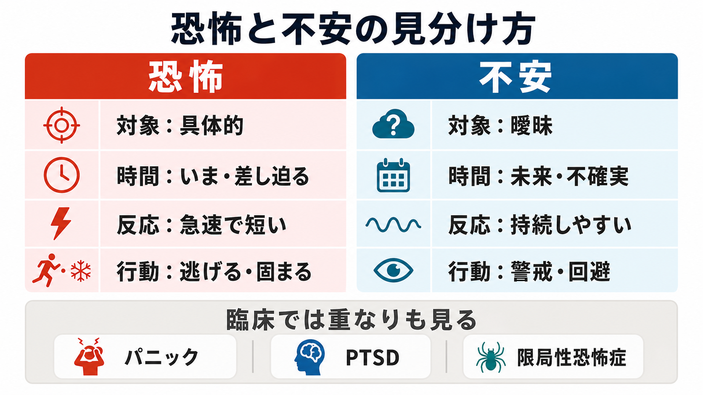
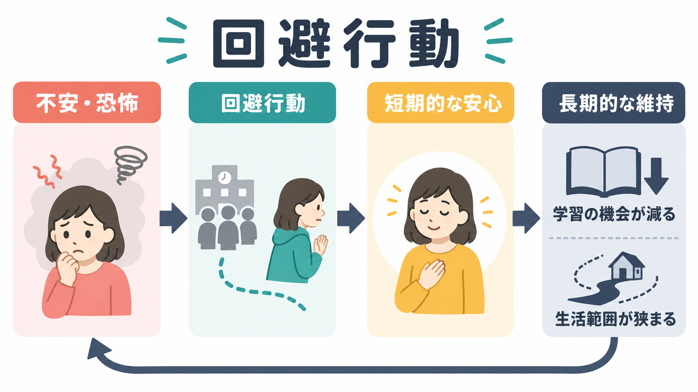
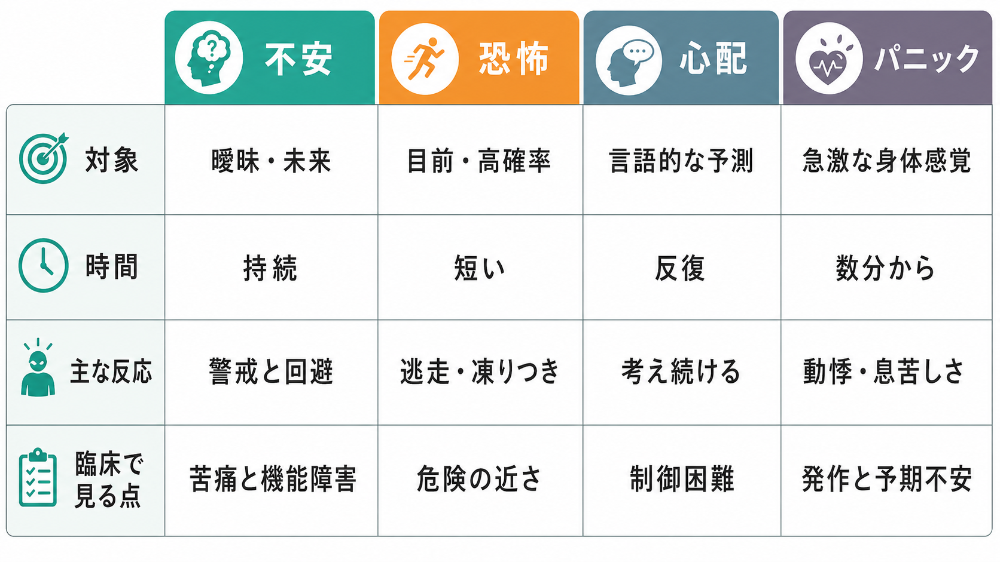

# 不安とは何か

## 要点

- 不安とは、目前の危険そのものではなく、**将来起こりうる脅威や不確実性**に備える心身反応である[1][2]。
- 恐怖は「いま近くにある危険」への急性反応として語られやすく、不安は「まだ起きていない、曖昧で予測しにくい脅威」への持続的な警戒として語られやすい[3][4]。
- 不安には、心配、過警戒、注意の脅威偏り、身体反応、回避、安全確認、睡眠障害などが含まれる。ただし、どれか一つだけで不安を定義することはできない[1][5]。
- 臨床的に問題となるのは、不安が強いこと自体ではなく、苦痛、生活範囲の狭まり、回避の固定化、学業・仕事・対人関係の障害につながる場合である[5][6]。
- 本記事は教育・研究目的の整理であり、個別の診断や治療指示ではない。

## この記事で答える問い

1. 不安は、恐怖・心配・パニックと何が違うのか。
2. 不確実な将来の脅威は、なぜ心身を警戒状態にするのか。
3. 不安は、脳・身体・認知・行動のどの層で理解できるのか。
4. 臨床や研究では、不安をどのように観察し、どこで通常反応と症状を分けるのか。

## まず結論

不安は、脳が「危険が起こるかもしれない」と見積もり、身体と行動を準備させる状態である。危険が近く、具体的で、逃げるか固まるかをすぐ選ぶ場面では恐怖に近い。危険が遠く、曖昧で、確率や時期が読めない場面では不安に近い[3][4]。

この反応は適応的である。試験前に準備する、夜道で周囲に注意する、体調変化を確認する、といった行動は不安があるからこそ起こる。一方で、脅威の見積もりが過大になり、回避や確認が増え、安心が短時間しか続かなくなると、不安は生活を守る機能から生活を狭める要因へ変わる[2][6]。

## 背景

不安は、[[精神症候学とは何か]]で扱う「本人が訴える主観的苦痛」と「観察可能な行動・身体反応」が重なり合う症候である。本人は「落ち着かない」「悪いことが起きそう」「心配が止まらない」と語るかもしれない。観察者からは、そわそわする、声が小さくなる、確認を繰り返す、診察室の出口に近い席を選ぶ、呼吸が浅い、筋緊張が高い、といった形で見えることがある。

NIMH は、不安そのものは生活の一部であり、健康、金銭、学校、仕事、家族について心配することは一般的だと説明している。一方、不安症では心配や恐怖が一時的ではなく、複数の状況で続き、時間とともに悪化し、日常生活を妨げることがある[5]。この区別は、[[症状と徴候は何が違うのか]]で扱う「主観的経験」と「機能障害・観察所見」を合わせて見る発想とつながる。

## 基本概念

### 不安

不安は、未来の脅威に対する予期的な反応である。Grupe と Nitschke は、不安を「潜在的な将来の脅威に関する不確実性」に対する感情・認知・行動の変化として整理し、脅威の確率やコストを高く見積もる、脅威へ注意が向く、安全を学びにくい、回避する、不確実性への反応性が高い、という過程を重視した[2]。

この見方では、不安は単なる「気持ち」ではない。脅威を探す注意、最悪の結果を予測する思考、胸の苦しさや筋緊張などの身体反応、確認・回避・安全行動が一つの準備システムとしてまとまる。したがって、不安の評価では、[[気分とは何か]]のような持続的な主観状態だけでなく、行動、睡眠、身体感覚、生活範囲を一緒に見る必要がある。

### 恐怖

恐怖は、目前または差し迫った危険への急性反応として捉えられやすい。Davis らは、予測可能で近い脅威に対する短時間の恐怖反応と、予測しにくく持続する脅威に対する不安様反応を区別し、扁桃体中心核や分界条床核を含む拡張扁桃体の役割を論じた[3]。この区別は、[[恐怖条件づけとは何か]]や [[PTSDでは恐怖記憶ネットワークに何が起きているのか]] と接続しやすい。

ただし、恐怖と不安は完全に分離できるものではない。現実の臨床では、目前の恐怖、予期不安、回避、身体感覚への恐怖が混ざって現れる。重要なのは、言葉の分類にこだわることではなく、「何が脅威として見積もられているか」「どれくらい具体的か」「いつ起こると予測されているか」を聞くことである。

### 心配

心配は、不安の認知的な側面であり、言語的・反復的な未来予測として現れやすい。たとえば「失敗したらどうしよう」「体調が悪化したらどうしよう」「相手に嫌われたかもしれない」と考え続ける。心配は問題解決の準備にもなるが、制御困難になり、同じ可能性を繰り返し検討するだけになると、不安を維持する。

### パニック

パニックは、急激に高まる強い恐怖や不快感と身体症状のまとまりとして現れやすい。動悸、息苦しさ、めまい、発汗、震え、死ぬのではないかという感覚などが短時間でピークに向かう。パニック発作そのものと、「また発作が起きるのではないか」という予期不安は分けて考える必要がある[6]。

## 仕組み

### 1. 不確実性が脅威評価を増幅する

不安を理解する中心は、不確実性である。危険が確実にないとわかっていれば警戒は下がる。危険が確実にあるとわかれば、逃げる、守る、助けを呼ぶなど具体的な行動に移りやすい。ところが「あるかもしれないが、いつ・どれくらい・避けられるかがわからない」場合、脳は情報収集と警戒を続ける[2]。

このとき、脅威の確率や損失を高く見積もるほど、不安は強まりやすい。認知の層では、破局的予測、曖昧な情報の脅威解釈、危険情報への注意偏りが起こる。これは [[認知バイアスとは何か]] とも関係する。

### 2. 身体反応が「危険らしさ」を強める

不安では、自律神経系、呼吸、筋緊張、内分泌反応が動員される。動悸、息苦しさ、胃部不快感、発汗、震え、筋緊張、疲労、睡眠障害などは、脅威への準備として理解できる。島皮質や前帯状皮質は、身体内部の変化を感情や行動選択に結びつけるうえで重要であり、[[内受容感覚とは何か]]や [[島皮質は内受容感覚ネットワークで何をしているのか]] と関連する[2]。

身体感覚は、単なる結果ではなく、次の不安の入力にもなる。たとえば動悸を「危険な病気の兆候かもしれない」と解釈すると、不安がさらに高まり、動悸も強くなる。この循環は、身体疾患や薬剤・物質の影響を見落とさないことの重要性にもつながる。

### 3. 脅威処理は単一の「不安中枢」ではない

不安を扁桃体だけで説明するのは単純化しすぎである。脅威の検出、身体反応、主観的な怖さ、言語的な心配、回避行動は重なり合うが、同一の神経過程ではない。LeDoux と Pine は、脅威に対する防御反応・生理反応のシステムと、恐怖や不安として報告される意識経験のシステムを区別する二システム枠組みを提案した[4]。

この見方では、身体が強く反応していても本人が「怖い」と言語化できないことがあり、逆に本人の不安の訴えが強くても観察可能な反応が目立たないこともある。したがって、臨床では主観、行動、生理、生活史を統合して読む必要がある。

### 4. 回避は短期的に楽にし、長期的に不安を残す

不安が強い場面を避けると、その瞬間は楽になる。この短期的な安心は強い学習効果を持つ。しかし、避けたままだと「実際には危険ではなかった」「耐えられた」「助けを求められた」という安全学習が起こりにくい。その結果、不安の対象は保たれ、生活範囲は狭まりやすい[2][6]。

臨床的には、回避は必ずしも露骨ではない。外出しないだけでなく、同伴者がいないと行けない、出口を確認する、検索を繰り返す、身体感覚を何度も測る、発言前に過剰に準備する、といった安全行動として現れる。

## 図解

以下の図は、不安・恐怖・心配・パニックを、対象、時間、主な反応、臨床で見る点から比較したものである。境界は便宜的であり、実際の経験では重なり合う。

## 臨床・研究との接続

### 通常の不安と臨床的な不安

通常の不安と臨床的に問題となる不安を分ける軸は、強度だけではない。持続期間、制御困難さ、苦痛、回避、生活範囲の狭まり、学業・仕事・家庭・対人関係への影響を確認する必要がある。ICD-11 CDDR は、不安または恐怖関連症群を、過剰な恐怖・不安と関連する行動上の障害があり、苦痛または機能障害をもたらすものとして整理している[7]。

### 評価で見るポイント

不安を評価するときは、少なくとも次の層を分けて聞く。

| 観点 | 確認すること |
|---|---|
| 脅威の焦点 | 何が起きることを恐れているのか。健康、失敗、対人評価、分離、閉所、外出、身体感覚など |
| 時間軸 | 目前の危険か、将来の予測か、発作の再発予測か |
| 認知 | 心配、破局的予測、曖昧な情報の解釈、注意の偏り |
| 身体 | 動悸、呼吸、発汗、筋緊張、胃腸症状、睡眠、疲労 |
| 行動 | 回避、安全確認、同伴、検索、受診反復、活動範囲の変化 |
| 文脈 | ストレス、外傷体験、身体疾患、薬剤、物質使用、発達段階、文化的意味づけ |

この整理は、[[焦燥とは何か]]のような行動面に出る症候や、[[ノルアドレナリン系は不安と覚醒にどう関わるのか]]、[[扁桃体過活動は不安症やPTSDにどう関わるのか]]のような神経科学的ノートと接続できる。

### 研究での測定

研究では、不安は質問紙、診断面接、行動課題、驚愕反射、皮膚電気反応、心拍、呼吸、コルチゾール、神経画像などで測定される。NIMH の RDoC では、潜在的脅威を「害が起こる可能性はあるが、遠い・曖昧・確率が低いまたは不確実な状況」として扱い、遺伝子、分子、回路、生理、行動、自己報告を横断して整理している[8]。

この枠組みは、診断名だけでなく、脅威予測、過警戒、回避、身体反応といった次元を測る発想を支える。ただし、研究指標がそのまま個別診断に対応するわけではない。

## よくある誤解

### 誤解1: 不安は弱さである

不安は、危険を予測して準備するための基本的な反応である。弱さではなく、環境への適応機能を持つ。ただし、脅威評価が過大になり、回避が固定化すると、生活を守る機能が生活を狭める方向へ働く。

### 誤解2: 不安は気の持ちようだけで消える

不安には、認知、身体、行動、学習、環境が関わる。考え方の修正が役立つことはあるが、睡眠、カフェイン、身体疾患、薬剤、生活ストレス、回避行動、対人環境を無視して「気の持ちよう」に還元すると、理解が浅くなる。

### 誤解3: 恐怖と不安は同じである

恐怖と不安は重なるが、同じではない。恐怖は目前の明確な危険、不安は曖昧で未来志向の脅威に近い。ただし、臨床では混ざって現れるため、どちらの語を使うかよりも、脅威の焦点、時間軸、回避、機能障害を具体化することが重要である[3][4]。

### 誤解4: 身体症状があれば精神的な不安ではない

不安は身体反応を伴いやすい。同時に、身体疾患、薬剤、物質、離脱、内分泌疾患、循環器・呼吸器疾患などが不安に似た症状を起こすこともある。身体症状があるから精神面を見ない、または不安らしいから身体面を見ない、という二分法は避ける。

## 関連ノート

- [[精神症候学とは何か]]
- [[症状と徴候は何が違うのか]]
- [[気分とは何か]]
- [[焦燥とは何か]]
- [[恐怖条件づけとは何か]]
- [[PTSDでは恐怖記憶ネットワークに何が起きているのか]]
- [[ノルアドレナリン系は不安と覚醒にどう関わるのか]]
- [[扁桃体過活動は不安症やPTSDにどう関わるのか]]
- [[内受容感覚とは何か]]
- [[島皮質は内受容感覚ネットワークで何をしているのか]]
- [[認知バイアスとは何か]]

今後の作成候補: `全般不安症とは何か`, `パニック発作とは何か`, `社交不安症とは何か`, `限局性恐怖症とは何か`, `回避行動とは何か`, `安全行動とは何か`, `予期不安とは何か`, `身体疾患に伴う不安症状とは何か`。

## MOC更新候補

- `content/00_MOC/` 配下の精神医学・症候学・感情科学・不安症関連 MOC に、バッチ統合時に `[[不安とは何か]]` を追加する候補。
- 並列ジョブとの競合を避けるため、このタスクでは MOC 本体を直接更新していない。

## 理解チェック

1. 不安と恐怖を、「脅威の近さ」「明確さ」「時間軸」から説明できるか。
2. 不安が適応的に働く例と、生活を狭める例をそれぞれ一つ挙げられるか。
3. 回避が短期的には安心を生み、長期的には不安を維持しうる理由を説明できるか。
4. 不安の評価で、主観的な心配だけでなく、身体反応・行動・機能障害・身体疾患を確認する理由は何か。
5. 「扁桃体が不安を作る」という単純な説明の限界を述べられるか。

## 未解決問題

- 不安の主観的経験、身体反応、回避行動を、個人内でどのように統合して測定するべきか。
- 診断横断的な不安次元と、全般不安症・パニック症・社交不安症などの診断カテゴリを、研究と臨床でどう接続するべきか。
- 文化、発達段階、身体疾患、薬剤・物質使用が、不安の表現型をどのように変えるか。
- 安全学習や回避の変化を、質問紙・行動課題・日常データでどこまで追跡できるか。

## 参考文献

[1] Chand, S. P., & Marwaha, R. (2023). *Anxiety*. StatPearls, NCBI Bookshelf. https://www.ncbi.nlm.nih.gov/books/NBK470361/

[2] Grupe, D. W., & Nitschke, J. B. (2013). Uncertainty and anticipation in anxiety: An integrated neurobiological and psychological perspective. *Nature Reviews Neuroscience, 14*, 488-501. https://doi.org/10.1038/nrn3524

[3] Davis, M., Walker, D. L., Miles, L., & Grillon, C. (2010). Phasic vs sustained fear in rats and humans: Role of the extended amygdala in fear vs anxiety. *Neuropsychopharmacology, 35*(1), 105-135. https://doi.org/10.1038/npp.2009.109

[4] LeDoux, J. E., & Pine, D. S. (2016). Using neuroscience to help understand fear and anxiety: A two-system framework. *American Journal of Psychiatry, 173*(11), 1083-1093. https://doi.org/10.1176/appi.ajp.2016.16030353

[5] National Institute of Mental Health. (2024). *Anxiety Disorders*. https://www.nimh.nih.gov/health/topics/anxiety-disorders/index.shtml

[6] Craske, M. G., Stein, M. B., Eley, T. C., Milad, M. R., Holmes, A., Rapee, R. M., & Wittchen, H.-U. (2017). Anxiety disorders. *Nature Reviews Disease Primers, 3*, 17024. https://doi.org/10.1038/nrdp.2017.24

[7] World Health Organization. (2024). *Clinical descriptions and diagnostic requirements for ICD-11 mental, behavioural and neurodevelopmental disorders*. WHO. https://iris.who.int/handle/10665/375767

[8] National Institute of Mental Health. (n.d.). *Definitions of the RDoC domains and constructs*. https://www.nimh.nih.gov/research/research-funded-by-nimh/rdoc/definitions-of-the-rdoc-domains-and-constructs
