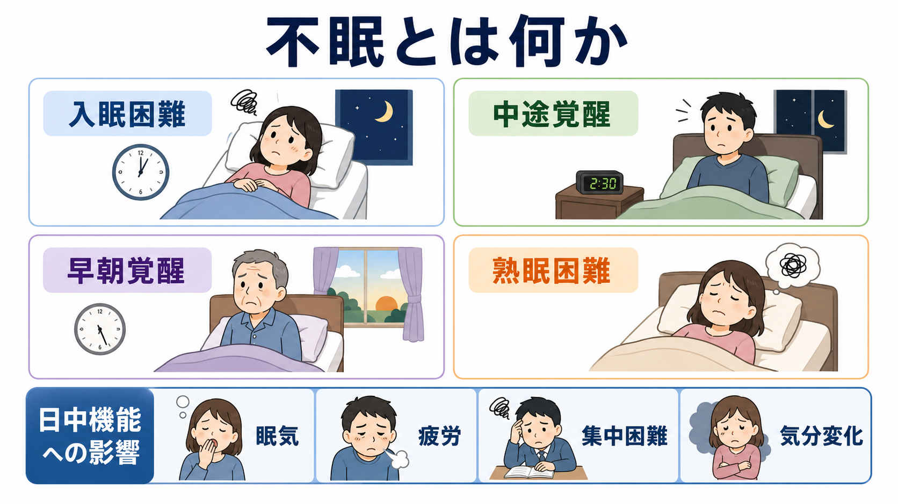
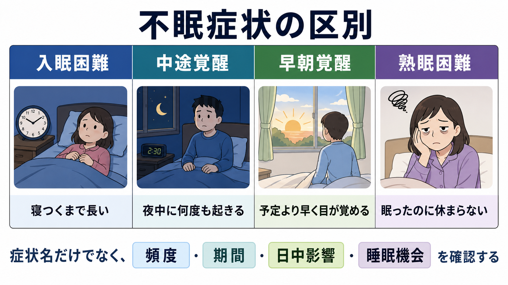
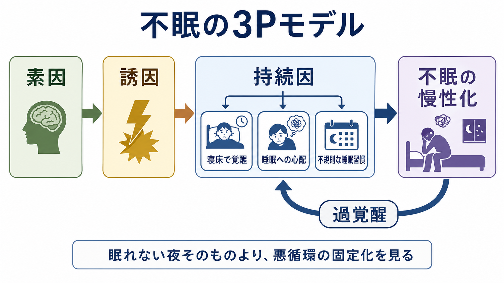

# 不眠とは何か

## 要点

- 不眠とは、眠る機会があるにもかかわらず、睡眠の量・質・タイミングに不満があり、日中の疲労、眠気、集中困難、気分変化、社会・学業・職業機能への影響を伴う状態である[1][2]。
- 症状としては、寝つきにくい「入眠困難」、夜中に目が覚める「中途覚醒」、予定より早く目が覚めて再入眠できない「早朝覚醒」、眠ったはずなのに休まらない「熟眠困難」を区別して記述する。
- DSM-5-TR や ICD-11 では、十分な睡眠機会、一定の頻度・期間、日中機能への影響、他の睡眠覚醒障害・身体疾患・物質使用などとの関係を確認することが重視される[1][2]。
- 慢性不眠は、単に「眠れない夜がある」ことではなく、素因・誘因・持続因、睡眠への心配、寝床と覚醒の条件づけ、[[過覚醒とは何か|過覚醒]]が絡み合って固定化する悪循環として理解できる[6][7][8]。
- 本稿は教育・研究目的の整理であり、個別の診断や治療指示ではない。強い苦痛、長期化、日中機能低下、事故リスク、自殺念慮、躁状態、せん妄、睡眠時無呼吸などが疑われる場合は専門的評価が必要である。

## この記事で答える問い

1. 不眠は、単なる睡眠時間の短さとどう違うのか。
2. 入眠困難・中途覚醒・早朝覚醒・熟眠困難は、それぞれ何を見ているのか。
3. 不眠を評価するとき、なぜ「日中機能への影響」と「睡眠機会」を確認する必要があるのか。
4. 不眠はなぜ慢性化し、[[不安とは何か|不安]]、[[抑うつ気分とは何か|抑うつ気分]]、[[注意障害とは何か|注意障害]]と結びつきやすいのか。
5. 臨床・研究では、不眠をどのような観点から記述し、介入研究へ接続するのか。

## まず結論

不眠は「睡眠時間が短いこと」だけではない。臨床的には、本人が睡眠の量・質・タイミングに不満をもち、そのために日中の生活、注意、気分、身体感覚、対人・学業・仕事に支障が出ているかを合わせて見る[1][2]。同じ6時間睡眠でも、本人が回復感を得て日中に機能していれば不眠症状とは限らない。一方で、十分な時間を寝床で過ごしていても、寝つけない、途中で何度も起きる、早朝に目が覚める、眠った感じがしないという苦痛が続き、日中に影響すれば不眠として評価される。

不眠を記述するときは、まず症状型を分ける。入眠困難は「眠りに入るまでが長い」、中途覚醒は「眠りが維持できない」、早朝覚醒は「望む起床時刻より早く起きて戻れない」、熟眠困難は「睡眠後の回復感が乏しい」という違いである。ただし、これらは互いに排他的ではない。ひとりの人に入眠困難と中途覚醒が同時に出ることも、抑うつ、不安、痛み、薬剤、概日リズムの乱れ、睡眠時無呼吸、むずむず脚症候群などが重なることもある[3]。

## 背景

不眠は、精神医学・睡眠医学・公衆衛生のいずれでも重要な症候である。DSM-5-TR では、不眠障害は睡眠の量または質への不満を中心に、入眠困難、睡眠維持困難、早朝覚醒のいずれかを含み、臨床的に意味のある苦痛または機能障害を伴い、少なくとも週3夜、3か月以上続くことが基準に含まれる[1]。ICD-11 の慢性不眠も、十分な睡眠機会と環境があるにもかかわらず、入眠または睡眠維持の困難が持続し、睡眠への不満と日中機能障害を伴う状態として整理される[2]。

ここで重要なのは、「眠れない」という訴えがただちに単一の診断名を意味しないことである。夜更かしや交代勤務のように睡眠機会が不足している場合、睡眠時間帯が体内時計とずれている場合、痛みや呼吸障害で睡眠が分断されている場合、[[せん妄とは何か|せん妄]]や躁状態の一部として睡眠欲求が変化している場合では、評価の焦点が異なる。したがって不眠の記述では、睡眠そのものの訴えだけでなく、背景疾患、薬剤、物質使用、生活リズム、精神症状、身体症状、日中機能を分けて確認する必要がある[3]。

## 基本概念

### 入眠困難

入眠困難は、寝ようとしてから眠りに入るまでに時間がかかる状態である。本人の体験としては、「布団に入ると目が冴える」「考えごとが止まらない」「眠らなければと思うほど眠れない」と表現されやすい。ここでは、実際の時計時間だけでなく、寝床に入った時刻、消灯時刻、スマートフォンや読書などの行動、眠気の有無、翌日の予定への心配を合わせて見る。

入眠困難は、[[不安とは何か|不安]]、反すう、緊張、身体感覚への注意、生活リズムの後退と結びつきやすい。眠れない経験が繰り返されると、寝床そのものが「休む場所」ではなく「眠れないことを確認する場所」になり、寝床で覚醒が強まる。これは慢性不眠の持続因として重要である[7]。

### 中途覚醒

中途覚醒は、眠りについた後に夜中に目が覚める状態である。数回目が覚めてもすぐ再入眠でき、日中の支障がなければ病的とは限らない。臨床的には、覚醒の回数、覚醒後に戻るまでの時間、覚醒時の不安・動悸・痛み・尿意・呼吸苦、夢や悪夢、物音、介護や育児などの環境要因を確認する。

中途覚醒は、睡眠維持の困難であり、加齢、痛み、頻尿、睡眠時無呼吸、アルコール、薬剤、抑うつ、不安、[[過覚醒とは何か|過覚醒]]などと関連しうる。したがって「夜中に起きる」という事実だけでなく、何が覚醒を起こし、覚醒後に何が再入眠を妨げているかを分けると整理しやすい。

### 早朝覚醒

早朝覚醒は、意図した起床時刻よりかなり早く目が覚め、その後眠りに戻れない状態である。本人は「朝4時に目が覚める」「まだ眠いのに戻れない」「朝が来る前から一日が始まってしまう」と語ることがある。早朝覚醒は、加齢、概日リズムの前進、抑うつ気分、生活リズム、光曝露、睡眠時間帯の変化などと関連しうる。

早朝覚醒で大切なのは、単に起床時刻が早いことと区別することである。早寝早起きで日中の機能が保たれている人は、不眠とは限らない。問題になるのは、望まない早朝覚醒が苦痛を生み、日中の疲労、集中困難、気分変化につながる場合である[1][2]。

### 熟眠困難

熟眠困難は、眠ったはずなのに休まらない、睡眠後の回復感が乏しいという体験である。「睡眠時間は足りているのに疲れが抜けない」「浅くしか眠れていない気がする」と表現される。これは睡眠時間の短さだけでは説明しにくく、睡眠の連続性、睡眠の主観的評価、身体疾患、痛み、気分症状、睡眠呼吸障害、薬剤、日中活動量などを合わせて考える必要がある。

熟眠困難は、本人の主観が中心になるため軽視されやすい。しかし不眠では、客観的睡眠時間と主観的睡眠感が一致しないことがあり、本人の苦痛や機能障害を丁寧に扱う必要がある[6]。一方で、熟眠困難だけで特定の疾患を決め打ちするのも危険である。

## 仕組み

### 3Pモデル

不眠の慢性化は、3Pモデルで理解しやすい。3Pとは、素因、誘因、持続因である[7]。

| 要素 | 内容 | 不眠での例 |
|---|---|---|
| 素因 | 不眠になりやすい背景 | 睡眠への反応性が高い、心配しやすい、加齢、身体疾患、過去の不眠経験 |
| 誘因 | 不眠を始める出来事 | ストレス、喪失、試験、転職、痛み、薬剤変更、生活リズムの乱れ |
| 持続因 | 不眠を続かせる行動・認知・条件づけ | 長すぎる寝床時間、昼寝、睡眠への心配、時計確認、寝床での覚醒 |

このモデルの要点は、不眠の始まりと続く理由が同じとは限らないことである。たとえば、最初は仕事のストレスで眠れなかったとしても、その後は「また眠れないのでは」という心配、長すぎる寝床時間、寝床でのスマートフォン、昼寝、時計確認が不眠を維持することがある。したがって臨床では、過去の原因探しだけでなく、現在の持続因を具体的に見る。

### 過覚醒

不眠では、眠気があるのに覚醒系が下がりきらない状態が問題になることがある。過覚醒モデルでは、認知的な心配、感情的緊張、交感神経系、内分泌、脳活動、身体感覚への注意が、夜間だけでなく日中にも高まりやすいと考える[6][8]。この状態では、寝床に入るほど「眠れるかどうか」を監視し、身体の小さな感覚や時計の時刻がさらに覚醒を上げる。

[[過覚醒とは何か|過覚醒]]は、不眠を「意志が弱いから眠れない」とみなさないためにも役立つ概念である。本人は眠ろうとしているのに、眠ろうとする努力や心配が逆に覚醒を高めることがある。これは[[強迫観念とは何か|強迫観念]]のような侵入的な思考とは異なるが、「考えないようにするほど考えてしまう」という逆説性を共有する場合がある。

### 睡眠機会と睡眠能力を分ける

不眠を評価するときは、眠る能力の問題と、眠る機会の不足を分ける必要がある。睡眠機会が短い、就寝時刻が不規則、夜間に仕事や育児で起きる必要がある、カフェインやアルコールの影響がある場合には、「眠れない」の背景が変わる。DSM-5-TR や ICD-11 が「十分な睡眠機会」を条件に含めるのは、この区別が不可欠だからである[1][2]。

この区別は研究でも重要である。睡眠日誌、質問紙、活動量計、必要に応じた終夜睡眠ポリグラフ検査は、それぞれ見ているものが異なる。欧州ガイドラインは、臨床面接、睡眠歴・医学歴、質問紙、睡眠日誌を診断手続きの中心に置き、睡眠時無呼吸や周期性四肢運動などが疑われる場合や治療抵抗例では追加検査を考えると整理している[3]。

## 図解

上の3枚は、この記事の要点をそれぞれ別の角度から示している。

| 図 | 読み方 |
|---|---|
| 図1 | 不眠を4つの夜間症状と日中機能への影響から見る。 |
| 図2 | 素因・誘因・持続因と過覚醒の悪循環から、慢性化を理解する。 |
| 図3 | 入眠困難・中途覚醒・早朝覚醒・熟眠困難を、面接で区別するための比較図として使う。 |

## 臨床・研究との接続

### 面接で確認すること

不眠を聴くときは、次の順に整理すると混乱しにくい。

| 観点 | 確認すること |
|---|---|
| 症状型 | 入眠困難、中途覚醒、早朝覚醒、熟眠困難のどれが中心か |
| 頻度・期間 | 週に何夜か、いつからか、急性か慢性か |
| 睡眠機会 | 寝床にいる時間、仕事・育児・介護・環境音、就寝起床時刻 |
| 日中影響 | 眠気、疲労、集中困難、[[気分とは何か|気分]]変化、事故、学業・仕事への影響 |
| 背景 | 身体疾患、痛み、薬剤、アルコール・カフェイン、精神症状、睡眠時無呼吸など |
| 維持因 | 時計確認、昼寝、長すぎる寝床時間、睡眠への心配、寝床での作業 |

この整理は、診断名を急いで付けるためではなく、本人の訴えを分解して支援可能な入口を探すためである。特に[[抑うつ気分とは何か|抑うつ気分]]、[[不安とは何か|不安]]、[[焦燥とは何か|焦燥]]、[[注意障害とは何か|注意障害]]、痛み、物質使用がある場合、不眠は結果でもあり維持因でもありうる。

### CBT-Iと薬物療法

成人の慢性不眠に対しては、AASMの行動・心理療法ガイドラインが、多要素の認知行動療法、すなわち CBT-I を強く推奨している[4]。CBT-I は、睡眠教育、刺激制御、睡眠制限または睡眠圧調整、認知的介入、リラクセーションなどを組み合わせ、不眠を維持する行動と認知を変える介入である。

薬物療法については、AASMの薬物療法ガイドラインが、薬剤ごとに弱い推奨として整理している[5]。これは薬が無意味ということではなく、薬剤の有益性・有害性・依存や転倒などのリスク、併存疾患、年齢、本人の希望を慎重に考える必要があるという意味である。本稿では個別の薬剤選択や中止を指示しない。

### 研究での扱い

研究では、不眠は自己記入式尺度、睡眠日誌、臨床面接、活動量計、終夜睡眠ポリグラフなどで測定される。主観的な睡眠不満は臨床的に重要だが、客観的睡眠時間とはずれることがある[6]。そのため、研究では「何を不眠と定義したか」「日中機能を含めたか」「併存疾患をどう扱ったか」「睡眠機会をどう確認したか」が結果解釈に影響する。

## よくある誤解

### 誤解1: 睡眠時間が短ければ不眠である

睡眠時間が短くても、本人が回復し、日中機能が保たれている場合は不眠とは限らない。逆に、睡眠時間が長く見えても、睡眠の質への強い不満と日中の支障があれば不眠として評価されることがある[1][2]。

### 誤解2: 眠れないのは意志が弱いからである

不眠では、眠ろうと努力するほど覚醒が上がることがある。これは本人の怠慢ではなく、過覚醒、条件づけ、睡眠への心配、生活リズム、身体・精神症状が絡む現象として理解した方がよい[6][8]。

### 誤解3: 睡眠衛生だけで慢性不眠は十分に扱える

規則的な生活やカフェイン調整は重要だが、慢性不眠ではそれだけで十分とは限らない。AASMのガイドラインでは、睡眠衛生単独よりも、多要素の CBT-I が重視されている[4]。

### 誤解4: 不眠はいつも他の病気の「おまけ」である

不眠は身体疾患や精神疾患に伴うことが多いが、それ自体が独立した臨床的焦点になる場合がある。ICD-11 でも、他疾患や物質による場合であっても、不眠が独立した臨床的注意の焦点であれば不眠障害として扱いうると整理される[2]。

## 関連ノート

- [[精神症候学とは何か]]
- [[症状と徴候は何が違うのか]]
- [[過覚醒とは何か]]
- [[不安とは何か]]
- [[抑うつ気分とは何か]]
- [[焦燥とは何か]]
- [[注意障害とは何か]]
- [[認知機能障害とは何か]]
- [[せん妄とは何か]]
- [[気分とは何か]]

今後の作成候補: `睡眠覚醒障害とは何か`, `概日リズム睡眠覚醒障害とは何か`, `睡眠時無呼吸とは何か`, `むずむず脚症候群とは何か`, `CBT-Iとは何か`, `睡眠日誌とは何か`, `睡眠衛生とは何か`, `睡眠薬とは何か`

MOC更新候補: `content/00_MOC/` 配下の精神医学・症候学・睡眠関連MOCに、バッチ統合時に `[[不眠とは何か]]` を追加する。

## 理解チェック

1. 不眠を「睡眠時間の短さ」だけで定義しない理由を説明できるか。
2. 入眠困難・中途覚醒・早朝覚醒・熟眠困難を、それぞれ一文で区別できるか。
3. 不眠の評価で、睡眠機会と日中機能への影響を確認する理由を説明できるか。
4. 3Pモデルにおける素因・誘因・持続因の違いを例で説明できるか。
5. 慢性不眠で、睡眠衛生単独より CBT-I が重視される理由を説明できるか。

## 参考文献

[1] American Psychiatric Association. (2022). *Diagnostic and Statistical Manual of Mental Disorders, Fifth Edition, Text Revision (DSM-5-TR).* American Psychiatric Association Publishing. https://doi.org/10.1176/appi.books.9780890425787

[2] World Health Organization. (2026). *ICD-11 for Mortality and Morbidity Statistics: 7A00 Chronic insomnia.* https://icd.who.int/browse/2026-01/mms/en#323148092

[3] Riemann, D., Espie, C. A., Altena, E., et al. (2023). The European Insomnia Guideline: An update on the diagnosis and treatment of insomnia 2023. *Journal of Sleep Research, 32*(6), e14035. https://doi.org/10.1111/jsr.14035

[4] Edinger, J. D., Arnedt, J. T., Bertisch, S. M., et al. (2021). Behavioral and psychological treatments for chronic insomnia disorder in adults: An American Academy of Sleep Medicine clinical practice guideline. *Journal of Clinical Sleep Medicine, 17*(2), 255-262. https://doi.org/10.5664/jcsm.8986

[5] Sateia, M. J., Buysse, D. J., Krystal, A. D., Neubauer, D. N., & Heald, J. L. (2017). Clinical practice guideline for the pharmacologic treatment of chronic insomnia in adults: An American Academy of Sleep Medicine clinical practice guideline. *Journal of Clinical Sleep Medicine, 13*(2), 307-349. https://doi.org/10.5664/jcsm.6470

[6] Riemann, D., Nissen, C., Palagini, L., Otte, A., Perlis, M. L., & Spiegelhalder, K. (2015). The neurobiology, investigation, and treatment of chronic insomnia. *The Lancet Neurology, 14*(5), 547-558. https://doi.org/10.1016/S1474-4422(15)00021-6

[7] Spielman, A. J., Caruso, L. S., & Glovinsky, P. B. (1987). A behavioral perspective on insomnia treatment. *Psychiatric Clinics of North America, 10*(4), 541-553. https://doi.org/10.1016/S0193-953X(18)30532-X

[8] Bonnet, M. H., & Arand, D. L. (2010). Hyperarousal and insomnia: State of the science. *Sleep Medicine Reviews, 14*(1), 9-15. https://doi.org/10.1016/j.smrv.2009.05.002
