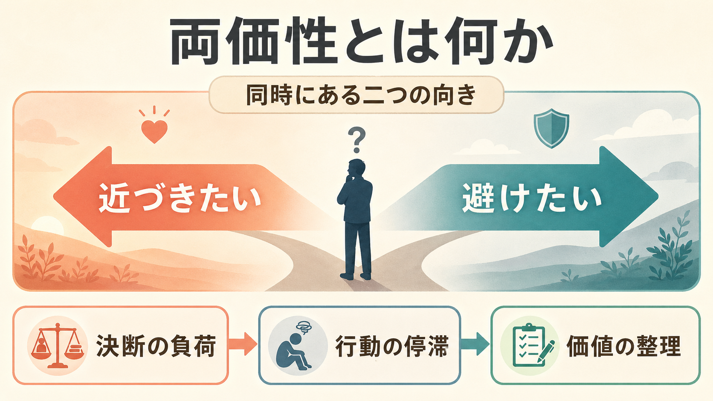
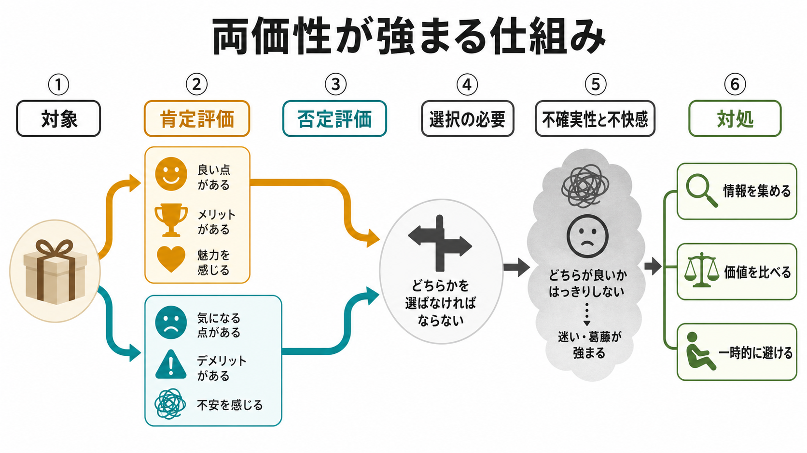
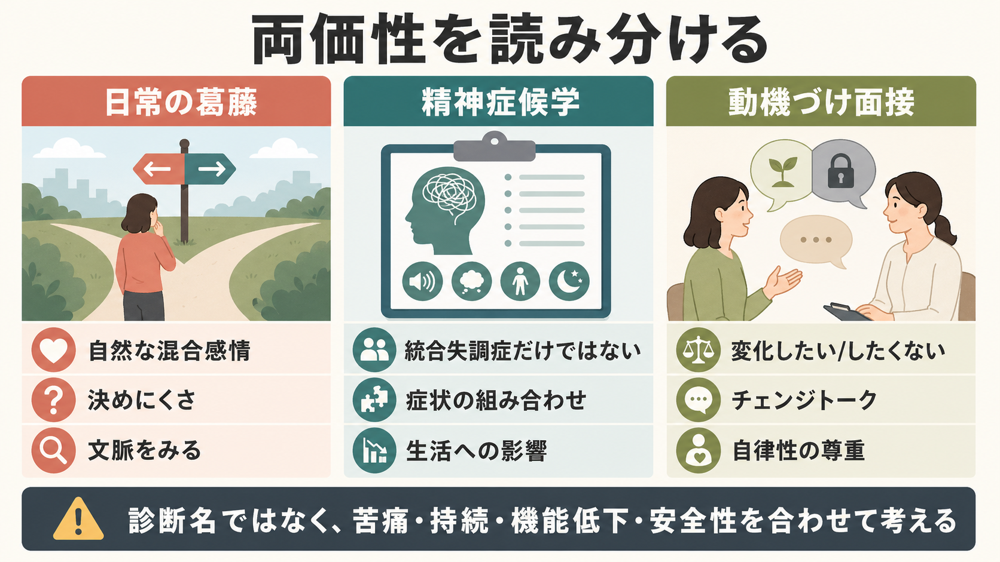

# 両価性とは何か

## 要点

- 両価性とは、同じ人・対象・行動について「近づきたい」と「避けたい」、「好き」と「嫌い」のような相反する感情や態度が同時に存在する状態である [1]。
- 両価性そのものは病的とは限らない。重要なのは、苦痛、持続、生活への影響、安全性、他の症状との組み合わせである。
- 選択を迫られると、肯定評価と否定評価が同時に活性化し、不確実性や後悔予期が強まり、決断回避や行動の停滞につながりやすい [4][5]。
- 臨床では、両価性を「抵抗」や「意志の弱さ」と決めつけず、本人にとっての価値、利益、損失、恐れ、関係性を分けて聴くことが重要である [7]。

## この記事で答える問い

1. 両価性は、単なる迷いや優柔不断と何が違うのか。
2. なぜ相反する感情が同時にあると、決断や行動が難しくなるのか。
3. 精神症候学、心理学、動機づけ面接では、両価性をどう扱うのか。

## まず結論

両価性は、「AかBかを決められない」という表面的な迷いではなく、同じ対象に対して肯定的評価と否定的評価がどちらも意味を持っている状態である。たとえば、退職したい人が「今の職場を離れたい」と感じながら、「収入、人間関係、責任を失うのは怖い」とも感じる。どちらか一方が本音で、もう一方が偽物なのではない。両方が本人にとって現実的な価値やリスクを表している。

## 背景

両価性という語は、精神医学史では Eugen Bleuler と結びつけられる。Bleuler は統合失調症概念の形成に大きく関わり、精神内に相互に排他的な矛盾が共存することを ambivalence として論じた [2]。ただし、現在の臨床では、両価性だけで特定の診断を決めることはできない。診断では、妄想、幻覚、まとまりにくい思考や行動、陰性症状、機能低下、経過、身体疾患や物質の影響などを総合して考える [8]。

心理学では、両価性は態度研究の重要概念でもある。従来の「好きか嫌いか」という一本の軸だけでは、同じ対象に強い肯定評価と強い否定評価が同時にある状態をうまく表せない。評価空間モデルは、肯定的評価と否定的評価を独立した次元として考えることで、無関心、単純な好意、単純な嫌悪、両価性を区別しやすくした [3]。

## 基本概念

### 両価性

両価性とは、同じ対象に対して相反する感情、評価、欲求、行動傾向が同時に存在することである。医療を受けたいが副作用が怖い、家族に会いたいが傷つけられるのが不安、変わりたいが今の生活の支えも失いたくない、といった形で現れる。

ここで大切なのは、両価性を「矛盾しているから非合理」と読まないことである。人の選択は、快・不快だけでなく、短期的利益、長期的利益、関係性、責任、習慣、リスク、自己像を同時に含む。両価性は、複数の価値が同じ場面で競合しているサインでもある。

### 迷い・曖昧さ・認知的不協和との違い

迷いは、情報不足や選択肢の多さから生じることがある。両価性はそれに加えて、同じ対象への肯定評価と否定評価が同時に強い点に特徴がある。曖昧さは対象や状況がはっきりしないことを指すが、両価性では対象がはっきりしていても、評価が二方向に分かれる。

認知的不協和は、自分の信念・態度・行動の不一致から生じる不快感を扱う概念である。両価性は、選択前から肯定的・否定的評価が併存することに注目する。両者は重なることがあるが、同じ概念ではない。

## 仕組み

両価性が問題として体験されやすいのは、選択を迫られたときである。態度研究の MAID model は、両価的な対象について決めなければならない場面で、相反する評価が意識に上がり、不確実性、不快感、後悔予期が強まると整理している [4]。その結果、問題解決的に情報を集めることもあれば、感情的負担を下げるために先延ばしや回避を選ぶこともある。

この仕組みは[[意思決定とは何か]]ともつながる。選択肢の価値が一方向にまとまっていれば、比較は比較的単純である。しかし、同じ選択肢の中に「得られるもの」と「失うもの」が強く含まれると、選択は価値の足し算では済まなくなる。決断回避のレビューは、選択困難、後悔予期、不確実性、感情的負担が、人を延期、現状維持、不作為へ向かわせることを示している [5]。

## 図解

両価性は、三つの層に分けると理解しやすい。

| 層 | 何が起きているか | 見えやすい形 |
|---|---|---|
| 感情・態度 | 肯定評価と否定評価が同時にある | 好きだが嫌い、期待するが怖い |
| 意思決定 | 選択による利益と損失がどちらも大きい | 決められない、先延ばしする |
| 臨床的文脈 | 苦痛、持続、機能低下、他症状と結びつく | 生活が止まる、支援や治療選択が難しくなる |

## 臨床・研究との接続

### 精神症候学

精神症候学では、両価性は感情、意欲、行為、対人関係の観察語として使われることがある。たとえば、近づきたいのに拒む、助けを求めたいのに支援を退ける、親密さを望みながら強い敵意も示す、といった場面である。ただし、これは単独で診断名を指す語ではない。[[精神症候学とは何か]]で扱うように、症状は文脈、経過、機能、本人の主観的苦痛と合わせて読む必要がある。

統合失調症の古典的記述では両価性が重視されたが、現在の診断枠組みでは、両価性は主要診断基準そのものではない。現代の統合失調症診断は、妄想、幻覚、解体した発話、解体した行動または緊張病性行動、陰性症状、持続期間、機能低下などを重視する [8]。したがって、両価性を見たときは「統合失調症らしい」と短絡せず、[[妄想とは何か]]、[[幻覚とは何か]]、[[意欲低下とは何か]]、[[認知機能障害とは何か]]などの周辺症状と合わせて評価する。

### 動機づけ面接

両価性は、[[モチベーション面接は行動変容をどう支えるのか]]の中心概念でもある。動機づけ面接では、変わりたい理由と変わりたくない理由が同時にあることを、非協力や欠陥ではなく、変化過程の自然な一部として扱う [7]。面接者が一方的に説得すると、本人は現状維持の理由を強く語りやすくなる。むしろ、本人自身の価値、願望、必要性、能力、次の一歩を引き出すことが重視される。

ここで注意したいのは、両価性を解消することが常に「変化させること」を意味しない点である。医療・福祉・心理支援では、本人の自律性、十分な情報、リスク、安全性、支援資源を踏まえながら、どの方向に進むかを本人とともに考える必要がある。

## よくある誤解

### 両価性は意志が弱いだけである

誤りである。両価性は、複数の価値やリスクが同時に意味を持つ状態であり、単純な怠慢とは限らない。むしろ、本人が重要なものを複数抱えているからこそ決めにくくなる。

### 両価性があるなら病的である

誤りである。進学、転職、結婚、治療選択、家族関係など、両価性は日常的に起こる。臨床的に問題になるのは、それが強い苦痛、長期の停滞、生活機能の低下、危険な行動、精神症状の悪化と結びつく場合である。

### どちらか一方だけが本心である

必ずしもそうではない。両価性では、相反する両側がどちらも本人にとって本当の意味を持つことがある。支援では、片側を否定するより、両側が何を守ろうとしているのかを整理するほうが役に立つ。

## 関連ノート

- [[精神症候学とは何か]]
- [[意思決定とは何か]]
- [[モチベーション面接は行動変容をどう支えるのか]]
- [[意欲低下とは何か]]
- [[回避行動とは何か]]
- [[妄想とは何か]]
- [[幻覚とは何か]]
- [[認知機能障害とは何か]]

MOC更新候補: `content/00_MOC/` 配下の精神医学、症候学、心理学・意思決定、臨床面接関連MOC。並列ジョブとの競合を避けるため、本記事ではMOC本体は更新しない。

## 理解チェック

1. 両価性と単なる情報不足による迷いは、どこが違うか。
2. 選択を迫られると両価性の不快感が強まる理由を説明できるか。
3. 両価性を統合失調症だけに結びつけてはいけない理由は何か。
4. 動機づけ面接では、両価性をどのように扱うか。

## 未解決問題

- 両価性が適応的な熟慮として働く場合と、機能低下を招く停滞になる場合を、臨床場面でどう見分けるか。
- 両価性の強さを、自己報告、行動指標、生理指標、面接所見のどの組み合わせで評価するのが妥当か。
- 精神病症状、強迫症状、抑うつ、不安、依存、対人トラウマなど、異なる臨床文脈で両価性の意味がどう変わるか。

## 参考文献

[1] Merriam-Webster. (2026). Ambivalence. *Merriam-Webster.com Dictionary*. https://www.merriam-webster.com/dictionary/ambivalence

[2] Encyclopaedia Britannica. (2026). Eugen Bleuler. *Britannica*. https://www.britannica.com/biography/Eugen-Bleuler

[3] Cacioppo, J. T., Gardner, W. L., & Berntson, G. G. (1997). Beyond bipolar conceptualizations and measures: The case of attitudes and evaluative space. *Personality and Social Psychology Review, 1*(1), 3-25. https://doi.org/10.1207/s15327957pspr0101_2

[4] van Harreveld, F., van der Pligt, J., & de Liver, Y. N. (2009). The agony of ambivalence and ways to resolve it: Introducing the MAID model. *Personality and Social Psychology Review, 13*(1), 45-61. https://doi.org/10.1177/1088868308324518

[5] Anderson, C. J. (2003). The psychology of doing nothing: Forms of decision avoidance result from reason and emotion. *Psychological Bulletin, 129*(1), 139-167. https://doi.org/10.1037/0033-2909.129.1.139

[6] Conner, M., Wilding, S., van Harreveld, F., & Dalege, J. (2021). Cognitive-affective inconsistency and ambivalence: Impact on the overall attitude-behavior relationship. *Personality and Social Psychology Bulletin, 47*(4), 673-687. https://doi.org/10.1177/0146167220945900

[7] Miller, W. R., & Rose, G. S. (2015). Motivational interviewing and decisional balance: Contrasting responses to client ambivalence. *Behavioural and Cognitive Psychotherapy, 43*(2), 129-141. https://doi.org/10.1017/S1352465813000878

[8] Patel, K. R., Cherian, J., Gohil, K., & Atkinson, D. (2014). Schizophrenia: Overview and treatment options. *P & T, 39*(9), 638-645. https://pmc.ncbi.nlm.nih.gov/articles/PMC4159061/
