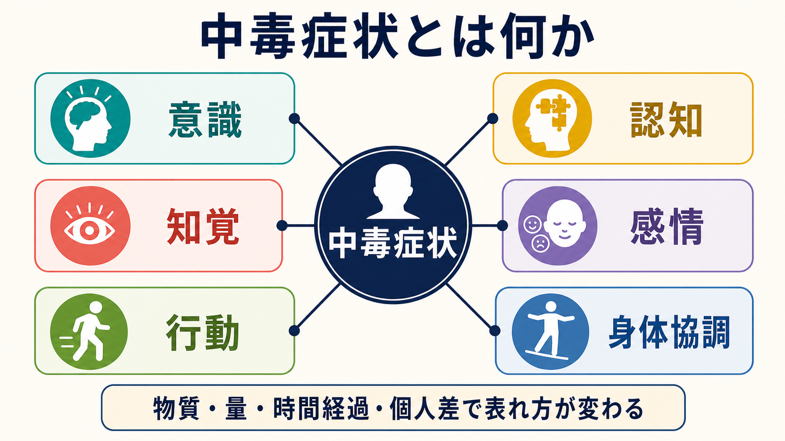
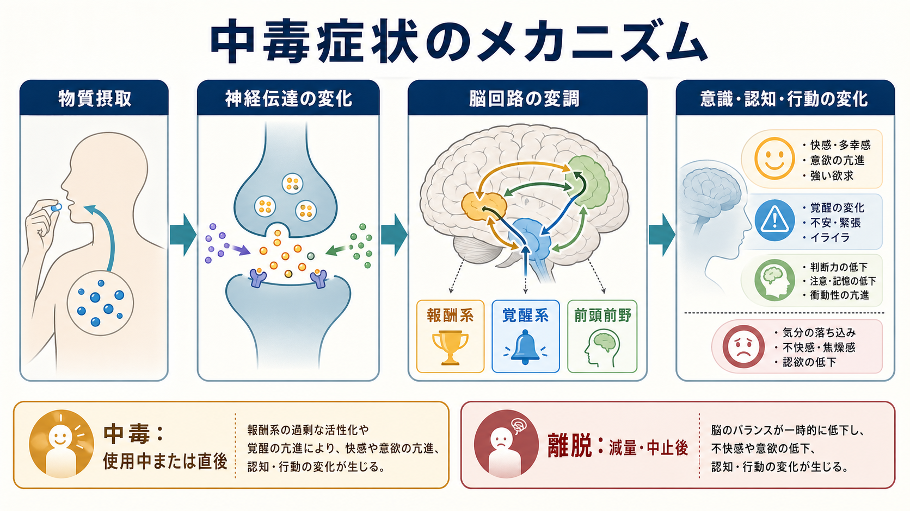

# 中毒症状とは何か

## 要点

- 中毒症状とは、精神作用物質の使用後に、意識、認知、知覚、感情、行動、身体協調などが一過性に変化する状態である。ICD-10 では、物質投与後に意識水準、認知、知覚、感情、行動、その他の心理生理機能が乱れ、通常は時間とともに回復する状態として整理される[1]。
- DSM-5-TR 系の整理では、各物質ごとに「使用障害」「中毒」「離脱」「物質誘発性精神疾患」が区別される。したがって「酔っている」「中毒症状がある」ことは、それだけで物質使用障害を意味しない[2][3]。
- 中毒症状の表れ方は、物質の薬理作用、量、使用経路、使用からの時間、耐性、併用物質、身体疾患、睡眠不足、年齢などで変わる[3][4]。
- 臨床的には、[[精神症候学とは何か]]、[[意識障害とは何か]]、[[認知機能障害とは何か]]、[[幻覚とは何か]]、[[妄想とは何か]]、[[せん妄とは何か]]との鑑別が重要である。
- 本稿は教育・研究目的の概説であり、個別の診断や治療指示ではない。強い意識障害、呼吸抑制、けいれん、激しい興奮、自傷他害リスクがある場合は救急対応が優先される。

## この記事で答える問い

1. 中毒症状とは、精神医学では何を指すのか。
2. 物質使用障害、離脱、物質誘発性精神疾患、毒物学的な「中毒」とは何が違うのか。
3. なぜ同じ物質でも、人によって意識、認知、感情、行動の変化が異なるのか。
4. 臨床・研究では、どのように観察し、記述し、鑑別するのか。

## まず結論

中毒症状は、「物質が入ったために、脳と身体の状態が一時的にずれた結果」と考えると理解しやすい。アルコールであれば脱抑制、判断力低下、運動失調、眠気が目立つことがある。刺激薬では覚醒亢進、焦燥、過活動、疑い深さが前景に出ることがある。鎮静薬やオピオイドでは眠気、反応低下、呼吸抑制が問題になることがある。大麻や幻覚薬では知覚変化、不安、時間感覚の変化、現実感の揺らぎが目立つことがある。

ただし、臨床的に重要なのは「どの物質なら必ずこの症状」という単純な対応ではない。中毒症状は、物質の種類、用量、血中濃度の上昇速度、使用者の耐性、併用物質、身体状態、環境によって変化する[3][4]。そのため評価では、症状名を当てる前に、使用時刻、量、経路、併用、既往、薬剤、バイタルサイン、意識水準、認知、行動、身体所見を組み合わせて読む。

## 背景

「中毒」という語は、日常語では「依存」「やめられない」「毒にあたった」「酔っている」を広く含みやすい。しかし精神医学では、少なくとも次の区別が必要である。

| 用語 | 中心 | 時間軸 | 例 |
|---|---|---|---|
| 中毒症状 | 使用中または使用直後の一過性変化 | 急性 | 判断力低下、脱抑制、眠気、興奮、知覚変化 |
| 物質使用障害 | 問題があっても使用が続く行動パターン | 慢性または反復性 | 制御困難、渇望、役割障害、危険使用 |
| 離脱 | 減量・中止後の反跳的変化 | 中止後 | 不安、振戦、不眠、発汗、けいれんなど |
| 物質誘発性精神疾患 | 物質使用・離脱により精神疾患様の症状が生じる状態 | 急性から持続性まで | 物質誘発性精神病、気分症状、不安症状、睡眠障害 |
| 毒物学的な中毒・過量 | 有害量による身体危機 | 急性 | 呼吸抑制、不整脈、昏睡、けいれん |

ICD-10 は、急性中毒を「精神作用物質の投与後に生じる意識、認知、知覚、感情、行動などの乱れ」と位置づけ、通常は急性薬理作用と直接関係し、時間とともに回復すると説明する[1]。一方で、過量や毒物学的な poisoning は別の分類軸にも置かれるため、精神症状としての中毒と身体危機としての中毒を混同しないことが重要である[1]。

## 基本概念

### 中毒症状は「状態」であり「診断名」だけではない

中毒症状は、ある時点で観察される状態である。たとえば「会話がまとまらない」「眠気が強い」「怒りっぽい」「ふらつく」「幻覚様体験を訴える」といった症候は、[[意識障害とは何か]]、[[認知機能障害とは何か]]、[[幻覚とは何か]]、[[妄想とは何か]]と重なって見える。中毒症状と判断するには、それらが物質使用の時間経過と整合し、ほかの身体疾患や一次性精神疾患だけでは説明しにくいことを確認する必要がある。

### 物質使用障害とは区別する

物質使用障害は、制御困難、社会的障害、危険使用、身体的徴候などを含む反復的・持続的な行動パターンとして定義される。Merck Manual は、DSM-5-TR に基づき、使用障害の診断は 12 か月内に複数の基準を満たす病的パターンの同定であると説明している[2]。一方、中毒は使用中または直後に起こる可逆的な精神・行動変化であり、単回でも起こりうる。

### 離脱とは時間軸が逆である

離脱は、物質をやめた後、または量を減らした後に起こる。中毒が「入ったことによる急性作用」であるのに対し、離脱は「入らなくなったことによる反跳」と考えられる。離脱は物質によっては重篤で、アルコールや鎮静薬ではせん妄やけいれんを伴うことがある[1][3]。この点で、[[せん妄とは何か]]との接続が重要になる。

### 物質誘発性精神疾患とは持続性が異なる

物質誘発性精神疾患は、物質使用または離脱により、うつ、躁、精神病、不安、睡眠障害、神経認知障害などに似た精神変化が生じる状態である。DSM-5-TR の整理に基づく Merck Manual の概説では、物質誘発性精神疾患は、物質中毒または離脱からおおむね 1 か月以内に出現し、苦痛や機能障害を伴い、物質使用前から存在していた症状ではなく、急性せん妄だけでは説明されず、長期に持続しすぎないことが評価上の要点とされる[5]。

## 仕組み

中毒症状の仕組みは、単一の「快感物質」だけでは説明できない。物質は神経伝達を変化させ、報酬系、覚醒系、前頭前野、辺縁系、脳幹などの回路バランスを変える。その結果、快感、緊張、不安、眠気、脱抑制、判断力低下、知覚変化、衝動性、運動協調の低下などが生じる。

### 報酬系と強化

多くの依存性物質は、基底核を含む報酬回路に強く作用する。NIDA は、薬物が神経細胞間の信号伝達を妨げたり増幅したりし、報酬回路を過剰に活性化して、使用経験と環境手がかりを強く結びつけると説明している[6]。[[ドパミンは報酬だけの物質なのか]]で扱うように、ドパミンは快感そのものだけでなく、重要な出来事を学習し、再びその行動を起こしやすくする強化信号として働く。

### 覚醒系と身体状態

刺激薬では覚醒、活動性、注意の過剰な高まりが前景に出やすく、鎮静薬やオピオイドでは覚醒低下、反応低下、呼吸抑制が重要になる。これは脳幹、視床、ノルアドレナリン系、GABA 系、オピオイド系などが覚醒と身体機能を支えるためである。したがって中毒症状の評価では、精神症状だけでなく呼吸、循環、体温、瞳孔、発汗、協調運動を観察する。

### 前頭前野と判断・抑制

前頭前野は計画、判断、衝動制御、リスク評価に関わる。物質使用により前頭前野の制御が弱まると、普段なら止められる行動が止まりにくくなり、危険な運転、攻撃性、性的脱抑制、浪費、衝動的な再使用につながることがある。Volkow らのレビューは、依存の神経生物学を、報酬・ストレス・実行制御の回路変化として整理している[7]。中毒症状では、この慢性的変化の一部が、急性の脱抑制や判断力低下として見える。

## 図解

上の 1 枚目は、中毒症状を「意識・認知・知覚・感情・行動・身体協調」の 6 領域に分けて見る概念地図である。評価では、本人の言葉だけでなく、周囲からの情報、行動観察、身体所見、時間経過を合わせる。

2 枚目は、物質摂取から神経伝達の変化、脳回路の変調、意識・認知・行動の変化へ進む流れを示している。ポイントは、中毒と離脱を同じ「物質関連の変化」として見つつ、時間軸を分けることである。

## 臨床・研究との接続

### 面接では「何を、いつ、どのくらい」を確認する

中毒症状が疑われるとき、面接では「何を使ったか」だけでなく、使用時刻、量、経路、併用、処方薬、市販薬、サプリメント、既往、睡眠、食事、水分、外傷、感染、低血糖などを確認する。これは [[物質使用歴はどのように聞くべきか]] と直結する。本人の説明が不確かでも、尿・血液検査、所持物、家族や同伴者の情報、救急搬送時の状況を組み合わせる[1]。

### 観察では MSE と身体評価をつなぐ

精神科的には、外観、行動、発話、気分と感情、思考過程、思考内容、知覚、認知、病識、判断力を観察する。一方で中毒症状では、精神状態検査だけで完結しない。瞳孔、眼振、構音、歩行、協調運動、呼吸数、酸素化、体温、血圧、脈拍、発汗、皮膚所見などが、物質や重症度の推定に役立つ。

### 鑑別では「物質だけで説明してよいか」を問う

中毒症状に見えても、頭部外傷、低血糖、感染、てんかん、脳血管障害、甲状腺機能異常、肝腎機能障害、薬剤性精神症状、一次性精神疾患が隠れていることがある。[[薬剤性精神症状とは何か]]の観点からは、処方薬や市販薬による精神症状も確認する。激しい興奮や幻覚があっても、刺激薬中毒、躁状態、せん妄、急性精神病、解離、外傷反応は重なって見えるため、時間経過と身体所見が重要になる。

### 研究では急性作用と慢性変化を分ける

研究上は、急性中毒、反復使用、耐性、離脱、渇望、使用障害、回復過程を分けて測定する必要がある。Koob と Volkow は、依存を報酬、ストレス、実行制御を含む神経回路の変化として整理し、急性の快感だけでなく、負の情動、習慣化、制御低下が関わると論じている[8]。この枠組みは、中毒症状を「その場の酔い」だけでなく、その後の学習、再使用、生活機能への影響と接続して考える助けになる。

## よくある誤解

### 誤解1: 中毒症状があれば、必ず依存症である

中毒症状は単回使用でも起こる。物質使用障害は、問題があっても使用が続く反復的パターンを評価する概念であり、中毒症状そのものとは区別される[2][3]。

### 誤解2: 違法薬物だけが問題になる

アルコール、カフェイン、処方薬、市販薬でも中毒症状は起こりうる。Merck Manual は、物質関連障害で扱う物質群に、アルコール、カフェイン、大麻、幻覚薬、吸入剤、オピオイド、鎮静薬、刺激薬、タバコ、その他の物質を含めている[3]。

### 誤解3: 中毒症状は「本人の意思が弱い」問題である

中毒症状は薬理作用、神経伝達、身体状態、環境の相互作用として生じる。責任追及だけでは、呼吸抑制、外傷、せん妄、自傷他害リスク、再使用リスクを見落とす。教育・臨床では、道徳評価よりも、観察、リスク評価、安全確保、背景理解が重要である[6][7]。

### 誤解4: 眠っていれば安全である

眠気や反応低下は、単なる休息ではなく、鎮静薬、アルコール、オピオイド、複数物質併用による危険な覚醒低下の可能性がある。呼吸抑制、嘔吐物誤嚥、低体温、外傷があれば緊急性が高い。

## 関連ノート

確認済みの関連ノート:

- [[精神症候学とは何か]]
- [[意識障害とは何か]]
- [[認知機能障害とは何か]]
- [[幻覚とは何か]]
- [[妄想とは何か]]
- [[せん妄とは何か]]
- [[躁状態とは何か]]
- [[物質使用歴はどのように聞くべきか]]
- [[薬剤性精神症状とは何か]]
- [[ドパミンは報酬だけの物質なのか]]

今後の作成候補:

- 離脱症状とは何か
- アルコール中毒とは何か
- オピオイド中毒とは何か
- 刺激薬中毒とは何か
- 物質誘発性精神病とは何か
- 過量服薬と中毒症状は何が違うのか

MOC 更新候補:

- `content/00_MOC/` 配下の精神医学・症候学・物質関連障害系 MOC に、バッチ統合時に `[[中毒症状とは何か]]` を追加する。

## 理解チェック

1. 中毒症状と物質使用障害は、時間軸と評価対象がどう違うか。
2. 中毒と離脱を、使用との時間関係でどう区別できるか。
3. 中毒症状の評価で、精神状態検査だけでなく身体所見が必要なのはなぜか。
4. 幻覚や妄想があるとき、物質誘発性か一次性精神疾患かを考えるうえで、どの情報が重要か。
5. 「違法薬物でないから安全」と言えない理由は何か。

## 未解決問題

- 多物質併用では、どの物質がどの症状に寄与したかを明確に分けにくい。
- 急性中毒、離脱、物質誘発性精神疾患、一次性精神疾患は連続的に重なることがあり、単回面接だけでは判断が難しい。
- 報酬系、ストレス系、実行制御系の変化を、個人の臨床症状や再使用リスクにどこまで精密に対応づけられるかは、なお研究課題である。

## 参考文献

[1] World Health Organization. *International Statistical Classification of Diseases and Related Health Problems 10th Revision (ICD-10): Mental and behavioural disorders due to psychoactive substance use (F10-F19).* https://icd.who.int/browse10/2010/en/GetConcept?ConceptId=F11.2

[2] American Psychiatric Association. (2022). *Diagnostic and Statistical Manual of Mental Disorders: DSM-5-TR* (5th ed., text rev.). American Psychiatric Association Publishing. https://catalog.libraries.psu.edu/catalog/37111499

[3] Merck Manual Professional Edition. *Overview of Substance Use.* Reviewed/Revised Aug 2025; Modified Jan 2026. https://www.merckmanuals.com/professional/psychiatric-disorders/substance-related-disorders/overview-of-substance-use

[4] Merck Manual Professional Edition. *Substance Use Disorders.* Reviewed/Revised Aug 2025; Modified Jan 2026. https://www.merckmanuals.com/professional/psychiatric-disorders/substance-related-disorders/substance-induced-disorders

[5] Merck Manual Professional Edition. *Substance-Related Psychiatric Disorders.* Reviewed/Revised Aug 2025; Modified Jan 2026. https://www.merckmanuals.com/professional/psychiatric-disorders/substance-related-disorders/substance-related-psychiatric-disorders

[6] National Institute on Drug Abuse. *Drugs, Brains, and Behavior: The Science of Addiction: Drugs and the Brain.* https://nida.nih.gov/publications/drugs-brains-behavior-science-addiction/drugs-brain

[7] Volkow, N. D., Koob, G. F., & McLellan, A. T. (2016). Neurobiologic advances from the brain disease model of addiction. *The New England Journal of Medicine, 374*(4), 363-371. https://doi.org/10.1056/NEJMra1511480

[8] Koob, G. F., & Volkow, N. D. (2016). Neurobiology of addiction: a neurocircuitry analysis. *The Lancet Psychiatry, 3*(8), 760-773. https://doi.org/10.1016/S2215-0366(16)00104-8
