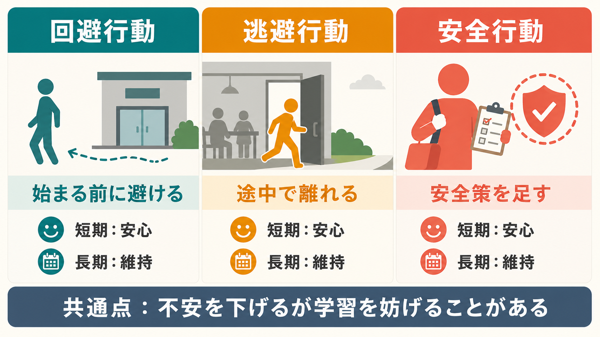
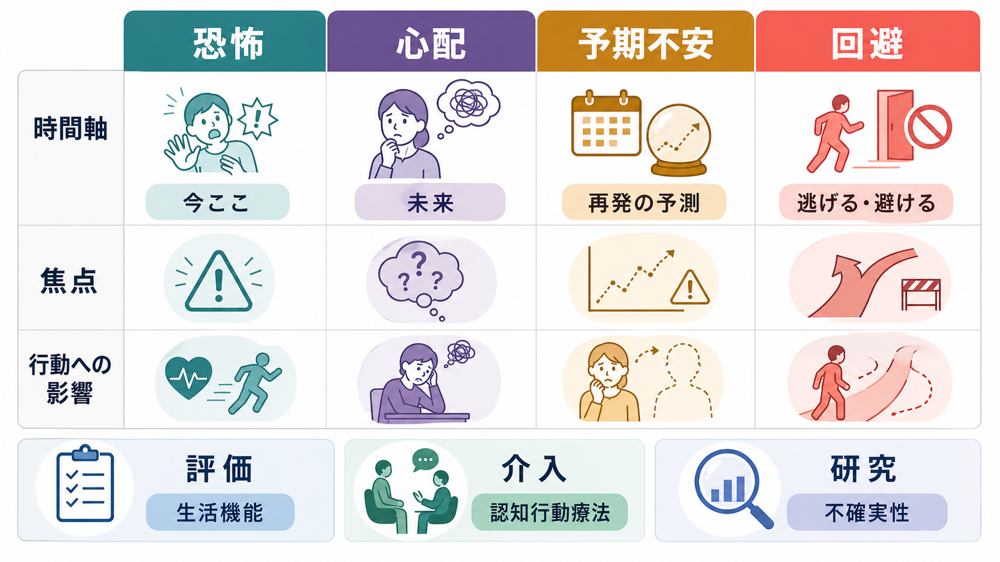

# 予期不安とは何か

## 要点

- 予期不安とは、「また発作が起きるかもしれない」「また失敗するかもしれない」という未来の出来事への不安が、現在の注意、身体感覚、行動選択を支配する状態である。
- [[パニック発作とは何か|パニック発作]]では、追加の発作やその結果への持続的な心配、発作を避けるための行動変化が診断上も重要であり、予期不安はその中心的な構成要素になる[1][2]。
- 予期不安は、身体感覚の監視、破局的解釈、回避行動、安全行動によって維持されやすい。回避は短期的には安心をもたらすが、「実際には大丈夫だった」という学習機会を奪うため、長期的には不安を残す[3][4]。
- 臨床的には、予期不安そのものを「性格の弱さ」と見るのではなく、恐怖学習、内受容感覚、注意、行動の悪循環として評価することが重要である。

## この記事で答える問い

1. 予期不安は、通常の心配や恐怖と何が違うのか。
2. なぜ「発作そのもの」よりも「発作が起きるかもしれない時間」が生活を狭めるのか。
3. 回避や安全行動は、なぜ短期的には助けになり、長期的には不安を維持しうるのか。
4. 臨床・研究では、予期不安をどのように評価し、どのような介入概念と結びつけるのか。

## まず結論

予期不安は、未来の危険を先取りする適応的な機能が過剰に働き、「起きるかもしれないこと」に備える行動が生活の中心になってしまう状態である。たとえば、電車内で動悸が起きた経験のあとに、電車へ乗る前から身体を監視し、「また倒れるかもしれない」と解釈し、外出を避ける。避けるとその場の不安は下がるが、「乗っても発作は必ずしも破局にならない」という経験が得られない。こうして予測は修正されず、次の外出前にさらに不安が強くなる。

この仕組みは、[[恐怖条件づけとは何か|恐怖条件づけ]]や[[回避学習とは何か|回避学習]]とよく対応する。危険が本当にある場面では回避は役に立つ。しかし危険がすでに過大評価されている場面では、回避は「危険がなかったこと」を確認する機会を減らし、予期不安を固定しやすい[4][5]。

## 背景

予期不安は、特定の診断名だけに閉じた現象ではない。パニック症、広場恐怖、社交不安、限局性恐怖、PTSD、身体症状に関する不安、失敗経験後の行動萎縮など、さまざまな場面で見られる。共通するのは、過去の発作・失敗・苦痛が未来の予測として再構成され、現在の行動を制限する点である。

パニック症では、予期不安はとくに見えやすい。DSM-5-TR に基づく臨床解説では、パニック症は反復する予期しない発作に加え、追加の発作やその結果への持続的な心配、または発作を防ぐための不適応的な行動変化を伴うとされる[1]。NICE ガイドラインも、パニック症では発作後少なくとも1か月以上続く「もう一度起きることへの心配」や「発作に関連した行動変化」が中心的特徴であると整理している[2]。

ここで重要なのは、予期不安は「発作が起きている瞬間」だけの問題ではないという点である。むしろ、発作が起きていない時間に、発作を避けるための予定変更、外出制限、同行者への依存、薬や水の携帯、出口確認、身体感覚の監視が増えていく。本人にとっては合理的な安全確保であっても、生活機能の低下という形で問題が現れる。

## 基本概念

### 恐怖・心配・予期不安

恐怖は、目の前の脅威に対する反応である。心配は、より広い未来の出来事について考え続ける認知的活動である。予期不安はその中間にあり、過去の強い苦痛経験が「また起きる」という予測として立ち上がり、身体感覚、場所、状況、他者の反応に注意が向く状態である。

たとえば「明日の発表がうまくいくか心配だ」は一般的な心配である。一方、「前回声が震えた。明日も震えて、頭が真っ白になり、皆に変に思われる。だから発表を避けたい」となると、予期不安は行動制限に直結している。

### 予期不安と身体感覚

パニック症の認知モデルでは、動悸、息苦しさ、めまいなどの身体感覚が、心臓発作、窒息、失神、発狂、制御喪失のサインとして破局的に解釈されることで恐怖が増幅すると考える[3]。破局的解釈に関するメタ分析でも、身体感覚を危険のサインとして解釈する傾向はパニック症の重要な認知過程として検討されてきた[6]。

予期不安では、この過程が発作前から始まる。身体に異常がないか確認し続けるほど、通常なら流れていく小さな感覚が目立つ。目立った感覚は「やはり起きそうだ」という証拠として読まれ、不安が高まる。不安が高まると動悸や息苦しさが増え、それがさらに危険の証拠に見える。

### 回避行動と安全行動

回避行動は、恐れている場所・活動・会話・身体感覚を避ける行動である。安全行動は、完全には避けないが「危険を防ぐため」と感じられる補助行動である。たとえば出口近くに座る、水を必ず持つ、会議で発言前に何度も原稿を確認する、運動を避ける、脈を測る、すぐ帰れる予定だけを選ぶ、といった行動である。

これらは短期的には不安を下げる。そのため、本人にとっては「これをしたから大丈夫だった」と学習されやすい。しかし、長期的には「安全行動なしでも大丈夫だったか」「不安が上がっても破局にならなかったか」が検証されにくい。安全行動に関するレビューでは、安全行動は不安症の発症・維持に関与し、曝露中の学習を妨げる可能性がある一方、使い方によっては議論も残ると整理されている[7]。

## 仕組み

予期不安の悪循環は、次のように整理できる。

1. 発作・失敗・強い苦痛の記憶が残る。
2. 似た状況に近づくと、「また起きるかもしれない」という予測が立ち上がる。
3. 身体感覚や周囲の反応を監視する。
4. 小さな変化が危険のサインとして解釈される。
5. 不安が高まり、身体反応が増える。
6. 回避・逃避・安全行動をとる。
7. その場の不安は下がる。
8. しかし、予測が反証されず、次回の予期不安が残る。

このループでは、回避が強化子として働く。避けた直後に不安が下がるため、回避は「役に立った行動」として学習される。[[自己効力感とは何か|自己効力感]]の観点から見ると、「不安があっても行動できた」という経験が減り、「不安があるなら行動できない」という予測が強まる。

研究的には、予測不能な嫌悪刺激を待つ時間に不安が高まることも重要である。パニック症では、予測可能な嫌悪刺激よりも、予測不能な嫌悪刺激を待つ場面で不安反応が高まることが報告されており、予期の不確実性が症状理解の鍵になる[8]。これは「いつ来るかわからない発作」を恐れる臨床像とよく対応する。

## 図解

次の図は、似ている行動を区別するための補助図である。回避、逃避、安全行動はいずれも不安を下げる方向に働くが、学習上の意味は少し違う。回避は始まる前に避けること、逃避は途中で離れること、安全行動は場面にとどまりながら危険を防いだつもりになることである。

| 行動 | 例 | 短期効果 | 長期的な問題 |
|---|---|---|---|
| 回避 | 電車に乗らない、発表を断る | 不安を感じる場面に入らずに済む | 「入っても大丈夫だった」という経験が得られない |
| 逃避 | 途中で会議室を出る、すぐ帰る | 不安が急に下がる | 不安のピークが自然に下がる経験が得にくい |
| 安全行動 | 出口確認、薬・水の携帯、脈拍確認 | 安心感が出る | 「安全行動があったから大丈夫だった」と解釈しやすい |
| 接近行動 | 小さな範囲で試す、同じ場面にとどまる | 一時的に不安は上がる | 予測と結果のずれを学習しやすい |

## 臨床・研究との接続

臨床では、予期不安を単独のラベルとして聞くだけでは不十分である。何を恐れているのか、どの身体感覚を危険視しているのか、どの状況を避けているのか、どの安全行動が残っているのか、生活機能にどの程度影響しているのかを分けて評価する必要がある。

介入概念としては、心理教育、認知再評価、行動実験、曝露、内受容感覚曝露が関係する。内受容感覚曝露は、過換気、息止め、回転、身体緊張などを用いて、恐れている身体感覚を安全な文脈で経験し直す技法であり、パニック関連の身体感覚への恐怖を下げる狙いがある[5]。ただし、これは個別の健康状態やリスク評価を踏まえて専門家が設計すべきものであり、この記事は自己判断での実施を勧めるものではない。

NICE ガイドラインでは、パニック症の治療選択肢として、心理療法、薬物療法、セルフヘルプがいずれも有効性を持つと整理され、本人の評価と共同意思決定に基づいて選択することが重視される[2]。研究上は、曝露の効果を「不安が下がること」だけでなく、「予測した破局が起きないことを学ぶ」「不確実性を抱えたまま行動できることを学ぶ」という抑制学習の観点から捉える議論も発展している[4]。

神経科学的には、予期不安は[[扁桃体過活動は不安症やPTSDにどう関わるのか|扁桃体]]、島皮質、前頭前野、線条体、自律神経反応などを含む広いネットワークと関係する可能性がある。ただし、臨床場面での予期不安を単一の脳部位だけで説明するのは過度な単純化である。むしろ、脅威予測、身体内部感覚、注意制御、行動選択、学習が結びついた現象として見るほうがよい。

## よくある誤解

### 「予期不安は気にしすぎである」

不正確である。予期不安は、過去の苦痛経験、身体感覚への注意、危険予測、回避による短期的安心が結びついた学習過程として理解できる。本人の意志の弱さだけで説明するべきではない。

### 「避ければ不安は治る」

短期的には不安は下がる。しかし、危険予測が過大な場合、避け続けると予測が修正されない。回避が生活範囲を狭めると、予期不安はむしろ強まりやすい[4][7]。

### 「安全行動はすべて悪い」

単純には言えない。安全行動は、急性の不安を和らげ、行動への足場になることもある。一方で、安全行動に依存すると「安全行動がないと無理」という学習が残る。臨床では、安全行動を一気に禁止するのではなく、何が役に立ち、何が学習を妨げているかを評価する。

### 「発作が完全になくならないと行動できない」

予期不安の回復で重要なのは、症状をゼロにしてから動くことだけではない。不安や身体感覚が残っていても、予測した破局が起きないこと、行動を調整しながら生活できることを経験する点が重要である。

## 関連ノート

- [[パニック発作とは何か]]
- [[回避学習とは何か]]
- [[恐怖条件づけとは何か]]
- [[自己効力感とは何か]]
- [[扁桃体過活動は不安症やPTSDにどう関わるのか]]
- [[ストレス脆弱性モデルとは何か]]

## MOC更新候補

- `content/00_MOC/MOC・精神医学.md`
- `content/00_MOC/MOC・症候学.md`
- `content/00_MOC/MOC・認知行動療法.md`

並列生成ジョブとの競合を避けるため、今回は MOC 本体を更新せず、候補の記載に留める。

## 理解チェック

1. 予期不安は、恐怖や一般的な心配とどの点で異なるか。
2. 回避行動が短期的には安心をもたらすのに、長期的には不安を維持しうるのはなぜか。
3. 身体感覚の監視と破局的解釈は、パニック発作の予期不安にどう関係するか。
4. 安全行動を評価するとき、臨床的に確認すべき点は何か。

## 未解決問題

- 予期不安を、パニック症、社交不安、PTSD、身体症状への不安などに共通する横断的過程としてどこまで統一的に測定できるか。
- 安全行動を完全に減らすことと、段階的に薄めることのどちらが、どの患者群・状況で有効か。
- 予測不能性への過敏さ、内受容感覚への注意、回避学習のどれが、個々の症例で主要な維持因子になっているかをどう見分けるか。

## 参考文献

[1] Barnhill, J. W. (2026). *Panic Attacks and Panic Disorder*. MSD Manual Professional Edition. https://www.msdmanuals.com/professional/psychiatric-disorders/anxiety-and-trauma-and-stressor-related-disorders/panic-attacks-and-panic-disorder

[2] National Institute for Health and Care Excellence. (2019). *Generalised anxiety disorder and panic disorder in adults: management* (Clinical guideline CG113). NCBI Bookshelf. https://www.ncbi.nlm.nih.gov/books/NBK552847/

[3] Clark, D. M. (1986). A cognitive approach to panic. *Behaviour Research and Therapy*, 24(4), 461-470. https://doi.org/10.1016/0005-7967(86)90011-2

[4] Craske, M. G., Treanor, M., Conway, C. C., Zbozinek, T., & Vervliet, B. (2014). Maximizing exposure therapy: an inhibitory learning approach. *Behaviour Research and Therapy*, 58, 10-23. https://doi.org/10.1016/j.brat.2014.04.006

[5] Lee, K., Noda, Y., Nakano, Y., Ogawa, S., Kinoshita, Y., Funayama, T., & Furukawa, T. A. (2006). Interoceptive hypersensitivity and interoceptive exposure in patients with panic disorder: specificity and effectiveness. *BMC Psychiatry*, 6, 32. https://doi.org/10.1186/1471-244X-6-32

[6] Ohst, B., & Tuschen-Caffier, B. (2018). Catastrophic misinterpretation of bodily sensations and external events in panic disorder, other anxiety disorders, and healthy subjects: A systematic review and meta-analysis. *PLOS ONE*, 13(3), e0194493. https://doi.org/10.1371/journal.pone.0194493

[7] Blakey, S. M., & Abramowitz, J. S. (2016). The effects of safety behaviors during exposure therapy for anxiety: Critical analysis from an inhibitory learning perspective. *Clinical Psychology Review*, 49, 1-15. https://doi.org/10.1016/j.cpr.2016.07.002

[8] Grillon, C., Lissek, S., Rabin, S., McDowell, D., Dvir, S., & Pine, D. S. (2008). Increased anxiety during anticipation of unpredictable but not predictable aversive stimuli as a psychophysiologic marker of panic disorder. *American Journal of Psychiatry*, 165(7), 898-904. https://doi.org/10.1176/appi.ajp.2007.07101581
