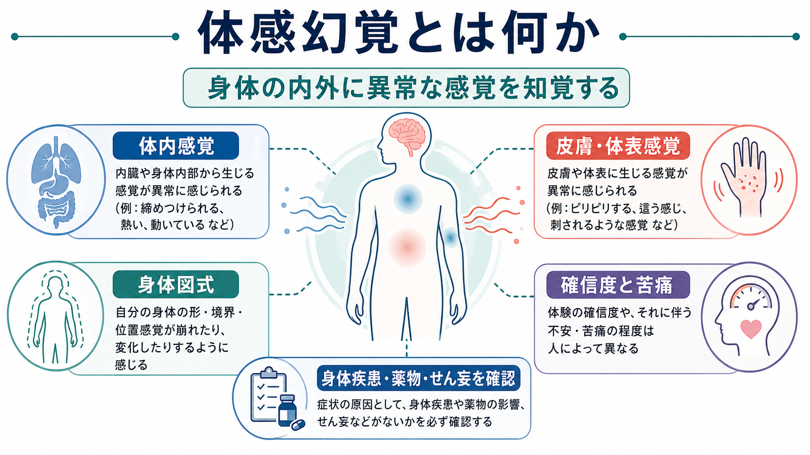
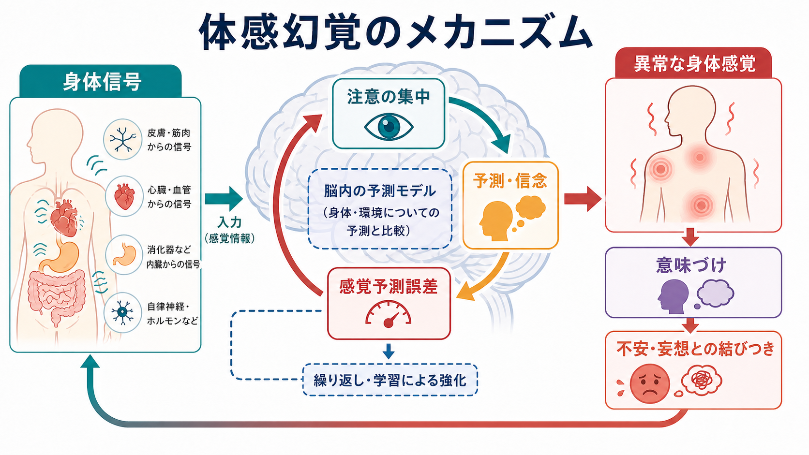
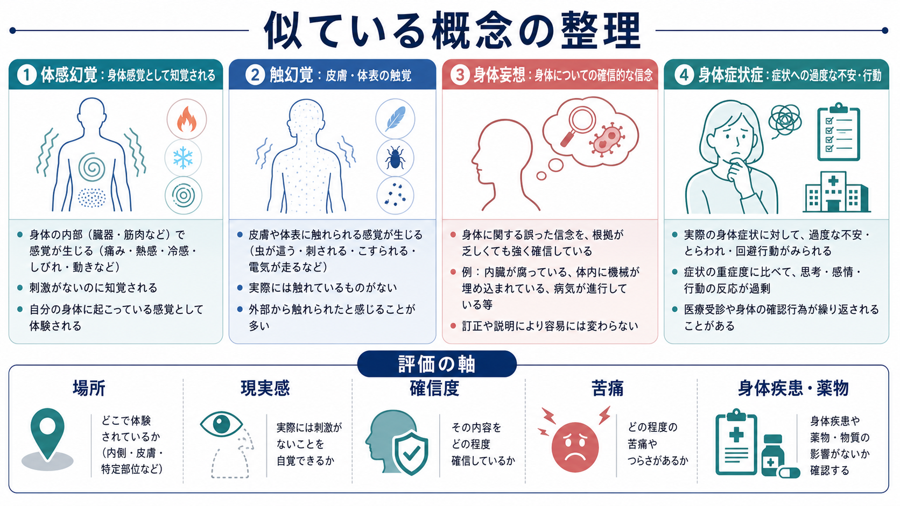

# 体感幻覚とは何か

## 要点

- 体感幻覚とは、身体の内部、体表、身体の形や位置に関する異常な感覚を、対応する外的刺激や医学的所見だけでは説明しにくい形で知覚する[[幻覚とは何か|幻覚]]である[1][2]。
- 皮膚を虫が這う、体内で何かが動く、内臓が変形する、身体の一部が大きくなるなど、内容は多様で、苦痛や確信の強さも人によって異なる[3][4]。
- 体感幻覚は[[妄想とは何か|妄想]]、不安、文化的意味づけ、身体疾患、薬剤・物質、[[せん妄とは何か|せん妄]]、神経疾患と重なりやすい[3][5]。
- 評価では「本当にあるか」をただ否定するより、場所、性質、時間経過、現実感、確信度、生活機能、身体疾患・薬剤・物質との関係を丁寧に分ける。
- 本稿は教育・研究目的の概説であり、個別の診断や治療指示ではない。

## この記事で答える問い

1. 体感幻覚は、触幻覚・身体妄想・身体症状症と何が違うのか。
2. 身体の感覚が、なぜ「異常な身体感覚」として体験されうるのか。
3. 臨床や研究では、どのような軸で整理すると誤解が少ないのか。

## まず結論

体感幻覚は、[[知覚とは何か|知覚]]のうち、とくに身体に関する感覚が「そこにあるもの」として体験される現象である。英語では somatic hallucination や bodily hallucination と呼ばれ、身体や内臓、身体システム・過程に関する感覚体験を中心とする[2]。NIMHは統合失調症の精神病症状として、幻覚を「ないものを見たり、聞いたり、嗅いだり、味わったり、感じたりする」体験として説明しており、体感幻覚はこの「感じる」側に位置づく[3]。

ただし、実際の臨床では、単純に「幻覚かどうか」だけで切り分けると粗くなる。虫が皮膚を這うように感じる体表の体験は触幻覚に近く、内臓が腐っていると確信する体験は身体妄想に近い。異常感覚への不安や確認行動が中心なら[[身体症状症は脳の予測処理で説明できるのか|身体症状症]]との連続性も考える必要がある。したがって体感幻覚は、感覚、信念、情動、身体医学的背景を同時に見る症候学的な入口である。

## 背景

幻覚というと[[幻聴とは何か|幻聴]]や幻視が想像されやすいが、身体に関する幻覚も精神医学・神経医学の重要な対象である。ICD-11 CDDRは精神・行動・神経発達症の臨床記述と診断要件を国際的にそろえるための手引きであり、診断分類を使う前提として、症状の性質を正確に記述することを重視している[1]。

体感幻覚が難しいのは、身体感覚がもともとあいまいで、内臓感覚、痛み、しびれ、熱感、圧迫感、運動感覚、身体所有感などが重なっているからである。外界の音や光と違い、体内感覚は直接確認しにくい。さらに、身体疾患や薬剤性の感覚異常が併存していることもある。したがって、精神症状としての記述と身体医学的評価を切り離さず、[[身体合併症は精神科診療でなぜ重要なのか|身体合併症]]の可能性も同時に扱う必要がある[5][8]。

## 基本概念

### 体感幻覚

体感幻覚は、身体の内部、臓器、体表、身体の形・位置・動きに関する幻覚である。NCBI MedGenでは、身体や内臓、身体のシステムや過程に関連する感覚経験を含む幻覚として整理されている[2]。例としては、体内で虫や物体が動く、内臓がねじれる、身体の一部が膨らむ、皮膚の下に電気が走る、体の境界が変わるように感じる、などがある。

この体験は、本人にとっては「ただの考え」ではなく、感覚として迫ってくる。したがって、面接では「そう感じるのですね」と体験を受け止めつつ、「どこで」「どのように」「いつから」「どのくらい確信しているか」「どの程度つらいか」を分けて聞くことが重要になる。

### 触幻覚との関係

触幻覚は、体表や皮膚に触れられている、刺される、虫が這う、風や液体が当たるといった触覚の幻覚である。Lim と Blom は触幻覚と体感幻覚を bodily hallucinations として扱い、触幻覚を皮膚や皮下組織に関する外界からの触刺激がない触覚体験、体感幻覚を体内に関する感覚体験として区別している[4]。

ただし、実際の訴えは境界があいまいである。「皮膚の下を何かが動く」は体表と体内の両方を含む。したがって、用語の分類よりも、体験の場所、深さ、質感、動き、本人の意味づけを記録する方が臨床的には役に立つ。

### 身体妄想との関係

身体妄想は、身体についての確信的な信念が中心になる。たとえば「内臓が腐っている」「体内に機械が埋め込まれている」と強く確信し、反証されても容易に変わらない場合は、感覚体験だけでなく[[妄想とは何か|妄想]]としての評価が必要になる[8]。

体感幻覚と身体妄想は排他的ではない。異常な身体感覚が先にあり、それを説明するために身体妄想が形成されることもある。逆に、身体妄想が強いほど、身体感覚への注意が増え、異常感覚がより鮮明になることもある。この相互作用を見落とすと、「幻覚か妄想か」という二分法に閉じ込められる。

### セネストパチー

セネストパチーは、対応する身体所見がはっきりしない奇異で苦痛な身体感覚を指す概念で、とくに口腔領域では「口腔セネストパチー」として報告が多い[6]。DSM系の分類では身体型の妄想性障害や身体症状症と関連づけられることがあるが、幻覚・妄想・身体感覚異常のどこに置くかは文献によって揺れがある[6]。

この揺れは欠点だけではない。体感幻覚を理解するうえで、「身体感覚」「身体についての信念」「苦痛」「医学的所見」「文化的説明」が絡み合うことを示している。

## 仕組み

体感幻覚を単一の原因で説明するのは難しい。現在の理解では、少なくとも次の層が重なる。

第一に、身体からの信号である。体性感覚、内臓感覚、自律神経、痛み、筋緊張、薬剤・物質の作用、睡眠不足、疲労、神経疾患などが、通常とは異なる身体信号を作ることがある。体性感覚ネットワークや島皮質、頭頂葉などは、身体の位置、境界、内部状態を統合するうえで重要である。体感幻覚の単例fMRI研究では、体感幻覚時に一次体性感覚野や後部頭頂皮質の活動が報告されており、少なくとも一部では、通常その感覚様式を処理する領域が関与する可能性がある[5]。

第二に、注意と予測である。身体に強く注意を向けるほど、微細な感覚は増幅されやすい。予測符号化の観点では、脳は身体と環境についての予測を作り、入力とのずれである予測誤差を使って知覚を更新する。精神病症状では、予測、予測誤差、その精度づけの乱れが、幻覚や妄想の形成に関わると考えられている[7]。

第三に、意味づけである。同じ「胸の奥が動く感じ」でも、不安、過去の経験、文化的背景、宗教的説明、身体疾患への恐れ、他者からの被害感と結びつくと、体験の現実感や苦痛は大きく変わる。身体に関する幻覚は、本人の安全感や身体所有感に直結するため、視覚や聴覚の幻覚とは異なる切迫感をもつことがある[4]。

## 図解

上の1枚目は、体感幻覚を「身体の内外に異常な感覚を知覚する」現象として、体内感覚、皮膚・体表感覚、身体図式、確信度と苦痛、身体疾患・薬物・せん妄の確認に分けている。

2枚目は、身体信号、注意、予測・信念、感覚予測誤差、意味づけの循環を示している。これは機序を断定する図ではなく、臨床で体験を整理するための作業仮説である。

3枚目は、似ている概念の整理である。体感幻覚、触幻覚、身体妄想、身体症状症は、互いに排他的な箱というより、感覚体験、確信度、苦痛、確認行動、身体医学的背景の比重が異なる現象として考えるとよい。

## 臨床・研究との接続

### 面接で見る軸

[[MSEで知覚異常をどう聞くか|MSEで知覚異常を聞く]]ときは、次の軸を分ける。

| 軸 | 確認すること |
|---|---|
| 場所 | 体表か、体内か、特定部位か、全身か |
| 質 | しびれ、熱感、圧迫、動き、虫、電気、変形感など |
| 時間経過 | 急性か慢性か、発作性か持続性か、睡眠や薬剤と関連するか |
| 現実感 | 感覚としてどれほどリアルか |
| 確信度 | 「そう感じる」と「そうに違いない」の違い |
| 苦痛・生活機能 | 不安、回避、確認行動、睡眠、仕事・学業への影響 |
| 鑑別 | 身体疾患、神経疾患、薬剤・物質、せん妄、精神病症状 |

この整理は、本人の体験を否定するためではなく、治療・支援につながる情報に分けるために行う。たとえば急性発症、意識変容、発熱、神経脱落症状、薬剤変更、物質使用、激しい疼痛などがあれば、精神症状として固定する前に身体医学的評価を優先する。

### 統合失調症スペクトラムとの関係

統合失調症では、幻覚、妄想、思考障害などの精神病症状がみられることがある[3]。体感幻覚は幻聴ほど頻度が高く語られないが、統合失調症スペクトラムの患者で身体に関する幻覚や異常身体感覚が臨床的に重要になることがある[4][5]。また、セネステジアや身体イメージの異常は統合失調症で報告されており、身体体験の変容が精神病理と関連する可能性が示されている[5]。

### 文化と意味づけ

Lim と Blom の研究では、イスラム圏背景をもつ精神病患者において、触幻覚・体感幻覚がジンなどの文化宗教的存在と結びついて解釈される例が検討されている[4]。これは、文化的説明を「誤り」として捨てるべきだという意味ではない。むしろ、体感幻覚は[[文化的背景は診断にどう影響するのか|文化的背景]]や文脈によって、恐怖、恥、被害感、治療アクセスに影響することを示している。

### 研究での課題

研究上の課題は、体感幻覚の測定が難しいことである。幻聴なら声の頻度、内容、位置、苦痛を比較的尋ねやすいが、体感幻覚では、体内・体表・運動感覚・身体図式・痛み・しびれ・妄想的解釈が混ざる。今後は、[[体性感覚ネットワークは身体情報をどう表現するのか|体性感覚ネットワーク]]、内受容、身体所有感、予測処理、文化的定式化をつなぐ研究が必要である。

## よくある誤解

### 誤解1: 体感幻覚は「身体の病気ではない」と決めつけてよい

決めつけてはいけない。体感幻覚という記述は、身体疾患や薬剤・物質の影響がないことの証明ではない。異常感覚には神経疾患、内分泌・代謝異常、薬剤、物質使用、感染、せん妄、疼痛疾患などが関わる場合がある[8]。精神症状として理解する場合でも、[[鑑別診断とは何か|鑑別診断]]は必要である。

### 誤解2: 本人が強く訴えるなら、すべて妄想である

強い訴えは妄想の可能性を高めるが、それだけでは判断できない。重要なのは、感覚体験そのもの、そこから導かれる信念、反証可能性、生活への影響、身体医学的背景を分けることである。体感幻覚と身体妄想は連続的に重なりうる。

### 誤解3: 触幻覚と体感幻覚は同じである

重なるが同じではない。触幻覚は主に皮膚・体表の触覚に関わる。体感幻覚は体内感覚や身体の変形感、臓器や身体過程に関する感覚まで含む[2][4]。ただし、実践では分類名より、体験の質を丁寧に記述する方が有用である。

### 誤解4: 体感幻覚はまれなので重要ではない

研究数は少ないが、重要でないわけではない。身体に関する幻覚は苦痛が強く、羞恥、被害感、身体への恐怖、医療機関の反復受診、生活機能低下につながりうる[4][6]。頻度だけで重要性を判断しない方がよい。

## 関連ノート

- [[幻覚とは何か]]
- [[幻聴とは何か]]
- [[妄想とは何か]]
- [[せん妄とは何か]]
- [[MSEで知覚異常をどう聞くか]]
- [[薬剤性精神症状とは何か]]
- [[鑑別診断とは何か]]
- [[身体症状症は脳の予測処理で説明できるのか]]
- [[身体所有感とは何か]]
- [[身体図式とは何か]]
- [[体性感覚ネットワークは身体情報をどう表現するのか]]
- [[身体合併症は精神科診療でなぜ重要なのか]]
- [[生物心理社会モデルとは何か]]
- [[文化的背景は診断にどう影響するのか]]

## MOC更新候補

- [[MOC｜精神医学]] に「症候学・幻覚」の入口として追加候補。
- [[MOC｜意識・自己・身体性]] に「身体感覚・身体所有感・身体図式」との接続として追加候補。
- [[MOC｜神経科学と精神疾患]] に「体性感覚ネットワーク、内受容、予測処理」との接続として追加候補。

並列生成ジョブとの競合を避けるため、本稿ではMOC本体は更新していない。

## 理解チェック

1. 体感幻覚と触幻覚は、どの感覚領域で重なり、どこで区別できるか。
2. 「体内で何かが動く感じ」と「体内に機械を入れられたという確信」を分けて記述するには、どの軸を見るべきか。
3. 体感幻覚を評価するとき、身体疾患・薬剤・物質・せん妄を確認する必要があるのはなぜか。
4. 予測符号化の観点では、身体信号、注意、予測、意味づけはどのように循環するか。
5. 文化的背景を聞くことは、体感幻覚の理解にどのような意味をもつか。

## 未解決問題

- 体感幻覚、セネストパチー、身体妄想、身体症状症を、どの程度まで共通の身体予測処理モデルで説明できるか。
- 体感幻覚に固有の評価尺度や面接法を、文化差を含めてどのように標準化できるか。
- 体性感覚ネットワーク、島皮質、頭頂葉、内受容ネットワークのどの変化が、体感幻覚の苦痛や確信度と関係するか。
- 身体疾患を見逃さず、同時に不要な検査・処置の反復を減らす臨床的バランスをどう設計するか。

## 参考文献

[1] World Health Organization. (2024). *Clinical descriptions and diagnostic requirements for ICD-11 mental, behavioural and neurodevelopmental disorders*. WHO. https://www.who.int/publications/i/item/9789240077263

[2] National Center for Biotechnology Information. *Somatic hallucination (Concept Id: C0233774)*. MedGen. https://www.ncbi.nlm.nih.gov/medgen/65853

[3] National Institute of Mental Health. *Schizophrenia*. https://www.nimh.nih.gov/health/publications/schizophrenia

[4] Lim, A., & Blom, J. D. (2021). Tactile and somatic hallucinations in a Muslim population of psychotic patients. *Frontiers in Psychiatry, 12*, 728397. https://doi.org/10.3389/fpsyt.2021.728397

[5] Shergill, S. S., Brammer, M. J., Williams, S. C. R., Murray, R. M., & McGuire, P. K. (2001). Modality specific neural correlates of auditory and somatic hallucinations. *Journal of Neurology, Neurosurgery & Psychiatry, 71*(5), 688-690. https://pmc.ncbi.nlm.nih.gov/articles/PMC1737587/

[6] Umezaki, Y., et al. (2016). Oral cenesthopathy. *BioPsychoSocial Medicine, 10*, 20. https://doi.org/10.1186/s13030-016-0067-8

[7] Sterzer, P., Adams, R. A., Fletcher, P., et al. (2018). The predictive coding account of psychosis. *Biological Psychiatry, 84*(9), 634-643. https://doi.org/10.1016/j.biopsych.2018.05.015

[8] Calabrese, J., & Al Khalili, Y. (2023). Psychosis. In *StatPearls*. NCBI Bookshelf. https://www.ncbi.nlm.nih.gov/books/NBK546579/
