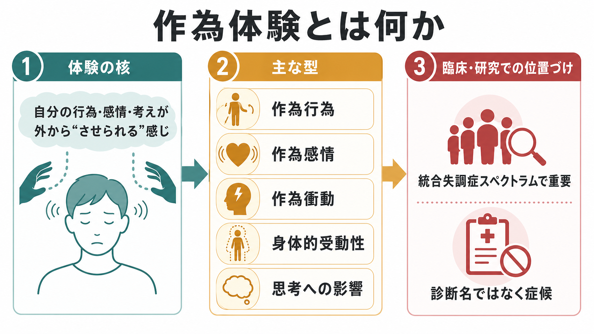
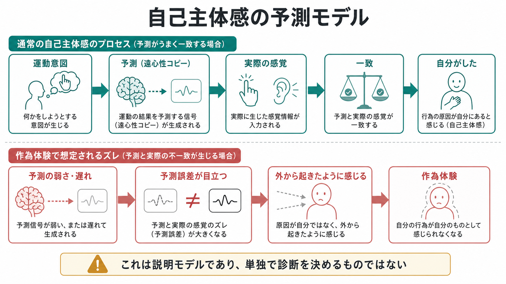
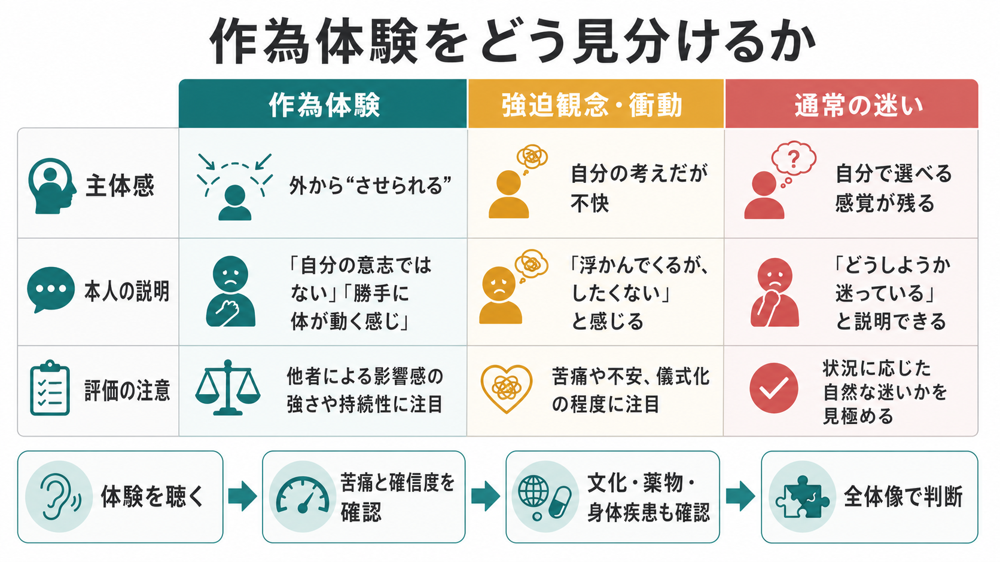

# 作為体験とは何か

## 要点

- 作為体験とは、自分の行動、感情、衝動、身体感覚、思考などが「自分から生じた」のではなく、外部の力や他者によって起こされているように感じられる体験である[1][2]。
- 古典的にはシュナイダーの一級症状、現代の分類では ICD-11 の「影響・受動性・制御の体験」と重なり、[[妄想とは何か]]、[[幻覚とは何か]]、[[体感幻覚とは何か]]とは区別しつつ関連づけて理解する必要がある[1][3]。
- 中核は「内容が奇妙か」ではなく、「主体感が失われ、自分の体験が自分のものとして感じられにくい」点にある[2][4]。
- 研究上は、運動意図、予測、感覚フィードバック、自己帰属のずれとして説明する自己主体感モデルが有力だが、単独の機序で全例を説明できる段階ではない[5][6]。
- 本稿は教育・研究目的の整理であり、個別の診断や治療指示ではない。

## この記事で答える問い

1. 作為体験は、単なる「操られているという考え」と何が違うのか。
2. 作為行為、作為感情、作為衝動、身体的受動性、思考への影響はどう整理できるのか。
3. 自己主体感の研究は、作為体験をどこまで説明できるのか。
4. 臨床では、どのような点に注意して聴き取るべきか。

## まず結論

作為体験は、「誰かに操作されている」という説明内容だけで決まる症状ではない。より重要なのは、本人が通常なら「自分がした」「自分の内側から起きた」と感じるはずの行為や感情や思考について、「これは自分からではない」「外から起こされた」と体験することである。このため、作為体験は[[妄想とは何か|妄想]]の一種として語られることもあるが、妄想内容そのものよりも、自己主体感と自己所属感の変化に注目すると理解しやすい[2][4]。

ICD-11 では、統合失調症または他の一次性精神病性障害の陽性症状の一部として、影響・受動性・制御の体験が位置づけられる。そこでは、感情、衝動、行動、思考が自分によって生成されたものではなく、外部から置かれたり、引き抜かれたり、制御されたりする体験として記述される[1][8]。ただし、作為体験があることだけで診断名が自動的に決まるわけではない。持続期間、苦痛、機能障害、他の精神症状、物質・薬剤、身体疾患、文化的文脈を含めて全体像で評価する。

## 背景

### シュナイダー一級症状との関係

作為体験は、シュナイダーが統合失調症の診断上重視した一級症状と深く関係する。代表的には、作為行為、作為感情、作為衝動、身体的受動性、思考挿入、思考奪取、思考伝播などが挙げられる[2][3]。これらに共通するのは、思考や行為の「内容」だけでなく、体験の発生源が自分ではないように感じられる点である。

もっとも、シュナイダー一級症状は歴史的に重要だが、現代の診断ではそれだけで統合失調症を確定する基準ではない。Cochrane レビューでも、一級症状は診断に一定の参考情報を与える一方、感度・特異度の限界があり、単独で診断を決めるには不十分であると整理されている[3]。したがって、作為体験は「統合失調症らしさ」を示す症候として重い意味を持つが、必ず文脈化して読む必要がある。

### 「受動性」と「作為」

英語圏では passivity experiences、experiences of influence, passivity or control、delusions of control などの語が使われる。日本語の「作為体験」は、「自分が能動的にした」のではなく「させられた」という受動性を強調する言い方である。

ここでいう受動性は、単に「やる気がない」「流されやすい」という性格傾向ではない。本人にとっては、体の動き、気分、衝動、考えが、外部の力、機械、電波、他者、霊的存在などによって起こされたように感じられる。説明の形は時代や文化で変わりうるが、「自分の体験の発生源が自分ではない」という構造が中心にある[4]。

## 基本概念

### 作為体験の主な型

| 型 | 体験の焦点 | 例として語られやすい表現 |
|---|---|---|
| 作為行為 | 行動や運動 | 「手が勝手に動かされた」「歩かされた」 |
| 作為感情 | 感情や気分 | 「怒りを入れられた」「悲しくさせられた」 |
| 作為衝動 | 欲求や衝動 | 「したくない衝動を起こされた」 |
| 身体的受動性 | 身体感覚や身体機能 | 「体に刺激を送られる」「内臓を操作される」 |
| 思考への影響 | 思考の発生・消失・伝播 | 「考えを入れられる」「考えを抜かれる」 |

これらは互いに明確に分かれるとは限らない。身体への影響が[[体感幻覚とは何か|体感幻覚]]として語られたり、思考への影響が[[妄想とは何か|妄想]]内容として体系化されたり、声の体験と結びついて[[幻覚とは何か|幻覚]]と同時に問題になることもある。

### 強迫観念・侵入思考との違い

作為体験は、[[強迫観念とは何か]]や[[侵入思考とは何か]]と混同されやすい。強迫観念や侵入思考では、多くの場合、考えやイメージは「自分の心に浮かんだものだが、不快で、望ましくなく、制御しにくい」と体験される。一方、作為体験では、「そもそも自分から出たものではない」「外から入れられた、起こされた」という外部帰属が前景化する。

ただし、現実の面接では境界があいまいなことも多い。重要なのは、本人がどの程度「自分のものではない」と感じているか、外部の力の関与をどれほど確信しているか、その体験が行動や安全にどう影響しているかを丁寧に聴くことである。

## 仕組み

### 自己主体感の基本モデル

自己主体感とは、自分の行為とその結果について「自分が起こした」と感じる感覚である。運動を行うとき、脳は運動指令だけでなく、その行為がどのような感覚結果を生むかという予測も作る。この予測と実際の感覚フィードバックがよく一致すると、結果は自分の行為として帰属されやすい[5][6]。

比較器モデルでは、この予測信号、遠心性コピー、感覚フィードバックの比較が、自己主体感を支えると考える。予測が弱い、遅れる、または実際の感覚との誤差が大きくなると、自分で起こした行為や内的発話が「自分ではないもの」として感じられやすくなる、という説明が成り立つ[5][6]。

### 予測処理から見た作為体験

近年のレビューでは、統合失調症における自己主体感の異常は、単純な「自己主体感の低下」だけでは説明しきれないとされる。課題、利用できる手がかり、明示的判断と暗黙的指標の違いによって、自己帰属の過剰と過少の両方が観察されるためである[7]。

この点で、[[予測処理とは何か|予測処理]]の枠組みは有用である。予測誤差がどの水準で、どの精度で重みづけられるかによって、ある場面では「自分がしたはずなのに外から起きた」と感じ、別の場面では「外的出来事を自分が起こした」と感じる可能性がある。2023年の計算モデル研究では、感覚運動予測信号の時間遅延を加えることで、統合失調症で観察される双方向の自己主体感異常を再現できることが示された[6]。

ただし、これは作為体験の全体を説明し尽くすものではない。作為体験には、運動制御だけでなく、内的発話、身体所有感、感情の自己帰属、他者意図の推論、妄想的説明の形成、社会的脅威の解釈が関わる。したがって、自己主体感モデルは有力な足場だが、臨床現象をそのまま一つの神経計算に還元するのは慎重であるべきである[4][7]。

## 図解

図1は、作為体験を「体験の核」「主な型」「臨床・研究での位置づけ」に分けて整理した概念地図である。図2は、予測と感覚フィードバックの一致・不一致から自己主体感を説明するモデルを示している。図3は、作為体験、強迫観念・衝動、通常の迷いを区別するための臨床的な見取り図である。

画像は理解の補助であり、診断アルゴリズムではない。実際には、本人の語り、時間経過、確信度、苦痛、生活への影響、他の症状、身体・薬物要因を合わせて評価する。

## 臨床・研究との接続

### 面接で確認する軸

作為体験が疑われるとき、面接では次の軸を分けて確認する。

| 軸 | 確認したいこと | 注意点 |
|---|---|---|
| 主体感 | 「自分がした」と感じるか、「させられた」と感じるか | 体験を頭ごなしに否定しない |
| 外部帰属 | 誰が、何が、どのように起こしていると感じるか | 文化的・宗教的文脈も確認する |
| 確信度 | 疑いがあるのか、確信しているのか | 確信度は変動しうる |
| 苦痛と機能障害 | 不安、恐怖、回避、対人関係、睡眠、安全への影響 | リスク評価と支援につなげる |
| 鑑別 | せん妄、物質・薬剤、神経疾患、気分症状、強迫症状 | [[せん妄とは何か]]や身体疾患も視野に入れる |

臨床的には、「それは本当ですか」と事実性だけを問うより、「どのように起こる感じがしますか」「自分でしている感じはどれくらいありますか」「その体験のせいで何を避けていますか」と、体験構造と生活影響を分けて聴く方が有用である。

### 研究での測定

研究では、作為体験そのものを直接測るだけでなく、自己主体感を実験課題で評価する。代表的には、行為と結果の時間間隔をどの程度近く感じるかを測る intentional binding、行為結果の感覚減弱、能動運動と受動運動の区別、遅延フィードバック下での自己帰属判断などが用いられる[6][7]。

ただし、実験課題で測る自己主体感と、本人が生活の中で体験する作為体験は同一ではない。実験課題は機序の一部を切り出す道具であり、臨床面接で得られる現象学的な記述と相補的に扱う必要がある。

## よくある誤解

### 誤解1: 作為体験は「操られているという妄想」と同じである

完全には同じではない。妄想的な説明が加わることは多いが、作為体験の中核は「自分の行為や感情が自分から生じたものとして感じられない」という主体感の変化である。説明内容だけでなく、体験の質を聴く必要がある[2][4]。

### 誤解2: 作為体験があれば統合失調症である

誤りである。作為体験は統合失調症スペクトラムで重要な症候だが、診断は単一症状ではなく、症状群、持続、機能障害、除外診断、文化的文脈から判断する[1][3]。

### 誤解3: 反証すれば作為体験は消える

多くの場合、単純な反証や説得は十分ではない。本人には体験が切実であり、確信度や不安を強める場合もある。臨床的には、体験の事実性を争う前に、苦痛、安全、睡眠、孤立、回避行動、支援資源を扱うことが重要である。

### 誤解4: 作為体験はすべて危険な症状である

作為体験は重要な評価対象だが、存在するだけで危険性が決まるわけではない。リスクは、命令性の[[幻覚とは何か|幻覚]]、被害的な[[妄想とは何か|妄想]]、強い恐怖、衝動性、物質使用、孤立、過去の行動、現在の支援状況と合わせて判断する。

## 関連ノート

既存ノート:

- [[精神症候学とは何か]]
- [[妄想とは何か]]
- [[幻覚とは何か]]
- [[体感幻覚とは何か]]
- [[強迫観念とは何か]]
- [[侵入思考とは何か]]
- [[予測処理とは何か]]
- [[ドパミン仮説は統合失調症をどこまで説明できるのか]]
- [[グルタミン酸仮説は統合失調症をどう説明するのか]]

MOC 更新候補:

- `content/00_MOC/MOC｜精神医学.md`
- `content/00_MOC/MOC｜神経科学と精神疾患.md`
- `content/00_MOC/MOC｜計算論的精神医学.md`

今後の作成候補:

- 影響体験とは何か
- 思考挿入とは何か
- 思考奪取とは何か
- 思考伝播とは何か
- 自己主体感とは何か
- シュナイダー一級症状とは何か

## 理解チェック

1. 作為体験の中核は、「内容の奇妙さ」よりも何の変化にあるか。
2. 作為体験と強迫観念を区別するとき、本人のどのような感覚を確認するとよいか。
3. 自己主体感の比較器モデルでは、予測と実際の感覚フィードバックの関係をどう考えるか。
4. 作為体験があるだけで診断名を確定できない理由は何か。

## 参考文献

[1] World Health Organization. (2024). *Clinical descriptions and diagnostic requirements for ICD-11 mental, behavioural and neurodevelopmental disorders*. World Health Organization. https://iris.who.int/bitstream/handle/10665/375767/9789240077263-eng.pdf

[2] Waters, F. A. V., & Badcock, J. C. (2010). First-rank symptoms in schizophrenia: Reexamining mechanisms of self-recognition. *Schizophrenia Bulletin, 36*(3), 510-517. https://doi.org/10.1093/schbul/sbn112

[3] Soares-Weiser, K., Maayan, N., Bergman, H., Davenport, C., Kirkham, A. J., Grabowski, S., & Adams, C. E. (2015). First rank symptoms for schizophrenia. *Cochrane Database of Systematic Reviews, 2015*(1), CD010653. https://doi.org/10.1002/14651858.CD010653.pub2

[4] Kendler, K. S., & Mishara, A. (2019). The prehistory of Schneider's first-rank symptoms: Texts from 1810 to 1932. *Schizophrenia Bulletin, 45*(5), 971-990. https://doi.org/10.1093/schbul/sbz047

[5] Frith, C. (2012). Explaining delusions of control: The comparator model 20 years on. *Consciousness and Cognition, 21*(1), 52-54. https://doi.org/10.1016/j.concog.2011.06.010

[6] Okimura, T., Maeda, T., Mimura, M., & Yamashita, Y. (2023). Aberrant sense of agency induced by delayed prediction signals in schizophrenia: A computational modeling study. *Schizophrenia, 9*, 72. https://doi.org/10.1038/s41537-023-00403-7

[7] Rossetti, I., Mariano, M., Maravita, A., Paulesu, E., & Zapparoli, L. (2024). Sense of agency in schizophrenia: A reconciliation of conflicting findings through a theory-driven literature review. *Neuroscience & Biobehavioral Reviews, 163*, 105781. https://doi.org/10.1016/j.neubiorev.2024.105781

[8] Maj, M., van Os, J., De Hert, M., Gaebel, W., Galderisi, S., Green, M. F., Guloksuz, S., Harvey, P. D., Jones, P. B., Malaspina, D., McGorry, P., Murray, R. M., Nuechterlein, K. H., Peralta, V., Thornicroft, G., & Ventura, J. (2021). The clinical characterization of the patient with primary psychosis aimed at personalization of management. *World Psychiatry, 20*(1), 4-33. https://doi.org/10.1002/wps.20809
