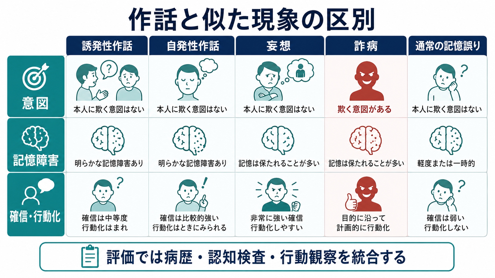
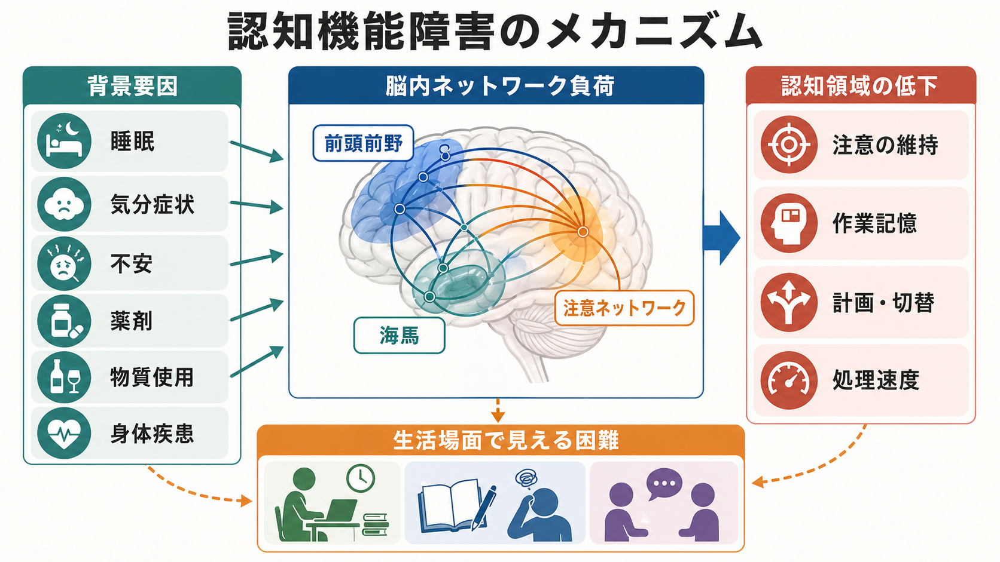

# 作話とは何か

## 要点

- 作話とは、本人がだまそうとしていないにもかかわらず、誤った記憶や説明を真実として語る現象である。典型的には健忘や見当識障害、前頭葉・辺縁系の制御障害と結びつく[1][2]。
- 「記憶の穴を埋める嘘」ではなく、本人にとってはその時点で自然に想起された現実である。臨床では詐病や意図的な虚偽、通常の物忘れ、妄想と区別して扱う必要がある[1][3]。
- 古典的には、質問に誘発される「誘発性作話」と、質問がなくても行動や語りとして現れる「自発性作話」が区別される[2]。
- 自発性作話では、過去の記憶断片や習慣が現在の現実として扱われることがあり、眼窩前頭皮質を含む「現実フィルタリング」の障害が重要な仮説になっている[3][4]。
- 作話はコルサコフ症候群、前交通動脈瘤破裂後、頭部外傷、脳炎、認知症、せん妄、統合失調症などで報告されるが、背景疾患ごとに意味づけは異なる[1][5][7]。

## この記事で答える問い

1. 作話は、単なる嘘や空想と何が違うのか。
2. 誘発性作話と自発性作話はどう違うのか。
3. 記憶障害、前頭葉機能、現実モニタリングはどのように関わるのか。
4. 臨床では何を観察し、どのような誤解を避けるべきか。

## まず結論

作話は、**記憶の検索・監視・時間文脈づけがうまく働かないために、誤った説明が本人のなかで「もっともらしい現実」として成立する現象**である。したがって、作話を見たときに最初に考えるべきことは「なぜ嘘をつくのか」ではなく、「どの記憶過程、見当識、実行機能、病識、脳疾患が関わっているのか」である。

作話の内容は、ときに日常的で目立たない。「昨日、娘が来た」と言うが実際には来ていない、退院予定がないのに「これから仕事へ行く」と荷物をまとめる、検査中に覚えていない単語を自信をもって答える、といった形で現れる。重要なのは、本人がその発言を意図的な虚偽として経験していない点である[1][2]。

## 背景

作話は、19世紀末のコルサコフ症候群の記載とともに精神医学・神経心理学で注目されてきた。現在では、アルコール関連のコルサコフ症候群だけでなく、前交通動脈瘤破裂後、外傷性脳損傷、脳炎、認知症、せん妄、精神病性障害など、複数の文脈で論じられる[3][7]。

この広さが、作話をわかりにくくしている。ある場面では、作話は健忘患者が質問に答えようとして出す記憶検査上の誤反応に近い。別の場面では、患者が過去の習慣にもとづいて病棟から出ようとするなど、語りだけでなく行動全体を現在の現実からずらす。さらに認知症やせん妄では、全般的な混乱、注意障害、妄想的確信と重なって見えることもある。

そのため作話は、ひとつの単純な症状名というより、**記憶の誤りがどのように語り・確信・行動へ変換されるかを見るための症候学的窓**として理解するとよい。これは[[精神症候学とは何か|精神症候学]]や[[MSEで認知機能をどう評価するか|MSEでの認知機能評価]]とも直結する。

## 基本概念

### 定義

作話は、神経精神医学的には「だます意図なしに誤った記憶を生成し、それを真実として扱う現象」と整理できる[1]。この定義には三つの要素がある。

| 観点 | 作話で見ること | 臨床的な意味 |
|---|---|---|
| 内容 | 事実と合わない記憶・説明 | 記憶検索や時間文脈づけの誤りを示す |
| 意図 | だます意図が乏しい | 詐病や意図的な虚偽と区別する |
| 確信 | 本人は真実として語ることが多い | 反論しても修正されにくい場合がある |

### 誘発性作話と自発性作話

Kopelman は、作話を大きく「誘発性作話」と「自発性作話」に分けた[2]。

**誘発性作話**は、質問や記憶課題に答えるなかで生じる。たとえば、覚えていない出来事について尋ねられたとき、記憶の断片や推測を組み合わせてもっともらしい答えを出す。これは健忘のある患者だけでなく、記憶が弱い状況では健常者にも類似した誤反応が生じうる[2][7]。

**自発性作話**は、質問されていないのに誤った語りや行動が出る。患者は、現在入院中なのに「会社へ行く時間だ」と行動したり、過去の予定を現在の義務として扱ったりする。この型では、単なる記憶の欠損よりも、現在の現実に合わない記憶を抑える機構の障害が重要になる[3][4]。

### 作話と近い現象

作話は、妄想、空想、通常の記憶誤り、意図的な虚偽と混同されやすい。

| 現象 | 中心にあるもの | 作話との違い |
|---|---|---|
| 通常の記憶誤り | 記憶の不正確さ | 病的な健忘や行動化を伴わないことが多い |
| 妄想 | 反証困難な信念体系 | 記憶検索の誤りだけでは説明できないことが多い |
| 詐病・虚偽 | 外的利益や意図的操作 | 作話では欺く意図が乏しい |
| 空想 | 想像としての経験 | 作話では本人が現実記憶として扱う |

## 仕組み

### 記憶は再構成される

記憶は、過去の出来事を録画のように再生するものではない。想起では、手がかり、意味知識、自己に関する物語、時間文脈、感情、現在の目的が組み合わされる。したがって、[[エピソード記憶とは何か|エピソード記憶]]や[[想起は記憶を変えるのか|想起]]は、もともと再構成的であり、誤りを含みうる。

作話では、この再構成過程の誤りが、本人のなかで十分にチェックされず、発話や行動へ進む。Gilboa らの戦略的検索モデルでは、作話は記憶そのものの保存障害だけでなく、検索方略、候補記憶の選択、検索後モニタリングの障害が重なって生じると考えられる[6][8]。

### 現実フィルタリング

Schnider は、自発性作話を理解する鍵として「現実フィルタリング」を提案した。これは、想起された記憶が現在の現実に属するか、いま行動の根拠にしてよいかを早期に選別する仕組みである[3][4]。

この仮説では、作話患者は記憶をまったく作れないのではない。むしろ、過去の本当の出来事、習慣、未完了の予定、古い自己像などが活性化され、それが現在の状況に関係しないにもかかわらず抑制されない。結果として、患者は「いま退院して仕事へ行く」「すでに亡くなった家族に会いに行く」といった、過去と現在がずれた現実を生きることがある[3][4]。

### 前頭葉、眼窩前頭皮質、辺縁系

自発性作話では、眼窩前頭皮質、とくに後内側眼窩前頭領域や、その接続を含む前頭葉・辺縁系ネットワークが重視されている[3][4]。前交通動脈瘤破裂後に作話が生じやすいことも、この領域の血管・神経ネットワークとの関係から理解される。

ただし、作話を「前頭葉が壊れると出る症状」と単純化してはいけない。研究では、誘発性作話と自発性作話が二重解離を示すこと、自発性作話が一般的な実行機能障害だけでは説明しきれないこと、時間順序や現在関連性の判断が重要であることが示されている[5]。つまり、作話は[[認知機能検査は何を測っているのか|認知機能検査]]の一点だけではなく、記憶、時間文脈、行動、病識を統合して読む必要がある。

### コルサコフ症候群との関係

コルサコフ症候群では、チアミン欠乏に関連するウェルニッケ脳症後の慢性的な健忘が中心となる。批判的レビューでは、コルサコフ症候群は、エピソード記憶が他の認知機能に比べて著しく障害される残遺症候群として整理され、実行機能低下、アパシー、病識低下、初期の作話を伴いうるとされる[7]。

ただし、コルサコフ症候群の作話も一様ではない。自発性・空想性の作話は急性期から初期に目立ち、慢性期には誘発性作話や記憶検査上の侵入反応が残りやすい、という整理がある[7]。そのため、作話の有無だけで診断するのではなく、栄養状態、アルコール使用、急性の意識障害、眼球運動障害、運動失調、健忘の経過を合わせて評価する。

## 図解

この記事の3枚の図は、次の読み方を想定している。

1. 1枚目は、作話を「記憶の穴」「想起の混線」「本人にとっての現実」「評価と支援」の流れとして概観する図である。
2. 2枚目は、現在の現実に関係しない記憶断片を抑える現実フィルタリングの弱まりを示す。
3. 3枚目は、作話、妄想、詐病、通常の記憶誤りを区別するための臨床的観点をまとめる。

## 臨床・研究との接続

### 面接で見ること

作話が疑われるとき、面接では「発言が正しいか」だけでなく、次の点を観察する。

| 観察点 | 具体例 | 意味 |
|---|---|---|
| 誘発性 | 質問時だけ誤答するか | 記憶検索の弱さを反映しやすい |
| 自発性 | 質問なしに語る、行動するか | 現実フィルタリング障害を疑う |
| 内容の性質 | 実体験の断片か、荒唐無稽か | 時間文脈の混乱か、全般的混乱かを考える |
| 確信度 | 訂正にどう反応するか | 病識・見当識・妄想との鑑別に関わる |
| 行動化 | 退院しようとする、予定に向かう | 安全評価と環境調整が必要になる |

作話を問い詰めるだけでは、関係性を損ない、説明をさらに作らせることがある。臨床的には、本人の尊厳を保ちながら、事実確認、家族・支援者からの情報、認知機能評価、身体疾患・薬剤・せん妄の評価を統合する。

### 評価と支援

作話そのものを単独で治療対象にするより、背景にある状態を評価することが重要である。急性の意識変容や注意障害があればせん妄を考える。アルコール使用や栄養障害があればウェルニッケ脳症・コルサコフ症候群の評価が必要になる。脳損傷後であれば、神経心理検査、画像所見、生活場面での行動観察を合わせてみる。

支援では、本人を論破するよりも、外部記憶補助、予定表、環境の一貫性、支援者間の情報共有、リスク場面の予防が役立つことがある。自発性作話で行動化がある場合は、本人が「正しい」と感じている現実に沿って動いているため、単なる説得では修正しにくい。安全と尊厳の両方を保つ環境調整が必要になる。

### 研究上の意義

作話研究は、記憶がどのように現在の自己や行動に結びつくかを考えるうえで重要である。作話は、記憶の保存だけでなく、検索、時間順序、自己関連性、行動の現在適合性を分けて検討する手がかりになる[4][6]。

この点で、作話は[[長期記憶とは何か|長期記憶]]、[[記憶の固定化とは何か|記憶の固定化]]、[[MSEで認知機能をどう評価するか|認知機能評価]]をつなぐテーマである。臨床症候としての作話は、脳が「過去を思い出す」だけでなく、「いま何を現実として採用するか」を選んでいることを示している。

## よくある誤解

### 誤解1: 作話は嘘である

作話は、外的利益のために意図的に虚偽を述べることとは違う。本人は発言を真実として経験していることが多い。したがって、倫理的非難よりも、記憶障害、見当識、病識、前頭葉機能を評価する必要がある[1][2]。

### 誤解2: 記憶の穴を埋めるだけで説明できる

「穴埋め」は一部の誘発性作話を説明しやすいが、自発性作話や行動化を伴う作話では不十分である。現実に関係しない記憶を抑えられないこと、時間文脈を誤ること、検索後のモニタリングが弱いことが関わる[3][5][6]。

### 誤解3: すべての作話は荒唐無稽である

作話の多くは、むしろ日常的でありうる。過去の予定、家族との出来事、仕事、買い物、退院、食事など、本人の生活史から見れば自然な内容が、現在の文脈からずれて現れる。

### 誤解4: 反証すればすぐ訂正できる

訂正で一時的に黙ることはあっても、背景の現実フィルタリングや記憶監視の問題が残っていれば、同じ説明が戻ることがある。事実訂正だけでなく、環境構造化とリスク管理が必要になる。

## 関連ノート

### 既存ノート

- [[精神症候学とは何か]]
- [[MSEで認知機能をどう評価するか]]
- [[エピソード記憶とは何か]]
- [[想起は記憶を変えるのか]]
- [[長期記憶とは何か]]
- [[記憶の固定化とは何か]]
- [[認知機能検査は何を測っているのか]]

### 関連ノート候補

- コルサコフ症候群とは何か
- ウェルニッケ脳症とは何か
- 健忘とは何か
- 前交通動脈瘤破裂後の認知症状
- 現実モニタリングとは何か
- 詐病とは何か
- 妄想と作話はどう違うのか

### MOC更新候補

- `content/00_MOC/MOC｜認知機能.md`
- 精神医学・症候学系のMOCが統合ジョブで更新される場合、本記事を「記憶・認知症候」または「精神症候学」に追加する。

## 理解チェック

1. 作話と意図的な嘘を分ける最重要点は何か。
2. 誘発性作話と自発性作話は、どのような場面で区別できるか。
3. 自発性作話で「過去の予定を現在の義務として扱う」ことは、どの機構の障害として説明されるか。
4. 作話を見たとき、本人を論破する前に確認すべき身体・神経・認知面の情報は何か。
5. 作話が研究上、記憶のどの側面を理解する手がかりになるか。

## 参考文献

[1] Wiggins, A., & Bunin, J. L. (2023). *Confabulation*. StatPearls. NCBI Bookshelf. https://www.ncbi.nlm.nih.gov/books/NBK536961/

[2] Kopelman, M. D. (1987). Two types of confabulation. *Journal of Neurology, Neurosurgery & Psychiatry*, 50(11), 1482-1487. https://doi.org/10.1136/jnnp.50.11.1482

[3] Schnider, A. (2001). Spontaneous confabulation, reality monitoring, and the limbic system: A review. *Brain Research Reviews*, 36(2-3), 150-160. https://doi.org/10.1016/S0165-0173(01)00090-X

[4] Schnider, A. (2013). Orbitofrontal reality filtering. *Frontiers in Behavioral Neuroscience*, 7, 67. https://doi.org/10.3389/fnbeh.2013.00067

[5] Schnider, A., von Daniken, C., & Gutbrod, K. (1996). The mechanisms of spontaneous and provoked confabulations. *Brain*, 119(4), 1365-1375. https://doi.org/10.1093/brain/119.4.1365

[6] Gilboa, A., Alain, C., Stuss, D. T., Melo, B., Miller, S., & Moscovitch, M. (2006). Mechanisms of spontaneous confabulations: A strategic retrieval account. *Brain*, 129(6), 1399-1414. https://doi.org/10.1093/brain/awl093

[7] Arts, N. J. M., Walvoort, S. J. W., & Kessels, R. P. C. (2017). Korsakoff's syndrome: A critical review. *Neuropsychiatric Disease and Treatment*, 13, 2875-2890. https://doi.org/10.2147/NDT.S130078

[8] Gilboa, A. (2010). Strategic retrieval, confabulations, and delusions: Theory and data. *Cognitive Neuropsychiatry*, 15(1), 145-180. https://doi.org/10.1080/13546800903056965

## 未解決問題

- 誘発性作話、自発性作話、妄想、せん妄中の混乱した語りを、臨床現場でどの程度再現性高く区別できるか。
- 眼窩前頭皮質の現実フィルタリング仮説と、戦略的検索モデルをどのように統合できるか。
- 作話を減らす介入が、本人の自尊感情、支援関係、安全管理にどのような影響をもつか。
- 認知症や統合失調症における作話様の語りを、神経心理学的作話とどこまで同じ枠組みで扱えるか。
