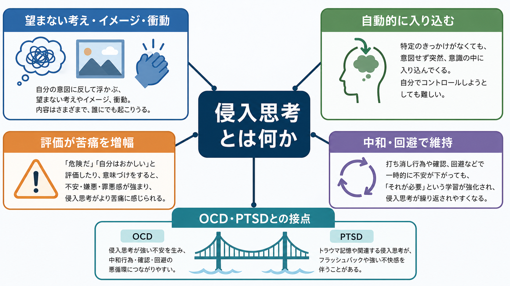
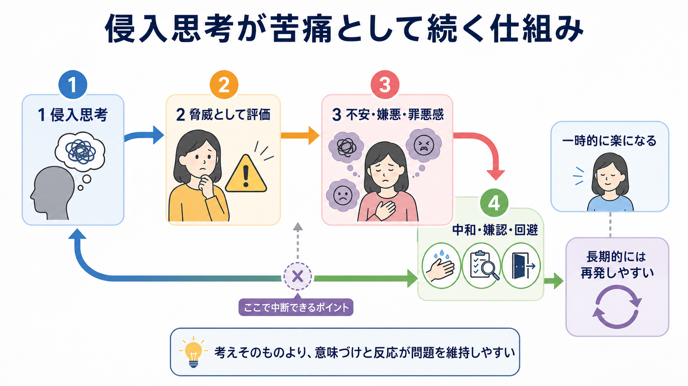
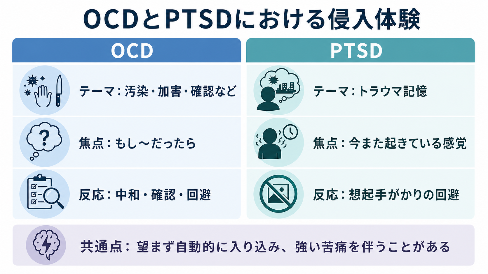

# 侵入思考とは何か

## 要点

- 侵入思考とは、本人が望んでいないのに、考え・イメージ・衝動・記憶が突然意識に入り込む体験である。
- 侵入思考そのものは珍しい体験ではない。国際研究では、非臨床の大学生777人の93.6%が過去3か月に少なくとも1つの望まない侵入を報告した[1]。
- 強迫症（OCD）では、侵入思考を「危険」「自分の本心」「責任を取るべきこと」と解釈し、中和・確認・回避を繰り返すことで苦痛が維持されやすい[2][3]。
- PTSDでは、侵入的なトラウマ記憶・フラッシュバック・悪夢が、過去の出来事を「いま再び起きている」ように感じさせることがある[6][7]。
- 本稿は教育・研究目的の概説であり、個別の診断や治療指示ではない。

## この記事で答える問い

- 侵入思考は、通常の思考・心配・反すうと何が違うのか。
- なぜ「考えが浮かぶこと」よりも、その意味づけや反応が問題になりやすいのか。
- 強迫症とPTSDでは、侵入体験はどのように似ていて、どこが違うのか。
- 臨床面接や研究で、侵入思考をどのように扱うとよいのか。

## まず結論

侵入思考は、「浮かんだ内容が危険だから病的」というより、「本人の意思に反して入り込み、強い苦痛や回避・確認・中和行動を引き起こし、生活を狭めるときに臨床的意味を持つ」体験である。多くの人に一過性の侵入思考は起こるが、OCDでは侵入思考への破局的評価と中和行動、PTSDではトラウマ記憶の再体験と想起手がかりの回避が問題を維持しやすい[2][6][7]。

## 背景

「考えたくないのに、変な考えが浮かぶ」「危険なイメージが一瞬よぎる」「過去の場面が突然よみがえる」という体験は、日常的にも臨床的にも報告される。侵入思考は、思考内容だけを見ると、加害、汚染、確認、性、宗教、身体、対人関係、トラウマ記憶など非常に多様である。

重要なのは、内容そのものだけで病理性を決めないことである。Clark と Purdon は、通常の望まない侵入思考・イメージ・衝動が臨床的強迫観念の基盤になりうると整理したが、同時に測定や定義の難しさも指摘した[4]。つまり、侵入思考は「あるかないか」だけでなく、頻度、持続、制御困難感、本人にとっての受け入れがたさ、苦痛、機能障害、回避や儀式行動との結びつきで評価する必要がある。

この観点は、[[精神症候学とは何か]]や[[MSEで思考内容をどう評価するか]]と接続する。精神症候学では、本人の語る主観的体験を尊重しつつ、考えの内容、形式、持続、確信度、行動への影響、身体反応、文脈を分けて記述する。

## 基本概念

### 侵入思考の定義

侵入思考は、広くは「本人が望まない形で意識に入り込む思考・イメージ・衝動・記憶」を指す。英語では unwanted intrusive thoughts, intrusive cognitions, intrusive memories などが使われる。OCD文脈では「強迫観念」に近く、PTSD文脈では「侵入記憶」「再体験」に近い。

ただし、すべての侵入思考が強迫症やPTSDを意味するわけではない。Radomsky らの国際研究は、侵入思考が非常に一般的な体験であることを示した[1]。そのため、臨床的には「浮かんだこと」よりも、「それをどう評価したか」「どう対処したか」「どれほど生活を妨げているか」を見る。

### 心配・反すう・妄想との違い

心配は、多くの場合「将来起こるかもしれない問題」について言語的に連鎖する。反すうは、過去の失敗や自己評価を繰り返し考え込む。侵入思考は、より突然で、本人の意図に反し、イメージや衝動の形をとることがある。

妄想との違いも重要である。侵入思考は、しばしば「自分でも変だと思う」「考えたくない」と体験される。一方、妄想では確信度が高く、現実検討の障害が中心になることがある。もちろん境界は単純ではないため、[[MSEで思考過程をどう評価するか]]や[[MSEで病識と判断力をどう評価するか]]のように、確信度、訂正可能性、文脈、行動への影響を分けて評価する。

## 仕組み

OCDの認知モデルでは、侵入思考そのものよりも、それに対する破局的な意味づけが強迫観念を維持すると考える。Rachman は、思考・イメージ・衝動の重要性を破局的に誤解釈することで強迫観念が生じ、その誤解釈が続く限り強迫観念も持続しやすいと論じた[2]。たとえば「人を傷つけるイメージが浮かんだ」ことを、「自分は危険な人間だ」「防がなければ本当に起こる」と解釈すると、強い不安や罪悪感が生じる。

この苦痛を下げるために、確認、洗浄、祈り、数える、頭の中で打ち消す、特定の場所を避ける、安心を求めるといった中和行動が起こる。短期的には不安が下がるが、長期的には「中和したから大丈夫だった」という学習が強まり、侵入思考を危険なものとして扱う循環が残りやすい[3][5]。

OCDに関連する認知的信念としては、過大な責任、思考の過大評価、思考を完全に制御すべきという信念、脅威の過大評価、不確実性への不耐性、完全主義が挙げられる[3]。これらは「思考が浮かぶこと」と「自分がそれを望んでいること」を混同しやすくする。臨床では、思考の内容だけを詮索するよりも、本人がその思考にどのような意味を与え、どのような行動で対応しているかを聞くことが重要である。

## 図解

3枚の図は、侵入思考を次の3つの視点で整理している。

1. 概念地図：侵入思考は、望まない考え・イメージ・衝動が自動的に入り込み、評価と反応によって苦痛が増幅しうる体験である。
2. 維持メカニズム：侵入思考、脅威評価、不安・嫌悪・罪悪感、中和・確認・回避が循環すると、短期的な安心と長期的な再発しやすさが同時に生じる。
3. OCDとPTSDの比較：両者は「望まず自動的に入り込む」「苦痛を伴う」という点で似ているが、OCDでは「もし〜だったら」という脅威評価、PTSDでは「いままた起きている」ような再体験が中心になりやすい。

## 臨床・研究との接続

### 強迫症との接続

OCDでは、侵入思考は強迫観念として現れやすい。内容は汚染、確認、加害、性、宗教、対称性、関係性など多様である。Audet らのシステマティックレビューとメタ分析は、OCDの強迫観念では、非臨床群の類似した侵入思考よりも、苦痛、罪悪感、否定的感情、生活への干渉が大きいことを示した[8]。

治療研究との接続では、NICEのOCDガイドラインは、成人OCDに対してCBT、特に曝露反応妨害（ERP）を含む治療やSSRIを重症度に応じて推奨している[5]。これは本稿の読者が自己判断で実施する手順ではなく、専門家が評価と共同意思決定のもとで扱う臨床的選択肢である。関連する評価・説明の基礎としては、[[DSMとICDは何が違うのか]]、[[ケースフォーミュレーションとは何か]]、[[心理教育とは何か]]が役立つ。

### PTSDとの接続

PTSDでは、侵入体験はトラウマ記憶の再体験として現れやすい。NICEのPTSDガイドラインは、PTSDの症状として再体験、回避、過覚醒、否定的な気分・思考の変化などを挙げる[7]。ICD-11では、PTSDの中核に「過去の出来事が現在起きているように再体験される」ことが置かれ、 vivid intrusive memories, flashbacks, nightmares が含まれる[6]。

ここでの侵入記憶は、単なる思い出しや反省とは異なる。本人にとっては、画像、音、匂い、身体感覚、恐怖が急に立ち上がり、「過去を思い出している」というより「現在の危険として再び起こっている」ように感じられることがある。[[トラウマ歴はどのように聞くべきか]]や[[記憶障害とは何か]]と接続して、出来事の詳細を急いで聞き出すのではなく、安全性、現在の苦痛、回避、睡眠、身体反応、生活機能を丁寧に評価する必要がある。

### 研究上の注意

侵入思考研究では、測定法が結果を大きく左右する。質問紙だけでは、心配、反すう、空想、通常の記憶想起と侵入思考を混同することがある。Clark と Purdon は、侵入思考の測定における構成概念妥当性の課題を論じた[4]。研究では、内容、頻度、持続、苦痛、制御困難感、本人の評価、反応、機能障害を分けて測ることが望ましい。

## よくある誤解

### 誤解1: 侵入思考が浮かぶのは危険な人だから

侵入思考は多くの人に起こる。浮かんだ内容は、本人の価値観や意図をそのまま示すものではない。むしろ、本人が大切にしている価値に反するからこそ、強い嫌悪や罪悪感を伴うことがある。

### 誤解2: 考えないようにすれば消える

「考えないようにする」努力は、短期的には自然な反応だが、逆に思考の監視を強めることがある。OCDでは、打ち消し、確認、回避が短期的な安心をもたらす一方で、長期的には侵入思考を危険なものとして学習させる可能性がある[2][3]。

### 誤解3: 侵入思考とPTSDのフラッシュバックは同じ

重なる部分はあるが、同じではない。OCDでは「もし自分が危険なら」「もし汚染されていたら」といった可能性への脅威評価が中心になりやすい。PTSDでは、過去のトラウマ場面が現在の出来事のように再体験されることが中心になりやすい[6][7]。

### 誤解4: 内容を詳しく話せば必ずよくなる

侵入思考やトラウマ記憶の内容を話すことが役立つ場面はあるが、急に詳細を語らせることが常によいわけではない。評価では、本人の安全、同意、現在の安定性、苦痛の程度、生活機能を確認しながら進める必要がある。

## 関連ノート

- [[精神症候学とは何か]]
- [[MSEで思考内容をどう評価するか]]
- [[MSEで思考過程をどう評価するか]]
- [[MSEで病識と判断力をどう評価するか]]
- [[DSMとICDは何が違うのか]]
- [[トラウマ歴はどのように聞くべきか]]
- [[ケースフォーミュレーションとは何か]]
- [[心理教育とは何か]]
- [[記憶障害とは何か]]

## MOC更新候補

- [[MOC｜精神医学]] に、症候学ノートとして「侵入思考とは何か」を追加する候補。
- [[MOC｜臨床実践・治療]] に、OCD/PTSDの心理教育・評価と接続する候補。
- [[MOC｜認知科学・心理学]] に、思考抑制、反すう、脅威評価、記憶再体験の入口として追加する候補。

## 理解チェック

1. 侵入思考そのものが珍しくないことを示す研究知見は何か。
2. OCDで侵入思考が苦痛として維持されやすい循環を説明できるか。
3. OCDの侵入思考とPTSDの侵入記憶は、どこが似ていてどこが違うか。
4. 侵入思考を評価するとき、内容以外に確認すべき点は何か。
5. 侵入思考を扱うとき、なぜ「本人の本心」と短絡しないことが重要なのか。

## 未解決問題

- 侵入思考、心配、反すう、空想、記憶想起を、日常場面でどこまで信頼性高く区別できるか。
- 文化・宗教・道徳規範の違いが、侵入思考の内容や苦痛の強さにどのように影響するか。
- OCDとPTSDが併存する場合、侵入思考と侵入記憶の評価・治療標的をどのように優先づけるか。
- スマートフォンやウェアラブルを用いた生態学的瞬間評価で、侵入体験の時間的変化をどこまで測定できるか。

## 参考文献

[1] Radomsky, A. S., Alcolado, G. M., Abramowitz, J. S., et al. (2014). Part 1--You can run but you can't hide: Intrusive thoughts on six continents. *Journal of Obsessive-Compulsive and Related Disorders, 3*(3), 269-279. https://doi.org/10.1016/j.jocrd.2013.09.002

[2] Rachman, S. (1997). A cognitive theory of obsessions. *Behaviour Research and Therapy, 35*(9), 793-802. https://doi.org/10.1016/S0005-7967(97)00040-5

[3] Obsessive Compulsive Cognitions Working Group. (1997). Cognitive assessment of obsessive-compulsive disorder. *Behaviour Research and Therapy, 35*(7), 667-681. https://www.psy.ox.ac.uk/publications/137935

[4] Clark, D. A., & Purdon, C. L. (1995). The assessment of unwanted intrusive thoughts: A review and critique of the literature. *Behaviour Research and Therapy, 33*(8), 967-976. https://doi.org/10.1016/0005-7967(95)00030-2

[5] National Institute for Health and Care Excellence. (2005, updated). *Obsessive-compulsive disorder and body dysmorphic disorder: treatment* (CG31). https://www.nice.org.uk/guidance/cg31/chapter/Recommendations

[6] World Health Organization. (2026). *ICD-11 MMS: 6B40 Post traumatic stress disorder*. https://icd.who.int/browse/2026-01/mms/en

[7] National Institute for Health and Care Excellence. (2018). *Post-traumatic stress disorder* (NG116). https://www.nice.org.uk/guidance/ng116

[8] Audet, J.-S., Bourguignon, L., & Aardema, F. (2023). What makes an obsession? A systematic-review and meta-analysis on the specific characteristics of intrusive cognitions in OCD in comparison with other clinical and non-clinical populations. *Clinical Psychology & Psychotherapy, 30*(6), 1446-1463. https://doi.org/10.1002/cpp.2887
