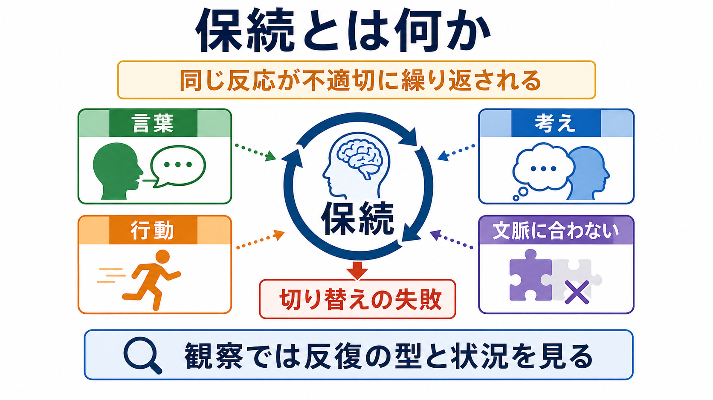
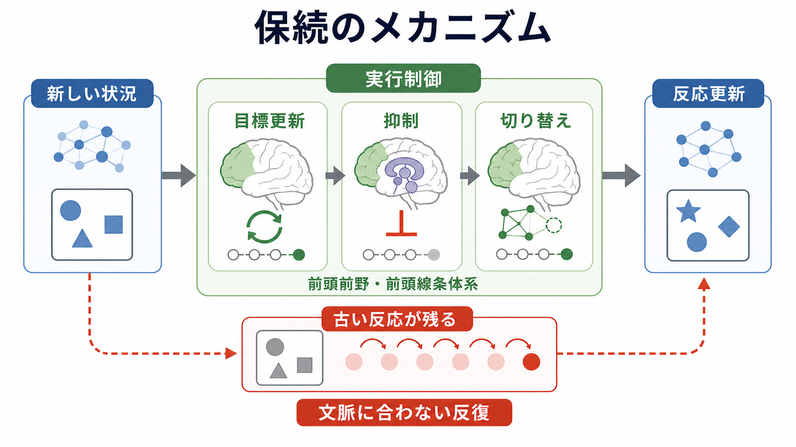
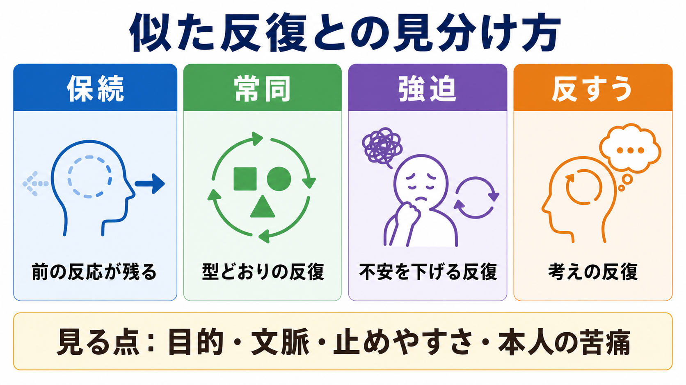

# 保続とは何か

## 要点

- 保続とは、以前は適切だった反応が、状況が変わった後も不適切に繰り返される現象である。
- 「同じ言葉を繰り返す」「同じ考えから離れられない」「同じ行動を続ける」など、言語・思考・運動・行為の水準で観察される。
- 保続は単一の病名ではなく、[[精神症候学とは何か|精神症候学]]、[[失語とは何か|失語]]、[[実行機能障害とは何か|実行機能障害]]、神経疾患、認知症、精神疾患の評価で横断的に問題になる症候である。
- 評価では「反復しているか」だけでなく、反復の型、文脈とのずれ、止めやすさ、本人の自覚・苦痛、背景疾患を分けて見る。

## この記事で答える問い

- 保続とは、単なる「しつこさ」や「こだわり」と何が違うのか。
- どのような型に分けると観察しやすいのか。
- 前頭葉、前頭線条体系、実行制御とはどう関係するのか。
- 臨床面接や神経心理検査では、何に注意して記述すればよいのか。

## まず結論

保続は、「前の反応が、次の文脈に入り込む」現象として捉えると理解しやすい。たとえば、最初の質問に対して「はい」と答えた後、次の質問では別の答えが必要なのに、再び「はい」と答え続ける。あるいは、描画課題で同じ線や形を必要以上に描き続ける。問題は、反復そのものではなく、文脈が変わっても反応を更新できない点にある。

古典的な神経心理学では、保続は一つの現象ではなく、少なくとも「セットの切り替えに失敗する保続」「前の反応が侵入する反復性保続」「運動や発話が止まりにくい連続性保続」に分けて考えられてきた[1]。この分類は完全な最終回答ではないが、観察記述を粗くしないための実用的な足場になる。

## 背景

保続は、神経心理学、精神医学、言語聴覚療法、老年医学で長く扱われてきた症候である。特に前頭葉損傷、認知症、失語、頭部外傷などでは、課題の切り替え、反応抑制、言語産出、習慣化した行動の調整がうまくいかず、保続として現れることがある[2][3]。

ただし、「保続があるから前頭葉障害である」と短絡してはいけない。前頭葉病変で目立つことは多いが、保続は課題設計、注意、記憶、言語障害、動機づけ、疲労、せん妄、薬剤、環境の影響でも増える。神経心理検査での保続は、病巣の単純な局在サインというより、複数の認知過程がどこで詰まっているかを示す観察所見として扱うのが安全である[4]。

## 基本概念

保続の中心は「反復」と「不適切な持続」である。日常の反復は、練習、習慣、確認、儀式、作業手順として適応的に働くことがある。保続では、状況が変わったにもかかわらず、前の反応をやめる、選び直す、更新することが難しくなる。

臨床的には、次のような水準で観察される。

| 水準 | 例 | 観察の焦点 |
|---|---|---|
| 言語 | 同じ単語、句、答えを繰り返す | 質問が変わっても同じ返答が残るか |
| 思考 | 同じ主題や連想から離れにくい | 内容が文脈に沿って更新されるか |
| 運動 | 同じ線、動作、手順を続ける | 指示終了後も動きが続くか |
| 行動 | 同じ確認、同じ道具操作を繰り返す | 目的が達成された後も続くか |

Sandson と Albert は、保続を「ある刺激や課題が終わった後にも、前の反応が不適切に繰り返されること」として整理し、機序の違いに応じた下位分類を示した[1]。この視点では、保続は単に「同じことをする人」という性格記述ではなく、刺激、課題、反応、時間経過の関係として記述する。

## 仕組み

保続を支える機序としてよく挙げられるのは、[[実行機能とは何か|実行機能]]のうち、目標更新、反応抑制、[[認知的柔軟性とは何か|認知的柔軟性]]、セットシフティングの障害である。新しい文脈に入ったとき、脳は「いま何をすべきか」を更新し、不要になった反応を抑制し、別の反応に切り替える必要がある。この過程が弱くなると、古い反応が残りやすくなる。

前頭前野と[[大脳基底核ループとは何か|前頭線条体系]]は、この切り替えや抑制に関わる重要なネットワークである。前頭葉損傷後の保続や、Wisconsin Card Sorting Test などで観察されるセット維持・切り替えの失敗は、この実行制御の障害として議論されてきた[2][5]。

一方で、すべての保続を「前頭葉の抑制障害」だけで説明するのは狭すぎる。失語における語の保続では、言語選択、音韻・語彙検索、反応履歴の影響が関わる。認知症では、意味記憶、注意、作業記憶、遂行機能が重なって保続が増えることがある[6][7]。したがって、保続は「どの水準の反応が、どの文脈で、どのくらい残るのか」を分けて考える必要がある。

## 図解

保続を観察するときは、似た反復現象との区別が重要である。とくに[[常同行動とは何か|常同行動]]、[[強迫観念とは何か|強迫観念]]・[[強迫行為とは何か|強迫行為]]、反すう、迂遠、脱線、注意障害と混同しやすい。

| 現象 | 中心となる特徴 | 保続との見分け方 |
|---|---|---|
| 保続 | 前の反応が新しい文脈に残る | 直前の課題や発話との連続性を見る |
| 常同行動 | 型どおりの反復が続く | 文脈変化より、反復パターンの固定性が目立つ |
| 強迫行為 | 不安や違和感を下げるための反復 | 本人の抵抗感、苦痛、儀式性を確認する |
| 反すう | 同じ考えを繰り返し考える | 思考内容の持続、気分との関係を見る |
| 迂遠・脱線 | 話が遠回り・横道にそれる | 前反応の侵入か、連想の広がりかを分ける |

## 臨床・研究との接続

面接では、「保続あり」とだけ書くより、観察事実を短く具体化する方が有用である。たとえば「質問が変わっても直前の回答語を3回繰り返す」「五角形模写で一辺を何度もなぞり続ける」「課題終了の合図後も同じ手順を続ける」のように、反復の対象、回数、誘発条件、修正可能性を書く。

失語臨床では、保続は発話の流暢性や命名だけでなく、治療反応にも関係する。Treatment of Aphasic Perseveration などの介入研究は、保続を単なる随伴症状ではなく、言語治療で扱える標的として検討してきた[6]。ただし、個別の介入選択は言語機能、病変、認知機能、疲労、コミュニケーション環境を含む専門評価に基づく。

認知症研究では、アルツハイマー病などで言語性・行動性の保続が観察され、意味記憶や実行機能の低下と結びつけて検討されている[7]。臨床では、保続が本人の「わざと」「性格」と誤解されると、周囲の対応が厳しくなりやすい。教育・支援では、反復を責めるよりも、刺激を減らす、手順を区切る、合図を明確にする、休息を入れるといった環境調整を検討する。

## よくある誤解

**誤解1: 保続は強迫症と同じである。**  
強迫症では、不安や違和感を下げるための強迫行為、本人の抵抗感、苦痛、侵入的な強迫観念が中心になる。保続では、前の反応が文脈に合わなくなっても残る点が中心であり、本人が明確な目的や不安低減のために行っているとは限らない。

**誤解2: 保続は前頭葉障害だけで起こる。**  
前頭葉・前頭線条体系は重要だが、保続は失語、認知症、注意障害、記憶障害、せん妄、薬剤、疲労でも増える。局在よりも、どの課題でどの反応が残るかを記述する必要がある[4]。

**誤解3: 同じことを繰り返せばすべて保続である。**  
反復には、習慣、練習、確認、常同、強迫、反すう、文化的儀礼、単なる聞き返しも含まれる。保続と呼ぶには、文脈変化に対する反応更新の失敗が観察されるかを確認する。

**誤解4: 保続は本人の努力不足である。**  
保続は、反応を止める・切り替える・選び直す認知制御の問題として理解されることが多い。本人の意図だけで説明すると、症候の背景にある神経心理学的問題を見落とす。

## 関連ノート

- [[精神症候学とは何か]]
- [[MSEで思考過程をどう評価するか]]
- [[失語とは何か]]
- [[実行機能とは何か]]
- [[実行機能障害とは何か]]
- [[認知的柔軟性とは何か]]
- [[大脳基底核ループとは何か]]
- [[強迫観念とは何か]]
- [[強迫行為とは何か]]

MOC更新候補: `content/00_MOC/` 配下の精神医学・認知機能・神経心理学関連 MOC に追加候補。ただし並列生成ジョブとの競合を避けるため、本記事では MOC 本体を更新しない。

## 理解チェック

1. 保続を「単なる反復」と区別するとき、どの文脈情報を見るべきか。
2. 言語性保続、思考の保続、運動性保続では、観察記述はどう変わるか。
3. 強迫行為、常同行動、反すうと保続を分けるとき、本人の目的・苦痛・抵抗感はどのように役立つか。
4. 保続を前頭葉障害だけに還元すると、どのような見落としが起こるか。

## 未解決問題

- 保続の下位分類は臨床記述には有用だが、神経機序と一対一に対応するとは限らない。
- 課題中の保続、日常生活上の保続、会話中の保続を、同じ尺度でどこまで比較できるかは慎重に扱う必要がある。
- 保続を減らす介入では、本人の努力を求めるだけでなく、合図、環境、課題負荷、疲労、言語障害を含む多因子的な設計が必要である。

## 参考文献

[1] Sandson, J., & Albert, M. L. (1984). Varieties of perseveration. *Neuropsychologia, 22*(6), 715-732. https://doi.org/10.1016/0028-3932(84)90098-8

[2] Sandson, J., & Albert, M. L. (1987). Perseveration in behavioral neurology. *Neurology, 37*(11), 1736-1741. https://doi.org/10.1212/WNL.37.11.1736

[3] Vilkki, J. (1989). Perseveration in memory for figures after frontal lobe lesion. *Neuropsychologia, 27*(8), 1101-1104. https://doi.org/10.1016/0028-3932(89)90189-9

[4] Alvarez, J. A., & Emory, E. (2006). Executive function and the frontal lobes: A meta-analytic review. *Neuropsychology Review, 16*(1), 17-42. https://doi.org/10.1007/s11065-006-9002-x

[5] Milner, B. (1963). Effects of different brain lesions on card sorting: The role of the frontal lobes. *Archives of Neurology, 9*(1), 90-100. https://doi.org/10.1001/archneur.1963.00460070100010

[6] Helm-Estabrooks, N., Emery, P., & Albert, M. L. (1987). Treatment of aphasic perseveration (TAP) program. *Archives of Neurology, 44*(12), 1253-1255. https://doi.org/10.1001/archneur.1987.00520240039012

[7] Pekkala, S., Albert, M. L., Spiro, A., & Erkinjuntti, T. (2008). Perseveration in Alzheimer's disease. *Dementia and Geriatric Cognitive Disorders, 25*(2), 109-114. https://doi.org/10.1159/000112476
