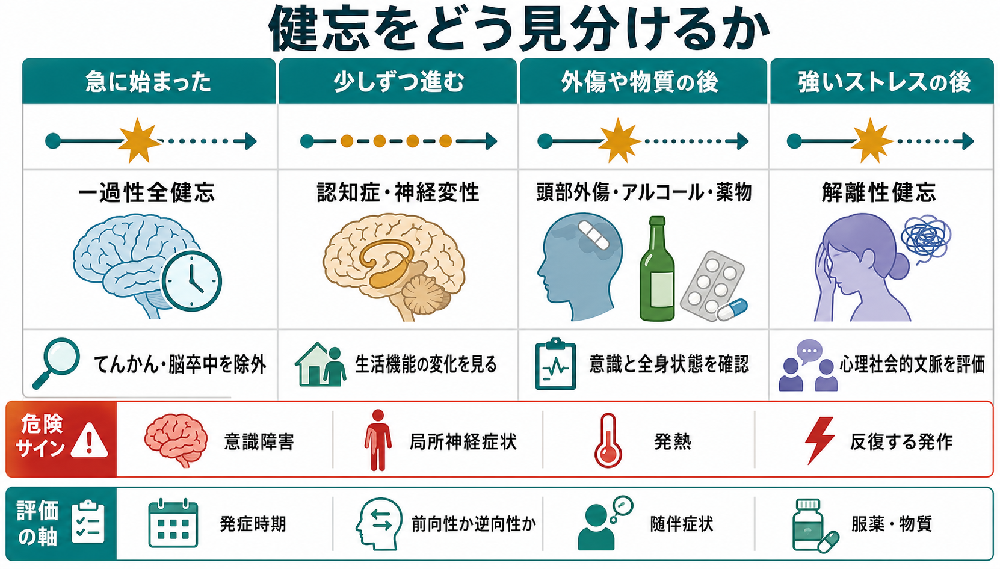
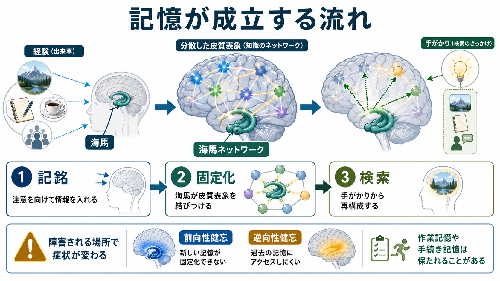
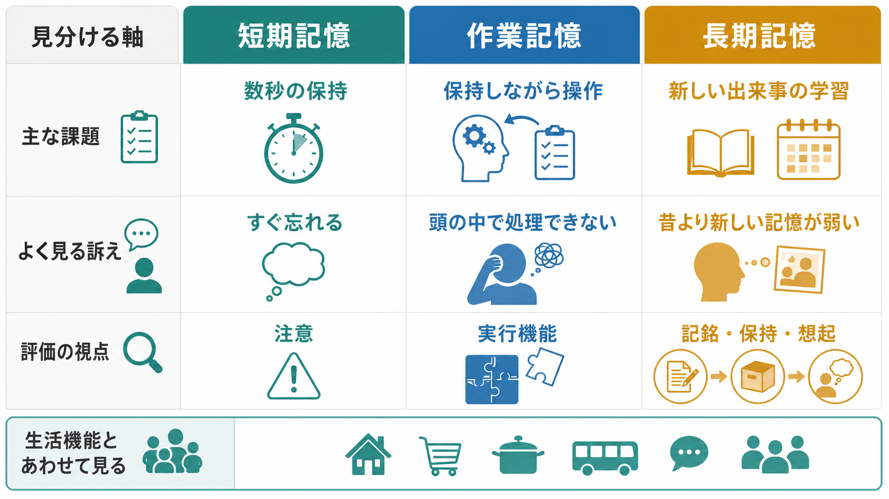

# 健忘とは何か

## 要点

- 健忘とは、過去の経験を思い出せない、または新しい記憶を形成しにくい状態を指す。単なる「忘れっぽさ」ではなく、[[記銘・保持・想起は何が違うのか|記銘・保持・想起]]のどこかが障害された状態として見ると理解しやすい[1]。
- **前向性健忘**は、発症後に新しい出来事を覚えにくい状態である。**逆向性健忘**は、発症前の出来事を思い出しにくい状態である[1]。
- 健忘は、頭部外傷、脳卒中、てんかん、脳炎、低酸素、アルコール関連障害、薬物、神経変性、強い心理的ストレスなど、複数の原因で起こる[1]。
- 宣言的記憶の障害では、海馬を含む内側側頭葉、間脳、前脳基底部、関連する皮質ネットワークが重要になる[1][2]。
- 医療・精神医学的には、発症時期、経過、前向性か逆向性か、意識障害や局所神経症状の有無、服薬・物質使用、心理社会的背景を分けて評価する。

## この記事で答える問い

- 健忘は、普通の物忘れや[[認知機能低下はどのように評価するのか|認知機能低下]]と何が違うのか。
- 前向性健忘・逆向性健忘とは何か。
- 健忘では、どの記憶過程と脳システムが問題になりやすいのか。
- 臨床・研究では、健忘をどのように見分け、どのような限界に注意するのか。

## まず結論

健忘は、「頭の中の記憶ファイルが消えた」というより、経験を記憶として利用できる形にする過程、時間をかけて安定させる過程、手がかりから再構成する過程のどこかが障害された状態である。したがって、健忘を理解するには、[[長期記憶とは何か|長期記憶]]の分類と、[[記憶の固定化とは何か|記憶の固定化]]、検索、注意、意識状態を分けて考える必要がある。

特に重要なのは、前向性健忘と逆向性健忘の区別である。前向性健忘では「いま起きていることを後で思い出せる形に残す」ことが難しく、逆向性健忘では「すでに経験した出来事へアクセスする」ことが難しい。両者はしばしば併存するが、障害される範囲、経過、原因、残りやすい記憶システムは同じではない[1][2]。

## 背景

健忘は、[[精神症候学とは何か|精神症候学]]と神経心理学の両方にまたがる症候である。患者が「覚えていない」と述べる場合でも、少なくとも三つの可能性がある。第一に、そもそも注意が向いておらず記銘されていない。第二に、記銘されたが固定化や保持が不十分である。第三に、記憶痕跡は部分的に残っているが、現在の文脈から検索できない。

この区別は臨床的に重要である。意識障害、せん妄、強い不安、うつ状態、睡眠不足、薬物、身体疾患では、記憶そのものより注意や覚醒の問題が前面に出ることがある。一方、海馬・内側側頭葉・間脳の障害では、新しい宣言的記憶の形成が目立って障害されることがある[1][2]。

歴史的には、Scoville と Milner による両側海馬領域切除後の症例報告が、海馬を含む内側側頭葉が新しい記憶の保持に重要であることを示した古典的研究として位置づけられる。この研究では、重い前向性健忘と一部の逆向性健忘が生じる一方、人格、一般知能、初期の記憶、技術的技能は相対的に保たれることが示された[3]。

## 基本概念

### 前向性健忘

前向性健忘とは、原因となる出来事や発症時点の後に、新しい情報や出来事を記憶として保持しにくい状態である[1]。たとえば、同じ質問を何度もする、少し前に説明された内容を思い出せない、病室に来た人を覚えていない、といった形で見える。

これは「短期記憶がゼロになる」という意味ではない。会話の最中だけなら情報を保持できることもあるし、作業手順や技能学習が部分的に保たれることもある。典型的には、エピソード記憶や事実記憶のような宣言的記憶が障害されやすい[1][2]。

### 逆向性健忘

逆向性健忘とは、原因となる出来事や発症前の経験を思い出しにくい状態である[1]。頭部外傷の直前の出来事を覚えていない、数日前から数年分の出来事が抜けている、個人的な自伝的記憶の一部にアクセスできない、という形で現れる。

逆向性健忘では、発症直前の記憶ほど失われやすく、古い記憶ほど保たれやすいことがある。これは、記憶が時間とともに皮質ネットワークへ統合されるという固定化の考え方と関係する。ただし、すべての逆向性健忘が同じ法則に従うわけではなく、脳損傷、てんかん、解離、神経変性などで様相は異なる。

### 一過性・持続性・進行性

健忘は時間経過でも分類できる。頭部外傷や一過性全健忘では一過性の経過をとることがある。脳炎、低酸素、心停止後、重い両側内側側頭葉障害などでは持続的な健忘が残ることがある。アルツハイマー病などの神経変性疾患では、記憶障害が進行性に広がることがある[1]。

一過性全健忘は、突然の前向性健忘と一時的な逆向性健忘を特徴とし、しばしば同じ質問の反復を伴う。典型例では自己意識は保たれ、発作は通常 1-24 時間で改善し、局所神経症状を伴わない[4]。ただし、非典型的な症状がある場合には脳卒中、てんかん、脳炎などの鑑別が必要である。

## 仕組み

記憶は単一の倉庫ではなく、複数のシステムからなる。意識的に思い出せる宣言的記憶には海馬と関連する内側側頭葉ネットワークが深く関わる。一方、技能、習慣、条件づけ、情動学習には線条体、小脳、扁桃体など別のシステムも関与する[2]。このため、重い健忘があっても、すべての学習が同じように失われるわけではない。

健忘を過程で見ると、少なくとも次の三段階がある。

| 過程 | 内容 | 障害されたときの見え方 |
|---|---|---|
| 記銘 | 注意を向け、情報を記憶として利用できる形に入れる | その場で聞いたことが後に残らない |
| 固定化 | 海馬が分散した皮質表象を結びつけ、時間をかけて安定させる | 新しい出来事が長期記憶になりにくい |
| 検索 | 手がかりから記憶を再構成する | 手がかりがないと思い出せない、文脈で成績が変わる |

内側側頭葉の研究では、海馬、嗅内皮質、周嗅皮質、海馬傍皮質が協調して記憶を支えると考えられている。海馬だけが単独で「記憶の保管場所」なのではなく、刺激の特徴、文脈、時間、場所、意味を結びつけるネットワークの要として働く[5]。

## 図解

健忘を見分けるときは、「どの時点から」「どの種類の記憶が」「どの経過で」「どの随伴症状とともに」障害されているかを見る。特に、急性発症、意識障害、局所神経症状、発熱、けいれん、頭部外傷、薬物・アルコール関連、低栄養、重い心理的ストレスは、別々の評価軸として扱う必要がある[1][4][6]。

## 臨床・研究との接続

臨床では、健忘は診断名というより症候である。評価では、本人の訴えだけでなく、家族や支援者からの情報、生活機能、服薬、物質使用、身体疾患、神経診察、認知検査、必要に応じた画像検査や脳波検査を組み合わせる[1][6]。[[認知機能検査は何を測っているのか|認知機能検査]]は有用だが、検査得点だけで原因を確定できるわけではない。

解離性健忘では、通常の物忘れでは説明しにくい重要な自伝的情報、しばしば外傷や強いストレスに関連する情報を思い出せないことが問題になる。DSM-5-TR に基づく診断では、症状による苦痛や機能障害があり、薬物、神経疾患、外傷性脳損傷、てんかん、認知症、PTSD などでよりよく説明されないことを確認する[6]。これは[[解離とは認知科学的に何か|解離]]の一部として理解できるが、神経学的原因の除外を省略してよいという意味ではない。

研究では、健忘は記憶システムを分ける自然実験として重要である。両側内側側頭葉損傷の症例、側頭葉てんかん、外傷後健忘、一過性全健忘、コルサコフ症候群、神経変性疾患の比較により、記憶が単一能力ではなく複数の脳システムと過程からなることが明らかにされてきた[2][3][5]。

## よくある誤解

### 健忘は「記憶が完全に消える」ことである

健忘では、記憶が完全に消える場合だけでなく、検索できない、文脈が合わない、固定化が不十分、注意が入らなかった、という場合がある。思い出せないことは、ただちに痕跡が存在しないことを意味しない。

### 健忘があれば必ず認知症である

健忘は認知症でもみられるが、頭部外傷、てんかん、一過性全健忘、薬物、低酸素、感染、代謝異常、解離などでも起こる[1][4][6]。経過が急性か慢性か、進行性か一過性か、他の認知領域や生活機能がどう変化しているかを見る必要がある。

### 海馬がすべての記憶を保存している

海馬は新しい宣言的記憶の形成や文脈結合に重要だが、技能、習慣、情動学習、条件づけなどには別のシステムも関わる[2]。そのため、海馬関連の健忘では、出来事を思い出せない一方で、ある種の技能学習が保たれることがある。

### 解離性健忘は演技か、逆に必ず外傷記憶が正確に戻るものだ

どちらも単純化である。解離性健忘では本人が意図的にだましているとは限らない一方、回復した記憶の正確さは外部証拠なしに断定できない。臨床では、安全性、苦痛、生活機能、神経学的鑑別、心理社会的文脈を慎重に扱う[6][7]。

## 関連ノート

- [[精神症候学とは何か]]
- [[症状と徴候は何が違うのか]]
- [[記銘・保持・想起は何が違うのか]]
- [[長期記憶とは何か]]
- [[記憶の固定化とは何か]]
- [[認知機能検査は何を測っているのか]]
- [[認知機能低下はどのように評価するのか]]
- [[解離とは認知科学的に何か]]

## MOC更新候補

- `content/00_MOC/` 配下の精神医学、認知科学、記憶、症候学に関する MOC があれば、本ノートへのリンクを追加候補とする。
- 並列ジョブとの競合を避けるため、本タスクでは MOC 本体は更新しない。

## 理解チェック

1. 前向性健忘と逆向性健忘は、それぞれどの時点の記憶に関わるか。
2. 健忘を「記銘・固定化・検索」に分けると、臨床評価で何が見えやすくなるか。
3. 海馬が障害されても、技能学習や作業中の情報保持が相対的に保たれることがあるのはなぜか。
4. 急に始まった健忘で、意識障害や局所神経症状がある場合、なぜ一過性全健忘だけで説明してはいけないのか。
5. 解離性健忘を考えるとき、神経学的原因の除外と心理社会的文脈の評価が両方必要なのはなぜか。

## 未解決問題

- 健忘で失われたように見える記憶が、どの程度「保存の障害」なのか「検索の障害」なのかを個別例で切り分けることは難しい。
- 一過性全健忘の機序は、片頭痛、静脈うっ滞、てんかん、心理的要因など複数仮説があるが、単一の説明にはまとまっていない[4]。
- 解離性健忘における記憶回復の正確性、再構成、暗示、外部証拠の関係は慎重な扱いが必要である[7]。

## 参考文献

[1] Merck Manual Professional Edition. *Amnesias*. Reviewed/Revised Modified Sept 2025. https://www.merckmanuals.com/professional/neurologic-disorders/function-and-dysfunction-of-the-cerebral-lobes/amnesias

[2] Squire, L. R. (2004). Memory systems of the brain: A brief history and current perspective. *Neurobiology of Learning and Memory*, 82(3), 171-177. https://doi.org/10.1016/j.nlm.2004.06.005

[3] Scoville, W. B., & Milner, B. (1957). Loss of recent memory after bilateral hippocampal lesions. *Journal of Neurology, Neurosurgery & Psychiatry*, 20(1), 11-21. https://doi.org/10.1136/jnnp.20.1.11

[4] Nehring, S. M., Spurling, B. C., & Kumar, A. (2024). *Transient Global Amnesia*. StatPearls. NCBI Bookshelf. https://www.ncbi.nlm.nih.gov/books/NBK442001/

[5] Squire, L. R., Wixted, J. T., & Clark, R. E. (2007). Recognition memory and the medial temporal lobe: A new perspective. *Nature Reviews Neuroscience*, 8, 872-883. https://doi.org/10.1038/nrn2154

[6] Merck Manual Professional Edition. *Dissociative Amnesia*. https://www.merckmanuals.com/en-ca/professional/psychiatric-disorders/dissociative-disorders/dissociative-amnesia?media=full

[7] Merck Manual Consumer Version. *Dissociative Amnesia*. Reviewed/Revised Jun 2025; Modified Jul 2025. https://www.merckmanuals.com/home/mental-health-disorders/dissociative-disorders/dissociative-amnesia
