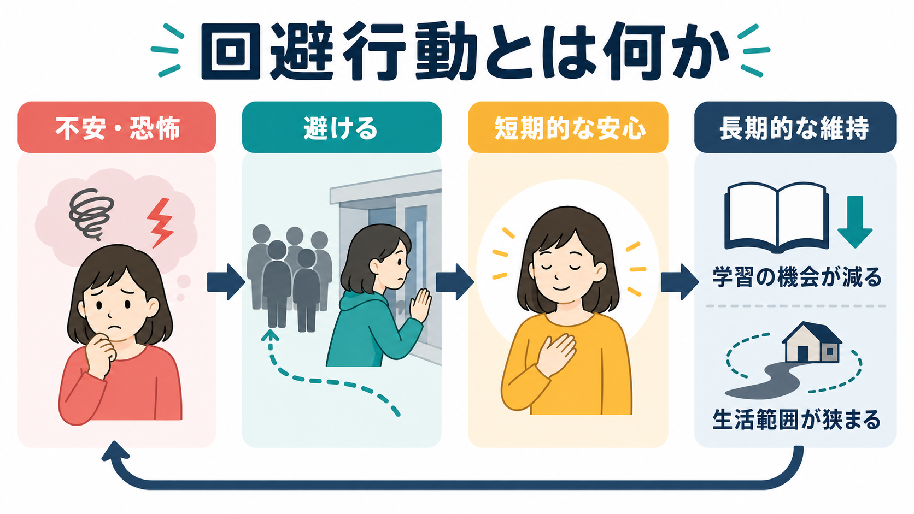
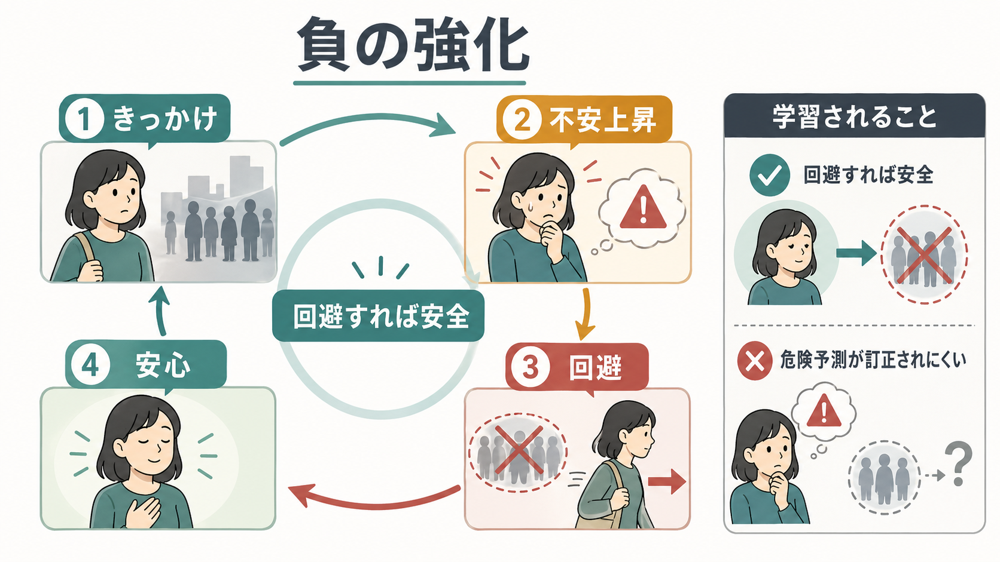

# 回避行動とは何か

## 要点

- 回避行動とは、[[不安とは何か|不安]]や[[恐怖とは何か|恐怖]]を下げるために、恐れている状況・場所・記憶・身体感覚・対人場面などに近づかない行動である。
- 回避は短期的には苦痛を下げるため、本人にとって合理的に見える。しかし、その安心が「避ければ安全」という学習を強め、次の回避を起こしやすくする[1][2]。
- 回避が続くと、「実際には何が起きたか」「不安が上がっても自然に下がるか」「対処できるか」を試す機会が減る。そのため危険予測が訂正されにくい[3]。
- 回避行動、逃避行動、安全行動は重なり合うが、始まる前に避ける、途中で離れる、安全策を足す、という時間軸で区別すると理解しやすい[4][5]。
- この記事は教育・研究目的の整理であり、個別の診断や治療指示ではない。

## この記事で答える問い

1. 回避行動は、単なる「逃げ」ではなく、どのような学習として理解できるのか。
2. なぜ回避は短期的に楽なのに、長期的には不安や生活制限を維持しうるのか。
3. 回避行動、逃避行動、安全行動はどのように違うのか。
4. 臨床や研究では、回避をどのような観点から評価するのか。

## まず結論

回避行動の中心は、苦痛の低下そのものではなく、**苦痛が下がった直後に「避けたから助かった」と学習されること**である。たとえば、発表が怖い人が発表を避けると、その日は安心する。しかし同時に、「発表しても大丈夫だった」「不安は上がっても下がった」「多少うまくいかなくても対処できた」という反証経験は得られない。

このため回避は、[[強化とは何か|強化]]の観点では負の強化として説明される。嫌な感覚や予期された危険が取り除かれることで、その行動が次に起こりやすくなる[1][2]。したがって、回避行動を理解するには、本人の意志の弱さではなく、[[オペラント条件づけとは何か]]、[[古典的条件づけとは何か]]、[[恐怖条件づけとは何か]]、予測誤差、生活上の機能障害を一緒に見る必要がある。

## 背景

回避は、多くの不安・恐怖関連症状に共通する行動パターンである。社会的場面を避ける、外出範囲を狭める、確認を繰り返してからでないと行動できない、身体感覚が出そうな運動を避ける、トラウマを想起させる場所や会話を避ける、といった形で現れる。

歴史的には、回避学習は Mowrer らの二要因説と結びつけて説明されてきた。第一に、刺激と恐怖が結びつく古典的条件づけが起こる。第二に、その刺激から離れる行動が恐怖を減らすため、負の強化によって維持される[1]。この枠組みは単純化も含むが、回避が「不安を下げるから続く」という基本構造を理解するうえで有用である。

現代の曝露療法研究では、単に不安が下がることよりも、恐れていた結果が起きないこと、または起きても対処できることを学ぶ抑制学習が重視される[3]。回避はこの学習機会を減らすため、不安の維持因子になりやすい。

## 基本概念

### 回避行動

回避行動は、恐れている状況に入る前に、その状況そのものを避ける行動である。例として、人前で話す予定を断る、電車に乗らない、病気が怖くて検査結果を見ない、トラウマを思い出す場所に近づかない、などがある。

回避の特徴は、苦痛を「経験する前」に下げられる点である。そのため本人は強い安心を得るが、同時に、恐れていた場面が実際にはどれほど危険だったのかを確かめる機会を失う。

### 逃避行動

逃避行動は、すでに入った状況から途中で離れる行動である。会議中に強い動悸を感じて退室する、混雑した場所で不安が上がってすぐ帰る、会話中に恥ずかしさが強くなって席を外す、などが含まれる。

逃避も短期的には不安を下げる。しかし、苦痛のピークを越えた後に自然に下がる経験や、その場に残っても破局的結果が起きない経験が得られにくい。

### 安全行動

安全行動は、恐れている状況に入りながら、不安や破局を防ぐために付け加える行動である。出口の近くに座る、水や薬を必ず持つ、会話前に何度も原稿を確認する、相手の反応を過剰に監視する、身体感覚を何度も確認する、といった形をとる。

安全行動は一見すると適応的に見える。実際、急性の危険がある場面では安全確保は必要である。ただし、危険が過大評価されている場面では、「安全行動があったから大丈夫だった」と解釈され、場面そのものの安全性や自分の対処能力が学ばれにくくなる[4][5]。

## 仕組み

### 1. 苦痛の低下が行動を強める

回避行動の最も重要な仕組みは負の強化である。負の強化とは、不快な刺激や状態が取り除かれることで、その直前の行動が増えることである。回避では、不安、緊張、身体感覚、破局的イメージ、恥ずかしさなどが一時的に減るため、「避ける」という行動が強くなる[1][2]。

ここで重要なのは、本人が意識的に「回避を増やそう」と考えていなくても、安心のタイミングが学習を作る点である。安心は強い報酬として働き、次に似た場面が来たときに同じ行動を選びやすくする。

### 2. 危険予測が訂正されにくくなる

不安が維持されるのは、恐怖反応があるからだけではない。恐れている予測が検証されないことも大きい。たとえば、「人前で赤面したら軽蔑される」と予測して発表を避けると、その予測が正しいかどうかは試されない。

抑制学習の観点では、曝露で重要なのは「不安をゼロにすること」ではなく、「予測した破局が起きない」「不安があっても行動できる」「複数の文脈で安全学習を取り出せる」といった新しい学習である[3]。回避は、その新しい学習を始める前に状況を閉じてしまう。

### 3. 注意と解釈が狭くなる

回避が続くと、注意は危険の手がかりに偏りやすい。避けるべきものを探す必要があるため、身体感覚、他者の表情、失敗の兆候、出口、逃げ道などが過剰に目立つ。すると、曖昧な情報が危険の証拠として解釈されやすくなる。

この過程は、[[予期不安とは何か]]や[[パニック発作とは何か]]と結びつく。予期不安では「また起きるかもしれない」という未来予測が現在の行動を狭める。パニック発作では、身体感覚が危険のサインとして解釈されることで、さらなる不安を呼びやすい。

### 4. 生活範囲が狭まる

回避の長期的な問題は、症状の強さだけではなく、生活範囲の縮小にある。最初は一つの場所や活動だけを避けていても、似た場面へ一般化すると、外出、仕事、学業、対人関係、余暇、受診、睡眠などに影響が広がる。

このため臨床評価では、「どれほど不安が強いか」だけでなく、「何を避けているか」「避けることで何を失っているか」「本人にとって大切な活動がどの程度制限されているか」を見る必要がある。これは[[精神症候学とは何か]]で扱う症状評価にも通じる。

## 図解

回避行動は、似た行動と混同されやすい。次の図は、回避行動、逃避行動、安全行動を時間軸と学習効果から区別するための補助図である。

| 行動 | 典型的なタイミング | 例 | 短期的な効果 | 長期的なリスク |
|---|---|---|---|---|
| 回避行動 | 状況に入る前 | 発表を断る、電車に乗らない | 不安を感じる場面を回避できる | 危険予測が検証されない |
| 逃避行動 | 状況の途中 | 会議を途中退室する、混雑から離れる | 不安が急に下がる | 不安が自然に下がる経験を得にくい |
| 安全行動 | 状況の前・中 | 出口確認、過剰な準備、身体確認 | 行動への足場になることがある | 「安全策があったから大丈夫」と学習される |
| 接近行動 | 状況に段階的に入る | 小さな範囲で試す | 一時的に不安が上がることがある | 予測と結果のずれを学べる |

## 臨床・研究との接続

### 社交不安と安全行動

NICE の社交不安症ガイドラインでは、成人の評価で、恐れている社会的状況、避けている状況、不安症状、自己像、安全希求行動、注意の焦点などを詳しく把握することが推奨されている[6]。これは、社会的状況そのものよりも、「何を恐れ、何を避け、どの安全行動で持ちこたえているか」が症状維持を理解する鍵になるためである。

### PTSD と回避

PTSD では、トラウマ関連の思考・感情や外的手がかりの回避が診断基準上も重要な症状群として扱われる。米国退役軍人省の National Center for PTSD は、DSM-5-TR の成人 PTSD 基準でも回避症状が必要条件として残っていることを整理している[7]。ただし、これは診断基準の説明であり、個別の診断は専門的評価を要する。

この点は、[[PTSDでは恐怖記憶ネットワークに何が起きているのか]]と接続できる。トラウマ関連の記憶や手がかりを避けることは短期的な苦痛を下げる一方で、現在の安全と過去の危険を区別する学習を妨げうる。

NICE の PTSD ガイドラインも、PTSD の認識・評価・治療を扱ううえで、不安、睡眠、集中困難などの症状と生活の質を改善することを目的に据えており、回避を単独の行動ではなく症状群と機能障害の文脈で見る必要がある[8]。

### 強迫症と回避

[[強迫観念とは何か]]や[[強迫行為とは何か]]でも、回避は重要である。汚染が怖くて触らない、確認できない状況に行かない、特定の数字や言葉を避ける、といった行動は、強迫観念による不安を下げる。しかし、強迫行為や回避によって安心が得られると、「確認しないと危険」「洗わないと耐えられない」という予測が残りやすい。

### 研究での扱い

研究では、回避は質問紙、行動課題、日常生活記録、生理指標、曝露課題中の行動観察などで測定される。安全行動に関するレビューやメタ分析では、安全行動が曝露中の学習を妨げる可能性が指摘される一方、使用条件や段階的な減らし方によって効果が変わる可能性も議論されている[4][5]。したがって、「安全行動は常に悪い」と単純化するより、「どの学習を助け、どの学習を妨げているか」を見るほうが精密である。

## よくある誤解

### 誤解1: 回避は本人の弱さである

回避は、苦痛を下げるために学習された行動である。弱さや怠けだけで説明すると、なぜ同じ行動が繰り返されるのか、なぜ似た場面に広がるのかを見落とす。行動の機能を見れば、回避は「その場を切り抜けるためには役立ったが、長期的には生活を狭めることがある行動」として理解できる。

### 誤解2: 避けなければすぐ治る

急に回避をやめることが常に有効とは限らない。不安や危険が現実にある場面では安全確保が必要であり、強い症状がある場合には専門的支援のもとで段階や環境を調整する必要がある。この記事で述べるのは、回避が維持因子になりうるという一般的な仕組みであって、自己判断で急に曝露を行う指示ではない。

### 誤解3: 安全行動はすべて悪い

安全行動は、行動への足場になる場合もある。一方で、安全行動がなければ何もできない、または安全行動のおかげで破局が起きなかったと解釈される場合には、学習を妨げることがある[4][5]。重要なのは、行動そのものに善悪を貼ることではなく、その行動が何を可能にし、何の検証を妨げているかを見ることである。

### 誤解4: 不安が下がれば回避は解決する

不安の低下は重要だが、それだけでは不十分なことがある。回避を減らすうえで重要なのは、不安があっても行動できること、恐れていた結果が起きないこと、起きても対処できることを学ぶことである[3]。その意味で、回避行動の理解は[[行動変容はどのように起こるのか]]ともつながる。

## 関連ノート

- [[不安とは何か]]
- [[恐怖とは何か]]
- [[予期不安とは何か]]
- [[パニック発作とは何か]]
- [[強迫観念とは何か]]
- [[強迫行為とは何か]]
- [[精神症候学とは何か]]
- [[古典的条件づけとは何か]]
- [[オペラント条件づけとは何か]]
- [[強化とは何か]]
- [[恐怖条件づけとは何か]]
- [[行動変容はどのように起こるのか]]
- [[PTSDでは恐怖記憶ネットワークに何が起きているのか]]

MOC更新候補: `content/00_MOC/MOC｜学習・行動・動機づけ.md`、精神医学・症候学関連のMOC、認知行動療法関連のMOC。並列ジョブとの競合を避けるため、本記事ではMOC本体は更新しない。

## 理解チェック

1. 回避行動が負の強化で維持される、とはどういう意味か。
2. 回避行動と逃避行動を、時間軸でどう区別できるか。
3. 安全行動が役立つ場合と、学習を妨げる場合の違いは何か。
4. 回避によって失われる「学習の機会」とは、具体的に何か。
5. 臨床評価で、症状の強さだけでなく生活範囲を見る必要があるのはなぜか。

## 参考文献

[1] Krypotos, A.-M., Effting, M., Kindt, M., & Beckers, T. (2015). Avoidance learning: A review of theoretical models and recent developments. *Frontiers in Behavioral Neuroscience*, 9, 189. https://doi.org/10.3389/fnbeh.2015.00189

[2] Pittig, A., Treanor, M., LeBeau, R. T., & Craske, M. G. (2018). The role of associative fear and avoidance learning in anxiety disorders: Gaps and directions for future research. *Neuroscience & Biobehavioral Reviews*, 88, 117-140. https://doi.org/10.1016/j.neubiorev.2018.03.015

[3] Craske, M. G., Treanor, M., Conway, C. C., Zbozinek, T., & Vervliet, B. (2014). Maximizing exposure therapy: An inhibitory learning approach. *Behaviour Research and Therapy*, 58, 10-23. https://doi.org/10.1016/j.brat.2014.04.006

[4] Blakey, S. M., & Abramowitz, J. S. (2016). The effects of safety behaviors during exposure therapy for anxiety: Critical analysis from an inhibitory learning perspective. *Clinical Psychology Review*, 49, 1-15. https://doi.org/10.1016/j.cpr.2016.07.002

[5] Meulders, A., Van Daele, T., Volders, S., & Vlaeyen, J. W. S. (2016). The use of safety-seeking behavior in exposure-based treatments for fear and anxiety: Benefit or burden? A meta-analytic review. *Clinical Psychology Review*, 45, 144-156. https://doi.org/10.1016/j.cpr.2016.02.002

[6] National Institute for Health and Care Excellence. (2013, updated 2024). *Social anxiety disorder: recognition, assessment and treatment* (Clinical guideline CG159). https://www.nice.org.uk/guidance/cg159/chapter/recommendations

[7] National Center for PTSD, U.S. Department of Veterans Affairs. (2024). *PTSD and DSM-5*. https://ptsd.va.gov/PTSD/professional/treat/essentials/dsm5_ptsd.asp

[8] National Institute for Health and Care Excellence. (2018). *Post-traumatic stress disorder* (NICE Guideline NG116). https://www.ncbi.nlm.nih.gov/books/NBK542453/
