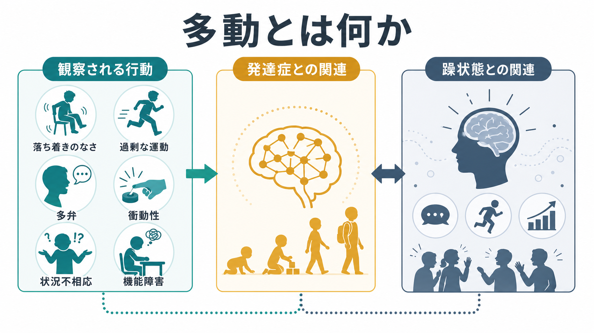
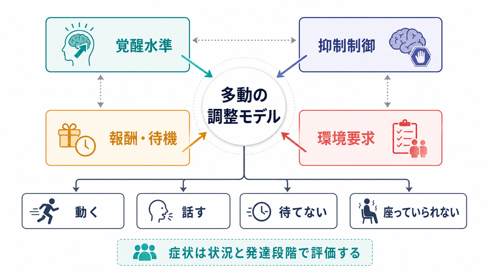
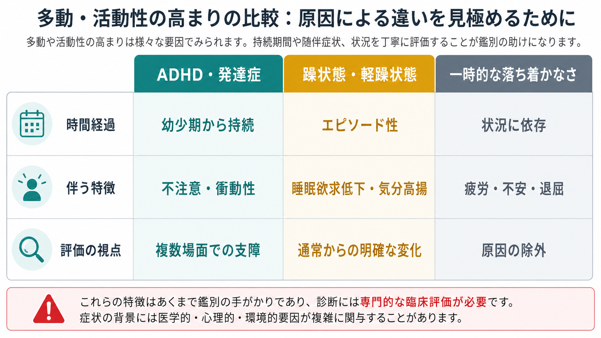

# 多動とは何か

## 要点

- 多動とは、単に「よく動く」ことではなく、年齢、発達段階、場面の要求に比べて、動き・発話・落ち着きのなさ・待てなさが過剰にみえ、学業、仕事、対人関係、安全に影響する状態を指す。
- ADHDでは、多動は不注意・衝動性と並ぶ中核症状の一群であり、幼少期から複数場面で持続すること、6か月以上続くこと、機能障害を伴うことが重視される[1][2]。
- 躁状態・軽躁状態では、多動は「いつもの性格」ではなく、気分の高揚または易怒性、睡眠欲求低下、多弁、観念奔逸、目標志向性活動の増加などとまとまって、エピソード性に出現する[5][6]。
- 多動を評価するときは、発達症、躁状態、[[焦燥とは何か]]、[[過覚醒とは何か]]、睡眠不足、物質・薬剤、身体疾患、環境負荷を区別する必要がある。
- 本稿は教育・研究目的の整理であり、個別の診断や治療指示ではない。

## この記事で答える問い

1. 多動は、通常の活発さや落ち着かなさと何が違うのか。
2. ADHDなどの発達症における多動は、どのように評価されるのか。
3. 躁状態・軽躁状態でみられる活動性の増加は、ADHDの多動とどこが違うのか。
4. 臨床・研究では、多動をどのように観察し、どのような誤解を避けるべきか。

## まず結論

多動は、観察される行動だけで決まる症状ではない。重要なのは、「どの場面で」「いつから」「どの程度」「何を妨げているか」である。授業中に席を立つ、会話で話しすぎる、待つことが難しい、手足をそわそわ動かす、静かに遊べない、仕事中にじっとしていられない、といった行動は多動の手がかりになりうる。しかし、それだけでは診断名は決まらない。

ADHDにおける多動は、発達早期から続く神経発達症の症状として、不注意や衝動性とともに評価される。CDCやNIMHの解説では、ADHD症状は小児期に始まり、複数の状況で頻繁に現れ、社会・学校・仕事の機能を妨げることが診断上重要だとされる[1][2]。NICEも、ADHDを年齢や発達水準に比べて過剰な多動・衝動性・不注意で特徴づけられる不均質な状態として説明している[3]。

一方、躁状態の多動は、通常からの明確な変化として出現する。DSM-5以降の躁エピソードでは、気分変化に加えて活動性またはエネルギーの増加が中心に置かれ、睡眠欲求低下、多弁、思考の加速、[[観念奔逸とは何か]]、リスク行動などとまとまって評価される[5][7]。そのため、同じ「よく動く」「話し続ける」でも、幼少期から持続しているのか、数日から1週間以上のエピソードとして急に変化したのかで意味が大きく変わる。

## 背景

多動は、日常語では「活発」「落ち着きがない」「じっとできない」と表現されることが多い。小児では走り回る、よじ登る、授業中に席を離れる、順番を待てないといった形で目立ちやすい。成人では、外から見える走り回りよりも、内的な落ち着かなさ、予定を詰め込みすぎる、会話量が多い、会議中に身体を動かし続ける、休むことに強い苦手さがある、といった形で現れることがある[1][2]。

臨床的には、多動は「症状名」であって「診断名」ではない。ADHD、双極症の躁状態・軽躁状態、不安、せん妄、物質使用、薬剤性のアカシジア、睡眠不足、疼痛、甲状腺機能亢進など、さまざまな背景で多動に見える行動が起こりうる。したがって、[[症状と徴候は何が違うのか]]で扱うように、本人の訴え、周囲からの観察、時間経過、機能障害、身体・薬剤要因を統合して読む必要がある。

## 基本概念

### 多動は「活動量」と「制御」の問題としてみる

多動は、活動量が多いことだけではない。活動を場面に合わせて調整する力、待つ力、止める力、発話を相手の反応に合わせる力が関わる。たとえば、運動場で走ることは状況に合っているが、静かに待つ必要がある場面で立ち歩くことは、環境要求との不一致として問題になりやすい。

この意味で、多動は[[注意障害とは何か]]や[[実行機能障害とは何か]]と重なりやすい。不注意があると、今すべきことに注意を保ちにくくなる。抑制制御が弱いと、思いついた行動や発話を止めにくくなる。報酬を待つことが苦手だと、すぐに動く、割り込む、次の刺激を探す行動が増えやすい。

### ADHDにおける多動

ADHDでは、多動・衝動性の症状として、そわそわする、席を離れる、不適切な場面で走る・登る、静かに遊べない、常に動いているように見える、過度に話す、質問が終わる前に答える、順番を待てない、他人に割り込むなどが挙げられる[1][2]。ただし、診断上は症状数だけでなく、6か月以上続くこと、発達水準に比べて不相応であること、複数場面でみられること、機能障害を伴うことが重視される[1][3]。

ADHDの多動は、年齢とともに見え方が変わる。小児では身体的な動きとして目立ちやすいが、青年期・成人期では「内的な落ち着かなさ」「休めない感じ」「多弁」「予定や活動の過剰な詰め込み」として残ることがある[1][2]。この変化を見落とすと、成人のADHDを単なる性格や忙しさとして片づけてしまう。

### 躁状態における活動性の増加

躁状態・軽躁状態では、多動は気分・睡眠・思考・行動の全体的な変化の一部として現れる。典型的には、睡眠欲求が低下しても疲れを感じにくい、話し続ける、考えが次々に飛ぶ、活動計画が急に増える、浪費や危険行動が増える、誇大感が強まる、といった変化と結びつく[5][6]。これは[[躁状態とは何か]]や[[軽躁状態とは何か]]で扱う、エピソード性の気分症状として理解するとよい。

ADHDとの違いは、時間経過にある。ADHDでは幼少期からの持続性と複数場面での一貫性が重要であるのに対し、躁状態では「普段の本人からの明確な変化」と「数日から1週間以上のエピソード性」が重要になる[5][7]。ただし、ADHDと双極症は併存しうるため、どちらか一方に単純化しないことも重要である。

## 仕組み

多動の仕組みは、単一の脳部位や単一の心理過程では説明できない。近年のADHD総説では、ADHDは遺伝的要因、環境相関、神経認知機能、脳構造・機能の小さな差異、併存症、機能障害が重なった不均質な状態として整理されている[4]。多動もその一部であり、次のような複数の調整過程の相互作用として捉えると理解しやすい。

| 観点 | 多動へのつながり | 例 |
|---|---|---|
| 覚醒水準 | 低すぎても高すぎても、活動や刺激探索で調整しようとする | 退屈な課題で席を動く、不安時にそわそわする |
| 抑制制御 | 行動や発話を止める力が弱いと、割り込みや立ち歩きが増える | 順番を待てない、思いついたことをすぐ言う |
| 報酬・待機 | 遅い報酬より即時の刺激に引かれやすい | 長い説明を待てず別の活動に移る |
| 環境要求 | 場面が静止・待機・長時間集中を求めるほど目立つ | 授業、会議、待合室で困難が増える |
| 気分・睡眠 | 躁状態や睡眠不足では活動性が急に増える | 眠らず活動し続ける、多弁になる |

このモデルは、症状を「本人の意志の弱さ」とみなすためのものではない。むしろ、どの調整過程が、どの環境で、どの時間経過で破綻しているのかを観察するための枠組みである。たとえば、ADHDでは発達早期からの抑制制御・注意調整・報酬待機の難しさが問題になりやすい。一方、躁状態では気分、睡眠、エネルギー、目標志向性活動のエピソード性変化が前景化する。

## 図解

本記事の3枚の図は、次の意図で配置している。

1枚目は、多動を「観察される行動」「発達症との関連」「躁状態との関連」に分けて示す概念地図である。2枚目は、多動を覚醒水準、抑制制御、報酬・待機、環境要求の相互作用として整理する。3枚目は、ADHD・発達症、躁状態・軽躁状態、一時的な落ち着かなさを、時間経過、伴う特徴、評価の視点で比較する。

## 臨床・研究との接続

### 評価の入口

多動を評価するときは、まず安全と緊急性を確認する。激しい興奮、攻撃性、自傷他害リスク、せん妄、物質中毒、重い睡眠不足、身体疾患が疑われる場合は、単なる多動ではなく急性の評価対象になる。[[意識障害とは何か]]や[[せん妄とは何か]]と重なる場合、注意障害や見当識障害が前景化することがある。

次に、時間経過を確認する。幼少期から一貫しているのか、最近急に変わったのか、数時間単位で揺れるのか、数日から週単位のエピソードなのかを見る。ADHD評価では、複数場面からの情報、保護者・教師・本人の報告、併存症や代替原因の評価が推奨される[8]。躁状態では、睡眠欲求低下、気分高揚または易怒性、活動性増加、思考・発話の加速、リスク行動をまとまりとして見る[5][6]。

### MSEでの観察

精神状態診察では、多動を「落ち着きがない」とだけ書かず、観察可能な行動に分けて記述する。たとえば、着席保持、姿勢変化、手足の動き、発話量、割り込み、質問への反応、待機困難、視線、課題持続、指示理解、疲労の有無を具体的に見る。[[焦燥とは何か]]では内的緊張や苦痛が前景化しやすいが、ADHDの多動では必ずしも苦痛感が中心ではない。躁状態では、本人が快調と感じる一方で、周囲からは活動過多や危険行動として観察されることがある。

### 研究上の扱い

研究では、多動は評価尺度、行動観察、活動量計、課題成績、保護者・教師・本人報告などで測定される。ADHD研究では、多動・衝動性は不注意と分けて扱われることも、合わせて症状次元として扱われることもある。Nature Reviews Disease Primersの総説は、ADHDを多様な症状、機能障害、神経認知プロファイル、併存症をもつ不均質な発達症として整理しており、多動も単一メカニズムではなく多次元的に理解する必要がある[4]。

躁状態研究では、活動性・エネルギー増加が診断基準上の中心性を増している。CANMAT/ISBDガイドラインは、DSM-5で躁エピソードの基準Aに「活動またはエネルギーの増加」が加わった点を踏まえ、急性躁状態の評価と管理を整理している[5]。このことは、多動を単なる周辺症状ではなく、気分エピソードの構造を理解する手がかりとして扱う必要があることを示している。

## よくある誤解

### 誤解1: 多動は元気な子どものことだ

活発さは病的とは限らない。問題になるのは、発達段階や場面の要求に比べて過剰であり、複数場面で持続し、本人や周囲の生活機能を妨げる場合である[1][3]。遊び場で走ることと、授業・道路・診察室などで危険や支障が生じるほど制御しにくいことは区別する。

### 誤解2: 成人には多動は残らない

成人では、走り回るよりも内的な落ち着かなさ、過度な活動、話しすぎ、休めなさとして現れることがある[1][2]。したがって、小児期の典型像だけを基準にすると、成人の困難を見落としやすい。

### 誤解3: 多動があればADHDである

多動はADHDの重要な症状だが、ADHDに特異的ではない。躁状態、[[過覚醒とは何か]]、不安、[[せん妄とは何か]]、薬剤性アカシジア、物質使用、睡眠不足、身体疾患でも多動に見える行動は起こりうる。診断では、発症時期、持続期間、複数場面性、併存症、代替原因を確認する[1][8]。

### 誤解4: 躁状態の多動とADHDの多動は同じである

両者は重なる行動表現をもつが、時間経過と随伴症状が異なる。ADHDでは発達早期からの持続性が重視される。躁状態では、通常からの明確な変化、睡眠欲求低下、気分高揚または易怒性、目標志向性活動の増加、思考・発話の加速、リスク行動がまとまって出る[5][6]。

### 誤解5: 多動は本人の努力不足である

多動は、注意、抑制、覚醒、報酬、睡眠、気分、環境要求が絡んだ症状として理解する方が臨床的に有用である。道徳的に評価すると、支援可能な要因が見えにくくなる。教育・職場・家庭では、環境調整、課題の分割、休憩の設計、睡眠・身体状態の確認、専門的評価への接続が検討点になる。

## 関連ノート

- [[注意障害とは何か]]
- [[実行機能障害とは何か]]
- [[焦燥とは何か]]
- [[過覚醒とは何か]]
- [[躁状態とは何か]]
- [[軽躁状態とは何か]]
- [[観念奔逸とは何か]]
- [[思考促迫とは何か]]
- [[精神運動制止とは何か]]
- [[せん妄とは何か]]

### MOC更新候補

- 並列ジョブとの衝突を避けるため、本タスクではMOC本体は更新しない。
- バッチ統合時に、`content/00_MOC/` 配下の精神医学・症候学・発達症・双極症関連MOCへ本記事リンクの追加を検討する。

### 関連ノート候補

- ADHDとは何か
- 発達症とは何か
- 衝動性とは何か
- アカシジアとは何か
- 多弁とは何か
- 目標志向性活動とは何か
- 睡眠欲求低下とは何か

## 理解チェック

1. 多動を「活動量が多い」だけでなく、「発達段階」「場面要求」「機能障害」から評価する必要があるのはなぜか。
2. ADHDにおける多動と躁状態における活動性増加を、時間経過の観点からどう区別するか。
3. 成人の多動が小児の多動と違って見える例を2つ挙げられるか。
4. 多動に見える状態で、焦燥、過覚醒、せん妄、薬剤性アカシジアを鑑別に入れる理由は何か。
5. MSEで「落ち着きがない」と書く代わりに、どのような観察項目を具体的に記述できるか。

## 参考文献

[1] Centers for Disease Control and Prevention. (2024). *Diagnosing ADHD*. https://www.cdc.gov/adhd/diagnosis/index.html

[2] National Institute of Mental Health. *Attention-Deficit/Hyperactivity Disorder: What You Need to Know*. https://www.nimh.nih.gov/health/publications/attention-deficit-hyperactivity-disorder-what-you-need-to-know

[3] National Institute for Health and Care Excellence. (2018). *Attention deficit hyperactivity disorder: diagnosis and management, NG87: Context*. https://www.nice.org.uk/guidance/NG87/chapter/context

[4] Faraone, S. V., Bellgrove, M. A., Brikell, I., Cortese, S., Hartman, C. A., Hollis, C., Newcorn, J. H., Philipsen, A., Polanczyk, G. V., Rubia, K., Sibley, M. H., & Buitelaar, J. K. (2024). Attention-deficit/hyperactivity disorder. *Nature Reviews Disease Primers*, 10, 11. https://doi.org/10.1038/s41572-024-00495-0

[5] Yatham, L. N., Kennedy, S. H., Parikh, S. V., et al. (2018). Canadian Network for Mood and Anxiety Treatments and International Society for Bipolar Disorders 2018 guidelines for the management of patients with bipolar disorder. *Bipolar Disorders*, 20(2), 97-170. https://doi.org/10.1111/bdi.12609

[6] Dailey, M. W., & Saadabadi, A. (2023). *Mania*. In *StatPearls*. StatPearls Publishing. https://www.ncbi.nlm.nih.gov/books/NBK493168/

[7] National Center for Biotechnology Information. *DSM-IV to DSM-5 Manic Episode Criteria Comparison*. https://www.ncbi.nlm.nih.gov/books/NBK519712/table/ch3.t7/

[8] Wolraich, M. L., Hagan, J. F., Allan, C., et al. (2019). Clinical practice guideline for the diagnosis, evaluation, and treatment of attention-deficit/hyperactivity disorder in children and adolescents. *Pediatrics*, 144(4), e20192528. https://doi.org/10.1542/peds.2019-2528

## 未解決問題

- ADHDの多動・衝動性を、生活場面での実時間データ、本人報告、周囲の観察、神経認知課題からどう統合して評価するのが最も妥当か。
- 躁状態の活動性増加と、発達症由来の慢性的な多動が併存する場合、エピソード性変化をどの指標で最も鋭敏に捉えられるか。
- 多動を「減らす」だけでなく、学習・仕事・対人関係の機能に結びつけて支援する環境設計はどのように個別化できるか。
