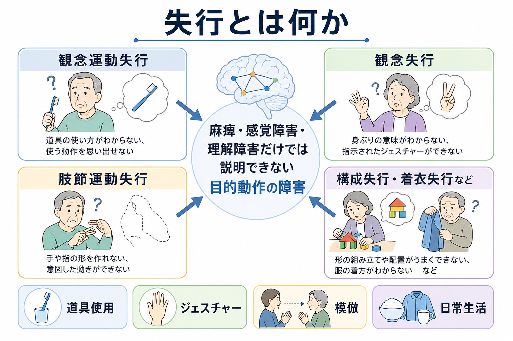
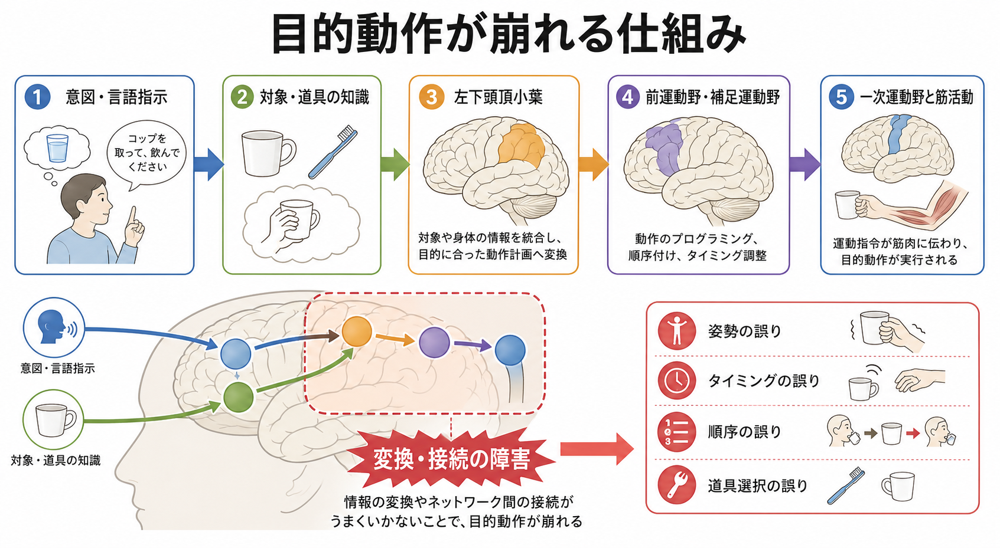
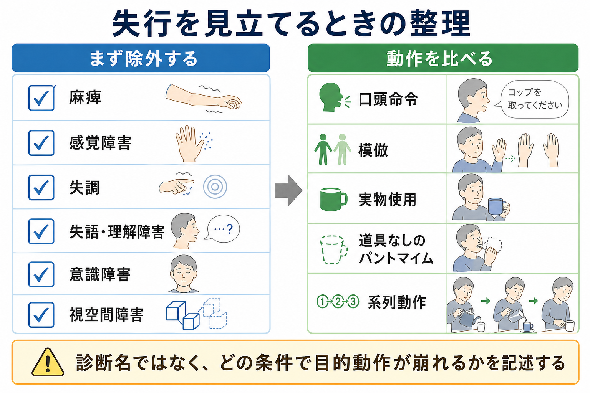

# 失行とは何か

## 要点

- 失行とは、麻痺、感覚障害、失調、理解障害、意識障害だけでは説明できない、学習された目的動作の障害である[1][2]。
- 典型例は「歯ブラシを持てるし筋力もあるのに、歯を磨く動作を命令や模倣でうまく行えない」「道具の系列的使用が崩れる」「手指の姿勢やジェスチャーがぎこちない」といった形で現れる[2][3]。
- 分類には観念運動失行、観念失行、肢節運動失行、構成失行、着衣失行、口腔顔面失行、発語失行などがあるが、文献間で定義が完全には統一されていない[1][2]。
- 神経心理学的には、目的、対象・道具知識、身体図式、視空間処理、左頭頂葉から前運動野へ至る行為ネットワークの変換・接続障害として理解できる[2][4]。
- 臨床では「失行あり」と名づけるだけでなく、どの入力条件、どの動作、どの誤り型で崩れるかを記述することが重要である[5][6]。
- 本稿は教育・研究目的の概説であり、個別の診断や治療指示を行うものではない。

## この記事で答える問い

- 失行は単なる不器用さや麻痺と何が違うのか。
- 観念運動失行、観念失行、肢節運動失行などはどう区別されるのか。
- 目的動作が崩れるとき、脳内ではどのような変換過程が問題になるのか。
- 臨床・研究では失行をどのように観察し、評価し、記述するのか。

## まず結論

失行は、筋力や感覚の一次的な障害ではなく、「何をしたいか」を「どの身体部位を、どの順序・方向・タイミングで動かすか」へ変換する行為システムの障害である。したがって、同じ人でも、自発動作ではできるが口頭命令ではできない、実物を持つとできるが道具なしのパントマイムでは崩れる、模倣ではできるが系列的な道具使用で失敗する、というように条件依存的に現れる[2][5]。

この点で、失行は[[運動ネットワークは随意運動をどう生み出すのか|随意運動]]だけの問題でも、[[認知機能障害とは何か|認知機能障害]]一般だけの問題でもない。意図、道具知識、身体表象、空間処理、運動プログラムが交差する症候であり、[[精神症候学とは何か|精神症候学]]では「症状名」よりも観察条件と誤り型を丁寧に記述することが要点になる。

## 背景

日常生活の多くは、単なる筋収縮ではなく、学習された行為のまとまりから成り立っている。歯を磨く、鍵を開ける、服を着る、手を振る、コップで水を飲むといった動作では、身体部位の選択、対象物の意味、道具の機械的性質、系列的な手順、文脈に合った目標が統合される。

失行が重要なのは、この統合が崩れると、筋力が保たれていても生活機能が大きく損なわれるためである。脳卒中後の上肢失行はADLの自立度や障害度に影響しうることが指摘されており、認知症、パーキンソニズム、外傷性脳損傷、腫瘍、精神疾患圏の一部でも観察される[1][7]。また、失行は[[失認とは何か|失認]]、失語、注意障害、視空間障害、せん妄などと併存しやすく、観察が粗いと「わざとしない」「理解していない」「不器用なだけ」と誤解されやすい。

## 基本概念

### 定義

最小限の定義は、「学習された、または目的をもつ動作を、麻痺・感覚障害・失調・理解障害・協力不良だけでは説明できない形で実行できない状態」である[1][2]。この定義には二つの含意がある。

第一に、失行は除外診断的な観察を必要とする。筋力低下、錐体路徴候、感覚低下、小脳性失調、視覚障害、失語による命令理解障害、[[意識障害とは何か|意識障害]]、[[注意障害とは何か|注意障害]]があれば、動作失敗の原因は一つに決められない。第二に、失行は「できるか、できないか」だけでなく、「どの条件で崩れるか」を見る症候である。口頭命令、模倣、実物使用、写真提示、道具なしのパントマイム、系列動作を比べることで、障害されている水準が見えやすくなる[5][6]。

### 代表的な分類

| 分類 | 典型的な現れ | 見立ての焦点 |
|---|---|---|
| 観念運動失行 | 指示された身ぶり、道具使用のパントマイム、模倣がぎこちない | 行為の概念と運動出力の接続、姿勢・方向・タイミング |
| 観念失行 | 道具の選択や系列的使用が崩れる | 行為全体の概念、道具知識、手順 |
| 肢節運動失行 | 手指の細かい運動が拙劣で、なめらかさを欠く | 熟練運動の出力パターン、巧緻性 |
| 構成失行 | 図形模写やブロック構成が崩れる | 視空間構成、部分と全体の配置 |
| 着衣失行 | 衣服の向き、袖通し、身体との対応づけが崩れる | 身体図式、視空間処理、系列化 |
| 口腔顔面失行・発語失行 | 舌・口唇・発声の随意的制御や音の系列化が崩れる | 口腔顔面運動、発話運動プログラム |

ただし、この表は固定的な診断体系ではない。失行の下位分類は文献ごとに幅があり、観念失行と概念性失行、発語失行と失語、構成失行と視空間障害の境界は研究・臨床文脈によって異なる[1][2]。したがって、分類名は「観察を整理する見出し」として使い、実際には課題条件、誤り型、併存症候を記述する。

### 誤り型

失行で見られる誤りには、空間的誤り、時間的誤り、内容誤り、系列誤り、身体部位を道具の代わりに使う誤り、保続、脱落、過剰運動などがある[5][6]。たとえば「櫛で髪をとかすふり」を求めたとき、手の向きが逆になる、髪ではなく空中をなぞる、手指を櫛そのもののように使う、別の道具動作に置き換わる、途中で止まる、といった形で現れる。

この誤り型は、[[症状と徴候は何が違うのか|徴候]]として観察できる。一方で、本人が「やり方はわかるのに手が思うように動かない」と訴える場合には主観的な困難も含まれる。どちらか一方だけで判断せず、本人の訴え、行動観察、神経学的診察、認知機能評価を合わせて読む必要がある。

## 仕組み

目的動作は、おおまかに次の変換として考えられる。

1. 意図や命令を理解する。
2. 対象物や道具の意味、使い方、身体との関係を取り出す。
3. 身体部位の姿勢、方向、軌道、順序、タイミングへ変換する。
4. 前運動野・補足運動野・一次運動野を介して筋活動として実行する。
5. 視覚、体性感覚、結果のフィードバックで修正する。

この流れのどこが障害されるかで、症候の見え方が変わる。左下頭頂小葉は、道具・対象・身体の情報を行為計画へ統合する重要な結節点としてしばしば論じられ、前運動野や補足運動野は動作プログラム、系列化、タイミング調整に関与する[2][4]。ただし、失行は一つの脳部位だけで決まる単純な局在症候ではない。側頭葉の意味知識、前頭葉の実行制御、基底核・運動系、白質連絡、左右半球の相互作用が関与するネットワーク症候として捉えるほうが実態に近い[2][4]。

Goldenberg は、失行を「運動制御の認知的側面」として捉え、無意味手姿勢の模倣、単一機械的道具の使用、道具使用のパントマイムといった課題では、視覚的特徴、身体部位、道具、対象を分節化し、組み合わせる能力が中核になると論じている[4]。この見方では、失行は「筋肉を動かす力」よりも、行為を意味ある構造へ分け、再結合する認知運動変換の障害である。

一方、認知症では、道具知識や意味記憶、視空間処理、実行機能の低下が加わるため、失行はより複合的になる。アルツハイマー病では構成失行、着衣失行、観念運動失行、観念失行が比較的早期から目立つことがあり、前頭側頭型認知症や皮質基底核変性症では経過や病変分布に応じて口腔顔面失行、歩行失行、肢節運動失行などが問題になる[7]。このため、[[認知機能低下はどのように評価するのか|認知機能低下の評価]]では、記憶や見当識だけでなく、行為の観察も重要になる。

## 図解

1枚目は、失行の全体像を「麻痺・感覚障害・理解障害だけでは説明できない目的動作の障害」として示した。観念運動失行、観念失行、肢節運動失行、構成失行・着衣失行などは、同じ失行という語の下に置かれるが、観察すべき課題と誤り型は異なる。

2枚目は、意図・言語指示、対象・道具知識、左下頭頂小葉、前運動野・補足運動野、一次運動野と筋活動の変換過程を示した。ここで強調したいのは、「命令を理解したか」「筋力があるか」だけでなく、情報を行為形式へ変換する過程が障害されうるという点である。

3枚目は、臨床での見立てを整理した。失行を疑うときは、まず麻痺、感覚障害、失調、失語・理解障害、意識障害、視空間障害を確認し、そのうえで口頭命令、模倣、実物使用、道具なしのパントマイム、系列動作を比べる。

## 臨床・研究との接続

### 観察の組み立て

失行の評価では、まず神経学的な運動・感覚所見を確認する。握力、筋トーヌス、片麻痺、感覚低下、視野障害、失調、不随意運動があれば、動作の失敗は失行だけでは説明できない。次に、[[MSEで認知機能をどう評価するか|MSEでの認知機能評価]]や言語理解、注意、覚醒水準を確認する。特に[[せん妄とは何か|せん妄]]や重度の注意障害では、課題の保持そのものが難しくなる。

そのうえで、同じ行為を条件を変えて比べる。たとえば「バイバイをしてください」という口頭命令、検者の手振りをまねる模倣、実際の道具を渡して使う実物使用、道具なしで使うふりをするパントマイム、歯磨きやお茶を入れるような系列動作を比較する。TULIA は上肢失行を標準化して評価する検査であり、Apraxia Screen of TULIA（AST）は短時間のベッドサイド評価を意図して作られた[5][6]。

### 鑑別の考え方

失行に似て見えるが別の問題として、次がある。

| 似て見える状態 | 主な違い |
|---|---|
| 麻痺 | 筋力低下や錐体路徴候が動作失敗を説明する |
| 失調 | 測定異常、企図振戦、協調運動障害が目立つ |
| 失語 | 命令理解、復唱、命名など言語機能の障害が中心になる |
| 失認 | 対象を認識できないため、道具使用が崩れる |
| 視空間障害 | 空間配置や左右、対象位置の把握が崩れる |
| 意識障害・注意障害 | 課題への持続的関与、保持、切り替えが困難になる |
| 抑うつ・陰性症状・意欲低下 | できないというより、開始や持続の動機づけが低い場合がある |

実際には、これらは併存する。したがって「失行か、失認か」と二分するより、対象認知、意味知識、身体表象、運動出力、注意、言語理解のどこに制約があるかを層状に記述するほうが臨床的である。[[鑑別診断とは何か|鑑別診断]]は、単一の正解名を選ぶ作業ではなく、観察された現象をもっともよく説明する仮説を比較する作業である。

### リハビリテーション・支援

失行への介入は、原因疾患、病変、併存障害、生活目標によって変わる。脳卒中後の上肢失行では、機能訓練、代償方略、認知訓練、日常生活動作の文脈での練習を組み合わせる研究が進められている[8]。ただし、個別の訓練内容や治療方針は専門職による評価に基づいて決める必要がある。

臨床記述としては、「失行あり」だけでは支援につながりにくい。たとえば「実物を渡すと改善する」「口頭命令より模倣がよい」「道具なしパントマイムで身体部位を道具として使う」「系列動作で順序が入れ替わる」と書くと、環境調整やリハビリ課題を設計しやすくなる。

## よくある誤解

### 誤解1: 失行は麻痺の軽い形である

失行は麻痺そのものではない。筋力や基本的な運動範囲が保たれていても、目的に合った姿勢、軌道、順序、道具使用が崩れる。もちろん麻痺と失行は併存しうるため、評価では両方を分けて見る。

### 誤解2: 本人が理解していないだけである

言語理解障害があれば命令課題は失敗しやすい。しかし、失行では理解が比較的保たれていても、模倣やパントマイム、道具使用で特有の誤りが出る。口頭命令だけで判断せず、実物使用や模倣を含めて比較する必要がある。

### 誤解3: 失行は一つの検査で決まる

TULIA や AST のような標準化評価は有用だが、失行は課題、文脈、道具、身体部位、併存症候に依存する。検査点だけでなく、日常生活でどの動作が危険・非効率・困難になるかを合わせて読む。

### 誤解4: 失行は認知症や脳卒中だけの問題である

脳卒中や認知症は重要な原因だが、外傷性脳損傷、腫瘍、パーキンソニズム、皮質基底核変性症、精神疾患圏のジェスチャー障害など、より広い文脈で問題になる[1][2][6][7]。ただし、疾患名と失行の関係を単純化しすぎず、実際の行為障害を観察することが重要である。

## 関連ノート

- [[精神症候学とは何か]]
- [[症状と徴候は何が違うのか]]
- [[認知機能障害とは何か]]
- [[MSEで認知機能をどう評価するか]]
- [[鑑別診断とは何か]]
- [[失認とは何か]]
- [[病態失認とは何か]]
- [[身体失認とは何か]]
- [[身体図式とは何か]]
- [[身体イメージとは何か]]
- [[意識障害とは何か]]
- [[注意障害とは何か]]
- [[せん妄とは何か]]
- [[運動ネットワークは随意運動をどう生み出すのか]]
- [[前頭頭頂ネットワークは認知制御をどう支えるのか]]
- [[視覚ネットワークはどのように階層的に情報処理するのか]]

## MOC更新候補

- [[MOC｜認知機能]] に、行為・ジェスチャー・道具使用の症候として追加候補。
- [[MOC｜脳・神経科学]] に、頭頂葉・前運動野・行為ネットワークの臨床神経心理ノートとして追加候補。
- [[MOC｜意識・自己・身体性]] に、身体図式・身体イメージ・身体失認との関連ノートとして追加候補。

## 理解チェック

1. 失行を疑う前に、どのような一次的な運動・感覚・認知の障害を確認する必要があるか。
2. 口頭命令では失敗するが実物使用では改善する場合、どのような仮説が考えられるか。
3. 観念運動失行と観念失行を、道具使用と系列動作の観点から説明するとどうなるか。
4. 失行を「左頭頂葉の障害」とだけ説明すると、どのような点を見落とすか。
5. 臨床記録で「失行あり」よりも有用な書き方はどのようなものか。

## 未解決問題

- 失行の下位分類は歴史的に多様であり、分類名と検査課題の対応が文献間で完全には統一されていない。
- 道具使用、模倣、パントマイム、系列動作、日常生活動作を同じ枠組みで評価する標準化はなお課題である。
- 失行と失語、失認、視空間障害、実行機能障害が併存する場合、どの症候が生活機能低下に最も寄与しているかを分離するのは難しい。
- リハビリテーションでは、検査上の改善が日常生活上の安全性や自立度へどの程度転移するかを慎重に検証する必要がある。

## 参考文献

[1] Gowda, S. N., Hodis, B., & Schneider, L. K. (2024). *Apraxia*. StatPearls. NCBI Bookshelf. https://www.ncbi.nlm.nih.gov/sites/books/NBK585110/

[2] Osiurak, F., & Rossetti, Y. (2017). Apraxia: Review and update. *Journal of Clinical Neurology, 13*(4), 317-324. https://doi.org/10.3988/jcn.2017.13.4.317

[3] Rumiati, R. I., & Tessari, A. (2016). The representation of objects in apraxia: From action execution to error awareness. *Frontiers in Human Neuroscience, 10*, 39. https://doi.org/10.3389/fnhum.2016.00039

[4] Goldenberg, G. (2013). *Apraxia: The cognitive side of motor control*. Oxford University Press. https://doi.org/10.1093/acprof:oso/9780199591510.001.0001

[5] Vanbellingen, T., Kersten, B., Van de Winckel, A., Bellion, M., Baronti, F., Müri, R., & Bohlhalter, S. (2011). A new bedside test of gestures in stroke: The apraxia screen of TULIA (AST). *Journal of Neurology, Neurosurgery & Psychiatry, 82*(4), 389-392. https://doi.org/10.1136/jnnp.2010.213371

[6] Bachofner, H., Scherer, K. A., Vanbellingen, T., Bohlhalter, S., Stegmayer, K., & Walther, S. (2022). Validation of the Apraxia Screen TULIA (AST) in schizophrenia. *Neuropsychobiology, 81*(4), 311-321. https://doi.org/10.1159/000523778

[7] Chandra, S. R., Issac, T. G., & Abbas, M. M. (2015). Apraxias in neurodegenerative dementias. *Indian Journal of Psychological Medicine, 37*(1), 42-47. https://doi.org/10.4103/0253-7176.150817

[8] Donkervoort, M., Dekker, J., Stehmann-Saris, J. C., & Deelman, B. G. (2001). Efficacy of strategy training in left hemisphere stroke patients with apraxia: A randomised clinical trial. *Neuropsychological Rehabilitation, 11*(5), 549-566. https://doi.org/10.1080/09602010042000093
