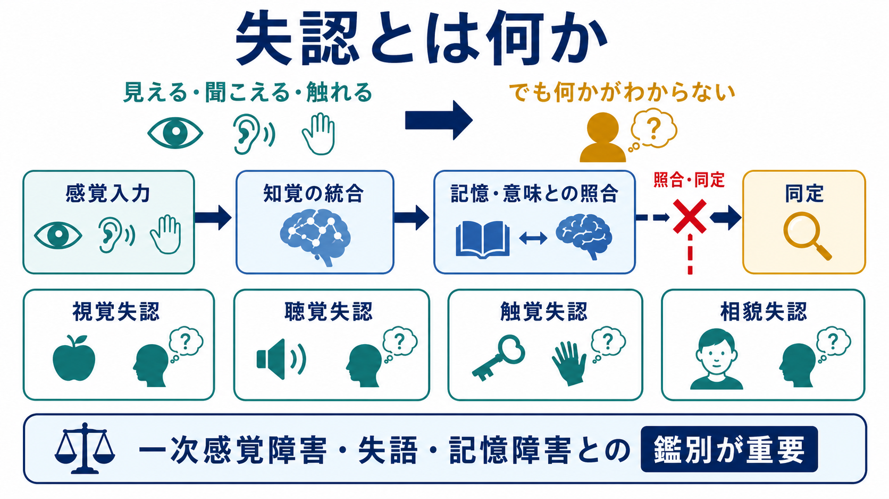
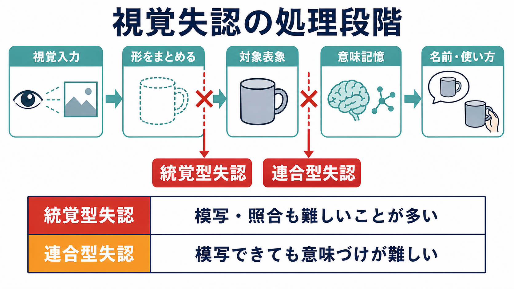

# 失認とは何か

## 要点

- 失認とは、視力・聴力・触覚などの一次感覚や意識水準が大きく保たれているにもかかわらず、対象・音・顔・触った物などを「それとして」認識できない症候である[1][2]。
- 典型例は「りんごが見えている、色や輪郭もある程度わかる。しかし、それが何で、何に使うものかがわからない」という状態である。
- 失認は単なる物忘れ、失語、注意障害、せん妄、一次感覚障害ではない。診断では、感覚入力、注意、言語、記憶、対象への親近性を切り分ける必要がある[1][2]。
- 視覚失認では、統覚型失認と連合型失認という古典的区別が有用である。前者は形のまとまりを作る段階、後者は知覚された形を意味記憶へ結びつける段階の障害として理解できる[3][4]。
- 臨床では原因疾患の評価と、環境調整・代償方略・作業療法や言語聴覚療法などが中心になる。特定の「失認そのものを治す薬」があるわけではない[2]。

## この記事で答える問い

1. 失認とは何を指す症候なのか。
2. 失認は、見えない・聞こえない・忘れた・言えない状態とどう違うのか。
3. 視覚失認では、認識のどの段階が障害されるのか。
4. 精神医学・神経心理学・認知神経科学では、失認をどのように評価し、どのような研究課題につなげるのか。

## まず結論

失認は、「感覚は届いているのに、意味ある対象として認識できない」状態である。したがって、失認を理解するには、脳が外界をただ写しているのではなく、感覚入力を統合し、過去の記憶や意味知識と照合し、名前・使い方・個体性へ結びつけていると考える必要がある[1][3]。

たとえば視覚失認では、目や一次視覚野だけの問題ではなく、形をまとめる処理、対象表象を作る処理、意味記憶へアクセスする処理、名前を出す処理のどこで障害が起きているかを切り分ける。これは[[視覚ネットワークはどのように階層的に情報処理するのか]]で扱う階層的な視覚処理と深く関係する。

## 背景

失認は、神経心理学において「認識とは何か」を考えるための重要な症候である。見えているにもかかわらず対象を認識できない、聞こえているにもかかわらず音の意味がわからない、触れているにもかかわらず物を同定できない、という症例は、知覚と意味記憶が単純に同じものではないことを示す。

臨床的には、失認は脳梗塞、外傷、腫瘍、変性疾患などで、頭頂葉・側頭葉・後頭葉を含む連合野の障害に関連して起こりうる[2]。ただし、失認は比較的まれであり、実際の評価では他の認知障害や感覚障害と混ざって見えることが多い。そのため、失認の有無だけでなく、どの感覚モダリティで、どの処理段階が、どの程度障害されているかを丁寧に見る必要がある。

精神医学の文脈では、失認は幻覚や妄想のような精神病症状とは異なるが、[[精神状態診察MSEとは何か]]で観察する認知・知覚・判断の領域と接点をもつ。認知症、せん妄、脳血管障害、薬剤性の認知変化などを考える場面では、[[鑑別診断とは何か]]の一部として「これは見えていないのか、注意が向いていないのか、名前が出ないのか、意味がわからないのか」を分けることが重要になる。

## 基本概念

### 失認の定義

失認は、対象を認識・同定できない症候であり、その障害は一次感覚障害、一般的な知能低下、注意障害、言語障害、記憶障害、刺激への不慣れだけでは説明されない[1]。この条件が重要である。単に視力が落ちている、聴力が落ちている、言葉で答えられない、名前を思い出せない、というだけでは失認とは呼ばない。

典型的には、障害は一つの感覚様式に比較的限局する。視覚では認識できないが、触ればわかる、音を聞けばわかる、使い方を説明されればわかる、というように、別の経路を使うと同定できる場合がある[1]。この「別の感覚ではわかる」という所見は、失認を一次感覚障害や全般的な意味記憶障害から区別する手がかりになる。

### 主な種類

| 種類 | 何が難しいか | 評価の例 |
|---|---|---|
| 視覚失認 | 見た対象を同定できない | 絵や実物の命名、照合、模写、別感覚での同定 |
| 聴覚失認 | 聞こえた音や声を認識できない | 環境音、言語音、音楽、声の識別 |
| 触覚失認 | 触った物を同定できない | 目を閉じて鍵や硬貨を触り、形・材質・名称を確認 |
| 相貌失認 | 顔から人物を同定できない | 有名人・家族・自分の顔の識別、髪型や声などの手がかりとの比較 |
| 同時失認 | 複数要素や全体場面を同時に把握しにくい | 複雑な絵、場面理解、読み書き、視覚探索 |

相貌失認は顔認知の選択的障害としてよく知られる。顔認知研究では、顔の不変的特徴、視線、表情、口の動きなどが分散した神経システムで処理されると考えられており、人物同定と社会的手がかりの処理が部分的に分かれることが示されている[6]。

### 統覚型失認と連合型失認

視覚失認では、古典的に統覚型失認と連合型失認が区別される[3][4]。

統覚型失認では、線や色などの局所的特徴はある程度見えていても、それらをまとまった形として統合することが難しい。模写、照合、異なる角度から見た同一物の判断が困難になりやすい。

連合型失認では、形としては比較的まとまって知覚でき、模写もできることがある。しかし、その形を過去の知識や意味記憶へ結びつけられないため、「何であるか」「何に使うか」がわからない。

## 仕組み

### 認識は段階的な処理である

対象認識は、感覚入力から名前を出すまでの単一路ではない。視覚を例にすると、網膜から一次視覚野へ入った情報は、輪郭、色、動き、奥行き、形、物体カテゴリ、意味、行為可能性などへ段階的に変換される。腹側視覚経路は物体や形の認識に、背側視覚経路は空間位置や行為制御に相対的に強く関わるという整理がある[5]。

この区別は、視覚失認を理解する助けになる。見たものを手でつかむ動作は比較的保たれるのに、何であるかを言えないことがある。逆に、物体の名称や意味を言えても、空間的な行為制御が障害されることもある。つまり、視覚は「見るための視覚」と「行為するための視覚」に分けて考える必要がある[5]。

### 意味記憶との照合

認識には、現在の知覚表象を、過去に学習した対象知識へ結びつける過程が含まれる。りんごを見て「赤い丸いもの」として知覚するだけでは不十分であり、それが食べ物で、果物で、切る・持つ・食べる対象であるという意味体系へアクセスする必要がある。

連合型失認で問題になるのは、この結びつきである。対象表象が十分に作られていても、それが意味記憶へ接続できなければ、見たものを「何か」として知ることができない[3]。

### 触覚失認との対応

触覚失認では、目を閉じて触った対象の形・大きさ・材質・重さなどを手がかりに同定することが難しくなる。これは[[体性感覚ネットワークは身体情報をどう表現するのか]]で扱う体性感覚処理と関連する。触覚失認の評価では、基本的な触覚や位置覚が保たれているかを確認したうえで、触覚による対象同定の障害をみる必要がある[7]。

## 図解

この記事の図は、次の二つの読み方を想定している。

| 図 | 役割 | 読み方 |
|---|---|---|
| 図1 | 失認全体の概念地図 | 感覚入力が保たれていても、記憶・意味との照合や同定で止まると失認として現れる |
| 図2 | 視覚失認の処理段階 | 統覚型は形の統合、連合型は対象表象と意味記憶の接続に注目する |

図を読むときは、「見えるか」「聞こえるか」「触れるか」という感覚機能の問いと、「何であるかがわかるか」という認識の問いを分けると理解しやすい。

## 臨床・研究との接続

### 評価の基本

失認の評価では、まず一次感覚障害を確認する。視覚なら視力、視野、色覚、明暗識別などを確認し、聴覚なら聴力、触覚なら表在感覚・深部感覚をみる。次に、注意、意識水準、言語、記憶、遂行機能を確認する[1][2]。

そのうえで、共通物品を視覚、触覚、音、言語説明など複数の経路で提示する。視覚では同定できないが触ればわかるなら視覚失認を疑う。触っても視覚ならわかるなら触覚失認を疑う。声では人物がわからないが顔や文脈でわかるなら、声の認識に関わる問題を考える。

### 原因疾患と介入

失認そのものには単一の特異的治療があるわけではない。脳梗塞、腫瘍、外傷、変性疾患など、背景にある病態を評価し、可能な場合には原因へ介入する。機能面では、作業療法、言語聴覚療法、環境調整、代償手段の学習が重要になる[2]。

たとえば視覚失認がある人では、触覚、音声ラベル、置き場所の固定、色や形以外の手がかり、家族や支援者による環境整備が役立つことがある。相貌失認では、声、歩き方、髪型、服装、文脈など、顔以外の手がかりを組み合わせる。

### 研究上の意味

失認は、脳が対象をどのように表象しているかを調べる自然実験として重要である。視覚失認は、視覚入力、形の統合、物体表象、意味記憶、言語出力が分離可能な処理であることを示す[3][4]。相貌失認は、顔認知が一般的な物体認識とは一部異なる神経基盤をもつ可能性を考える手がかりになる[6]。

同時に、臨床症状から脳機能を一対一で単純に対応づけることには限界がある。病変は広がりをもち、注意・記憶・言語・遂行機能が相互に影響する。したがって、失認は「この部位が壊れたからこの症状」と短絡するよりも、処理段階とネットワークの障害として読むほうが実用的である。

## よくある誤解

### 誤解1: 失認は「見えていない」ことと同じである

失認では、一次感覚が比較的保たれていることが前提になる。視覚失認なら、視野や視力だけで説明できない認識障害をみる。見えていない場合は、まず眼科的問題、視神経、視野障害、一次視覚野障害などを考える。

### 誤解2: 名前が出ないなら失認である

名前が出ないだけなら、失語や呼称障害、記憶検索の問題かもしれない。失認では、名前だけでなく、対象の意味、使い方、カテゴリ、別感覚での同定を確認する必要がある[1]。

### 誤解3: 失認は認知症と同じである

認知症では複数の認知領域が進行性に障害されることが多いが、失認は特定の認識処理の障害として現れる。[[アルツハイマー病では脳内で何が起きているのか]]のような変性疾患で失認様の症状が出ることはあるが、失認そのものは認知症の同義語ではない。

### 誤解4: 図の分類だけで臨床判断できる

統覚型・連合型という分類は有用だが、実際の症例は混合的である。注意障害、視野障害、失語、記憶障害、遂行機能障害が重なると、検査結果の解釈は難しくなる。分類は出発点であり、最終判断では生活場面の観察、神経学的診察、画像検査、神経心理検査を統合する。

## 関連ノート

- [[視覚ネットワークはどのように階層的に情報処理するのか]]
- [[体性感覚ネットワークは身体情報をどう表現するのか]]
- [[精神状態診察MSEとは何か]]
- [[鑑別診断とは何か]]
- [[アルツハイマー病では脳内で何が起きているのか]]

MOC更新候補: `content/00_MOC/MOC｜認知機能.md`、`content/00_MOC/MOC｜脳・神経科学.md`、精神医学の症候学系 MOC がある場合は、バッチ統合時に本記事へのリンクを追加する。

今後の作成候補: `視覚失認とは何か`、`相貌失認とは何か`、`半側空間無視とは何か`、`失語と失認はどう違うのか`、`神経心理検査とは何か`。

## 理解チェック

1. 失認を一次感覚障害や失語と区別するために、どのような確認が必要か。
2. 統覚型失認と連合型失認は、視覚認識のどの処理段階の違いとして説明できるか。
3. 視覚ではわからないが触るとわかる、という所見は何を示唆するか。
4. 相貌失認が、一般的な物体認識だけでは説明しにくい理由は何か。
5. 失認のリハビリテーションで、環境調整や代償方略が重要になるのはなぜか。

## 未解決問題

- 統覚型・連合型という古典的分類を、現代の脳ネットワークモデルや計算論的モデルへどのように接続するのが最も妥当か。
- 顔、道具、文字、環境音、触覚対象など、対象カテゴリごとの失認を、共通原理とカテゴリ特異性の両方からどう説明できるか。
- 失認のリハビリテーションで、どの代償手段がどの症例に有効かを予測する指標は何か。
- 深層学習モデルの物体認識の失敗と、人間の失認症状をどこまで比較できるか。

## 参考文献

[1] Kumar, A., & Wroten, M. Agnosia. *StatPearls*. Last update: 2023-01-30. NCBI Bookshelf. https://www.ncbi.nlm.nih.gov/books/n/statpearls/article-17291/

[2] Huang, J. Agnosia. *Merck Manual Professional Edition*. Reviewed/Revised Sept 2025. https://www.merckmanuals.com/en-pr/professional/neurologic-disorders/function-and-dysfunction-of-the-cerebral-lobes/agnosia

[3] Riddoch, M. J., & Humphreys, G. W. (2003). Visual agnosia. *Neurologic Clinics*, 21(2), 501-520. https://doi.org/10.1016/S0733-8619(02)00095-6

[4] Farah, M. J. (1990). *Visual Agnosia: Disorders of Object Recognition and What They Tell Us about Normal Vision*. MIT Press. https://mitpress.mit.edu/9780262061353/visual-agnosia/

[5] Goodale, M. A., & Milner, A. D. (1992). Separate visual pathways for perception and action. *Trends in Neurosciences*, 15(1), 20-25. https://doi.org/10.1016/0166-2236(92)90344-8

[6] Haxby, J. V., Hoffman, E. A., & Gobbini, M. I. (2002). Human neural systems for face recognition and social communication. *Biological Psychiatry*, 51(1), 59-67. https://doi.org/10.1016/S0006-3223(01)01330-0

[7] Unnithan, A. K. A., & Das, J. M. Astereognosis. *StatPearls*. Last update: 2025-12-13. NCBI Bookshelf. https://www.ncbi.nlm.nih.gov/sites/books/NBK560773/
