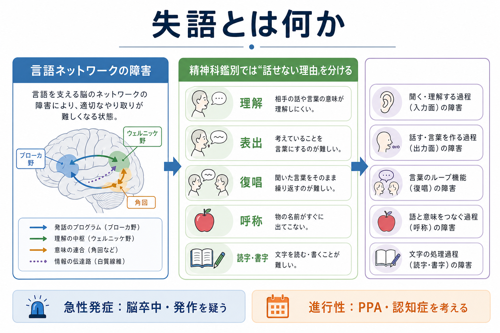
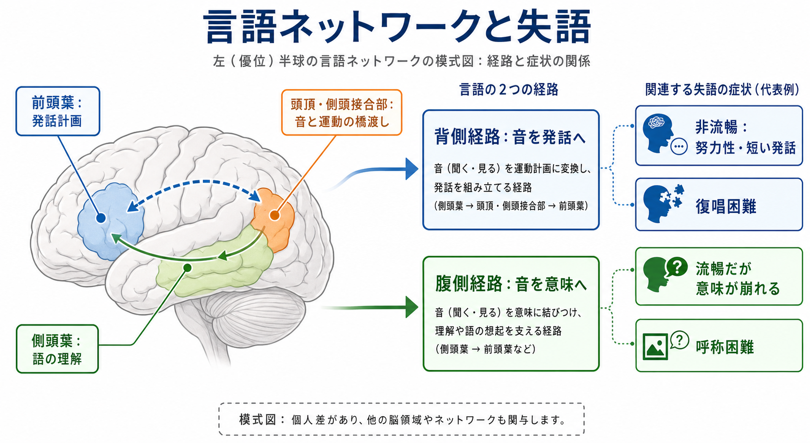
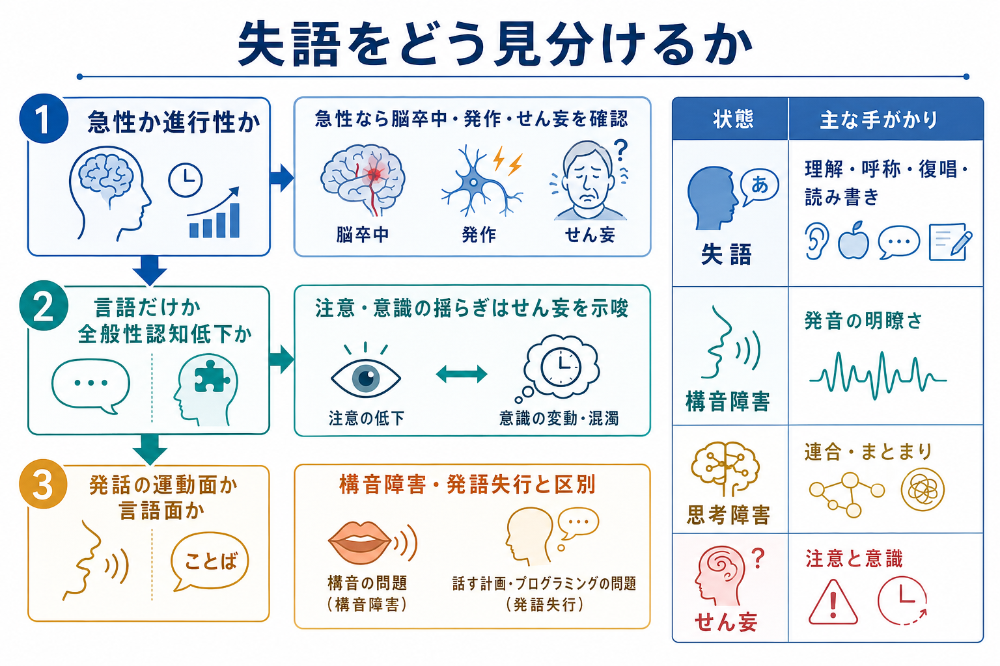

# 失語とは何か

## 要点

- 失語は、言語を支える脳領域・脳ネットワークの障害により、話す、聞いて理解する、復唱する、名づける、読む、書くことが障害される後天性の言語症状である[1]。
- 精神科鑑別では、「言葉が出ない」ことを、失語、構音障害、発語失行、[[意識障害とは何か]]、[[せん妄とは何か]]、[[認知機能障害とは何か]]、精神病性の思考障害から分けて考える。
- 急性発症の失語は、脳卒中、TIA、発作、外傷、感染などをまず疑う。慢性・進行性の場合は、一次性進行性失語（primary progressive aphasia; PPA）や認知症性疾患を考える[1][5]。
- 失語は「知能が低い」「やる気がない」「混乱している」と同義ではない。言語機能の障害が前景に出ているか、注意・意識・全般認知・思考形式の障害が前景に出ているかを観察する。

## この記事で答える問い

1. 失語とは、どのような神経心理症状か。
2. 失語の型やメカニズムは、精神科鑑別でどう役立つか。
3. せん妄、認知症、構音障害、発語失行、思考障害とは何が違うか。
4. 臨床でどのような観察・質問をすると見立てやすいか。

## まず結論

失語は「話せない症状」だけではない。言語を理解する、言葉を選ぶ、音として保持して復唱する、物に名前をつける、文字を読む・書く、といった複数の言語機能の障害である[1]。したがって、診察では流暢性だけでなく、理解、復唱、呼称、読字、書字を短く確認する。

精神科で重要なのは、失語を「まとまりのない話」「認知症による物忘れ」「意識障害による応答不良」「拒否的態度」と誤読しないことである。逆に、せん妄や精神病性思考障害を失語だけで説明しないことも同じくらい重要である。

## 背景

失語は多くの場合、優位半球、典型的には左半球の言語関連領域の損傷と関連する[1][2]。原因として最も多いのは脳卒中であり、米国脳卒中協会や NIDCD は、脳卒中後のコミュニケーション障害として失語を重視している[1][2]。ただし失語は脳卒中だけで起こるわけではなく、頭部外傷、脳腫瘍、脳感染症、手術後、発作、神経変性疾患でも生じる[1]。

精神科診療では、失語はしばしば「話のまとまらなさ」「応答の乏しさ」「了解不能な発話」として現れる。ここで重要なのは、患者が何を考えているか以前に、言語入力と出力のどこで詰まっているかを見ることである。[[精神症候学とは何か]]で扱う症候の読み取りは、身体・神経・認知のレベルを分けて観察して初めて安定する。

## 基本概念

### 失語で障害される主な機能

| 領域 | 観察すること | 例 |
|---|---|---|
| 理解 | 口頭命令や質問の意味を取れるか | 「右手で左耳を触ってください」 |
| 表出 | 自発話が流暢か、努力性か、語の選択が保たれるか | 短い電文体、錯語、迂言 |
| 復唱 | 聞いた語や文をそのまま繰り返せるか | 「今日はよい天気です」 |
| 呼称 | 物や絵の名前を言えるか | 時計、鉛筆、鍵 |
| 読字・書字 | 文字入力・出力が保たれるか | 短文を読む、氏名や文を書く |

古典的には、ブローカ失語、ウェルニッケ失語、伝導失語、全失語、超皮質性失語、健忘失語などに分類される[1]。ただし、実際の症状は病変部位、急性期か慢性期か、併存する注意障害・運動障害・聴覚障害によって混ざるため、分類名だけで理解しようとしない方がよい。

### 流暢性だけでは足りない

非流暢な発話はブローカ失語を示唆することがあるが、構音障害や発語失行でも発話はぎこちなくなる。流暢な発話でも、語の意味が崩れ、錯語や新造語が目立ち、理解が悪い場合はウェルニッケ型の障害を疑う[1]。また、復唱が目立って悪い場合は伝導失語など、音韻情報を保って発話へ戻す経路の障害を考える[1][3]。

## 仕組み

言語処理は単一の「言語中枢」ではなく、側頭葉、頭頂葉、前頭葉、それらを結ぶ白質路、注意・実行機能系が連携するネットワークで支えられる。Hickok と Poeppel の二重経路モデルでは、音声を意味理解へ結びつける腹側経路と、聞いた音を発話運動へ写像する背側経路が区別される[3]。この見方は、理解、復唱、音韻保持、発話計画が別々に障害されうることを説明しやすい。

一方、Hillis は、失語研究が古典的な病巣名から、言語課題を支える認知過程とネットワークの理解へ進んできたと整理している[4]。つまり「ブローカ野が壊れたからブローカ失語」とだけ見るのではなく、音韻処理、意味処理、語彙検索、文法処理、発話運動計画、注意資源がどこで崩れているかを考える。

## 図解

失語を精神科鑑別で見るときは、まず時間経過を置く。

- 急性発症: 脳卒中、TIA、発作、頭部外傷、急性の感染・炎症、せん妄を優先して考える。
- 亜急性から慢性: 腫瘍、慢性硬膜下血腫、神経変性疾患、認知症性疾患、PPA を考える。
- 変動性が強い: せん妄、発作、薬剤、疲労、注意障害の影響を考える。

次に、障害の中心を分ける。

| 見え方 | 中心にある可能性 | 確認の軸 |
|---|---|---|
| 言葉の意味が取れない | 失語、聴覚障害、注意障害 | 簡単な命令、筆談、環境調整 |
| 発音が不明瞭 | 構音障害 | 口唇・舌・咽頭の運動、声量、嚥下 |
| 言いたい語が出ない | 失語、発語失行、うつ、緊張、認知症 | 呼称、復唱、書字、時間経過 |
| 話は多いがまとまらない | ウェルニッケ型失語、思考障害、せん妄 | 理解、錯語、注意、意識、妄想との関係 |
| 応答が遅い・乏しい | 失語、意識障害、うつ、緘黙、陰性症状 | 覚醒、注意、非言語反応、文字理解 |

## 臨床・研究との接続

### 精神科鑑別での見方

失語の評価は、長い神経心理検査を行わなくても、初期診察でかなり手がかりを得られる。たとえば、以下を短く観察する。

1. 自発話: 流暢か、努力性か、文法が崩れるか、錯語があるか。
2. 理解: 一段階命令、二段階命令、抽象的質問を理解できるか。
3. 復唱: 単語、短文、長めの文で崩れ方が変わるか。
4. 呼称: 身近な物の名前が出るか。迂言や意味性錯語があるか。
5. 読字・書字: 音声より文字の方が通じるか、逆か。
6. 非言語反応: 表情、身振り、視線、選択肢への指差しが保たれるか。

これは[[症状と徴候は何が違うのか]]にも関わる。本人が「言葉が出ない」と訴える症状と、診察者が観察する理解障害、錯語、復唱障害、書字障害という徴候を分けると、見立てが安定する。

### PPA と認知症との接続

一次性進行性失語は、記憶障害や行動変化よりも言語障害が初期から前景に出る神経変性症候群である。国際基準では、非流暢/失文法型、意味型、ロゴペニック型の 3 主要亜型が整理されている[5]。臨床上は、PPA が「うつ」「会話への意欲低下」「認知症一般」と誤解されることがあるため、言語課題のどこが一貫して落ちるかを見る。

### リハビリテーションとの接続

脳卒中後失語に対する言語聴覚療法は、機能的コミュニケーション、理解、表出、読み書きの改善に有効性を示すエビデンスがある[6]。ただし、失語の回復は病変、重症度、時期、年齢、併存症、訓練量、家族や環境の支援に左右される[1][7]。精神科医療では、治療を直接担わない場合でも、失語を見逃さず、神経内科、脳卒中診療、リハビリテーション、言語聴覚士につなぐ判断が重要である。

## よくある誤解

### 「失語は知能低下である」

失語は言語の入力・出力・変換の障害であり、知能全体の低下そのものではない[1][2]。ただし、認知症やせん妄と併存することはある。したがって、言語で答えられないことを、ただちに理解力や判断力の低下とみなさない。

### 「話せているなら失語ではない」

流暢に話していても、意味の通らない発話、錯語、理解障害、呼称障害、復唱障害があれば失語の可能性がある[1]。流暢性だけでなく、理解・復唱・呼称を見る。

### 「精神病性のまとまりのなさと同じである」

思考障害では連合のゆるみ、脱線、観念の飛躍、妄想的文脈が問題になることが多い。一方、失語では、語音・語義・文法・復唱・呼称・読字書字の障害が前景に出る。両者が併存することもあるため、MSE の会話印象だけで断定しない。

### 「急に言葉が出ないのは心理的反応である」

急性の失語は脳卒中や発作のサインでありうる[1][2]。突然の言語障害、片麻痺、顔面麻痺、視野障害、強い頭痛、意識変容などがあれば、心理的説明に回収せず、身体疾患として緊急評価を考える。

## 関連ノート

- [[精神症候学とは何か]]
- [[症状と徴候は何が違うのか]]
- [[意識障害とは何か]]
- [[せん妄とは何か]]
- [[認知機能障害とは何か]]
- [[言語理解はどのように行われるのか]]
- [[言語産出はどのように行われるのか]]

### 関連ノート候補

- 構音障害とは何か
- 発語失行とは何か
- 一次性進行性失語とは何か
- 思考障害とは何か
- 脳卒中後の神経心理症状

## 理解チェック

1. 失語で最低限確認したい 5 つの言語機能は何か。
2. 「流暢に話すが意味が通りにくい」場合、どのような失語と、どのような精神症状を鑑別に置くか。
3. 急性発症の失語で、心理的説明より先に考えるべき身体疾患は何か。
4. せん妄と失語を分けるとき、注意・意識の変動はどのように役立つか。
5. PPA が一般的な認知症やうつと誤解されやすい理由は何か。

## 参考文献

[1] National Institute on Deafness and Other Communication Disorders. (2025). *Aphasia*. NIH/NIDCD. https://www.nidcd.nih.gov/health/aphasia

[2] American Stroke Association. *Effects of Aphasia*. American Heart Association. https://www.stroke.org/en/about-stroke/effects-of-stroke/communication-and-aphasia/stroke-and-aphasia/effects-of-aphasia

[3] Hickok, G., & Poeppel, D. (2007). The cortical organization of speech processing. *Nature Reviews Neuroscience, 8*, 393-402. https://doi.org/10.1038/nrn2113

[4] Hillis, A. E. (2007). Aphasia: Progress in the last quarter of a century. *Neurology, 69*(2), 200-213. https://doi.org/10.1212/01.wnl.0000265600.69385.6f

[5] Gorno-Tempini, M. L., Hillis, A. E., Weintraub, S., et al. (2011). Classification of primary progressive aphasia and its variants. *Neurology, 76*(11), 1006-1014. https://doi.org/10.1212/WNL.0b013e31821103e6

[6] Brady, M. C., Kelly, H., Godwin, J., Enderby, P., & Campbell, P. (2016). Speech and language therapy for aphasia following stroke. *Cochrane Database of Systematic Reviews*, CD000425. https://doi.org/10.1002/14651858.CD000425.pub4

[7] Vitti, E., & Hillis, A. E. (2021). Treatment of post-stroke aphasia: A narrative review for stroke neurologists. *International Journal of Stroke*. https://doi.org/10.1177/17474930211017807

## 未解決問題

- 急性期から慢性期まで、どの時点でどの強度の介入が最も有効かは、個人差が大きく、なお研究課題である。
- PPA の亜型、背景病理、画像所見、治療反応の対応は完全には一対一ではない。
- 精神科診療で失語を短時間に見分けるための標準化されたスクリーニング手順は、現場実装の余地がある。
