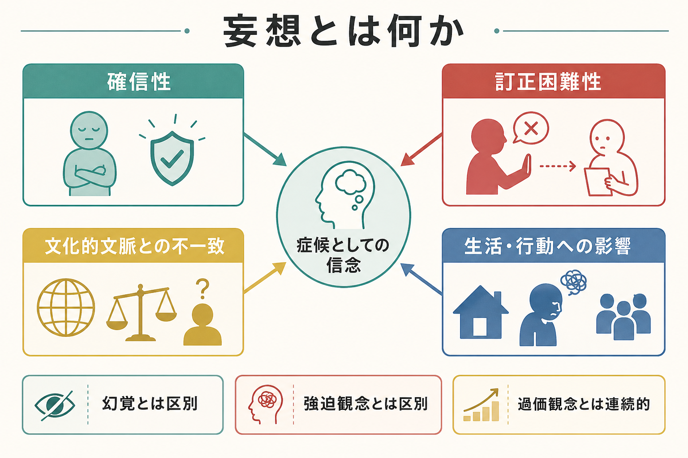
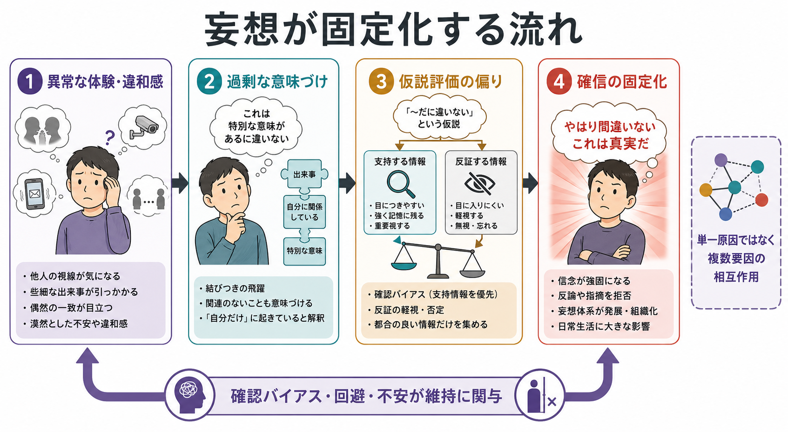

# 妄想とは何か

## 要点

- 妄想とは、反証や説明によって容易には訂正されず、その人の文化的・宗教的・社会的文脈からみても共有されにくい、強い確信を伴う信念である[1][2]。
- 「内容が奇妙かどうか」だけでは妄想とは判断できない。重要なのは、確信度、訂正困難性、根拠との釣り合い、文化的文脈、生活や行動への影響である[1][3]。
- 妄想は[[精神症候学とは何か|精神症候学]]では思考内容の異常として扱われるが、形成には知覚的違和感、情動、推論バイアス、対人環境、神経生物学的要因が関与しうる[4][5][6]。
- [[強迫観念とは何か|強迫観念]]は「自分の考えだが望ましくない」と体験されやすいのに対し、妄想は本人にとって現実についての確信として体験されやすい。
- 本稿は教育・研究目的の整理であり、個別の診断や治療指示ではない。

## この記事で答える問い

1. 妄想は、単なる「誤った考え」や「頑固な思い込み」と何が違うのか。
2. 文化的信念、強迫観念、過価観念、幻覚とはどのように区別するのか。
3. 妄想が形成・維持される仕組みには、どのような仮説があるのか。
4. 臨床や研究では、妄想をどのような軸で記述するのか。

## まず結論

妄想を一文でいうなら、「本人には現実についての確信として体験されるが、利用可能な根拠や共有される文化的文脈と釣り合わず、反証によっても容易には変わらない信念」である。DSM 系の定義では、外的現実についての誤った推論にもとづき、明白な反証にもかかわらず保持され、本人の文化や下位文化で通常受け入れられる信念ではないことが強調される[1]。ICD-11 でも、統合失調症や一次性精神症群の中核症状として、持続する妄想・幻覚・思考解体・影響体験などが位置づけられている[2]。

ただし、臨床的には「その信念が事実として正しいか」だけで判断しない。偶然に事実と一致する場合でも、根拠の乏しさ、確信の強さ、反証への反応、他の体験との結びつき、生活上の障害が問題になることがある。逆に、珍しい信念や宗教的信念であっても、文化・共同体・人生史の中で共有され意味づけられているなら、それだけで妄想とはいえない[3]。

## 背景

妄想は、精神病性症状の代表的な構成要素であり、統合失調症、妄想性障害、気分障害の精神病性特徴、物質・薬剤や身体疾患に関連する精神病症状、[[せん妄とは何か|せん妄]]、認知症など多様な文脈でみられる[1][2]。そのため、妄想という語は診断名ではなく、観察・面接で記述される症候名として扱う必要がある。

古典的な症候学では、妄想は「異常な確信」「訂正不能性」「内容の不可能性または不合理性」といった特徴で説明されてきた[1]。現代の臨床では、この古典的特徴をそのまま機械的に使うのではなく、文化的背景、発達水準、教育歴、宗教的共同体、情報環境、身体疾患や薬物の影響、本人の苦痛と機能障害を合わせて評価する。

## 基本概念

### 妄想をみる評価軸

| 評価軸 | 確認すること | 注意点 |
|---|---|---|
| 確信度 | どの程度「本当だ」と確信しているか | 100% の確信だけが妄想ではない |
| 訂正困難性 | 反証・説明・時間経過で変化するか | 面接者の説得で試すのではなく、反応を丁寧に聴く |
| 根拠との釣り合い | どの証拠からその結論に至ったか | 情報の選択や推論過程も見る |
| 文化的文脈 | 家族、地域、宗教、下位文化で共有されるか | 「珍しい信念」と「妄想」を混同しない |
| 情動と行動 | 不安、怒り、回避、確認、攻撃性、孤立につながるか | リスク評価と支援計画に直結する |

### 内容による分類

妄想の内容には、被害妄想、関係妄想、誇大妄想、嫉妬妄想、恋愛妄想、身体妄想、罪業妄想、貧困妄想、虚無妄想、宗教的内容をもつ妄想などがある[1]。ただし、内容分類は入口にすぎない。同じ「被害妄想」でも、急性の[[せん妄とは何か|せん妄]]、長期に持続する妄想性障害、気分エピソードに伴う精神病症状、物質関連症状では意味が異なる。

### 似ている概念との区別

| 概念 | 主な特徴 | 妄想との違い |
|---|---|---|
| 幻覚 | 外的刺激がないのに知覚のように体験される | 妄想は知覚そのものではなく信念・判断の水準 |
| [[強迫観念とは何か|強迫観念]] | 侵入的で望ましくない考えとして体験されやすい | 多くは本人が不合理性を多少なりとも認識する |
| 過価観念 | 強く価値づけられた信念や関心 | 妄想ほど訂正困難でない場合があるが連続的 |
| [[作話とは何か|作話]] | 記憶の欠損を本人が意図せず補う | 信念の固定化より記憶・想起の障害が中心 |
| [[侵入思考とは何か|侵入思考]] | 不快な考えやイメージが浮かぶ | 現実についての確信として保持されるとは限らない |

## 仕組み

妄想の形成を単一原因で説明することは難しい。現在の有力な見方は、異常な体験、情動、推論、社会的文脈、神経生物学的要因が相互作用するというものである[4][5][6]。

### 1. 違和感や異常なサリエンス

Kapur の異常サリエンス仮説では、ドパミン系の機能変化により、本来は中立的な刺激や内的表象に過剰な重要性が付与されると考える[6]。たとえば、周囲の視線、偶然の一致、ニュースの一文、身体感覚が「自分に関係している」「危険を示している」と強く感じられる。この段階では、まだ明確な妄想内容ではなく、「何かがおかしい」という違和感や意味の過剰さとして体験されることがある。

### 2. 意味づけと説明仮説

人は強い違和感や不安を、そのまま無意味なものとして放置しにくい。被害妄想の認知モデルでは、異常で情動的に重要な体験に対して、本人が意味を探し、脅威に関する説明を形成すると考える[5]。この説明は、過去の対人経験、自己評価、トラウマ、孤立、睡眠不足、ストレス、社会的逆境の影響を受けることがある。

### 3. 推論バイアスと信念評価

妄想をもつ人では、少ない証拠から早く結論に飛ぶ傾向、反証より支持証拠に注意が向きやすい傾向、脅威を外部に帰属しやすい傾向などが報告されている[4]。二要因理論では、第一の要因が異常な体験や説明仮説を生み、第二の要因がその仮説を棄却しにくくする信念評価の問題として働くと整理される[7]。

### 4. 維持要因

妄想は、いったん固定化すると、確認行動、回避、孤立、睡眠障害、不安、家族や周囲との対立によって維持されやすい。たとえば「見張られている」と確信した人が外出を避けると、反証となる体験が減り、危険予測だけが強まることがある。これは本人の性格の弱さではなく、不安を下げようとする自然な行動が、結果として信念の修正機会を狭めるという循環である。

予測処理やベイズ的枠組みでは、妄想は異常な予測誤差やその精度づけの問題としても説明される[8]。この見方では、脳は世界についてのモデルを更新し続けるが、誤差シグナルの重みづけが偏ると、偶然の出来事が過剰に意味をもち、信念更新が不安定または硬直的になる。

## 図解

図1は、妄想を「確信性」「訂正困難性」「文化的文脈との不一致」「生活・行動への影響」という4つの評価軸で読むための概念地図である。図2は、異常な体験や違和感が、意味づけ、仮説評価の偏り、確信の固定化へ進み、確認バイアスや回避によって維持される流れを示している。

画像だけで判断しないために、本文では表と文章で同じ内容を補足している。臨床・研究では、図の流れを「必ずこの順番で起こる過程」としてではなく、面接で確認すべき仮説の地図として使う。

## 臨床・研究との接続

臨床では、妄想らしさを判定する前に、安全、身体疾患、薬物、睡眠、意識水準、気分エピソード、認知機能、発達特性、文化的背景を確認する。[[せん妄とは何か|せん妄]]では意識・注意の変動を伴うことが多く、[[認知機能障害とは何か|認知機能障害]]や身体疾患の評価が重要になる。気分障害では、抑うつ気分や躁状態と一致する妄想内容がみられることがある。

面接では、信念を正面から否定するよりも、本人にとっての確信度、証拠、苦痛、行動への影響、安全上のリスク、支援資源を確認する。これは妄想を「肯定する」ことではなく、本人の体験を理解しながら、評価と支援につなげるためである。

研究では、妄想は単なる有無ではなく、確信度、占有度、苦痛、行動化、洞察、反証への開放性などの次元で測定される。被害妄想研究では、不安、心配、睡眠、自己評価、対人不信、推論バイアスが介入可能な要因として検討されている[5]。

## よくある誤解

### 誤解1: 妄想は「明らかに奇妙な考え」だけである

誤りである。内容が現実にありえそうでも、根拠との釣り合いを欠き、強い確信と訂正困難性をもち、文化的文脈から孤立し、生活に影響している場合には妄想として評価されることがある[1]。

### 誤解2: 文化や宗教と異なる信念はすべて妄想である

誤りである。妄想の評価では、本人の文化、宗教、下位文化、家族内の意味体系を確認する必要がある[3]。面接者に馴染みのない信念であることは、妄想であることの証拠ではない。

### 誤解3: 妄想は説得すれば修正できる

妄想は、本人にとって現実についての確信として体験される。強い説得や反論は、対立や不信を強める場合がある。臨床的には、信念そのものを急いで論破するより、苦痛、安全、睡眠、孤立、確認行動、生活機能を一緒に扱う方が有用なことが多い。

### 誤解4: 妄想は幻覚と同じである

幻覚は知覚体験の水準、妄想は信念・判断の水準にある。もちろん、幻聴の内容を説明するために「誰かが送信している」という妄想が形成されるなど、両者が結びつくことはある。

## 関連ノート

既存ノート:

- [[精神症候学とは何か]]
- [[強迫観念とは何か]]
- [[侵入思考とは何か]]
- [[作話とは何か]]
- [[せん妄とは何か]]
- [[認知機能障害とは何か]]
- [[解離とは何か]]

今後の作成候補:

- 被害妄想とは何か
- 関係妄想とは何か
- 妄想性障害とは何か
- 精神病症状とは何か
- 幻覚と妄想は何が違うのか
- 過価観念とは何か

MOC更新候補:

- `content/00_MOC/` 配下の精神医学・症候学系 MOC に、本記事を症候学の基礎ノートとして追加する。
- 並列生成ジョブとの競合を避けるため、本稿では MOC 本体は更新しない。

## 理解チェック

1. 妄想を評価するとき、内容の奇妙さだけでなく確認すべき軸を3つ挙げられるか。
2. 妄想と[[強迫観念とは何か|強迫観念]]の違いを、「本人にどう体験されるか」という観点から説明できるか。
3. 文化的・宗教的信念を妄想と即断しない理由を説明できるか。
4. 異常サリエンス仮説では、妄想形成のどの段階が強調されるか。
5. 被害妄想の維持に、確認行動や回避がどのように関わりうるか。

## 参考文献

[1] Fariba, K. A., & Fawzy, F. (2022). *Delusions*. StatPearls. NCBI Bookshelf. https://www.ncbi.nlm.nih.gov/sites/books/n/statpearls/article-79308/

[2] World Health Organization. (2026). *ICD-11 for Mortality and Morbidity Statistics: Schizophrenia or other primary psychotic disorders*. https://icd.who.int/browse/2026-01/mms/en#405565289

[3] Gaines, A. D. (1995). Culture-specific delusions. Sense and nonsense in cultural context. *Psychiatric Clinics of North America, 18*(2), 281-301. https://pubmed.ncbi.nlm.nih.gov/7659599/

[4] Garety, P. A., & Freeman, D. (1999). Cognitive approaches to delusions: A critical review of theories and evidence. *British Journal of Clinical Psychology, 38*(2), 113-154. https://doi.org/10.1348/014466599162700

[5] Freeman, D., & Garety, P. (2014). Advances in understanding and treating persecutory delusions: A review. *Social Psychiatry and Psychiatric Epidemiology, 49*, 1179-1189. https://doi.org/10.1007/s00127-014-0928-7

[6] Kapur, S. (2003). Psychosis as a state of aberrant salience: A framework linking biology, phenomenology, and pharmacology in schizophrenia. *American Journal of Psychiatry, 160*(1), 13-23. https://doi.org/10.1176/appi.ajp.160.1.13

[7] Coltheart, M., Langdon, R., & McKay, R. (2011). Delusional belief. *Annual Review of Psychology, 62*, 271-298. https://doi.org/10.1146/annurev.psych.121208.131622

[8] Corlett, P. R., Frith, C. D., & Fletcher, P. C. (2009). From drugs to deprivation: A Bayesian framework for understanding models of psychosis. *Psychopharmacology, 206*, 515-530. https://doi.org/10.1007/s00213-009-1561-0

## 未解決問題

- 妄想の確信度、苦痛、生活障害、行動化をどのように統合して、個別支援に役立つ評価へ変換するか。
- 文化的文脈を尊重しながら、本人や周囲の安全に関わる妄想をどう評価するか。
- 異常サリエンス、推論バイアス、予測誤差、社会的逆境を、単一の説明に還元せずにどう統合するか。
- 自然言語処理やデジタル表現型を用いた妄想研究で、本人の語りの尊厳とプライバシーをどう守るか。
