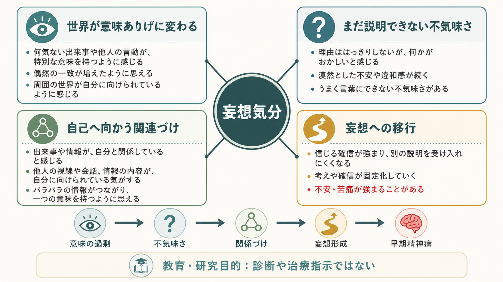
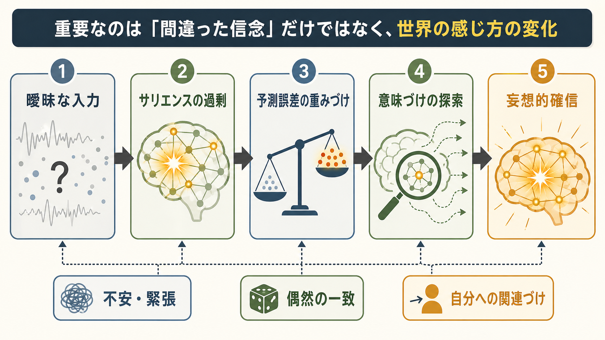
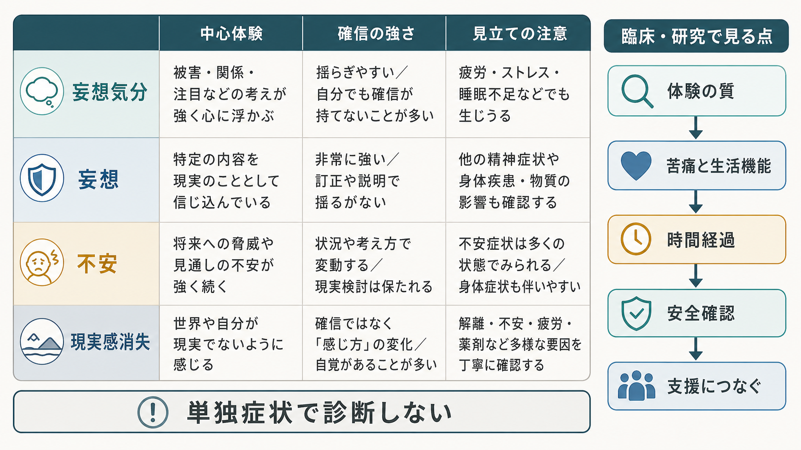

# 妄想気分とは何か

## 要点

- 妄想気分とは、世界全体がどこか変わり、不気味で意味ありげに感じられるが、その意味をまだはっきり言葉にできない体験である。
- 古典的な精神病理学では、妄想気分は[[妄想とは何か|妄想]]そのものより前に現れうる「雰囲気」や「前駆的な場の変化」として記述されてきた[1][2]。
- Conrad の初期統合失調症モデルでは、Trema と呼ばれる緊張・期待の段階から、世界の出来事が異常な意味を帯びる Apophany、さらに自己へ向かう関連づけへ進む流れが整理された[1]。
- 現代的には、[[ドパミン仮説は統合失調症をどこまで説明できるのか|ドパミン系]]に関連する異常サリエンス、予測誤差の重みづけ、意味づけの探索が、妄想気分から妄想的確信へ移る過程を説明する候補になる[4][5]。
- ただし、妄想気分だけで統合失調症と診断することはできない。苦痛、生活機能、時間経過、幻覚・思考障害・自己障害、物質使用、身体疾患、安全リスクを合わせて評価する必要がある[7][8]。

## この記事で答える問い

1. 妄想気分は、通常の不安や「何となく嫌な予感」と何が違うのか。
2. なぜ「世界が変わった感じ」が、やがて[[関係妄想とは何か|関係妄想]]や[[被害妄想とは何か|被害妄想]]へつながることがあるのか。
3. 現象学的な記述と、異常サリエンス・予測誤差モデルはどう接続できるのか。
4. 臨床・研究では、妄想気分をどのように扱うと安全で有用なのか。

## まず結論

妄想気分は「すでに完成した誤った信念」ではなく、世界の感じ方そのものが変わる体験である。本人には、街の音、他人の視線、偶然の一致、ニュース、身体感覚、沈黙などが、普段とは違って「何かを告げている」ように感じられる。しかし、その何かはまだ明確ではない。だからこそ妄想気分は、不安、緊張、違和感、期待、疎外感、恐怖、使命感、罪悪感などを伴いやすい[1]。

この段階で大切なのは、体験をただ「間違った考え」として扱わないことである。本人にとっては、考え以前に、世界の明るさ、距離感、意味の濃さ、自己との関係が変わっている。Jaspers の一次妄想論でも、妄想の核心は単なる信念内容ではなく、主観性の変化と意味の体験にあると整理されてきた[2]。

一方で、妄想気分は診断名ではない。睡眠不足、強いストレス、トラウマ、不安、気分症状、薬物・物質、身体疾患、解離、[[現実感消失とは何か|現実感消失]]でも似た違和感が起こりうる。したがって、教育・研究上は有用な概念だが、個別の診断や治療指示として単独で使うべきではない。

## 背景

妄想気分は、ドイツ語の Wahnstimmung に対応する概念として知られる。Stimmung は「気分」だけでなく、雰囲気、調律、世界との響き合いのような意味を含む。そのため妄想気分は、単に「妄想をもつときの気分」ではなく、世界全体が不穏に調律され直されたような体験として理解した方が近い。

Conrad は、初期統合失調症の体験を段階モデルとして記述した。最初の Trema は、舞台に立つ前のような緊張と期待であり、「何か重大なことが起ころうとしている」という未決定の感じが広がる。次の Apophany では、周囲の出来事が反復的に異常な意味を帯び、出来事どうしが過剰につながって見える。さらに Anastrophe では、それらの意味が自己を中心に回り始める[1]。この流れは、妄想気分から[[注察妄想とは何か|注察妄想]]、関係妄想、被害妄想へ進む場合を理解する手がかりになる。

Jaspers の一次妄想概念では、妄想気分、妄想知覚、妄想着想などは、心理学的に通常の理由から理解し尽くせない体験として扱われた[2][3]。近年の患者視点に基づく記述研究でも、一次妄想は単なる信念ではなく、自己・世界・意味の変化を伴うプロセスとして検討されている[3]。

## 基本概念

### 妄想気分

妄想気分では、本人は「何かが変だ」「何かが起ころうとしている」「周囲が自分に関係している気がする」と感じる。しかし、まだ「誰が何をしている」「なぜそうなのか」という説明は固まっていない。体験の中心は、世界が不気味で意味ありげに変化したという雰囲気である。

日常的な不安にも、胸騒ぎや警戒感はある。しかし妄想気分では、周囲の出来事そのものが意味を帯び、世界の側から何かが迫ってくるように体験される点が特徴的である。自分が考えすぎているという自覚が残ることもあるが、次第に「これはただの気のせいではない」という方向へ傾くことがある。

### 妄想知覚・妄想着想との違い

妄想知覚では、通常の知覚対象に、直接的で特別な意味が付与される。たとえば信号の色、新聞記事、他人のしぐさが、急に「自分へのサイン」として確信される。妄想着想では、明確な外的知覚を介さず、突然「そうだ、これはこういう意味だった」とわかるように感じられる。妄想気分は、こうした確信に至る前の、まだ意味が曖昧な雰囲気として位置づけられる。

### 似ている体験との区別

| 体験 | 中心にあるもの | 妄想気分との違い |
|---|---|---|
| 不安 | 未来の危険、心配、身体緊張 | 危険対象が比較的説明しやすいことが多い |
| [[現実感消失とは何か|現実感消失]] | 世界が非現実的・遠い・膜越しに感じられる | 意味の過剰付与より「現実感の薄さ」が中心になりやすい |
| 関係念慮 | 自分に関係しているかもしれないという揺らぎ | 反証や別解釈がまだ比較的保たれる |
| 関係妄想 | 周囲の出来事が自分に関係するという確信 | 確信が強く、別解釈が入りにくい |

## 仕組み

妄想気分を単一の原因で説明することはできない。ここでは、現象学的記述と神経認知モデルをつなぐための作業仮説として整理する。

### 1. 世界のサリエンスが変わる

サリエンスとは、ある刺激が「目立つ」「重要だ」「意味がある」と感じられる度合いである。Kapur は、精神病を異常サリエンスの状態として捉え、ドパミン系の調整異常によって、本来は中立的な刺激にも過剰な重要性が付与される可能性を論じた[4]。この見方では、妄想気分は、周囲の細部が突然意味を帯び始める段階として理解できる。

たとえば、いつもなら流れていく車の音、誰かの咳払い、SNS の投稿、信号の色が、妙に目立つ。まだ「何の意味か」は決まっていないが、注意はそこに引き寄せられる。この「意味の過剰」が、妄想気分の不気味さを支える。

### 2. 予測誤差の重みづけが変わる

[[予測処理とは何か|予測処理]]の観点では、脳は世界について予測を作り、実際の入力とのズレを予測誤差として扱う。Corlett らのモデルでは、妄想形成は、予測誤差信号が不適切に強く扱われ、偶然の一致や曖昧な入力に過剰な学習価値が与えられる過程として説明される[5]。この説明は、[[妄想は予測誤差処理の異常として説明できるのか]]とも接続する。

重要なのは、本人が「意図的に意味を作っている」のではなく、入力がすでに強い更新信号として立ち上がるように感じられる点である。曖昧な入力が強く目立つと、脳はその不一致を説明する仮説を探し始める。

### 3. 意味づけの探索が始まる

不気味で意味ありげな体験が続くと、人はそれを説明しようとする。「なぜ皆が自分を見るのか」「なぜこのニュースが目につくのか」「なぜ偶然が続くのか」という問いが生まれる。ここで、過去の対人経験、孤立、睡眠不足、不安、抑うつ、自己評価、文化的文脈が、どの説明が選ばれるかに影響する。

Schultze-Lutter が整理する基本症状の概念も、陽性症状が明確になる前の微細で主観的な変化に注目する。早期精神病研究では、はっきりした幻覚・妄想だけでなく、思考、知覚、自己感覚の微妙な変化を追うことが重要になる[6]。

### 4. 確信として固定される

ある説明が一度「これだ」と感じられると、不安は一時的に下がることがある。曖昧だった世界に理由が与えられるからである。しかし、その説明が「皆が自分を監視している」「ニュースは自分への暗号だ」のように固定されると、反証情報が入りにくくなり、確認行動や回避が増えることがある。これが妄想的確信への移行である。

## 図解

1枚目は、妄想気分を「世界が意味ありげに変わる」「まだ説明できない不気味さ」「自己へ向かう関連づけ」「妄想への移行」という4つの面から読むための概念地図である。

2枚目は、曖昧な入力、サリエンスの過剰、予測誤差の重みづけ、意味づけの探索、妄想的確信という流れを示す。これは診断や原因を断定する図ではなく、複数の研究仮説をまとめた理解用の図である。

3枚目は、妄想気分、妄想、不安、現実感消失の比較と、臨床・研究で見る点をまとめたものである。

## 臨床・研究との接続

臨床では、妄想気分を「正しいか間違っているか」だけで扱うと、本人の体験の核心を取り逃がす。確認すべきなのは、体験の質、確信の強さ、反証への反応、苦痛、生活機能、時間経過、安全リスク、他の症状、身体疾患や物質の影響である。

ICD-11 では、統合失調症は思考、知覚、自己経験、認知、意欲、感情、行動など複数の精神機能にわたる障害として説明され、持続する妄想、幻覚、思考障害、影響・被支配体験などが中核症状に含まれる[7]。DSM 系の基準でも、妄想、幻覚、まとまりのない発話、まとまりのない行動または緊張病性行動、陰性症状、持続期間、機能低下などを総合して評価する[8]。したがって、妄想気分は重要な面接所見になりうるが、それだけで診断が決まるわけではない。

研究では、妄想気分は現象学と計算論的精神医学をつなぐ概念になる。現象学は「世界がどのように変わって感じられるか」を記述し、異常サリエンスや予測誤差モデルは「なぜ中立的刺激が過剰に意味を帯びるのか」を説明しようとする。ただし、モデルは本人の経験を置き換えるものではない。本人の語り、生活文脈、文化、発達歴、身体状態を合わせて読む必要がある。

## よくある誤解

### 誤解1: 妄想気分は単なる不安である

不安は妄想気分にしばしば伴うが、同じではない。妄想気分では、世界の側が意味を帯びて迫ってくるように感じられ、出来事どうしが自分へ向かって結びつく感覚が生じることがある。

### 誤解2: 妄想気分があれば統合失調症である

そうではない。似た体験は、強いストレス、睡眠不足、気分症状、解離、物質使用、身体疾患、神経疾患でも起こりうる。診断には持続期間、症状の組み合わせ、機能低下、除外診断、本人の安全を含む総合評価が必要である[7][8]。

### 誤解3: 反論すれば妄想への移行を止められる

強い違和感や確信があるとき、正面からの反論は孤立や警戒を強めることがある。教育・支援の文脈では、まず苦痛と安全を確認し、体験の意味を一緒に整理し、別の説明を検討できる余地を保つことが重要である。

### 誤解4: 神経モデルがあれば主観的体験の記述は不要である

異常サリエンスや予測誤差は有用な説明枠組みだが、本人にとっての「世界の変わり方」を直接測るものではない。現象学的記述と神経認知モデルは、競合するというより、異なる解像度で同じ問題に近づく道具である。

## 関連ノート

既存ノート:

- [[妄想とは何か]]
- [[関係妄想とは何か]]
- [[注察妄想とは何か]]
- [[被害妄想とは何か]]
- [[現実感消失とは何か]]
- [[ドパミン仮説は統合失調症をどこまで説明できるのか]]
- [[妄想は予測誤差処理の異常として説明できるのか]]
- [[予測処理とは何か]]

今後の作成候補:

- 妄想知覚とは何か
- 一次妄想とは何か
- 基本症状とは何か
- 異常サリエンスとは何か
- 早期精神病とは何か

MOC更新候補:

- `content/00_MOC/` 配下の精神医学・症候学・神経科学と精神疾患関連 MOC に、本記事 `[[妄想気分とは何か]]` を追加する。
- 並列ジョブとの競合を避けるため、本記事作成時点では MOC 本体は更新しない。

## 理解チェック

1. 妄想気分を「妄想内容」ではなく「世界の感じ方の変化」として捉える理由は何か。
2. Trema、Apophany、Anastrophe は、妄想気分から自己関連づけへの流れをどう説明するか。
3. 異常サリエンス仮説では、なぜ中立的な出来事が意味ありげに感じられるのか。
4. 予測誤差モデルでは、曖昧な入力から妄想的確信へ移る過程をどう説明するか。
5. 妄想気分を評価するとき、診断名より前に確認すべき臨床的ポイントは何か。

## 参考文献

[1] Mishara, A. L. (2010). Klaus Conrad (1905-1961): Delusional mood, psychosis, and beginning schizophrenia. *Schizophrenia Bulletin, 36*(1), 9-13. https://doi.org/10.1093/schbul/sbp144

[2] Jones, N. (2004). Jaspers' concept of primary delusion. *The British Journal of Psychiatry, 185*(1), 77-78. https://doi.org/10.1192/bjp.185.1.77-a

[3] Hayashi, N., Igarashi, Y., & Harima, H. (2021). Delusion progression process from the perspective of patients with psychoses: A descriptive study based on the primary delusion concept of Karl Jaspers. *PLOS ONE, 16*(4), e0250766. https://doi.org/10.1371/journal.pone.0250766

[4] Kapur, S. (2003). Psychosis as a state of aberrant salience: A framework linking biology, phenomenology, and pharmacology in schizophrenia. *American Journal of Psychiatry, 160*(1), 13-23. https://doi.org/10.1176/appi.ajp.160.1.13

[5] Corlett, P. R., Honey, G. D., & Fletcher, P. C. (2016). Prediction error, ketamine and psychosis: An updated model. *Journal of Psychopharmacology, 30*(11), 1145-1155. https://doi.org/10.1177/0269881116650087

[6] Schultze-Lutter, F. (2009). Subjective symptoms of schizophrenia in research and the clinic: The basic symptom concept. *Schizophrenia Bulletin, 35*(1), 5-8. https://doi.org/10.1093/schbul/sbn139

[7] World Health Organization. (2024). *Clinical descriptions and diagnostic requirements for ICD-11 mental, behavioural and neurodevelopmental disorders*. https://iris.who.int/bitstream/handle/10665/375767/9789240077263-eng.pdf

[8] Patel, K. R., Cherian, J., Gohil, K., & Atkinson, D. (2014). Schizophrenia: Overview and treatment options. *P & T, 39*(9), 638-645. https://pmc.ncbi.nlm.nih.gov/articles/PMC4159061/

## 未解決問題

- 妄想気分を、面接でどの程度再現性高く評価できるか。
- 異常サリエンス、予測誤差、自己障害、情動調整を、単一原因に還元せずにどう統合するか。
- 早期支援の現場で、妄想気分をスティグマ化せず、本人の安全と生活機能の支援につなげる方法は何か。
