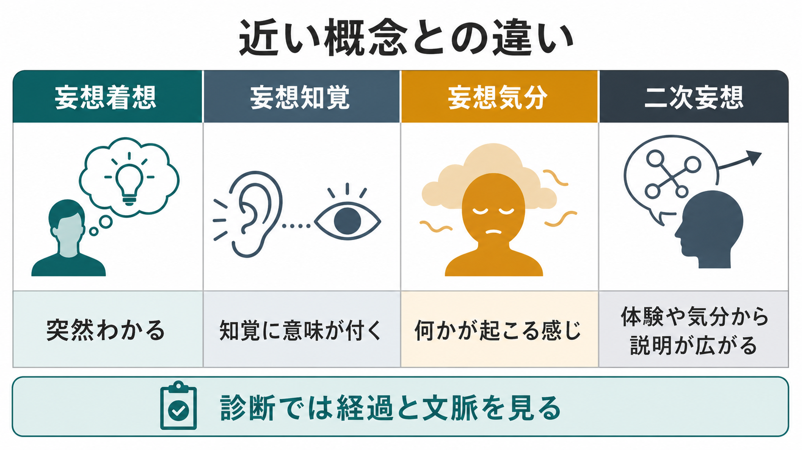

# 妄想着想とは何か

## 要点

- 妄想着想とは、ある考えが推論や証拠の積み上げを経ずに、突然「そうだ、これが真実だ」と強い確信を伴って成立する一次妄想体験の一型である[1][2]。
- 重要なのは「内容が奇妙か」だけではなく、「どのように成立したか」である。妄想着想では、考えが説明的な結論としてではなく、啓示・直観・突然の了解のように現れる[2][3]。
- 妄想知覚が「知覚された対象に異常な意味が付く」体験であるのに対し、妄想着想は特定の外的知覚を出発点にしないことがある[1][2]。
- 現代的には、異常なサリエンス、予測誤差、信念更新の重みづけの異常から妄想形成を説明するモデルと接続できる。ただし、これは妄想着想を単一メカニズムに還元するものではない[5][6][7]。
- 本稿は教育・研究目的の整理であり、個別の診断や治療指示ではない。

## この記事で答える問い

1. 妄想着想は、通常のひらめきや強い思い込みと何が違うのか。
2. 妄想気分、妄想知覚、二次妄想とはどのように区別されるのか。
3. 「突然わかる」という体験は、認知神経科学や計算論的精神医学ではどう説明されうるのか。
4. 臨床や研究で、妄想着想という概念をどのように使うべきか。

## まず結論

妄想着想は、[[妄想とは何か|妄想]]の「内容」ではなく「成立様式」に注目した概念である。本人にとっては、新しい考えが突然、しかも疑いにくい確信として現れる。周囲から見ると根拠の飛躍があるが、本人には「考えた結果」ではなく「わかった」「明らかになった」と体験されやすい。

この点で、妄想着想は単なる誤解、推測、陰謀論的信念、宗教的信念、強い価値観と同じではない。臨床的には、確信の強さ、訂正困難性、文化的文脈、生活機能への影響、他の精神症状、身体疾患や薬物の影響を合わせて評価する必要がある[1][8]。

## 背景

古典的な記述精神病理学では、妄想はしばしば「一次妄想」と「二次妄想」に分けて考えられてきた。Jaspers は、一次妄想を、それ以上心理学的に了解しにくい、直接的な妄想体験として記述した[2][4]。そこには妄想気分、妄想知覚、妄想着想、妄想記憶などが含まれる。

この区別は、現在の診断分類そのものではない。DSM や ICD は、診断のために症状の持続、重症度、機能障害、除外診断を重視する。一方で、症候学の言葉としての妄想着想は、面接で「その確信がどのように立ち上がったのか」を丁寧に記述するために役立つ。[[精神症候学とは何か|精神症候学]]の観点では、診断名へ急ぐ前に、体験の形を言葉にすることが重要である。

## 基本概念

### 妄想着想の定義

妄想着想は、特定の知覚や論理的推論からではなく、考えそのものが突然に現れ、妄想的確信として成立する体験である。英語では delusional intuition や delusional idea と呼ばれる。文献では「突然の観念」「直観のような妄想的了解」と説明されることが多い[2][3]。

たとえば、何かを見たからではなく、突然「自分は特別な使命を与えられている」「すべては自分を中心に動いている」と確信する場合がある。ここで重要なのは例の内容ではなく、根拠を吟味する過程が十分に見えないまま、確信だけが強く成立する点である。

### 通常のひらめきとの違い

通常のひらめきにも、突然性はある。数学の解法を思いつく、文章の構成が見える、対人関係の意味をふと理解する、といった経験は誰にでもありうる。しかし通常のひらめきは、後から根拠を検討したり、他者の反論で修正したり、現実の制約に照らして保留したりできる。

妄想着想では、考えが「仮説」ではなく「確定した現実」として立ち上がりやすい。本人にとっては疑うこと自体が不自然に感じられ、反証はしばしば「隠されている」「試されている」「相手が理解していない」と再解釈される。この訂正困難性は、[[被害妄想とは何か|被害妄想]]や[[誇大妄想とは何か|誇大妄想]]など、具体的な妄想内容の固定化にも関係する。

### 近い概念との違い

| 概念 | 体験の中心 | 妄想着想との違い |
|---|---|---|
| 妄想気分 | 世界全体が不気味に変わった、何か重大なことが起こるという雰囲気 | まだ明確な命題に結晶化していないことが多い |
| 妄想知覚 | 実際の知覚対象に、異常で個人的な意味が付く | 知覚対象が出発点になる |
| 妄想着想 | 突然、命題や確信が立ち上がる | 特定の知覚を必要としないことがある |
| 二次妄想 | 気分、幻覚、記憶、対人経験などから説明として発展する | 体験の連鎖として了解しやすい部分がある |

## 仕組み

### 1. 意味が過剰に立ち上がる

Jaspers 的な一次妄想の理解では、妄想は単なる誤った判断ではなく、意味の体験そのものの変容として扱われる[2][4]。つまり、世界の出来事が「普通の出来事」としてではなく、本人に直接関係する重大な意味を帯びる。

妄想着想では、この意味の立ち上がりが、知覚対象を介さずに思考内容として現れることがある。「考えた」というより、「意味が突然与えられた」と感じられる点が特徴である。

### 2. 異常なサリエンスと説明への圧力

Kapur の異常サリエンス仮説では、ドパミン系の変調により、本来は中立的な外界刺激や内的表象に過剰な重要性が付与されると考える[5]。この状態では、些細な偶然、身体感覚、記憶、ニュース、他者の表情などが「自分に関係する重大な手がかり」に感じられやすい。

人は強い違和感や重要感をそのまま放置しにくい。意味が過剰に立ち上がると、それを説明する物語が求められる。妄想着想は、この説明が一気に成立し、確信として固定される現象として理解できる。ただし、このモデルは妄想内容のすべてをドパミンだけで説明するものではない。

### 3. 予測誤差と信念更新

予測処理やベイズ的モデルでは、脳は感覚入力を受け取るだけでなく、世界についての予測を作り、予測と入力のずれである予測誤差を使ってモデルを更新すると考える[6][7]。このとき、どの誤差を信頼するか、どの予測を強く保つかという重みづけが重要になる。

妄想形成では、予測誤差が過剰に重みづけられたり、逆に成立した説明が強く固定されすぎたりすることで、信念更新が偏る可能性がある[6][7]。[[妄想は予測誤差処理の異常として説明できるのか]]で扱うように、この見方は妄想を「非合理な考え」だけでなく、知覚、注意、学習、情動、社会的文脈が絡む信念形成の問題として捉える。

### 4. 確信が自己物語へ組み込まれる

妄想着想が一度成立すると、その後の経験は新しい確信に沿って解釈されやすくなる。中立的な出来事も証拠として読まれ、反証は別の意味へ再解釈される。この過程で、妄想は孤立した考えではなく、自己理解、対人関係、行動選択に影響する物語へ組み込まれていく。

このため臨床的には、妄想着想の内容を正面から論破するより、本人にとっての確信の強さ、不安、睡眠、孤立、危険行動、支援資源、生活機能を確認することが重要になる。

## 図解

図1は、妄想着想を「突然性」「根拠の飛躍」「強い確信」「一次妄想体験」という観点から整理した概念地図である。図2は、曖昧な違和感、サリエンス過剰、意味づけの跳躍、確信の固定という流れを、あくまで仮説的メカニズムとして示している。

図3は、妄想着想、妄想知覚、妄想気分、二次妄想の違いを比較するための補助図である。実際の面接では、これらがきれいに分かれるとは限らない。たとえば、妄想気分が続いたあとに妄想着想が生じたり、妄想知覚が後から二次的な説明を増やしたりすることがある。

## 臨床・研究との接続

### 面接での聞き方

妄想着想を評価するときは、「それは本当ですか」と正誤を迫るより、成立過程を具体的に聞く方が有用である。

- その考えは、いつ、どのように浮かびましたか。
- 何かを見た、聞いた、思い出したことがきっかけでしたか。
- 最初から確信していましたか、それとも徐々に強まりましたか。
- その確信によって、行動、睡眠、対人関係、安心感はどう変わりましたか。
- 反対の証拠や別の説明を考える余地はありますか。

このような質問は、本人の体験を尊重しながら、[[精神状態診察MSEとは何か|精神状態診察]]で必要な思考内容、思考過程、知覚、気分、病識、リスクを整理する助けになる。

### 鑑別と安全

妄想着想のように見える体験は、統合失調症スペクトラムだけでなく、気分エピソード、せん妄、認知症、てんかん、薬物・アルコール、睡眠不足、強いストレス、文化的・宗教的文脈などでも問題になることがある[1][8]。そのため、[[鑑別診断とは何か|鑑別診断]]では経過、意識水準、身体疾患、薬剤、物質使用、発達歴、生活史を確認する。

危険行動、自傷他害リスク、著しい不眠、食事や水分摂取の低下、強い被害感、孤立、家族との対立がある場合は、妄想内容の真偽よりも安全確保と支援体制の評価が優先される。

### 研究での位置づけ

研究では、妄想着想を単独の測定対象にすることは難しい。多くの場合、妄想全般、陽性症状、サリエンス付与、信念更新、推論バイアス、予測誤差、確信度などの構成概念として測定される[6][7]。したがって、古典的症候学の語彙と、実験課題・脳画像・計算モデルの語彙を対応づけるときには、同じ「妄想」という語が異なる水準を指していることに注意する必要がある。

## よくある誤解

### 誤解1: 妄想着想は「急に変なことを思いつく」だけである

違う。突然性だけでは妄想着想とはいえない。重要なのは、突然現れた考えが、本人にとって訂正しにくい現実確信として成立する点である。

### 誤解2: 内容が宗教的・超常的なら妄想着想である

違う。信念の内容は文化、宗教、共同体、人生史の中で理解する必要がある。臨床的に問題になるのは、共有された文脈からの孤立、確信の訂正困難性、苦痛、機能障害、危険行動、他の症状との結びつきである[1][8]。

### 誤解3: 妄想着想は反論すれば消える

多くの場合、直接反論は確信を弱めるどころか、対立や不信を強めることがある。支援では、確信そのものを急いで崩すより、安全、睡眠、苦痛、孤立、生活機能、代替的な説明を検討できる余地を扱う方が現実的である。

### 誤解4: 古典的な症候学概念なので現代研究には不要である

不要ではない。妄想着想という概念は、診断分類には直接入らなくても、体験の成立様式を細かく記述する語彙を与える。これは、異常サリエンス、予測処理、信念更新の研究と臨床面接をつなぐ足場になる。

## 関連ノート

既存ノート:

- [[妄想とは何か]]
- [[被害妄想とは何か]]
- [[誇大妄想とは何か]]
- [[関係妄想とは何か]]
- [[注察妄想とは何か]]
- [[精神症候学とは何か]]
- [[精神状態診察MSEとは何か]]
- [[妄想は予測誤差処理の異常として説明できるのか]]
- [[ドパミン仮説は統合失調症をどこまで説明できるのか]]

今後の作成候補:

- 妄想知覚とは何か
- 妄想気分とは何か
- 一次妄想とは何か
- 二次妄想とは何か
- 過価観念と妄想は何が違うのか

MOC更新候補:

- `content/00_MOC/MOC｜精神医学.md` の症候学セクションに追加候補。
- `content/00_MOC/MOC｜神経科学と精神疾患.md` の妄想・精神病症状関連に追加候補。
- 並列生成ジョブとの競合を避けるため、本稿では MOC 本体は更新しない。

## 理解チェック

1. 妄想着想を、通常のひらめきと区別する観点を2つ挙げられるか。
2. 妄想知覚と妄想着想の違いを、「知覚対象が出発点になるか」という観点から説明できるか。
3. 異常サリエンス仮説では、なぜ中立的な出来事が重大な意味を帯びると考えるか。
4. 妄想着想が疑いにくい確信になると、反証がかえって信念を強めることがあるのはなぜか。
5. 臨床面接で、妄想着想の真偽だけでなく成立過程と生活機能を聞く必要がある理由を説明できるか。

## 参考文献

[1] Fariba, K. A., & Fawzy, F. (2022). *Delusions*. StatPearls. NCBI Bookshelf. https://www.ncbi.nlm.nih.gov/sites/books/n/statpearls/article-79308/

[2] Mishara, A. L., & Fusar-Poli, P. (2013). The phenomenology and neurobiology of delusion formation during psychosis onset: Jaspers, Truman symptoms, and aberrant salience. *Schizophrenia Bulletin, 39*(2), 278-286. https://doi.org/10.1093/schbul/sbs155

[3] Naudin, J., Azorin, J. M., Mishara, A., Wiggins, O. P., & Schwartz, M. A. (2021). Delusion progression process from the perspective of patients with psychoses: A descriptive study based on the primary delusion concept of Karl Jaspers. *PLOS ONE, 16*(5), e0250766. https://doi.org/10.1371/journal.pone.0250766

[4] Kumazaki, T. (2016). Jaspers' concept of primary delusion. *The British Journal of Psychiatry, 209*(1), 72-73. https://doi.org/10.1192/bjp.bp.115.165019

[5] Kapur, S. (2003). Psychosis as a state of aberrant salience: A framework linking biology, phenomenology, and pharmacology in schizophrenia. *American Journal of Psychiatry, 160*(1), 13-23. https://doi.org/10.1176/appi.ajp.160.1.13

[6] Fletcher, P. C., & Frith, C. D. (2009). Perceiving is believing: A Bayesian approach to explaining the positive symptoms of schizophrenia. *Nature Reviews Neuroscience, 10*(1), 48-58. https://doi.org/10.1038/nrn2536

[7] Sterzer, P., Adams, R. A., Fletcher, P. C., Frith, C., Lawrie, S. M., Muckli, L., Petrovic, P., Uhlhaas, P., Voss, M., & Corlett, P. R. (2018). The predictive coding account of psychosis. *Biological Psychiatry, 84*(9), 634-643. https://doi.org/10.1016/j.biopsych.2018.05.015

[8] World Health Organization. (2024). *Clinical descriptions and diagnostic requirements for ICD-11 mental, behavioural and neurodevelopmental disorders*. WHO. https://www.who.int/publications/i/item/9789240077263

## 未解決問題

- 妄想着想、妄想知覚、妄想気分を、研究上どの程度信頼性高く区別できるのか。
- 古典的症候学の「一次妄想」を、予測誤差、サリエンス、信念更新、自己障害のどの水準と対応づけるべきか。
- 妄想着想の早期段階で、確信の固定化を弱める支援や環境調整はどのように設計できるのか。
- 文化的・宗教的体験を尊重しながら、苦痛や機能障害を伴う妄想的確信をどう評価するか。
