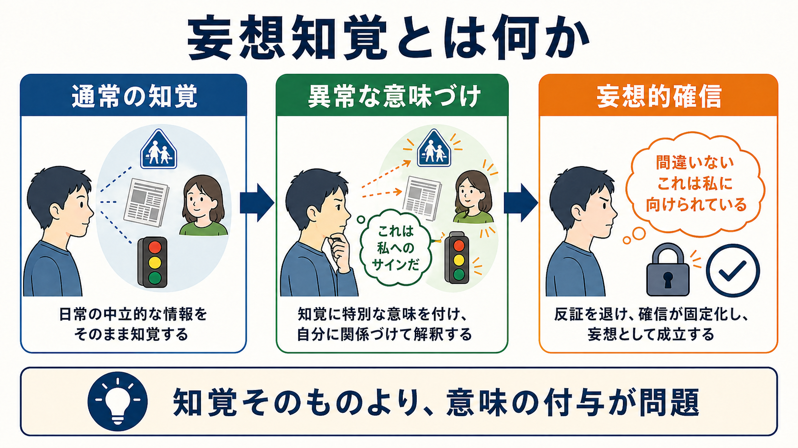
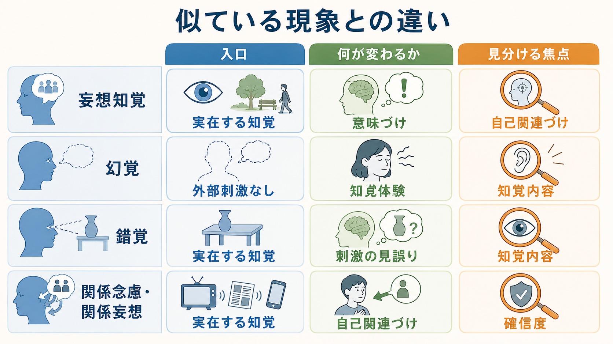
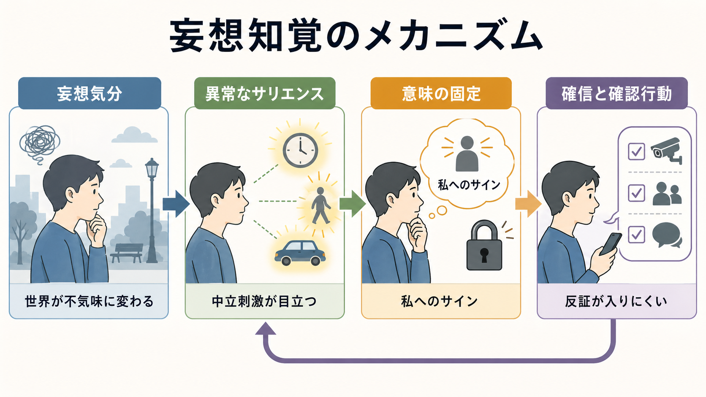

# 妄想知覚とは何か

## 要点

- 妄想知覚とは、実在する通常の知覚に対して、突然で個人的・しばしば自己関連的な妄想的意味が付与される現象である[1][2]。
- ポイントは「見えたもの」「聞こえたもの」自体が異常なのではなく、その知覚が「自分に向けられた決定的なサインだ」と理解される点にある[1][3]。
- 古典的には Schneider の一級症状の一つとして、統合失調症に比較的特異的な症状と考えられたが、現在はそれ単独で診断を決める所見ではない[1][4]。
- 臨床では、[[幻覚とは何か|幻覚]]、[[錯覚とは何か|錯覚]]、[[関係妄想とは何か|関係妄想]]、妄想気分、二次妄想と区別しつつ、体験の経過と文脈を丁寧に聞く必要がある。
- 本稿は教育・研究目的の整理であり、個別の診断や治療指示を行うものではない。

## この記事で答える問い

1. 妄想知覚は、通常の[[妄想とは何か|妄想]]や[[幻覚とは何か|幻覚]]と何が違うのか。
2. 「普通の知覚に異常な意味が付く」とは、具体的にどのような構造なのか。
3. なぜ古典的症候学では重視され、現在の診断体系では慎重に扱われるのか。
4. 面接や研究では、どのような点に注意して記述すべきか。

## まず結論

妄想知覚は、「知覚の異常」ではなく「知覚に付与される意味の異常」として理解するとつかみやすい。たとえば、信号が赤に変わる、新聞の見出しが目に入る、通行人がこちらを見る、といった通常なら中立的な出来事が、突然「これは私に対する特別な合図だ」「世界が私に何かを告げている」と確信される。このとき、知覚内容は実在するが、意味づけは本人にとって啓示的で、反証されにくく、[[妄想とは何か|妄想]]として固定する[1][2]。

したがって、妄想知覚を評価するときは、単に「変なことを信じているか」ではなく、次の順序を見る。

| 観点 | 確認すること |
|---|---|
| 知覚の入口 | 実在する外部刺激があったか |
| 意味づけ | その刺激に、突然で個人的な意味が付いたか |
| 確信度 | 反証や別解釈が入りにくい確信になっているか |
| 文脈 | 妄想気分、自己関連づけ、不安、睡眠、薬物、身体疾患などが関与していないか |

## 背景

妄想知覚は、古典的な精神症候学で重視されてきた概念である。Schneider の一級症状では、思考吹入・思考奪取・思考伝播、作為体験、特定の幻聴などと並び、統合失調症を示唆する症状として扱われた。Cochrane の診断精度レビューでは、一級症状は診断の手がかりにはなるが、感度・特異度には限界があり、それだけで統合失調症を診断することは推奨されないと整理されている[4]。

近年の論文では、妄想知覚は ICD-11 からは明示的に削除され、DSM 系でも独立項目としては扱われてこなかったため、臨床的注意から抜け落ちる危険があると指摘されている[1]。しかし、これは「不要な概念になった」という意味ではない。むしろ、診断ラベルとして機械的に使うのではなく、本人の体験構造、意味づけの突然性、自己関連性、妄想気分とのつながりを記述するための症候学的概念として重要である。

## 基本概念

### 妄想知覚の最小定義

妄想知覚は、真の知覚に対して、誤った、しばしば奇異で自己関連的な意味や解釈が付与される現象である[2]。ここでいう「真の知覚」とは、実際に信号が見えた、新聞を読んだ、人の視線に気づいた、音を聞いた、という水準では外部刺激が存在するという意味である。

ただし、単なる誤解とは異なる。妄想知覚では、意味づけが突然に立ち上がり、本人には「わかった」「そういうことだったのか」という啓示のように体験されやすい。HPO/MedGen の定義でも、妄想気分や妄想的雰囲気の中で、曖昧な懸念が明確な妄想的観察へ発展することがあるとされる[2]。

### 二リンクモデルと一リンクモデル

Nielsen らは、妄想知覚の理解に二つのモデルがあると整理している[1]。

| モデル | 考え方 | 例 |
|---|---|---|
| 二リンクモデル | 知覚そのものは保たれ、その後に異常な解釈が付く | 「信号が赤になった」ことを「私への合図」と解釈する |
| 一リンクモデル | 知覚体験の中に、すでに妄想的意味が含まれている | 信号が見えた瞬間から、それが「私への決定的な徴」として体験される |

二リンクモデルは臨床的に説明しやすいが、本人の体験では「まず普通に見て、あとから解釈した」という順番ではなく、知覚と意味が一体化して到来することがある。そのため、面接では「そのとき、どのように見えたか」「意味は後から考えたのか、その瞬間からわかったのか」を分けて聞くとよい。

### 似ている概念との違い

| 概念 | 入口 | 何が変わるか | 見分ける焦点 |
|---|---|---|---|
| 妄想知覚 | 実在する知覚 | 意味づけ | 「知覚に特別な意味が突然付いたか」 |
| [[幻覚とは何か|幻覚]] | 外部刺激なし、または刺激で説明しにくい知覚体験 | 知覚体験 | 「外から来たように聞こえる・見えるか」 |
| [[錯覚とは何か|錯覚]] | 実在する刺激 | 知覚内容の見誤り | 「対象を別のものとして知覚したか」 |
| [[関係妄想とは何か|関係妄想]] | 出来事・発言・メディアなど | 自己関連づけ | 「周囲の出来事が自分に関係すると確信するか」 |
| 二次妄想 | 気分、幻覚、記憶、身体感覚など | 説明仮説 | 「先行する体験を説明するために生じたか」 |

妄想知覚と関係妄想は重なることが多い。違いを強調するなら、妄想知覚は「特定の知覚体験を契機に妄想的意味が成立すること」、関係妄想は「周囲の出来事が自分に関係していると確信される内容の型」である。

## 仕組み

### 1. 妄想気分と「意味の過剰」

妄想知覚は、しばしば妄想気分の中で理解される。妄想気分とは、世界がどこか不気味で、何か重大なことが起こりそうで、しかしまだ意味がはっきりしない体験である。Jaspers に由来する現象学的整理では、妄想形成は本人の生活史や通常の動機づけから理解しにくいかたちで生じることがあるとされ、Mishara と Fusar-Poli は、こうした妄想気分や「文脈の喪失」を、精神病発症初期の重要な体験構造として論じている[5]。

この段階では、世界全体が意味を帯びすぎているが、まだ内容は固定していない。そこに特定の知覚が入ると、「これが答えだ」という形で妄想的意味が結晶化することがある。

### 2. 異常なサリエンス

Kapur の異常サリエンス仮説では、ドパミン系の調節異常により、本来は中立的な刺激や表象に過剰な重要性が付与され、本人がその重要性を説明しようとする過程で妄想的解釈が形成されると考える[6]。この枠組みは、妄想知覚を「普通の知覚が、なぜ突然決定的な意味を持つのか」と考えるうえで有用である。

ただし、異常サリエンスは単独原因ではない。本人の不安、孤立、文化的文脈、睡眠、身体状態、薬物、過去の対人経験、認知バイアスなどが相互に関与する。したがって、臨床では「ドパミンの問題」と単純化するのではなく、症候学的記述と生活文脈の理解を合わせて行う必要がある。

### 3. 反証の入りにくさと確信の固定

一度「これは私へのサインだ」と確信されると、次の知覚や出来事も同じ仮説を支える材料として読まれやすくなる。確認行動、回避、インターネット検索、周囲への過剰な確認、外出制限などが加わると、反証情報が入りにくくなり、確信がさらに固定される。ここでは、[[MSEで思考内容をどう評価するか|MSEで思考内容を評価する]]視点と、[[MSEで知覚異常をどう聞くか|知覚異常を聞く]]視点の両方が必要になる。

## 図解

図1は、妄想知覚を「通常の知覚」「異常な意味づけ」「妄想的確信」の流れとして示している。図2は、妄想気分、異常なサリエンス、意味の固定、確認行動が循環しうることを示す。図3は、妄想知覚を[[幻覚とは何か|幻覚]]、[[錯覚とは何か|錯覚]]、[[関係妄想とは何か|関係妄想]]と比較するための見取り図である。

## 臨床・研究との接続

### 面接での聞き方

妄想知覚を評価するときは、結論を急がず、本人の語りを時間順に確認する。

| 聞く軸 | 例 |
|---|---|
| きっかけ | 「最初に何が見えたり聞こえたりしましたか」 |
| 知覚の性質 | 「それは実際にそこにあったものですか、それとも外から来たように感じた体験ですか」 |
| 意味の生じ方 | 「その意味は後から考えたものですか、その瞬間にわかった感じでしたか」 |
| 確信度 | 「別の説明もありうると思えますか」 |
| 生活への影響 | 「その後、行動や人との関わりは変わりましたか」 |
| 鑑別 | 「睡眠不足、薬物、身体症状、せん妄、気分症状はありませんか」 |

この聞き方は、本人の体験を否定せずに、症候を記述するためのものである。妄想内容を正面から論破しようとすると、警戒や孤立が強まり、評価が難しくなることがある。

### 診断体系との関係

妄想知覚は、歴史的には統合失調症を示唆する一級症状として扱われた。しかし一級症状の診断精度には限界があり、Cochrane レビューでは、精神病圏の鑑別において一級症状だけに依存すると誤診や見逃しが生じうるとされる[4]。ICD-11 CDDR でも、統合失調症や一次性精神症群の評価では、妄想、幻覚、思考形式、陰性症状、持続期間、機能障害、気分症状や物質・身体疾患との関係を総合的に見る構造になっている[7]。

したがって、妄想知覚は「診断を一発で決める印」ではなく、[[精神症候学とは何か|精神症候学]]的に重要な体験構造として記述するのが適切である。

### 研究での位置づけ

研究では、妄想知覚は古典的な分類概念であると同時に、妄想形成、自己関連処理、異常サリエンス、予測処理、現象学的精神病理学をつなぐテーマになる。Rossi Monti は、妄想知覚がかつて妄想と統合失調症の診断上の参照点であった一方、Schneider 症状の疾患特異性が弱まったことで、妄想知覚と統合失調症を強く結びつける見方が緩んだと論じている[8]。この変化は、妄想知覚を捨てる理由ではなく、疾患横断的・文脈依存的に再検討する理由になる。

## よくある誤解

### 誤解1: 妄想知覚は幻覚である

違う。[[幻覚とは何か|幻覚]]は外部刺激で説明しにくい知覚体験であり、妄想知覚は実在する知覚に妄想的意味が付く現象である。ただし、幻聴に対して「これは組織からの命令だ」と解釈する場合のように、幻覚と妄想的意味づけが結びつくことはある。

### 誤解2: 普通の出来事を自分に関係づければ、すべて妄想知覚である

違う。誰でも、疲労や不安の中で「自分のことを言われたのでは」と感じることはある。妄想知覚と呼ぶには、実在する知覚を契機に、突然で強い、反証されにくい妄想的意味が成立しているかを確認する必要がある。

### 誤解3: 妄想知覚があれば統合失調症である

違う。古典的には統合失調症との関連が強調されたが、現在は一症状だけで診断を決めない。気分エピソード、物質・薬剤、身体疾患、[[せん妄とは何か|せん妄]]、発達特性、文化的背景、トラウマ、睡眠不足などを含めて総合的に考える[4][7]。

### 誤解4: 反証すればすぐ修正できる

妄想知覚では、意味づけが本人にとって啓示的で、世界の見え方全体と結びついていることがある。単純な説得よりも、安全、睡眠、生活機能、対人関係、苦痛、リスク、支援体制を整えながら評価することが重要である。

## 関連ノート

既存ノート:

- [[妄想とは何か]]
- [[関係妄想とは何か]]
- [[被害妄想とは何か]]
- [[注察妄想とは何か]]
- [[幻覚とは何か]]
- [[錯覚とは何か]]
- [[精神症候学とは何か]]
- [[MSEで思考内容をどう評価するか]]
- [[MSEで知覚異常をどう聞くか]]
- [[DSMとICDは何が違うのか]]

今後の作成候補:

- 妄想気分とは何か
- 一級症状とは何か
- 作為体験とは何か
- 異常サリエンス仮説とは何か
- 一次妄想と二次妄想は何が違うのか

MOC 更新候補:

- `content/00_MOC/` 配下の精神医学・症候学関連 MOC に追加する。
- 並列生成ジョブとの競合を避けるため、本ジョブでは MOC 本体は更新しない。

## 理解チェック

1. 妄想知覚で異常なのは、知覚そのものか、知覚に付与される意味か。
2. 妄想知覚と[[幻覚とは何か|幻覚]]を区別するために、最初に確認すべきことは何か。
3. 二リンクモデルと一リンクモデルは、妄想的意味が生じる順序をどのように違って考えるか。
4. なぜ妄想知覚だけで統合失調症を診断してはいけないのか。
5. 面接で妄想知覚を聞くとき、本人の体験を否定せずに確認できる質問を一つ挙げよ。

## 参考文献

[1] Nielsen, K. M., Nordgaard, J., & Henriksen, M. G. (2022). Delusional Perception Revisited. *Psychopathology, 55*(6), 325-334. https://doi.org/10.1159/000524642

[2] National Center for Biotechnology Information. MedGen: Delusional perception (Concept ID: C0424024). https://www.ncbi.nlm.nih.gov/medgen/602813

[3] Koehler, K. (1976). Delusional perception and delusional notion linked to a perception. *Psychiatria Clinica, 9*(1), 45-58. https://doi.org/10.1159/000283664

[4] Soares-Weiser, K., Maayan, N., Bergman, H., Davenport, C., Kirkham, A. J., Grabowski, S., & Adams, C. E. (2015). First rank symptoms for schizophrenia. *Cochrane Database of Systematic Reviews*, CD010653. https://doi.org/10.1002/14651858.CD010653.pub2

[5] Mishara, A. L., & Fusar-Poli, P. (2013). The Phenomenology and Neurobiology of Delusion Formation During Psychosis Onset: Jaspers, Truman Symptoms, and Aberrant Salience. *Schizophrenia Bulletin, 39*(2), 278-286. https://doi.org/10.1093/schbul/sbs155

[6] Kapur, S. (2003). Psychosis as a State of Aberrant Salience: A Framework Linking Biology, Phenomenology, and Pharmacology in Schizophrenia. *American Journal of Psychiatry, 160*(1), 13-23. https://doi.org/10.1176/appi.ajp.160.1.13

[7] World Health Organization. (2024). *Clinical descriptions and diagnostic requirements for ICD-11 mental, behavioural and neurodevelopmental disorders*. https://www.who.int/publications/i/item/9789240077263

[8] Rossi Monti, M. (1998). Whatever happened to delusional perception? *Psychopathology, 31*(5), 225-233. https://doi.org/10.1159/000029044

## 未解決問題

- 妄想知覚を、現代の診断体系でどの程度独立した症候として記録すべきか。
- 二リンクモデルと一リンクモデルの違いを、臨床面接や研究尺度でどのように安定して評価できるか。
- 異常サリエンス、自己関連処理、予測処理、現象学的記述を、個別支援に役立つ形でどう統合するか。
