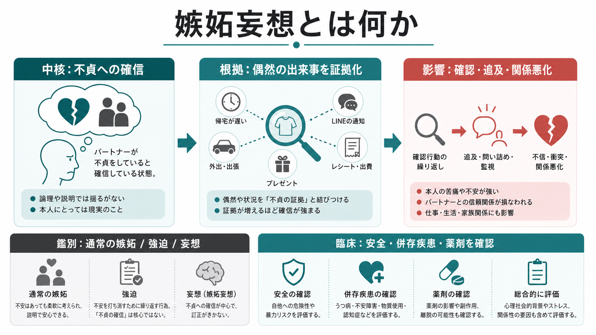
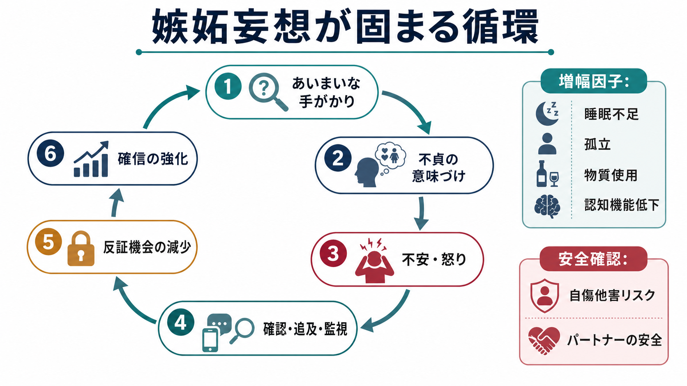
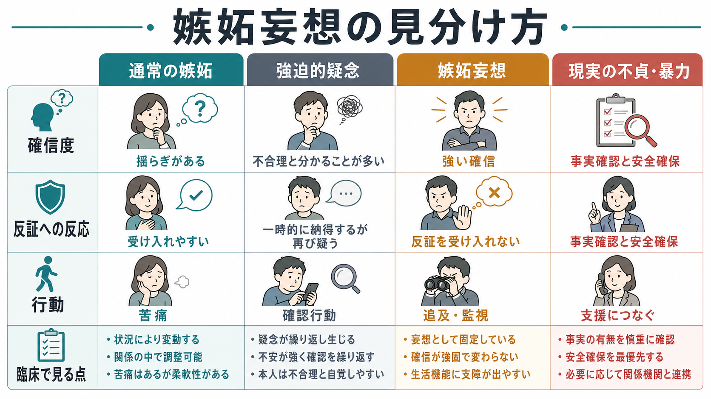

# 嫉妬妄想とは何か

## 要点

- 嫉妬妄想とは、配偶者や恋人など親密な相手が不貞をしているという信念が、乏しい根拠にもかかわらず強く固定される[[妄想とは何か|妄想]]の一型である[1][2]。
- 「嫉妬が強い」ことだけでは嫉妬妄想とはいえない。重要なのは、確信度、反証への反応、証拠の読み取り方、確認・追及・監視などの行動化、生活機能や安全への影響である[1][3]。
- Othello syndrome という呼称も使われるが、文献上は妄想性障害、統合失調症スペクトラム、気分障害、物質・薬剤、パーキンソン病などの神経疾患に伴う症候として扱われることがある[1][5][6]。
- 臨床では、本人の苦痛だけでなく、パートナーの安全、自傷他害リスク、家庭内暴力、ストーキング、物質使用、せん妄・認知症・薬剤性精神病などの背景を確認する必要がある[1][6][7]。
- 本稿は教育・研究目的の整理であり、個別の診断や治療指示ではない。

## この記事で答える問い

1. 嫉妬妄想は、通常の嫉妬や不安と何が違うのか。
2. なぜ偶然の出来事が「不貞の証拠」として固まっていくのか。
3. 臨床面接や研究では、どのような軸で整理すると安全で有用か。

## まず結論

嫉妬妄想は、「相手を愛しているから嫉妬している」という感情の強さだけでは説明できない。中心にあるのは、相手の不貞についての強い確信であり、偶然の出来事、相手の遅い帰宅、スマートフォン通知、服装、レシート、会話の間などが、選択的に「証拠」として集められていく点である[1][4]。

通常の嫉妬では、根拠が乏しければ疑いは揺らぎ、相手の説明や状況の変化で軽くなることが多い。嫉妬妄想では、反証が「隠しているからだ」「口裏を合わせているからだ」と再解釈されやすく、確認行動や追及によって関係が悪化し、さらに疑いが強まる循環が生じやすい[4][8]。

## 背景

診断分類上、嫉妬を主題とする妄想は、妄想性障害の「嫉妬型」または妄想内容の一つとして整理される。NCBI MedGen は jealous type delusional disorder を「配偶者または恋人が不貞であるという中心主題をもつ妄想性障害の一型」と定義している[2]。ICD-11 の臨床記述でも、妄想性障害では内容が個人内で安定しやすく、嫉妬妄想として「配偶者が不貞であるという不当な信念」が例示される[3]。

ただし、嫉妬妄想は単一の診断名ではない。[[被害妄想とは何か|被害妄想]]や[[関係妄想とは何か|関係妄想]]と重なることがあり、精神病性障害、気分エピソード、物質・薬剤、神経疾患、[[せん妄とは何か|せん妄]]、[[認知機能障害とは何か|認知機能障害]]の文脈でもみられる[1][5][6]。したがって、記事名としての「嫉妬妄想」は、診断ラベルではなく、思考内容の症候名として読むのがよい。

## 基本概念

### 中核

嫉妬妄想の中核は、「親密な相手が不貞をしている」という確信である。典型的には、相手の行動を監視する、携帯電話や持ち物を調べる、頻繁に問い詰める、第三者を不貞相手だと名指しする、相手の外出や交友を制限しようとする、といった行動が伴うことがある[1][7]。

ここで大切なのは、現実の不貞や関係上の問題が存在する可能性を最初から否定しないことである。実際の不貞、暴力、支配、ハラスメントが存在する場合もある。臨床的には、事実確認と安全確認を行いながら、信念の固定性、根拠の質、反証への反応、生活機能への影響を分けて見る必要がある。

### 通常の嫉妬との違い

通常の嫉妬は、関係を失う不安や怒り、悲しみを含む情動であり、必ずしも病的ではない。嫉妬妄想では、疑いが「可能性」ではなく「確信」として体験され、反証が入りにくくなる。相手が説明しても、説明それ自体が隠蔽の証拠として解釈されることがある[4][8]。

### 強迫的疑念との違い

[[強迫観念とは何か|強迫観念]]としての嫉妬では、「不貞かもしれない」という考えが侵入的に浮かび、本人がそれを不合理だと感じることが多い。これに対して嫉妬妄想では、信念は本人にとって現実そのものとして体験されやすい。ただし、強迫、過価観念、妄想は連続的であり、面接では確信度と洞察の程度を丁寧に見る。

## 仕組み

### 1. あいまいな手がかりの過剰な意味づけ

嫉妬妄想では、相手の帰宅が少し遅い、服装が変わった、スマートフォンを伏せて置いた、会話の間があった、といったあいまいな出来事が「不貞の証拠」として意味づけられる。Othello syndrome の文献では、偶然、会話の断片、置き忘れた物品などの根拠の乏しい手がかりが、裏切りの証拠として組み込まれることが指摘されている[6]。

この過程は、[[不安とは何か|不安]]や怒りが強いほど進みやすい。情動が高いと、脅威に合う情報だけが目立ち、別の説明を考える余地が狭くなる。

### 2. 確認行動が反証機会を減らす

疑いを下げるために、相手を問い詰める、スマートフォンを見る、予定を細かく確認する、外出を制限する、といった行動が起こることがある。短期的には安心をもたらしても、長期的には相手の防衛・回避・沈黙を引き出し、それがさらに疑いの証拠として解釈されることがある。これは[[回避行動とは何か|回避行動]]や確認行動が不安を維持する仕組みに近い。

### 3. 妄想一般のメカニズムとの接続

妄想研究では、異常なサリエンス、結論への飛躍、確証バイアス、予測誤差の重みづけなどが、妄想形成と維持を説明する枠組みとして検討されてきた[8]。嫉妬妄想でも、あいまいな対人刺激が過剰に重要なものとして感じられ、その感覚を説明する仮説として「不貞」が選ばれ、以後はその仮説に合う情報が集まりやすくなる。

### 4. 背景要因

背景には、精神病性障害、気分障害、物質使用、薬剤、神経疾患、認知機能低下、睡眠不足、孤立、関係性のストレスが関与しうる[1][5][6][7]。パーキンソン病では、Othello syndrome が幻視や抑うつ、ドパミン作動薬などと関連して報告されており、薬剤性・神経疾患性の可能性を見落とさないことが重要である[5][6]。

## 図解

図1は、嫉妬妄想を「不貞への確信」「偶然の出来事の証拠化」「確認・追及・関係悪化」「鑑別」「臨床評価」という5つの視点に分ける概念地図である。図2は、あいまいな手がかりが不貞の意味づけを受け、情動と確認行動を通じて確信が強化される循環を示す。

図3は、通常の嫉妬、強迫的疑念、嫉妬妄想、現実の不貞・暴力を混同しないための比較である。実務上は、妄想かどうかだけでなく、安全確保、事実確認、支援資源への接続を同時に考える。

## 臨床・研究との接続

### 臨床評価で見る点

臨床面接では、次の点を分けて確認する。

| 観点 | 確認すること |
|---|---|
| 内容 | 誰が、いつ、どのように不貞をしていると考えているのか |
| 確信度 | 可能性なのか、ほぼ確実なのか、完全な確信なのか |
| 根拠 | 具体的な事実か、偶然の出来事の解釈か、第三者情報か |
| 反証への反応 | 別の説明を検討できるか、反証を隠蔽の証拠にするか |
| 行動 | 確認、追及、監視、外出制限、暴力、法的トラブルがあるか |
| 安全 | 自傷他害、パートナーの安全、子どもや家族への影響 |
| 背景 | 物質・薬剤、神経疾患、気分症状、幻覚、せん妄、認知機能 |

この評価は、本人を論破するためではない。本人にとっては苦痛を伴う現実として体験されているため、体験の苦痛と安全を扱いながら、別の説明を検討できる余地を少しずつ作ることが重要である。

### 研究上の位置づけ

研究では、嫉妬妄想は「嫉妬」という情動、「不貞」という対人内容、「確信の固定性」という妄想性、「確認・監視」という行動化が重なる現象として扱える。Easton らは、嫉妬障害の症例史398例を検討し、DSM-IV の妄想性障害嫉妬型の基準を完全に満たすものは一部に限られると報告した[7]。この結果は、病的嫉妬全体と嫉妬妄想を混同せず、連続性と診断閾値を分けて扱う必要を示している。

## よくある誤解

### 誤解1: 嫉妬妄想は「性格が悪い」「独占欲が強い」だけである

そうとは限らない。嫉妬妄想は、妄想性の確信、強い情動、認知バイアス、物質・薬剤、神経疾患、関係性ストレスなどが絡む症候である[1][5][6]。人格評価だけに還元すると、安全評価や背景疾患の確認が抜け落ちる。

### 誤解2: 事実ではないと証明すれば治まる

反証がすぐに効くとは限らない。妄想では、反証が別の証拠として再解釈されることがある。正面から否定するよりも、苦痛、睡眠、物質使用、安全、確認行動、生活機能を扱いながら、別の説明を検討する余地を作る方が臨床的には有用なことが多い。

### 誤解3: 嫉妬妄想がある人は必ず危険である

これも誤りである。精神症状があることと暴力性は同義ではない。ただし、嫉妬妄想は親密な関係を直接巻き込み、追及、監視、ストーキング、暴力、自傷他害に接続する可能性があるため、安全評価は軽視できない[1][7]。

### 誤解4: 実際の不貞や暴力を考えなくてよい

嫉妬妄想という仮説があっても、現実の不貞、家庭内暴力、支配、脅迫、ハラスメントが存在する可能性は残る。症状評価と安全確保、事実確認、支援資源への接続は分けて考える。

## 関連ノート

既存ノート:

- [[妄想とは何か]]
- [[被害妄想とは何か]]
- [[関係妄想とは何か]]
- [[注察妄想とは何か]]
- [[強迫観念とは何か]]
- [[不安とは何か]]
- [[回避行動とは何か]]
- [[せん妄とは何か]]
- [[認知機能障害とは何か]]
- [[精神症候学とは何か]]

今後の作成候補:

- Othello syndrome とは何か
- 妄想性障害とは何か
- 病的嫉妬とは何か
- パーキンソン病精神病とは何か
- ドパミン作動薬と精神症状
- 親密な関係における安全評価

MOC更新候補:

- `content/00_MOC/` 配下の精神医学・症候学関連 MOC に、バッチ統合時に `[[嫉妬妄想とは何か]]` を追加する。

## 理解チェック

1. 通常の嫉妬と嫉妬妄想を分けるとき、内容の奇妙さ以外にどの軸を見るべきか。
2. 「相手の説明がかえって怪しく感じられる」ことは、嫉妬妄想の維持にどう関わるか。
3. 嫉妬妄想を疑うとき、本人の診断評価と同時に確認すべき安全上の項目は何か。
4. パーキンソン病や薬剤の文脈で嫉妬妄想を考える必要があるのはなぜか。

## 参考文献

[1] Joseph, S. M., & Siddiqui, W. (2023). *Delusional Disorder*. StatPearls. NCBI Bookshelf. https://www.ncbi.nlm.nih.gov/books/NBK539855/

[2] National Center for Biotechnology Information. *Jealous Type Delusional Disorder*. MedGen. https://www.ncbi.nlm.nih.gov/medgen/452758

[3] World Health Organization. (2024). *Clinical descriptions and diagnostic requirements for ICD-11 mental, behavioural and neurodevelopmental disorders*. https://iris.who.int/bitstream/handle/10665/375767/9789240077263-eng.pdf

[4] Tarrier, N., Beckett, R., Harwood, S., & Bishay, N. (1990). Morbid jealousy: a review and cognitive-behavioural formulation. *British Journal of Psychiatry, 157*, 319-326. https://doi.org/10.1192/bjp.157.3.319

[5] Kataoka, H., & Sugie, K. (2018). Delusional jealousy (Othello syndrome) in 67 patients with Parkinson's disease. *Frontiers in Neurology, 9*, 129. https://doi.org/10.3389/fneur.2018.00129

[6] De Michele, G., et al. (2021). Othello syndrome in Parkinson's disease: a systematic review and report of a case series. *Neurological Sciences, 42*(7), 2721-2729. https://doi.org/10.1007/s10072-021-05249-4

[7] Easton, J. A., Shackelford, T. K., & Schipper, L. D. (2008). Delusional disorder-jealous type: how inclusive are the DSM-IV diagnostic criteria? *Journal of Clinical Psychology, 64*(3), 264-275. https://doi.org/10.1002/jclp.20442

[8] Kapur, S. (2003). Psychosis as a state of aberrant salience: a framework linking biology, phenomenology, and pharmacology in schizophrenia. *American Journal of Psychiatry, 160*(1), 13-23. https://doi.org/10.1176/appi.ajp.160.1.13

## 未解決問題

- 病的嫉妬、強迫的嫉妬、嫉妬妄想を、連続的な症状次元として測定する最適な方法はまだ確立途上である。
- 安全評価を重視しながら、本人の体験を否定しすぎず、パートナーの安全も守る面接技法の整理が必要である。
- SNS、位置情報、メッセージアプリなど現代的な情報環境が、嫉妬妄想の内容と維持にどう影響するかは、さらに検討が必要である。
