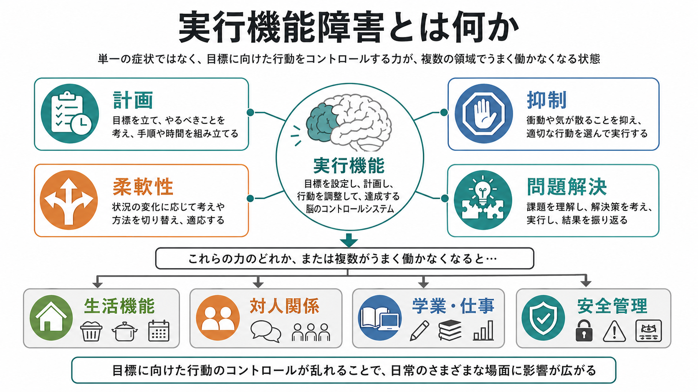
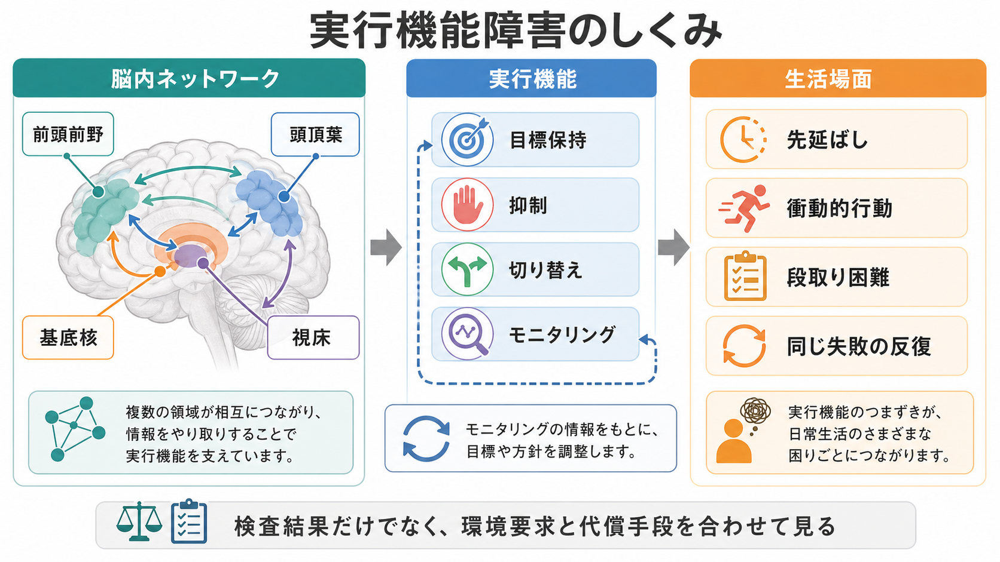

# 実行機能障害とは何か

## 要点

- 実行機能障害とは、目標を立て、手順を組み、衝動や妨害刺激を抑え、状況に応じて方略を切り替え、結果を点検する働きが弱まる状態である。
- 「計画性がない」「だらしない」という性格評価ではなく、[[中央実行系とは何か|中央実行系]]、[[抑制制御とは何か|抑制制御]]、[[認知的柔軟性とは何か|認知的柔軟性]]、ワーキングメモリ、モニタリングが組み合わさった高次認知の問題として見る。
- 検査室では目立たなくても、買い物、服薬管理、仕事の段取り、対人場面、家計管理、危険判断など、複数の要求が同時にかかる生活場面で強く現れることがある。
- 前頭葉だけの局在症状ではなく、前頭前野、頭頂葉、基底核、視床、小脳、白質連絡、神経伝達系を含む分散ネットワークの問題として理解する必要がある。
- 本稿は教育・研究目的の概説であり、個別の診断や治療指示ではない。

## この記事で答える問い

- 実行機能障害では、どのような認知過程が障害されるのか。
- 計画、抑制、柔軟性、問題解決の障害は、生活機能にどう現れるのか。
- なぜ「前頭葉障害」だけでは説明が足りないのか。
- 臨床や研究では、検査結果と日常生活の困難をどう結びつけて考えるのか。

## まず結論

実行機能障害は、目標指向行動を支える「制御の組み合わせ」が崩れた状態である。中核には、反応を止める抑制、情報を保持しながら操作するワーキングメモリ、規則や視点を切り替える柔軟性があり、これらが計画、問題解決、自己モニタリング、意思決定を支える[1][2]。したがって、実行機能障害は単一の症状名というより、「目的に沿って行動を組み立てる力」が、複数の入口から損なわれる症候群として理解するとよい。

生活上は、やるべきことは分かっているのに始められない、始めても順序が崩れる、予期しない変化に対応できない、衝動的に反応する、同じ失敗を繰り返す、時間や金銭や服薬を管理できない、といった形で現れる。これらは[[注意障害とは何か|注意障害]]、記憶障害、意欲低下、気分症状、睡眠不足、薬剤、身体疾患、環境負荷とも重なりやすいため、症状だけで原因を一つに決めないことが重要である[3]。

## 背景

実行機能という考え方は、古典的には前頭葉損傷後にみられる計画困難、脱抑制、保続、判断低下、社会的行動の変化を説明する文脈で発展した。現在では、前頭葉は重要な結節点ではあるが、実行機能を「前頭葉の一機能」とだけ捉えるのは狭すぎる。神経心理学と脳画像研究は、前頭前野、頭頂葉、基底核、視床、小脳、白質ネットワークが、課題目標の保持、選択、切り替え、エラー検出に関わることを示している[3][4]。

この背景を押さえると、実行機能障害を「知能が低い」「記憶が悪い」「意欲がない」と単純化しにくくなる。たとえば、単語の記憶は保たれていても、複数の予定を優先順位づけできないことがある。会話では理解が良好でも、現実の仕事では中断や締切や対人調整が重なるため破綻することがある。ここに、検査室での成績と日常生活上の困難がずれる理由がある[5][6]。

## 基本概念

### 実行機能は何を実行しているのか

実行機能は、低次の認知過程を「目的に沿って使う」ための制御である。視覚、記憶、言語、運動がそれぞれ働いていても、何を優先し、何を止め、どの順番で進め、結果をどう修正するかが整わなければ、生活上の行動はまとまりにくい。

代表的な構成要素は次のように整理できる。

| 構成要素 | 役割 | 障害されたときの見え方 |
|---|---|---|
| 目標保持・ワーキングメモリ | 今やるべき目的、規則、手順を頭に保つ | 途中で目的を忘れる、指示が多いと崩れる |
| 抑制 | 不適切な反応、衝動、妨害刺激を止める | 失言、衝動買い、割り込み、危険判断の低下 |
| 認知的柔軟性 | 規則、視点、方略を切り替える | 予定変更に弱い、こだわり、同じ方法への固着 |
| 計画・組織化 | 目標までの手順を分け、順序づける | 段取りが立たない、時間配分ができない |
| モニタリング | 自分の行動と結果を点検し修正する | ミスに気づかない、同じ失敗を繰り返す |
| 問題解決 | 新しい状況で仮説を立て、試し、修正する | 想定外に弱い、助言を実行へ移せない |

Miyake らの潜在変数研究は、実行機能が一枚岩ではなく、更新、抑制、切り替えのように相関しながらも分けられる構成をもつことを示した[2]。その後の「unity and diversity」の枠組みも、実行機能には共通因子と個別成分があると整理している[7]。臨床的にも、ある人は脱抑制が目立ち、別の人は計画や切り替えが主問題になる。

### 障害は「能力」と「環境要求」のずれで見える

実行機能障害は、本人の能力だけでなく、環境がどれほど複雑かによって見え方が変わる。静かな部屋で一つの課題を解く場面では保たれていても、電話が鳴る、締切が迫る、感情的な対人刺激がある、複数の選択肢がある、失敗がすぐには見えない、といった状況では困難が増える。

そのため、評価では「できる・できない」だけでなく、どの場面で、どの程度の支援があれば、どの程度安定してできるかを見る必要がある。これは[[GAFやWHODASは何を評価するのか|生活機能評価]]やリハビリテーション計画とも接続する視点である。

## 仕組み

実行機能は、単一の「司令塔」がすべてを命令するというより、複数の制御過程が状況に応じて協調する仕組みである。Stuss は、前頭葉内にも課題設定、モニタリング、活性化、情動・行動調整、統合的処理など異なる働きが分布しており、単一の中央実行器を想定しすぎないことを強調した[4]。

神経解剖学的には、次のような回路の相互作用が重要になる。

- 前頭前野: 目標保持、規則適用、抑制、計画、モニタリングに関わる。
- 頭頂葉: 注意の配分、課題関連情報の保持、空間的・数量的処理に関わる。
- 基底核・視床: 行動選択、開始、停止、習慣化、前頭皮質とのループに関わる。
- 小脳: タイミング、予測、誤差修正、認知的な系列処理にも関わる。
- 白質連絡・神経伝達系: 各領域の協調、処理速度、覚醒水準、報酬感受性を調整する。

このため、実行機能障害は外傷性脳損傷、脳血管障害、神経変性疾患、パーキンソン病、認知症、せん妄、ADHD、統合失調症、うつ病、物質使用、睡眠障害、薬剤影響、全身疾患など、さまざまな条件で生じうる[3]。同じ「段取りが悪い」という訴えでも、背景病態は大きく異なる。

## 図解

1 枚目の図は、実行機能障害を「計画」「抑制」「柔軟性」「問題解決」の崩れとして整理し、それが生活機能、対人関係、学業・仕事、安全管理へ波及する流れを示している。重要なのは、これらが別々の箱ではなく、日常生活では同時に要求される点である。

2 枚目の図は、前頭前野だけでなく、頭頂葉、基底核、視床などを含むネットワークから、目標保持、抑制、切り替え、モニタリングが生じ、先延ばし、衝動的行動、段取り困難、同じ失敗の反復につながる流れを示している。検査値だけでなく、環境要求と代償手段を合わせて見る必要がある。

## 臨床・研究との接続

### 精神医学的評価

精神科面接では、実行機能障害は[[MSEで認知機能をどう評価するか|MSE の認知機能評価]]、病識、判断力、衝動性、生活歴、発達歴、服薬管理、金銭管理、対人トラブル、就労・学業機能の中に現れる。本人は困っているが言語化しにくい場合もあれば、周囲の観察で初めて明らかになる場合もある。

聞き取りでは、次のような具体的場面を確認するとよい。

- 朝の準備、家事、買い物、通院、服薬、支払い、書類提出をどの程度自力で組み立てられるか。
- 予定変更、中断、複数課題、対人ストレスが入るとどう変化するか。
- ミスに気づけるか、気づいた後に修正できるか。
- メモ、アラーム、チェックリスト、支援者、環境調整でどの程度改善するか。

これは個別診断そのものではなく、生活機能と支援ニーズを把握するための臨床的記述である。

### 神経心理学的評価

伝統的には、Trail Making Test、Stroop 課題、Wisconsin Card Sorting Test、Tower of London、言語流暢性、ワーキングメモリ課題などが用いられてきた。これらは特定の制御成分を比較的標準化された条件で測る利点がある。

一方で、日常生活は、検査よりも開放的で、複数の目標が競合し、正解が一つに決まらず、感情や社会的文脈が混ざる。生態学的妥当性を扱った研究は、神経心理検査が日常生活上の認知機能を予測する力には一定の有用性があるものの、完全ではなく、評価する認知領域と生活上のアウトカムが対応しているほど関連が強いことを示している[5]。Burgess らは、従来課題だけでなく、現実場面に近い実行機能評価を開発・併用する必要性を論じた[6]。

### 疾患横断的な見方

実行機能障害は疾患横断的に出現する。ADHD では不注意、衝動性、多動性の背後に、抑制、ワーキングメモリ、時間管理、計画の困難が関わることがある。統合失調症では認知機能障害の一部として、計画、抽象化、認知的柔軟性、モニタリングの障害が社会機能や職業機能と関係することがある[8]。認知症や前頭側頭葉変性症では、脱抑制、無関心、固執、判断低下が早期から生活機能に影響する場合がある[3]。

このように、実行機能障害は診断名を横断して現れる「機能的な問題」である。研究では成分ごとに測定し、臨床では生活場面での支障と代償可能性を記述する、という二重の視点が必要になる。

## よくある誤解

**「実行機能障害は前頭葉だけの問題である」**  
前頭葉は重要だが、実行機能は前頭前野、頭頂葉、基底核、視床、小脳、白質連絡、神経伝達系を含む分散ネットワークに支えられる[3][4]。

**「検査が正常なら生活上の実行機能障害はない」**  
検査は重要だが、生活場面では複数課題、時間制約、感情負荷、対人調整、環境刺激が加わる。生態学的妥当性の観点から、検査結果と日常生活情報を合わせて判断する必要がある[5][6]。

**「実行機能障害は本人の怠けである」**  
動機づけは影響するが、実行機能障害は目標保持、抑制、切り替え、モニタリングの制御困難として理解できる。道徳的評価に置き換えると、支援可能な要因を見落としやすい。

**「計画困難、注意散漫、記憶障害は同じものである」**  
重なりはあるが同一ではない。注意が保てないために計画が崩れることもあれば、目標保持や切り替えの問題が注意散漫のように見えることもある。[[認知機能障害とは何か|認知機能障害]]を成分ごとに整理する必要がある。

## 関連ノート

- [[中央実行系とは何か]]
- [[中央実行ネットワークとは何か]]
- [[抑制制御とは何か]]
- [[認知的柔軟性とは何か]]
- [[問題解決とは何か]]
- [[注意障害とは何か]]
- [[認知機能検査は何を測っているのか]]
- [[MSEで認知機能をどう評価するか]]
- [[GAFやWHODASは何を評価するのか]]
- [[ADHDは前頭線条体回路の障害として説明できるのか]]

MOC 更新候補: `content/00_MOC/` 配下の精神医学、認知科学、神経心理学、症候学関連 MOC。並列ジョブとの競合を避けるため、本稿では MOC 本体は更新しない。

## 理解チェック

1. 実行機能障害を「性格」ではなく「目標指向行動の制御障害」と見ると、評価の焦点はどう変わるか。
2. 抑制、ワーキングメモリ、認知的柔軟性のうち、日常生活の「同じ失敗を繰り返す」ことに特に関わるのはどれか。複数挙げてよい。
3. なぜ、静かな検査室での成績だけでは、生活場面での実行機能障害を十分に説明できないのか。
4. 実行機能障害を前頭葉だけでなく分散ネットワークとして考える利点は何か。

## 参考文献

[1] Diamond, A. (2013). Executive functions. *Annual Review of Psychology*, 64, 135-168. https://doi.org/10.1146/annurev-psych-113011-143750

[2] Miyake, A., Friedman, N. P., Emerson, M. J., Witzki, A. H., Howerter, A., & Wager, T. D. (2000). The unity and diversity of executive functions and their contributions to complex “frontal lobe” tasks: A latent variable analysis. *Cognitive Psychology*, 41(1), 49-100. https://doi.org/10.1006/cogp.1999.0734

[3] Rabinovici, G. D., Stephens, M. L., & Possin, K. L. (2015). Executive dysfunction. *Continuum*, 21(3 Behavioral Neurology and Neuropsychiatry), 646-659. https://doi.org/10.1212/01.CON.0000466658.05156.54

[4] Stuss, D. T. (2011). Functions of the frontal lobes: Relation to executive functions. *Journal of the International Neuropsychological Society*, 17(5), 759-765. https://doi.org/10.1017/S1355617711000695

[5] Chaytor, N., & Schmitter-Edgecombe, M. (2003). The ecological validity of neuropsychological tests: A review of the literature on everyday cognitive skills. *Neuropsychology Review*, 13(4), 181-197. https://doi.org/10.1023/B:NERV.0000009483.91468.fb

[6] Burgess, P. W., Alderman, N., Forbes, C., Costello, A., Coates, L. M. A., Dawson, D. R., Anderson, N. D., Gilbert, S. J., Dumontheil, I., & Channon, S. (2006). The case for the development and use of “ecologically valid” measures of executive function in experimental and clinical neuropsychology. *Journal of the International Neuropsychological Society*, 12(2), 194-209. https://doi.org/10.1017/S1355617706060310

[7] Friedman, N. P., & Miyake, A. (2017). Unity and diversity of executive functions: Individual differences as a window on cognitive structure. *Cortex*, 86, 186-204. https://doi.org/10.1016/j.cortex.2016.04.023

[8] Tyburski, E., Mak, M., Sokołowski, A., Starkowska, A., Karabanowicz, E., Kerestey, M., Lebiecka, Z., Preś, J., Sagan, L., & Jansari, A. S. (2021). Executive dysfunctions in schizophrenia: A critical review of traditional, ecological, and virtual reality assessments. *Journal of Clinical Medicine*, 10(13), 2782. https://doi.org/10.3390/jcm10132782

## 未解決問題

- 実行機能の成分を細かく分けるほど、日常生活上の支援計画にどこまで直接つながるのか。
- 検査室課題、生態学的課題、質問紙、実生活ログをどのように統合すると、より妥当な生活機能評価になるのか。
- 精神疾患横断的な実行機能障害を、診断分類、RDoC、ネットワーク神経科学、リハビリテーションの言葉でどう橋渡しするか。
