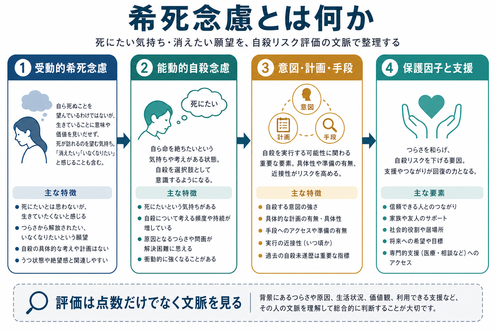
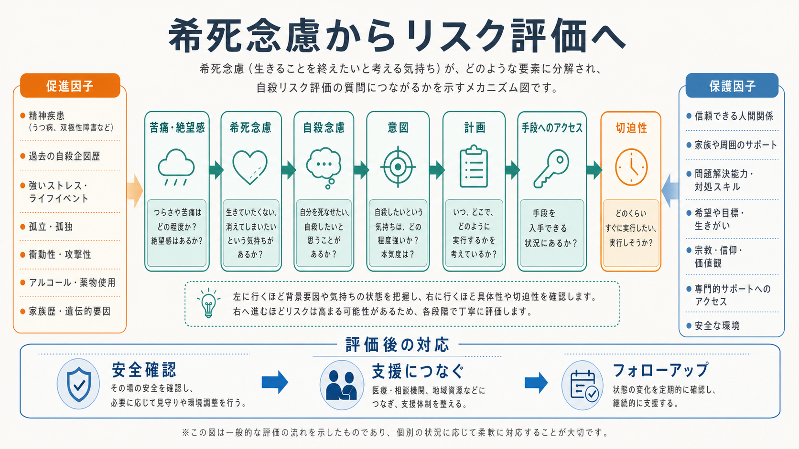

# 希死念慮とは何か

## 要点

- 希死念慮とは、「死にたい」「消えたい」「生きていたくない」といった死への願望や考えを指す臨床上の表現である。
- 自殺リスク評価では、希死念慮を「受動的な死への願望」だけで止めず、能動的な自殺念慮、意図、計画、手段へのアクセス、切迫性、過去の自殺企図、保護因子まで分けて聴く。
- 点数や「低・中・高リスク」という分類だけで将来の自殺を予測したり、支援の要否を決めたりするのは不十分である。NICE は、尺度を予測や退院判断の単独根拠にしないよう推奨している [1]。
- この記事は教育・研究目的の整理であり、個別の診断や治療指示ではない。差し迫った危険がある場合は、地域の救急・危機介入窓口につなぐ必要がある。

## この記事で答える問い

1. 希死念慮は、単なる「落ち込み」と何が違うのか。
2. 「消えたい」と「自殺したい」は同じ意味で扱ってよいのか。
3. 自殺リスク評価では、どのような要素に分けて確認するのか。
4. 尺度やスクリーニングは、臨床判断の中でどう位置づけるのか。

## まず結論

希死念慮は、自殺リスク評価の入口である。重要なのは、その言葉を聞いた時点で「本当に死ぬつもりがあるか、ないか」と二分することではない。死への願望が、苦痛からの離脱願望なのか、自殺を選択肢として考える状態なのか、さらに意図・計画・手段・実行時期まで具体化しているのかを、文脈の中で整理することである。

そのため、希死念慮は[[精神症候学とは何か|精神症候学]]の一症候としてだけでなく、[[症状と徴候は何が違うのか|症状と徴候]]、生活史、精神疾患、物質使用、孤立、痛み、喪失体験、保護因子を統合する臨床評価の結節点として扱う。

## 背景

自殺は公衆衛生上の重要課題であり、WHO は毎年 72 万人以上が自殺で亡くなり、15-29 歳では主要な死因の一つであると報告している [2]。自殺は単一の原因で起こるよりも、精神疾患、アルコール・薬物使用、過去の自殺企図、孤立、喪失、慢性疼痛、経済問題、差別、暴力被害などが重なって起こることが多い [2][3]。

一方で、希死念慮がある人の全員が自殺企図に進むわけではない。ここに評価の難しさがある。50 年分の縦断研究をまとめたメタ分析では、個別のリスク因子だけで将来の自殺念慮・自殺行動を高精度に予測することは難しく、予測力は全体として限定的だった [4]。したがって、臨床では「危険因子の足し算」ではなく、現在の苦痛、行動化のしやすさ、支援可能性、環境、時間的切迫性を含むリスク・フォーミュレーションが必要になる。

## 基本概念

### 希死念慮

希死念慮は、「死にたい」「眠ったまま目が覚めなければよい」「自分がいなければよい」「消えたい」といった、死や存在の消失に向かう考え・願望を含む広い概念である。日本語の臨床場面では、必ずしも英語の suicidal ideation と一対一に対応せず、受動的な死への願望から、能動的な自殺念慮までを含めて使われることがある。

### 受動的希死念慮

受動的希死念慮は、「自分で命を絶つつもりはないが、生き続けることがつらい」「自然に死ねたらよい」「消えてしまいたい」といった状態である。これは「安全」という意味ではない。ASQ のような短時間スクリーニングでも、「この数週間、死んでしまいたいと思ったか」「自分や家族は自分が死んだ方がよいと思ったか」といった受動的な死への願望を質問に含めている [5]。

### 能動的自殺念慮

能動的自殺念慮は、「自分で死ぬ」「自殺する」ことを具体的な選択肢として考える状態である。C-SSRS は、自殺念慮の重症度を、死にたい願望、非具体的な自殺念慮、方法の考え、意図、計画と意図へ段階化して評価する尺度として開発された [6]。この区別は、臨床面接で「死にたい」という言葉の意味を丁寧に分解するために役立つ。

### 自殺企図・自傷との区別

希死念慮は考えや願望であり、自殺企図は死ぬ意図を伴う行為である。自傷は必ずしも死ぬ意図を伴わないが、苦痛調整、解離、自己罰、対人メッセージなどの機能を持つ場合があり、将来の自殺リスク評価では重要な情報になる。概念上は区別しつつ、実際の評価では「意図」「致死性」「反復性」「行為後の救助要請」「現在の安全」を確認する。

## 仕組み

希死念慮は、苦痛を終わらせたいという心理的圧迫と、将来の選択肢が狭まる感覚が重なったときに生じやすい。背景には、抑うつ、不安、精神病症状、物質使用、衝動性、睡眠障害、慢性疼痛、対人喪失、経済問題、孤立、虐待・暴力被害などがある [2][3]。

研究上は、念慮と行動を分けて考える「ideation-to-action」の枠組みが重要である。この枠組みでは、希死念慮を生む要因と、念慮が自殺企図へ移行する要因は同じではないと考える [7]。たとえば、絶望感や孤立は念慮を強めうるが、実行に近づく段階では、手段へのアクセス、痛みや恐怖への馴化、衝動性、急性ストレス、アルコール使用、支援からの断絶が別に問題になる。

## 図解

| 評価する層 | 具体的に確認すること | 臨床的な意味 |
|---|---|---|
| 死への願望 | 死にたい、消えたい、生きていたくない | 苦痛の強さと持続を把握する |
| 自殺念慮 | 自分で命を絶つ考えがあるか | 受動的願望から能動的念慮への移行を見る |
| 意図 | 実行したい気持ち、本気度、抑制できる感覚 | 行動化の近さを評価する |
| 計画 | いつ、どこで、どのように、という具体性 | 切迫性と準備性を評価する |
| 手段 | 致死的手段へのアクセス、準備、入手可能性 | 環境調整の必要性を評価する |
| 過去歴 | 自殺企図、自傷、救急受診、入院歴 | 重要なリスク情報として扱う |
| 保護因子 | 支援者、責任、価値観、治療関係、将来目標 | 安全計画と支援資源につなげる |

## 臨床・研究との接続

臨床では、希死念慮を聴くこと自体が相手に自殺を促す、という前提で避けるべきではない。むしろ、短いスクリーニングでリスクのある人を見つけ、陽性の場合には訓練を受けた臨床家が短時間の安全評価や包括的評価につなげる設計が推奨されている [5]。

ただし、スクリーニングは入口であり、評価の代替ではない。C-SSRS のような尺度は、念慮・行動を共通言語で記録する助けになるが、完全な臨床評価を置き換えるものではない [6]。NICE が強調するように、リスク尺度を将来予測や支援の可否の単独根拠として使うのではなく、その人のニーズ、心理的・身体的安全、長期的支援を中心に評価する必要がある [1]。

研究では、従来の単一リスク因子研究だけでは予測精度が伸びにくいことが示されてきた [4]。そのため、近年は短期変動、デジタル表現型、機械学習、自然言語、睡眠・活動・社会的孤立の時系列などを組み合わせる研究が進む。ただし、これらも臨床での説明可能性、バイアス、偽陽性・偽陰性、本人の尊厳とプライバシーを慎重に扱う必要がある。

## よくある誤解

### 「消えたい」は自殺リスクではない

誤りである。「消えたい」は、受動的希死念慮、解離的な逃避願望、強い疲弊、抑うつ、恥、孤立を示すことがある。能動的自殺念慮と同じではないが、評価の入口として扱う。

### 「計画がなければ安全」

誤りである。具体的計画がないことは重要な情報だが、急性ストレス、酩酊、衝動性、手段へのアクセス、支援からの断絶があると、短時間で状態が変わることがある [2][3]。

### 「リスク尺度の点数が低ければ支援は不要」

誤りである。尺度は記録と共有の補助であり、支援の可否を機械的に決める道具ではない [1]。本人の苦痛、生活上の危機、治療関係、保護因子、フォローアップ可能性を合わせて見る。

### 「希死念慮を聞くと、かえって危険になる」

一般化しすぎである。臨床では、落ち着いた態度で直接かつ具体的に尋ね、陽性なら安全評価と支援につなぐことが重視される [5]。避けるほど、本人は話せないまま孤立しやすくなる。

## 関連ノート

- [[精神症候学とは何か]]
- [[症状と徴候は何が違うのか]]
- [[認知機能障害とは何か]]
- [[せん妄とは何か]]

今後の作成候補:

- 自殺リスク評価では何を聞くべきか
- 自傷と自殺企図はどう違うのか
- 抑うつ気分とは何か
- 精神状態診察 MSE で希死念慮をどう記録するか

MOC 更新候補:

- `content/00_MOC/MOC｜精神医学.md`
- `content/00_MOC/MOC｜臨床実践.md`

## 理解チェック

1. 受動的希死念慮と能動的自殺念慮は、どの質問で区別できるか。
2. 「計画はない」と答えた人でも、追加で確認すべきリスク要素は何か。
3. 自殺リスク尺度を、退院判断や支援の可否の単独根拠にしてはいけない理由は何か。
4. 保護因子を確認することは、単なる安心材料ではなく、どのように安全計画へつながるか。

## 未解決問題

- 希死念慮の短期変動を、臨床的に有用で負担の少ない形で測定する方法は確立途上である。
- 機械学習による自殺リスク予測は研究上有望だが、臨床実装では説明可能性、過剰介入、見逃し、データの偏りが問題になる。
- 「消えたい」「いなくなりたい」という表現は文化・年齢・対人文脈によって意味が変わるため、日本語臨床での質的研究がさらに必要である。

## 参考文献

[1] National Institute for Health and Care Excellence. (2022). *Self-harm: assessment, management and preventing recurrence. NICE guideline NG225*. https://www.nice.org.uk/guidance/ng225/chapter/recommendations

[2] World Health Organization. (2025). *Suicide*. https://www.who.int/news-room/fact-sheets/detail/suicide/

[3] Centers for Disease Control and Prevention. (2024). *Risk and Protective Factors for Suicide*. https://www.cdc.gov/suicide/risk-factors/index.html

[4] Franklin, J. C., Ribeiro, J. D., Fox, K. R., Bentley, K. H., Kleiman, E. M., Huang, X., Musacchio, K. M., Jaroszewski, A. C., Chang, B. P., & Nock, M. K. (2017). Risk factors for suicidal thoughts and behaviors: A meta-analysis of 50 years of research. *Psychological Bulletin, 143*(2), 187-232. https://doi.org/10.1037/bul0000084

[5] National Institute of Mental Health. (n.d.). *Ask Suicide-Screening Questions (ASQ) Toolkit*. https://www.nimh.nih.gov/research/research-conducted-at-nimh/asq-toolkit-materials/asq-tool/asq-screening-tool

[6] Posner, K., Brown, G. K., Stanley, B., Brent, D. A., Yershova, K. V., Oquendo, M. A., Currier, G. W., Melvin, G. A., Greenhill, L., Shen, S., & Mann, J. J. (2011). The Columbia-Suicide Severity Rating Scale: Initial validity and internal consistency findings from three multisite studies with adolescents and adults. *American Journal of Psychiatry, 168*(12), 1266-1277. https://doi.org/10.1176/appi.ajp.2011.10111704

[7] Klonsky, E. D., May, A. M., & Saffer, B. Y. (2016). Suicide, suicide attempts, and suicidal ideation. *Annual Review of Clinical Psychology, 12*, 307-330. https://doi.org/10.1146/annurev-clinpsy-021815-093204

