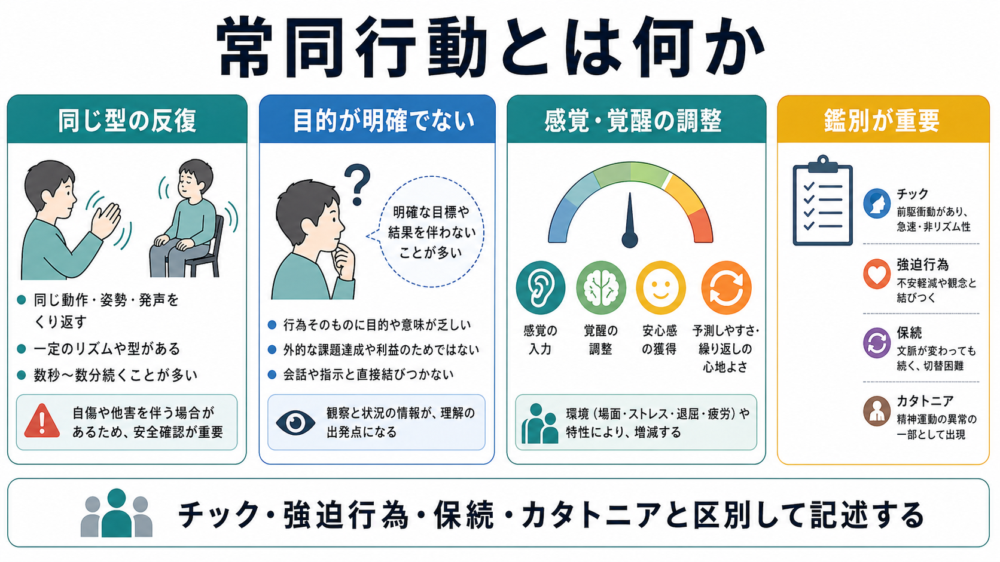
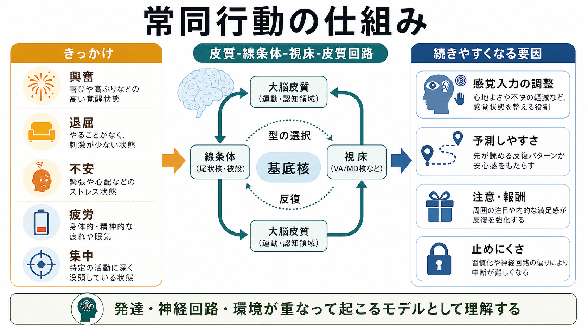
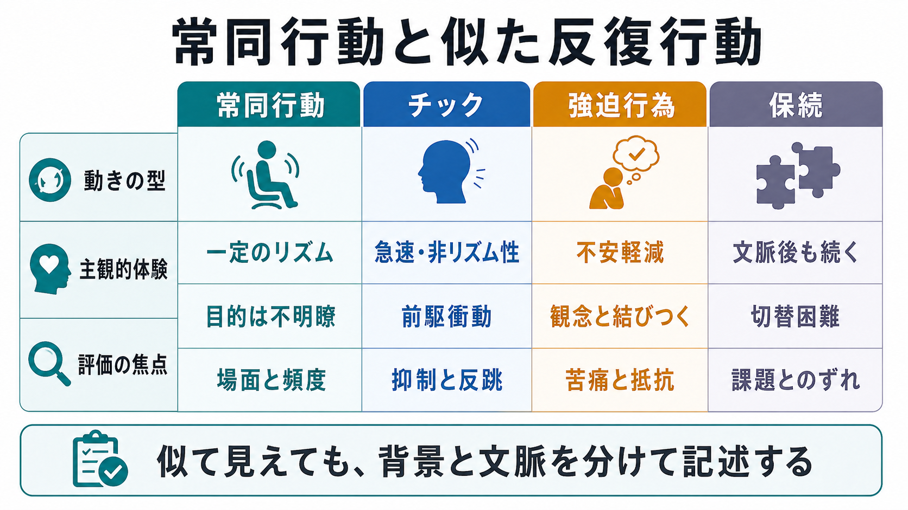

# 常同行動とは何か

## 要点

- 常同行動とは、同じ型の動作、姿勢、発声、物への接触などが反復され、外から見て明確な目的や課題達成との結びつきが乏しい症候である[1][2]。
- 代表例には、手をひらひらさせる、体を揺らす、頭を振る、指を動かす、同じ姿勢や動作を繰り返す、自傷を伴う頭打ちや噛みつきなどがある[2][6]。
- 常同行動は、[[カタトニアとは何か|カタトニア]]の症候、神経発達症の反復行動、知的発達症・感覚障害・神経疾患に伴う行動、または一次性の運動常同として現れることがある[3][4][8]。
- 鑑別では、[[強迫行為とは何か|強迫行為]]、チック、[[保続とは何か|保続]]、[[精神運動制止とは何か|精神運動制止]]、薬物・身体疾患による異常運動と分けて記述する必要がある[1][2][7]。
- 本稿は教育・研究目的の整理であり、個別の診断や治療指示ではない。自傷、急な発症、意識変容、発熱、脱水、薬剤変更、けいれん様症状がある場合は、臨床的な安全確認が優先される。

## この記事で答える問い

1. 常同行動とは、単なる癖や習慣と何が違うのか。
2. なぜ「目的が明確でない反復」が生じるのか。
3. チック、強迫行為、保続、カタトニアとはどう区別するのか。
4. 臨床面接や研究では、どの情報を観察・記録すればよいのか。

## まず結論

常同行動は、「同じことを繰り返す」という表面的な特徴だけで判断すると誤解しやすい。重要なのは、反復される動きの型、リズム、出現場面、本人の主観的体験、注意や呼びかけで止まるか、自傷や機能障害を伴うか、背景に発達特性・神経疾患・精神症状・薬剤・環境要因があるかを分けて見ることである[2][3][6]。

たとえば、手を振る動作が反復されていても、本人が不安を打ち消すために「しないといけない」と感じているなら強迫行為に近く、直前に身体感覚としての前駆衝動があり急速・非リズム的に出るならチックに近い。文脈が変わったのに前の反応が残るなら保続であり、無言、姿勢保持、反響症状、拒絶、精神運動興奮などとまとまって現れるならカタトニアの評価が必要になる[1][7][8]。

したがって、常同行動は単独の「診断名」としてではなく、まず症候として丁寧に記述するのがよい。診断分類上の「常同運動症 / stereotypic movement disorder」は、反復運動が活動を妨げたり自傷を生じたりし、他の神経発達症、精神疾患、物質・薬剤、神経疾患だけでは説明できない場合に検討されるカテゴリーである[1][2]。

## 背景

常同行動は、精神医学、児童神経学、発達臨床、神経心理学で少しずつ異なる言葉づかいをされてきた。DSM-5-TR では stereotypic movement disorder が神経発達症群の運動症群に置かれ、反復的で一見駆り立てられるような、明らかな目的に乏しい運動が社会・学業・その他の活動を妨げる、または自傷につながる場合に扱われる[1]。ICD-11 でも stereotyped movement disorder は、発達早期に始まる持続的な反復・常同的・見かけ上目的のない、しばしば律動的な運動として整理され、自傷を伴う型と伴わない型が区別される[2]。

一方、臨床観察では、診断カテゴリーに入る前の水準で「常同的な動き」「常同的な発声」「常同的な姿勢」と記述することが多い。[[カタトニアとは何か|カタトニア]]評価で用いられる Bush-Francis Catatonia Rating Scale では、stereotypy は「反復的で目的に向かわない運動活動」とされ、動作そのものの奇妙さよりも頻度の異常が重視される[8]。この意味では、常同行動は「その動作が奇妙かどうか」ではなく、「その文脈で、同じ型がどれほど反復され、何に結びついているか」を見る症候である。

## 基本概念

### 常同行動の中核

常同行動の中核は、次の三つに整理できる。

| 観点 | 見ること | 例 |
|---|---|---|
| 型の固定性 | 同じ動き、姿勢、発声、接触が似た形で出るか | 手をひらひらさせる、体を揺らす、指を弾く |
| 目的の不明瞭さ | 外的な課題達成や実用的な結果と直結しているか | 物を取るためではなく、同じ触り方を繰り返す |
| 文脈依存性 | どの場面で増え、何で減るか | 興奮、退屈、不安、疲労、集中で増えることがある |

運動常同は、反復的、律動的、しばしば左右対称的で、個人ごとに決まったパターンを取りやすい。典型例では、幼児期早期に始まり、興奮、ストレス、退屈、疲労、活動への没頭で増え、呼びかけや注意の転換で減ることがある[3][4][6]。ただし、これはすべての人に当てはまる判定規則ではない。症状の意味は、発達水準、言語能力、感覚特性、身体疾患、薬剤、環境、本人の苦痛と合わせて判断される。

### 「癖」との違い

日常的な癖や習慣にも、反復性はある。貧乏ゆすり、髪を触る、爪を噛む、ペンを回すなどは、多くの人にみられる。臨床的に問題になるのは、その反復が本人の生活を妨げる、自傷や他害のリスクにつながる、周囲の反応によって本人の苦痛や孤立が強まる、または別の精神・神経症状の一部として現れている場合である[1][2][6]。

そのため、常同行動を見たときに最初に問うべきことは「異常か正常か」ではない。「いつ、どこで、何が、どの程度、何と一緒に起こり、本人と生活にどんな影響があるか」である。この視点は、[[実行機能障害とは何か|実行機能障害]]や[[保続とは何か|保続]]の評価とも共通する。

### 一次性と二次性

運動常同は、しばしば一次性と二次性に分けて考えられる。一次性は、明らかな神経発達症や神経疾患なしに生じるものを指し、二次性は自閉スペクトラム症、知的発達症、感覚障害、神経疾患、薬剤・物質、環境要因などに関連して生じるものを指す[3][4]。

ただし、この分類は観察の便宜であり、原因が単純に一つに決まるという意味ではない。一次性に見える常同行動にも家族性や神経生物学的要因が示唆されることがあり、二次性の常同行動でも環境調整や本人の覚醒状態が大きく関わることがある[3][4]。

## 仕組み

### 神経回路だけで説明しすぎない

常同行動の仕組みは、まだ十分に解明されていない。研究では、皮質-線条体-視床-皮質回路、基底核、ドーパミン、GABA、アセチルコリンなどが関与候補として検討されてきた[4]。この回路は、運動の開始、選択、持続、停止、報酬学習、習慣化に関わるため、[[大脳基底核ループとは何か|大脳基底核ループ]]や[[習慣学習とは何か|習慣学習]]と接続して理解できる。

しかし、「基底核が悪いから常同行動が起こる」と単純化するのは危険である。常同行動は、発達、感覚処理、覚醒水準、環境、社会的反応、本人の学習履歴が重なって現れる。神経回路モデルは、症候を理解するための足場であって、個人の原因を一対一で決めるものではない[4]。

### 感覚・覚醒の調整

常同行動は、興奮、退屈、不安、疲労、集中などの場面で増えることがある[3][4][6]。これは、反復運動が感覚入力や覚醒水準を整える働きをもつ可能性を示す。たとえば、体を揺らす、指を動かす、音や触覚刺激を繰り返す行動は、本人にとって予測しやすい感覚フィードバックを生む。予測しやすい刺激は、過剰な不確実性を下げたり、逆に低覚醒を補ったりすることがある。

この見方は、常同行動を「意味のない行動」と決めつけないために重要である。外から見て目的が不明瞭でも、本人の身体・感覚・覚醒の調整としては何らかの機能を持つ場合がある。ただし、その機能があるから放置してよいという意味でもない。自傷、生活障害、社会的孤立、学習機会の制限がある場合には、本人の安全と尊厳を守る形で背景を評価する必要がある[2][6]。

### 反復が続きやすくなる条件

常同行動は、反復されるほど固定化しやすい場合がある。反復には、予測しやすさ、安心感、感覚入力、注意、周囲の反応、回避、報酬といった複数の強化要因が関わる。ここでいう強化は、本人が意識的に「得をしよう」としているという意味ではない。行動が起こった後に不快が下がる、刺激が整う、周囲の要求が一時的に下がる、注目が集まるなどの結果が続くと、行動パターンが維持されやすくなる。

この点は、[[目標指向行動と習慣行動は何が違うのか|目標指向行動と習慣行動]]の区別とも関係する。常同行動は、明確な目標へ向かう行動というより、一定の感覚・覚醒・文脈の中で選ばれやすくなった反復パターンとして理解すると見通しがよい。

## 図解

常同行動の鑑別では、「反復している」という見た目だけでなく、本人の主観的体験と文脈を分けて記述する。

| 似ている現象 | 中核 | 常同行動との見分け方 |
|---|---|---|
| チック | 急速、突発的、非リズム性の運動または音声。前駆衝動を伴うことがある | 常同行動はより律動的・持続的・型が固定しやすく、幼児期早期に始まることが多い[3][7] |
| [[強迫行為とは何か|強迫行為]] | 不安、責任感、危害予防、完全性などを下げるための反復行為 | 常同行動では、強迫観念との明確な結びつきや「しないと大変なことになる」という信念が目立たないことがある[1][7] |
| [[保続とは何か|保続]] | 文脈が変わった後も前の反応が残る | 常同行動は同じ型の運動・姿勢・発声が反復される。保続は課題切替や反応更新の失敗として見る |
| [[カタトニアとは何か|カタトニア]] | 精神運動症候群の一部として、緘黙、昏迷、姿勢保持、反響症状、常同、興奮などがまとまる | 常同だけでなく、症候群全体、急性度、身体安全性、薬剤・身体疾患を評価する[8] |
| 自傷行動 | 身体損傷を伴う反復 | 常同の一部として現れる場合もあるが、まず安全確認と損傷予防を優先する[2][6] |

## 臨床・研究との接続

### 面接で確認すること

常同行動を評価するときは、行動のラベルよりも、観察可能な情報を具体的に集める。

- 内容: どの部位が、どのように、どのリズムで動くか。
- 頻度と持続: 1日に何回、1回に何秒から何分続くか。
- 場面: 興奮、退屈、不安、疲労、集中、待機、対人場面、睡眠前後などとの関係。
- 変化: 呼びかけ、注意転換、活動変更、休息、感覚入力で減るか。
- 主観: 本人は気づいているか、心地よいか、困っているか、止めたいか。
- 影響: 学業、仕事、対人関係、食事、睡眠、安全、自尊感情への影響。
- 背景: 発達歴、[[強迫観念とは何か|強迫観念]]、チック、カタトニア症状、薬剤、物質、神経疾患、身体疾患、疼痛、睡眠不足。

DSM-5-TR や ICD-11 の診断カテゴリーでは、活動への干渉、自傷、発達早期の発症、他の状態でよりよく説明できないことが重視される[1][2]。ただし、実際の臨床では、診断カテゴリーの前に安全確認、身体評価、発達歴、家族・学校・職場での文脈把握が必要である。

### カタトニアとの接続

カタトニアにおける常同は、単独で見るよりも症候群の中で見る。BFCRS では、stereotypy は「反復的で目的に向かわない運動活動」と定義され、指遊び、体を触る、なでる、こするなどが例示される[8]。一方、mannerism は奇妙だが目的をもつ動作、verbigeration は語句・文の反復として区別される[8]。

したがって、成人精神科や急性期場面で常同行動を見たときは、緘黙、昏迷、拒絶、姿勢保持、反響症状、興奮、摂食・飲水低下、発熱、筋強剛、薬剤変更などを合わせて確認する。これは、[[緘黙とは何か|緘黙]]や[[精神運動制止とは何か|精神運動制止]]の評価とも接続する。

### 研究での注意点

研究では、常同行動の定義が研究領域ごとに異なることが問題になる。自閉スペクトラム症の制限反復行動、一次性運動常同、知的発達症に伴う常同、自傷行動、カタトニアの常同を同じ尺度で混ぜると、神経基盤や介入効果の推定が不安定になる[4]。そのため、対象集団、年齢、発達水準、知的機能、言語機能、併存症、自傷の有無、観察場面を明確にする必要がある。

一次性複雑運動常同の縦断研究では、幼児期早期の発症、持続性、チック・ADHD・強迫症状などの併存が報告されている[3][5]。ただし、これらの知見は集団平均であり、個々の子どもの予後や支援を機械的に決めるものではない。

## よくある誤解

### 誤解1: 目的がないなら意味もない

「目的が明確でない」は、「本人にとって意味がない」と同じではない。反復行動は、感覚入力、覚醒水準、予測可能性、不安や退屈の調整と関係することがある[4][6]。意味を決めつけるより、何が前に起こり、何が後に変わるかを観察する。

### 誤解2: 止められるなら問題ではない

注意や呼びかけで一時的に止まることがあっても、生活上の障害や自傷があれば臨床的に重要である[1][2]。逆に、止まらないから本人が「わざとやっている」と考えるのも誤りである。止まりやすさは、症状の性質と環境条件の一部として記述する。

### 誤解3: 常同行動はすべて自閉スペクトラム症を意味する

常同行動は自閉スペクトラム症でよく見られるが、それだけをもって自閉スペクトラム症とは言えない。一次性運動常同、知的発達症、感覚障害、カタトニア、薬剤・物質、神経疾患、身体疾患など、複数の背景がありうる[3][4][6]。発達歴、社会コミュニケーション、感覚特性、知的機能、言語機能、他の反復行動を合わせて見る必要がある。

### 誤解4: 強迫行為、チック、保続と同じである

いずれも反復を含むが、駆動因、時間経過、本人の体験、文脈が異なる。強迫行為では不安軽減や[[強迫観念とは何か|強迫観念]]との結びつき、チックでは前駆衝動と急速性、保続では文脈変更後の反応切替困難が焦点になる[1][7]。

## 関連ノート

既存ノート:

- [[カタトニアとは何か]]
- [[強迫行為とは何か]]
- [[強迫観念とは何か]]
- [[保続とは何か]]
- [[実行機能障害とは何か]]
- [[大脳基底核ループとは何か]]
- [[目標指向行動と習慣行動は何が違うのか]]
- [[習慣学習とは何か]]
- [[精神運動制止とは何か]]
- [[緘黙とは何か]]

関連ノート候補:

- チックとは何か
- 自傷行動とは何か
- 自閉スペクトラム症における制限反復行動とは何か
- 感覚調整とは何か
- 常同運動症とは何か

MOC更新候補:

- `content/00_MOC/MOC｜精神医学.md` または症候学関連 MOC に「常同行動とは何か」を追加。
- 神経発達症、運動症状、カタトニア、基底核ループ、習慣学習の関連ノート群から相互参照を検討。

## 理解チェック

1. 常同行動を「ただの癖」と区別するために、どの生活上の影響を確認する必要があるか。
2. チックと常同行動を見分けるとき、前駆衝動、リズム、持続時間はどう役立つか。
3. 強迫行為と常同行動では、本人の主観的体験にどのような違いが出やすいか。
4. カタトニアの文脈で常同を見たとき、他に確認すべき精神運動症状は何か。
5. 常同行動を神経回路モデルだけで説明しきれない理由は何か。

## 未解決問題

- 一次性運動常同と神経発達症に伴う常同は、どこまで共通の神経基盤をもつのか。
- 感覚調整、覚醒調整、報酬学習、社会的文脈は、個人差としてどのように組み合わさるのか。
- 自傷を伴う常同行動と伴わない常同行動は、同じ連続体として扱えるのか。
- 観察尺度、ウェアラブル計測、動画解析を、本人の主観的体験や生活機能の評価とどう統合できるか。

## 参考文献

[1] American Psychiatric Association. (2022). *Diagnostic and Statistical Manual of Mental Disorders, Fifth Edition, Text Revision (DSM-5-TR)*. American Psychiatric Association Publishing. https://doi.org/10.1176/appi.books.9780890425787

[2] World Health Organization. (2024). *Clinical descriptions and diagnostic requirements for ICD-11 mental, behavioural and neurodevelopmental disorders*. WHO. https://www.who.int/publications/i/item/9789240077263

[3] Muthugovindan, D., & Singer, H. (2009). Motor stereotypy disorders. *Current Opinion in Neurology, 22*(2), 131-136. https://doi.org/10.1097/WCO.0b013e328326f6c8

[4] Péter, Z., Oliphant, M. E., & Fernandez, T. V. (2017). Motor stereotypies: A pathophysiological review. *Frontiers in Neuroscience, 11*, 171. https://doi.org/10.3389/fnins.2017.00171

[5] Oakley, C., Mahone, E. M., Morris-Berry, C., Kline, T., & Singer, H. S. (2015). Primary complex motor stereotypies in older children and adolescents: Clinical features and longitudinal follow-up. *Pediatric Neurology, 52*(4), 398-403.e1. https://doi.org/10.1016/j.pediatrneurol.2014.11.002

[6] MedlinePlus Medical Encyclopedia. (2024). *Stereotypic movement disorder*. U.S. National Library of Medicine. https://medlineplus.gov/ency/article/001548.htm

[7] Child Neurology Foundation. (n.d.). *Motor stereotypies*. https://www.childneurologyfoundation.org/disorder/motor-stereotypies/

[8] University of Rochester Medical Center. (n.d.). *Bush-Francis Catatonia Rating Scale*. https://www.urmc.rochester.edu/psychiatry/divisions/collaborative-care-and-wellness/bush-francis-catatonia-rating-scale/bfcrs
