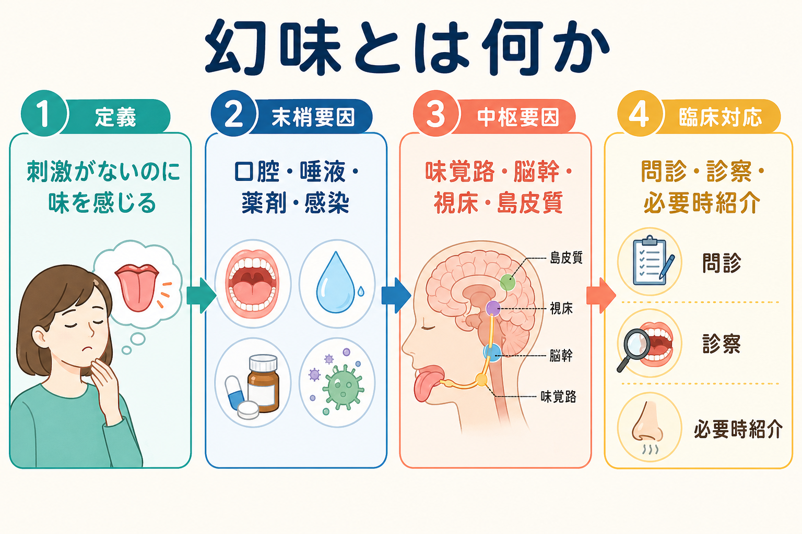
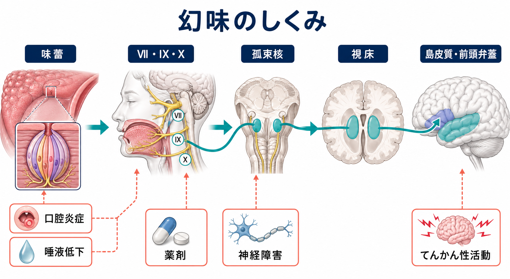
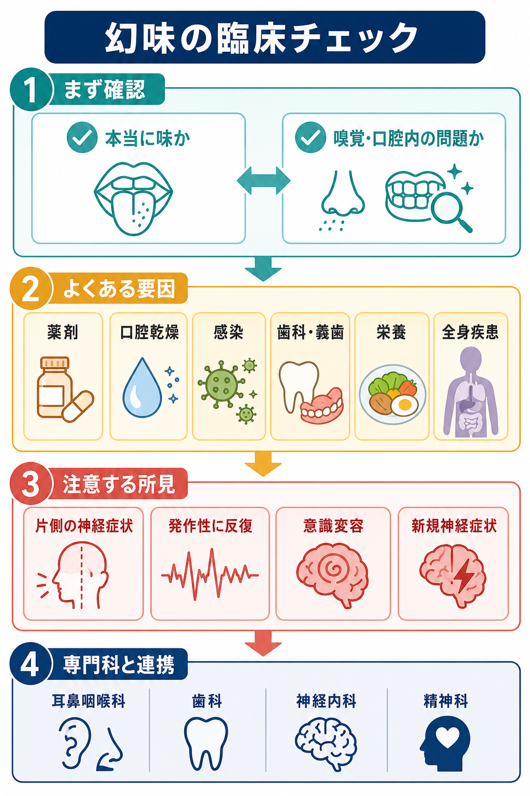

# 幻味とは何か

## 要点

- 幻味とは、口の中に対応する食物・薬剤・化学刺激がないのに、味が残る、湧いてくる、反復して感じられる体験である。英語では phantogeusia、または phantom taste perception と呼ばれる。
- NIH/NIDCD は、味覚障害のなかで「口の中に何もないのに、しばしば不快な味が持続する」体験を、最も一般的な味覚障害として説明している[1]。
- 臨床的には、幻味をただちに[[精神症候学とは何か|精神症候]]や精神病症状とみなすのではなく、口腔・歯科、嗅覚、薬剤、感染、唾液、栄養、全身疾患、末梢・中枢神経系を順に確認する。
- 発作性に短く反復する、意識変容・自動症・片側神経症状を伴う、新規の神経症状と同時に出る場合は、てんかん発作や脳血管障害などの神経学的評価が重要になる[4][5]。
- 本稿は教育・研究目的の整理であり、個別の診断や治療指示ではない。実際の対応は医療者による評価に基づく。

## この記事で答える問い

1. 幻味は、味覚障害、幻覚、口腔症状のどこに位置づけられるのか。
2. なぜ「ないはずの味」が感じられるのか。
3. 臨床では、どのような原因や危険サインを考えるべきか。
4. 精神医学の面接では、幻味をどのように聞き、記述すればよいか。

## まず結論

幻味は「味の幻覚」と呼べるが、精神科診断名に直結する症状ではない。むしろ、味覚系のどこかで生じる異常信号、口腔内の持続刺激、嗅覚との混同、薬剤や全身疾患による味覚変化が、本人には「口の中にない味」として経験されることが多い。したがって、[[MSEで知覚異常をどう聞くか|MSEの知覚異常評価]]では、「何の味か」「いつ始まったか」「口腔内の違和感や乾燥があるか」「食事や匂いと関係するか」「発作性か持続性か」「薬剤変更と関係するか」を、本人の言葉に沿って具体化する。

一方で、幻味は中枢神経系の症状としても現れる。古典的な SEEG 研究では、難治性てんかん患者718例のうち30例、約4%で発作症状の一部として味覚幻覚がみられ、頭頂葉・側頭葉・頭頂側頭葉発作、弁蓋部や島皮質周辺の関与が示唆された[5]。このため、反復する短い味覚体験を「気のせい」と片づけるのも、「精神病症状」と即断するのも不適切である。

## 背景

味覚は、甘味、塩味、酸味、苦味、うま味だけで完結しない。実際の「風味」は、味覚、嗅覚、口腔内の温度・刺激感・質感が統合された知覚である。NIDCD は、多くの人が味覚障害だと思って受診しても、実際には嗅覚障害が主であることが少なくないと説明している[1]。この点は幻味でも重要で、本人が「変な味がする」と表現していても、実際には鼻腔・副鼻腔・嗅覚路の問題や、口腔乾燥、胃食道逆流、歯科材料、感染、薬剤の影響が背景にあることがある。

味覚障害は生活の質にも影響する。食事の楽しみが落ちる、食欲が変わる、塩分や糖分を過剰に足す、体重が変動する、食べ物が安全か判断しにくくなる、といった問題が生じうる[1][7]。つまり幻味は「小さな感覚症状」ではなく、栄養、服薬、全身疾患、精神的苦痛に接続する症状である。

## 基本概念

### 幻味と味覚障害の分類

味覚障害には、味を感じにくい低味覚、味を感じない無味覚、味が異なって感じられる異味症、刺激がないのに味を感じる幻味などがある。レビューでは phantogeusia は「味物質がないのに味覚が生じること」と整理される[2]。NIDCD の用語では phantom taste perception とされ、しばしば不快で持続する味として説明される[1]。

ここで重要なのは、幻味と異味症の境界が実臨床では曖昧になりやすいことである。食事中に本来と違う味がするなら異味症に近い。何も食べていないのに金属味、苦味、酸味、薬品味、腐敗味、焦げた味のような体験が残るなら幻味に近い。ただし、口腔内に炎症、乾燥、歯科材料、逆流、感染があれば、本人には「ない味」に思えても、持続する末梢刺激がある可能性がある。

### 幻味と幻覚

精神医学では、外的刺激がないのに知覚される体験を幻覚と呼ぶ。したがって幻味は広い意味では味覚性幻覚である。しかし、[[精神症候学とは何か|精神症候学]]では、症状名を診断名と混同しないことが重要である。幻聴や幻視と同様に、幻味も統合失調症、気分障害、せん妄、物質使用、神経疾患、てんかん、口腔・耳鼻咽喉科疾患など、複数の文脈で起こりうる。

JAMA Neurology のレビューは、味覚 phantom がてんかんや統合失調症で報告されている一方、原因検索では薬剤、局所要因、末梢・中枢神経障害、全身疾患を考えるべきだと整理している[4]。精神科面接では「幻味があるか」だけでなく、時間経過、身体所見、服薬、意識、認知、他の知覚異常との組み合わせを記述する必要がある。

## 仕組み

味覚情報は、舌や口腔・咽頭の味蕾から、主に顔面神経、舌咽神経、迷走神経を通り、延髄の孤束核、視床、島皮質・前頭弁蓋などへ伝わる[1][2]。この経路のどこで異常が起きるかによって、幻味の意味は変わる。

### 末梢から生じる幻味

口腔内の炎症、舌炎、口腔乾燥、唾液の性状変化、歯科材料、義歯、口腔感染、放射線治療後、耳鼻咽喉科手術後などは、味覚受容や味物質の運搬を変える。味覚障害のレビューでは、味物質が受容器に届かない「輸送」の問題、味蕾など感覚単位の問題、末梢・中枢神経の問題という3層で機序を整理できる[2]。

薬剤も重要である。JAMA Neurology のレビューは、抗てんかん薬、抗菌薬、降圧薬、抗パーキンソン病薬、片頭痛薬、糖尿病薬など、多様な薬剤が味覚異常に関わりうると述べている[4]。高齢者では多剤併用、口腔乾燥、栄養状態、歯科問題が重なりやすく、症状が「精神的なもの」と誤解されやすい。

### 中枢から生じる幻味

味覚幻覚は、てんかん発作の一部として生じることがある。発作性で、数秒から短時間、同じ味が反復し、口部自動症、唾液分泌、腹部違和感、意識変容、視線偏位などを伴う場合は、側頭葉・頭頂葉・弁蓋部・島皮質周辺の発作症状として検討される[5][6]。

また、脳血管障害、腫瘍、外傷、神経変性疾患、多発性硬化症、パーキンソン病などでも味覚障害は報告される[4]。ただし、幻味だけで病変部位を確定することはできない。中枢性を疑うのは、症状の出方、神経学的所見、意識・認知の変化、画像・脳波などの検査情報を組み合わせた場合である。

### 嗅覚との混同

「味がない」「変な味がする」という訴えの一部は、実際には嗅覚障害や風味の障害である。風味は味覚と嗅覚の統合で成立するため、鼻閉、副鼻腔炎、ウイルス感染、COVID-19 後、嗅覚低下では、食べ物の味が薄い、変な味がする、金属味のように感じることがある[1][3]。幻味を評価するときは、匂いの変化、鼻症状、風味と純粋な味質の区別を確認する。

## 図解

上の1枚目は、幻味を「定義」「末梢要因」「中枢要因」「臨床対応」に分けた概念地図である。2枚目は、味蕾から孤束核、視床、島皮質・前頭弁蓋へ向かう味覚路を示している。下の3枚目は、臨床で確認する項目と注意所見を分けて整理している。

## 臨床・研究との接続

### 面接で確認すること

幻味を聞くときは、症状を否定せず、本人の表現を保ったまま具体化する。

| 確認軸 | 質問例 | 見たいこと |
|---|---|---|
| 味の質 | 「金属味、苦味、酸味、薬のような味など、近いものはありますか」 | 味質、嫌悪感、持続性 |
| 時間経過 | 「いつから、どのくらい続き、どの頻度で起こりますか」 | 急性発症、反復性、発作性 |
| 誘因 | 「食事、匂い、歯磨き、服薬、姿勢、睡眠と関係しますか」 | 口腔・嗅覚・薬剤・逆流 |
| 口腔症状 | 「口の乾き、痛み、舌の違和感、義歯や歯科治療の変化はありますか」 | 歯科・耳鼻咽喉科要因 |
| 神経症状 | 「意識が遠のく、体の片側が動かしにくい、しびれる、発作的に繰り返すことはありますか」 | てんかん、脳血管障害など |
| 精神症状 | 「他の感覚体験、気分、睡眠、不安、現実感の変化はありますか」 | [[MSEで知覚異常をどう聞くか|知覚異常評価]]との接続 |

### 注意する所見

急に始まった幻味、片側の神経症状、意識変容、反復する短い発作、頭痛や新規の神経症状、発熱や重い全身症状を伴う場合は、耳鼻咽喉科・歯科だけでなく、神経内科や救急評価が必要になることがある。逆に、慢性的で口腔乾燥や薬剤変更と同期している場合は、口腔・薬剤・全身疾患の見直しが中心になる。

日本の味覚障害診療に関するレビューは、味覚障害の病態は広く、原因部位と機序を見極めるために複数の検査を組み合わせる必要があると述べる。また、治療ではまず原因となる全身疾患や薬剤を調整する必要があると整理している[3]。これは幻味にも当てはまる。

### 精神科での位置づけ

精神科では、幻味を「知覚異常」の一部として記録しつつ、[[器質性精神障害を見逃さないためには何を見るべきか|器質性・身体疾患性の要因]]を見逃さない。幻味が妄想的解釈と結びつくこともある。たとえば「毒を盛られている味がする」と訴える場合、味覚体験そのもの、被害的解釈、確信度、食行動への影響、安全リスクを分けて記述する必要がある。症状の内容だけでなく、どの程度確信しているか、食事制限や服薬拒否につながっているか、周囲との関係に影響しているかを確認する。

## よくある誤解

### 幻味はすべて精神病症状である

誤りである。幻味は味覚障害、口腔疾患、薬剤、感染、嗅覚障害、全身疾患、神経疾患、てんかん発作などで起こりうる[1][2][4]。精神病症状として扱う前に、身体・神経・口腔・薬剤の文脈を確認する。

### 口の中に何もなければ原因は中枢にある

これも単純化である。本人が「何もない」と感じていても、口腔乾燥、微細な炎症、歯科材料、唾液変化、逆流、嗅覚障害などが持続刺激として働くことがある。

### 味覚障害は生活への影響が小さい

味覚障害は食欲、栄養、体重、食事制限、生活の質に影響する[1][7]。慢性的な不快味は、不安、抑うつ、睡眠、対人関係にも波及しうる。

### 亜鉛を飲めばよい

亜鉛欠乏が関係する味覚障害はあるが、すべての幻味に亜鉛補充が有効とはいえない。日本のレビューでも、味覚障害では原因疾患や薬剤をまず調整することが重要とされ、治療は原因に応じて考える必要がある[3]。サプリメントや処方薬の使用は医療者の評価に基づく。

## 関連ノート

既存ノート候補:

- [[精神症候学とは何か]]
- [[MSEで知覚異常をどう聞くか]]
- [[器質性精神障害を見逃さないためには何を見るべきか]]
- [[意識障害とは何か]]
- [[せん妄とは何か]]
- [[症状と徴候は何が違うのか]]

今後の作成候補:

- 味覚障害とは何か
- 嗅覚障害とは何か
- 異味症とは何か
- 口腔乾燥とは何か
- てんかん発作における感覚前兆とは何か

MOC 更新候補:

- `content/00_MOC/` 配下の精神医学・症候学関連 MOC に、本記事へのリンクを追加する候補。
- 並列記事生成ジョブとの衝突を避けるため、本ジョブでは MOC ファイルを直接更新しない。

## 理解チェック

1. 幻味と異味症は、どのように区別できるか。
2. 幻味を聞いたとき、なぜ嗅覚障害や口腔乾燥を確認する必要があるか。
3. 発作性に反復する短い幻味では、どのような神経学的鑑別を考えるか。
4. 「毒の味がする」という訴えでは、味覚体験と妄想的解釈をどのように分けて記述するか。

## 参考文献

[1] National Institute on Deafness and Other Communication Disorders. *Taste Disorders*. Last updated July 31, 2023. https://www.nidcd.nih.gov/health/taste-disorders

[2] Thomas DC, Chablani D, Parekh S, Pichammal RC, Shanmugasundaram K, Pitchumani PK. Dysgeusia: A review in the context of COVID-19. *Journal of the American Dental Association*. 2022;153(3):251-264. https://doi.org/10.1016/j.adaj.2021.08.009

[3] Nin T, Tsuzuki K. Diagnosis and treatment of taste disorders in Japan. *Auris Nasus Larynx*. 2024;51(1):1-10. https://doi.org/10.1016/j.anl.2023.04.002

[4] Heckmann JG, Heckmann SM, Lang CJG, Hummel T. Neurological aspects of taste disorders. *Archives of Neurology*. 2003;60(5):667-671. https://doi.org/10.1001/archneur.60.5.667

[5] Hausser-Hauw C, Bancaud J. Gustatory hallucinations in epileptic seizures: electrophysiological, clinical and anatomical correlates. *Brain*. 1987;110(2):339-359. https://doi.org/10.1093/brain/110.2.339

[6] Krämer G. Olfactory and gustatory dysfunction in epilepsy and other neurological disorders. *DGNeurologie*. 2022;5(5):430-431. https://doi.org/10.1007/s42451-022-00464-5

[7] National Institute of Dental and Craniofacial Research. *Taste Disorders*. https://www.nidcr.nih.gov/health-info/taste-disorders

## 未解決問題

- 幻味だけを主要アウトカムにした臨床研究は少なく、異味症、嗅覚障害、口腔疾患、COVID-19 関連症状と混在して扱われることが多い。
- 末梢性幻味と中枢性幻味を、問診だけで安定して分ける方法は限られている。
- 慢性の幻味が食行動、栄養、抑うつ、不安にどの程度影響するかは、疾患別・年齢別にさらに整理が必要である。
