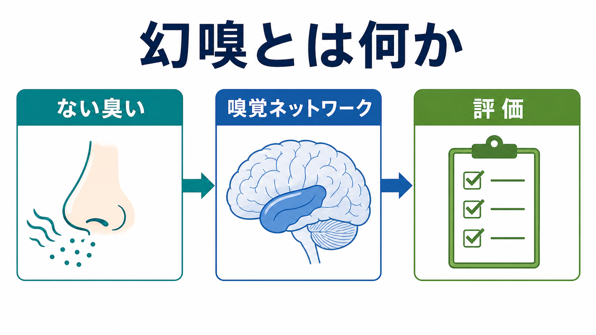
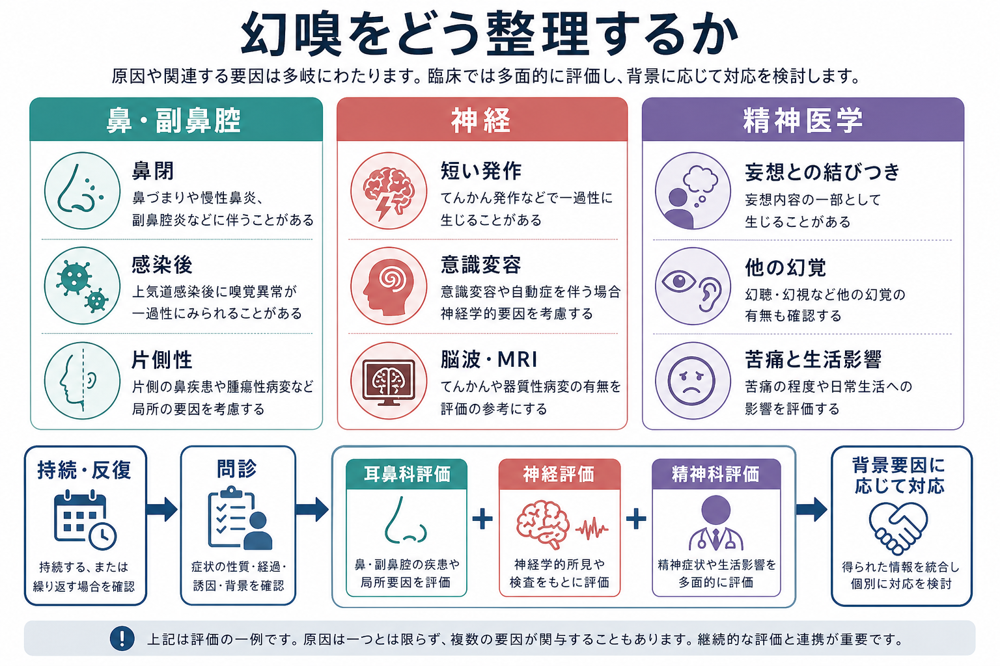

# 幻嗅とは何か

## 要点

- 幻嗅は、外界に同定できる臭い刺激がないのに臭いを感じる体験であり、英語では phantosmia、olfactory hallucination、phantom odor などと呼ばれる[1]。
- 典型的には焦げ臭い、腐敗臭、ガス臭、金属臭など不快な臭いとして訴えられやすいが、臭いの質だけで原因は決められない[1]。
- 原因は一つではなく、鼻腔・副鼻腔・嗅上皮の問題、片頭痛、側頭葉てんかん、頭部外傷、薬剤、神経変性疾患、統合失調症などの精神疾患が関わりうる[1][2]。
- てんかんでは、短時間で反復する臭いの体験が焦点発作の前兆として出ることがあり、側頭葉・扁桃体・海馬周辺の嗅覚ネットワークとの関係が重要になる[3][4]。
- 精神医学では、幻嗅を単独症状として診断名に直結させず、他の幻覚、妄想との結びつき、抑うつ・不安、生活への影響、身体疾患や物質・薬剤の影響を分けて評価する[5][6]。

## この記事で答える問い

1. 幻嗅は、単なる「気のせい」や「精神症状」とどう違うのか。
2. 幻嗅は、嗅覚ネットワークとどのように関係するのか。
3. てんかんや精神疾患では、どのような文脈で幻嗅が問題になるのか。
4. 臨床的には、どの情報を確認すれば見立てを誤りにくいのか。

## まず結論

幻嗅は、**「存在しない臭いを感じる」という体験の名前**であって、それ自体が特定の疾患名ではない。重要なのは、臭いの内容よりも、発症の急性さ、持続時間、反復性、片側性、鼻症状、頭痛、意識変容、発作様の経過、他の幻覚や妄想との関係、薬剤・物質使用、神経症状を組み合わせて読むことである[1][3][5]。

たとえば、数十秒から数分の焦げ臭さが反復し、その後に意識変容や自動症が続くなら、側頭葉てんかんを含む神経学的評価が重要になる。一方、臭いが「自分が腐っている」「誰かが毒をまいている」といった強い意味づけや被害的解釈に結びつくなら、精神病症状、抑うつ、不安、身体疾患、文化的文脈を含めた評価が必要になる[3][5][6]。

## 背景

嗅覚は、視覚や聴覚と異なり、情動・記憶・身体感覚に近い形で経験されやすい。臭いは、危険物、食物、身体状態、他者との距離感に結びつくため、実際にはない臭いであっても、本人にとっては強い不快感や不安を生むことがある[1]。

米国の NHANES 2011-2014 データを用いた横断研究では、40歳以上の成人 7,417 人のうち、実際にはない不快な臭い、悪臭、焦げ臭さを感じると報告した人は推定 6.5% だった[2]。この数字は、幻嗅が珍しい訴えではないことを示す一方で、調査上の自己報告であり、全例が同じ医学的原因を持つわけではない。

精神科面接では、幻嗅は [[MSEで知覚異常をどう聞くか|知覚異常の評価]] の一部として扱う。ただし、聞き方は「幻覚ですか」と断定的に問うより、「他の人には確認しにくい臭いを感じることがあるか」「どんな臭いか」「いつ、どのくらい続くか」と体験の性質から確認する方が情報を得やすい。

## 基本概念

### 幻嗅と錯嗅

幻嗅は、外的な臭い刺激を確認できない状況で臭いを感じる体験である[1]。これに対して、実際にある臭いを別の臭いとして感じる場合は、錯嗅または異嗅症に近い。たとえば、食べ物の臭いが腐敗臭に感じられる場合は、外界刺激があるため幻嗅とは区別して考える。

### 幻嗅と嗅覚低下

嗅覚障害は、臭いが弱くなる嗅覚低下、臭いが分からない嗅覚脱失、臭いの質が変わる異嗅、存在しない臭いを感じる幻嗅に分けて考えると整理しやすい[1]。幻嗅がある人でも、同時に嗅覚低下や鼻副鼻腔疾患があることがあり、主観的な訴えだけで機序を決めるのは危険である。

### 体験としてのリアリティ

幻嗅は、本人にとって「本当に臭う」体験として現れる。したがって、面接では「実際にはない」と急いで修正するより、まず臭いの質、頻度、持続、苦痛、生活影響、安全行動、現実検討を確認する。これは精神科的評価だけでなく、[[器質性精神障害を見逃さないためには何を見るべきか|器質性要因の見落とし]]を避けるためにも重要である。

## 仕組み

### 末梢性の説明

末梢性には、鼻腔・副鼻腔・嗅上皮・嗅神経の問題が含まれる。慢性副鼻腔炎、鼻ポリープ、上気道感染後、頭部外傷、鼻腔内の局所病変などでは、嗅覚入力の質や量が変化し、異常な臭い体験として自覚されることがある[1]。

この場合、鼻閉、鼻汁、感染後の経過、片側性、口腔乾燥、歯科・口腔内の問題、喫煙、薬剤歴を確認する。必要に応じて耳鼻咽喉科的な鼻内視鏡、嗅覚検査、副鼻腔 CT などが検討される[1]。

### 中枢性の説明

嗅覚情報は嗅球を経て、梨状皮質、嗅内皮質、扁桃体、海馬、眼窩前頭皮質などに広がる。これらは臭いそのものだけでなく、記憶、情動、意味づけと深く結びついている[1][7]。このため、嗅覚体験は「何かが臭う」という感覚だけでなく、「危険だ」「懐かしい」「自分に関係がある」といった意味づけを伴いやすい。

側頭葉てんかんでは、嗅覚に関わる内側側頭葉・扁桃体・海馬周辺のネットワークが発作活動に巻き込まれることで、臭いの前兆が生じることがある[3][4]。ある焦点てんかんの大規模後方視的研究では、嗅覚前兆は焦点てんかん患者の 5.1% にみられ、その多くでてんかん焦点は側頭葉に局在していた[3]。古典的研究でも、嗅覚前兆は内側側頭領域や扁桃体との関連が示唆されている[4]。

### 精神病理との接続

統合失調症や統合失調感情障害では、幻嗅は聴覚性幻覚ほど中心的に扱われてこなかったが、研究上は一定割合で報告される。WHO 10か国研究などを用いた解析では、統合失調症関連サンプルで過去1か月の嗅覚幻覚が 13-17% 程度にみられ、関係妄想・被影響体験、他の身体・触覚・味覚性幻覚と関連していた[5]。別研究では、統合失調症、うつ病、摂食障害の入院患者にも嗅覚幻覚が報告され、精神科診断名だけで幻嗅の有無を説明できないことが示されている[6]。

ここで重要なのは、幻嗅があるから統合失調症、という短絡ではない。幻嗅が精神病理として問題になるのは、体験の確信度が非常に高い、妄想的意味づけと結びつく、他の幻覚や思考内容の異常を伴う、生活行動や安全に影響する、という文脈である。これは [[脳ネットワークの破綻は精神疾患をどう説明するのか|脳ネットワークの破綻]] を症状次元として読む視点ともつながる。

## 図解

次の図は、幻嗅を臨床的に整理する時の大まかな入口を示す。鼻・副鼻腔、神経、精神医学のどれか一つに早く決めるのではなく、経過と背景に応じて並行して評価する。

## 臨床・研究との接続

### 面接で確認する軸

幻嗅の聞き取りでは、次の軸を分けると整理しやすい。

| 確認軸 | 具体的に聞くこと | 見立てへの意味 |
|---|---|---|
| 臭いの質 | 焦げ臭い、腐敗臭、ガス臭、薬品臭、金属臭など | 不快な臭いは多いが、質だけで原因は決めない |
| 時間経過 | 数秒、数分、数時間、持続性、反復性 | 短時間反復なら発作性の可能性を考える |
| 片側性 | 片方の鼻で強いか、鼻をふさぐと変わるか | 末梢性・局所性要因の手がかりになる |
| 随伴症状 | 頭痛、意識変容、自動症、記憶の抜け、鼻症状 | 片頭痛、てんかん、鼻副鼻腔疾患を考える |
| 意味づけ | 毒、腐敗、誰かの攻撃、自分の身体の臭いなど | 妄想・不安・抑うつとの関係を評価する |
| 生活影響 | 回避、換気、確認行動、食欲低下、対人困難 | 支援ニーズと安全確認につながる |
| 薬剤・物質 | 新規薬剤、アルコール、薬物、離脱、曝露 | [[物質使用歴はどのように聞くべきか|物質使用歴]] と薬剤歴を確認する |

### 検査と連携

鼻・副鼻腔の症状が目立つ場合は耳鼻咽喉科的評価が重要になる。原因が明らかでない場合、StatPearls は副鼻腔 CT や嗅覚領域に注意した頭部 MRI が検討されうると整理している[1]。発作性の経過、意識変容、記憶の抜け、自動症がある場合は、[[脳波EEGは何を測っているのか|脳波]]、MRI、必要に応じて [[PETは脳の何を測るのか|PET]] や [[SPECTは脳血流をどう評価するのか|SPECT]] など、てんかん焦点評価の文脈で検討される。

研究面では、側頭葉てんかんの嗅覚機能検査や fMRI 研究が、梨状皮質、扁桃体、海馬、嗅内皮質などを含む嗅覚・辺縁系ネットワークの理解を深めている[7][8]。ただし、これらは主に群平均の研究知見であり、個別の診断や治療方針を単独で決めるものではない。

### 支援の考え方

幻嗅が苦痛を伴う場合、対応は「臭いが本当にあるかどうかを議論する」ことから始めるより、苦痛、睡眠、食事、外出、対人関係、安全行動、確認行動を具体化する方が実用的である。背景に鼻副鼻腔疾患、片頭痛、てんかん、精神病症状、抑うつ・不安、薬剤・物質がある場合は、それぞれの評価と治療・支援につなげる[1][5]。

## よくある誤解

### 幻嗅はすべて精神疾患の症状である

そうではない。幻嗅は鼻副鼻腔疾患、上気道感染後、頭部外傷、片頭痛、側頭葉てんかん、薬剤、神経変性疾患などでも起こりうる[1]。精神疾患との関連は重要だが、最初から精神症状だけに絞ると身体・神経学的要因を見落とす。

### 焦げ臭いならてんかんである

焦げ臭さは幻嗅でよく報告されるが、臭いの種類だけでてんかんとは判断できない[1]。てんかんを疑う手がかりは、短時間で反復する、意識変容や自動症を伴う、発作後のぼんやりがある、既往や脳病変がある、といった時間構造と随伴症状である[3][4]。

### 幻嗅がある人には現実検討がない

幻嗅を感じても、「実際には臭いの発生源がないかもしれない」と考えられる人もいる。現実検討の程度、確信度、確認行動、妄想的意味づけを分けて聞く必要がある。これは [[MSEで病識と判断力をどう評価するか|病識と判断力]] の評価にも関係する。

### 検査で異常がなければ苦痛も小さい

検査で明確な原因が見つからなくても、本人の苦痛や生活影響は大きいことがある[1]。幻嗅は食欲、睡眠、対人関係、外出、火災やガス漏れへの不安に影響しうるため、原因検索と同時に生活上の支援を考える。

## 関連ノート

既存ノート:

- [[MSEで知覚異常をどう聞くか]]
- [[精神状態診察MSEとは何か]]
- [[器質性精神障害を見逃さないためには何を見るべきか]]
- [[物質使用歴はどのように聞くべきか]]
- [[脳波EEGは何を測っているのか]]
- [[PETは脳の何を測るのか]]
- [[SPECTは脳血流をどう評価するのか]]
- [[海馬回路は記憶をどう形成するのか]]
- [[脳ネットワークの破綻は精神疾患をどう説明するのか]]

今後の作成候補:

- 幻覚と錯覚はどう区別するか
- 側頭葉てんかんの前兆とは何か
- 嗅覚障害と精神疾患の関係
- 片頭痛の前兆にはどのような種類があるか

MOC更新候補:

- `content/00_MOC/` 配下の精神医学・症候学、神経科学・てんかん、MSE関連MOCに本記事へのリンクを追加する候補。並列ジョブとの競合を避けるため、本タスクではMOCファイルは編集しない。

## 理解チェック

1. 幻嗅と錯嗅を分ける時、外界刺激の有無はどのように関係するか。
2. 幻嗅を聞き取る時、臭いの内容以外に確認すべき時間経過の情報は何か。
3. 側頭葉てんかんを考える時、幻嗅に伴って確認したい症状は何か。
4. 幻嗅が精神病理として問題になりやすいのは、どのような意味づけや行動と結びつく時か。
5. 幻嗅を「精神症状」とだけ見なすと、どのような見落としが起こりうるか。

## 参考文献

[1] Gillette, B., Reid, J. A., & Shermetaro, C. (2023). Phantosmia. *StatPearls*. NCBI Bookshelf. https://www.ncbi.nlm.nih.gov/books/NBK585128/

[2] Bainbridge, K. E., Byrd-Clark, D., & Leopold, D. (2018). Factors Associated With Phantom Odor Perception Among US Adults: Findings From the National Health and Nutrition Examination Survey. *JAMA Otolaryngology-Head & Neck Surgery*, 144(9), 807-814. https://doi.org/10.1001/jamaoto.2018.1446

[3] Chen, C., Shih, Y. H., Yen, D. J., et al. (2021). Epileptic olfactory auras: a clinical spectrum. *Neurological Sciences*, 42, 1541-1547. https://pubmed.ncbi.nlm.nih.gov/33428053/

[4] Acharya, V., Acharya, J., & Lüders, H. (1998). Olfactory epileptic auras. *Neurology*, 51(1), 56-61. https://doi.org/10.1212/WNL.51.1.56

[5] Langdon, R., McGuire, J., Stevenson, R., & Catts, S. V. (2011). Clinical correlates of olfactory hallucinations in schizophrenia. *British Journal of Clinical Psychology*, 50(2), 145-163. https://doi.org/10.1348/014466510X500837

[6] Kopala, L. C., Good, K. P., & Honer, W. G. (1994). Olfactory hallucinations and olfactory identification ability in patients with schizophrenia and other psychiatric disorders. *Schizophrenia Research*, 12(3), 205-211. https://doi.org/10.1016/0920-9964(94)90030-2

[7] Turetsky, B. I., Hahn, C. G., Borgmann-Winter, K., & Moberg, P. J. (2009). Scents and nonsense: olfactory dysfunction in schizophrenia. *Schizophrenia Bulletin*, 35(6), 1117-1131. https://doi.org/10.1093/schbul/sbp111

[8] Hwang, B. Y., Mampre, D., Penn, R., Anderson, W. S., Kang, J., & Kamath, V. (2020). Olfactory Testing in Temporal Lobe Epilepsy: a Systematic Review. *Current Neurology and Neuroscience Reports*, 20(12), 65. https://doi.org/10.1007/s11910-020-01083-x
