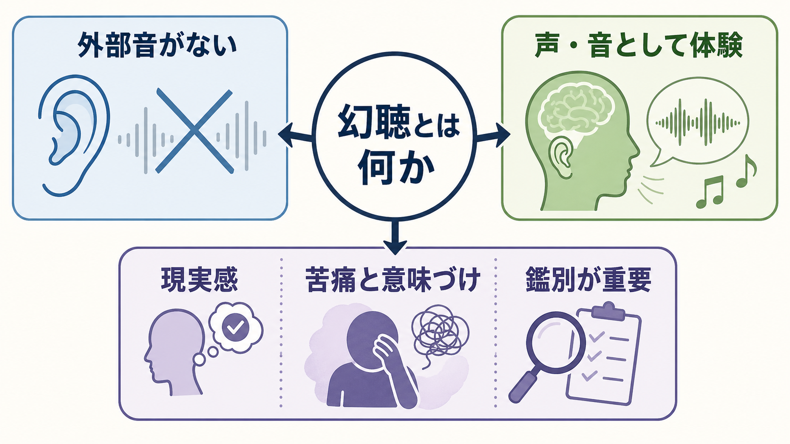
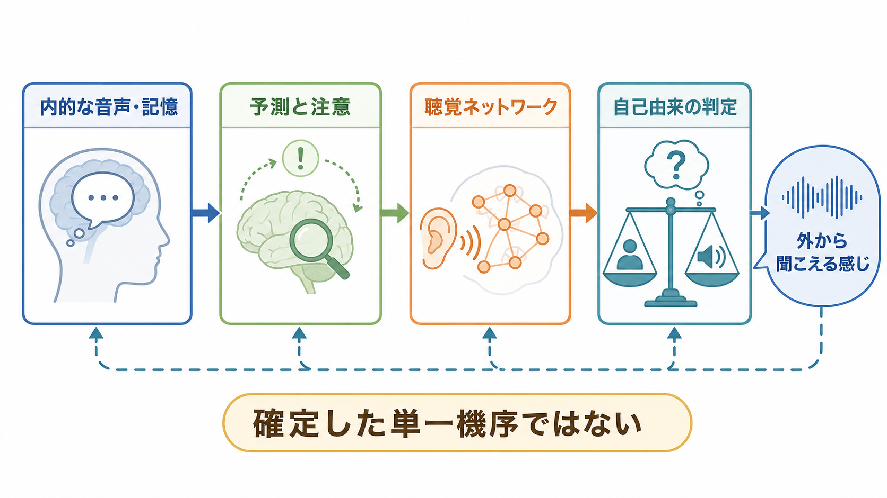
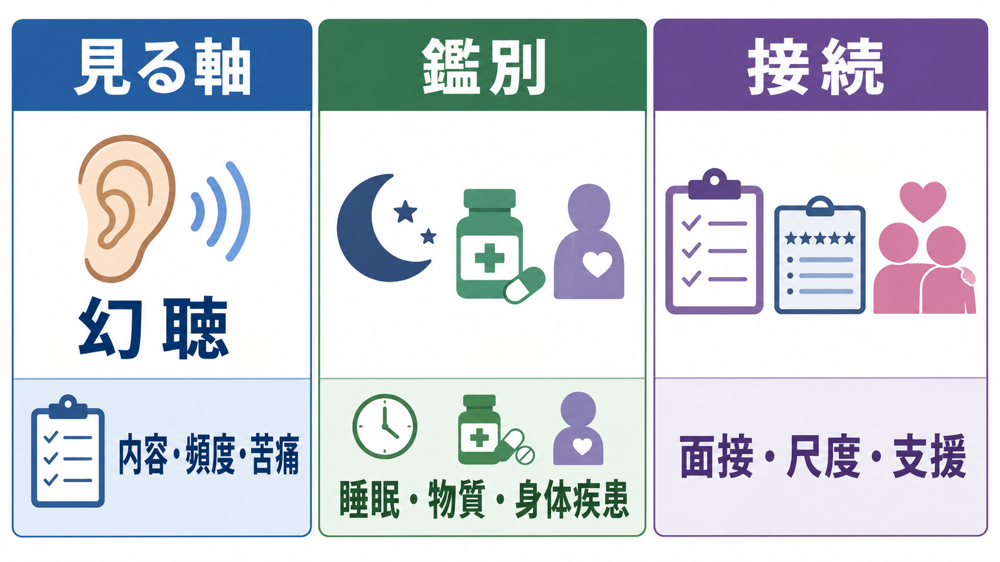

# 幻聴とは何か

## 要点

- 幻聴とは、外部に対応する音刺激がないにもかかわらず、声、音、音楽、物音などが知覚のように体験される現象である。ICD-11 では、幻覚は適切な外的刺激なしに生じる感覚知覚で、本人に非現実性への洞察がある場合もない場合もあると整理される[1]。
- 臨床で重要なのは、「聞こえたかどうか」だけでなく、内容、場所感、現実感、制御不能感、頻度、苦痛、生活への影響、睡眠・物質・身体疾患・せん妄との関係を記述することである[2][3]。
- 幻聴は統合失調症などの精神病症状でよく扱われるが、それだけに特異的な症状ではない。気分症、トラウマ関連症状、神経疾患、薬剤・物質、睡眠移行期、強いストレスなどでも起こりうる[2][4]。
- 機序としては、内言や記憶の外在化、自己モニタリングやソースモニタリングの障害、聴覚・言語ネットワークの変化、予測処理や注意の偏り、感情的意味づけなどが検討されている。ただし、単一の確定機序で説明できるわけではない[5][6][7]。
- 本記事は教育・研究目的の整理であり、個別の診断や治療指示ではない。

## この記事で答える問い

1. 幻聴は、通常の想像、内言、聞き間違い、妄想と何が違うのか。
2. なぜ「外から聞こえる」「誰かの声に感じる」という体験が生じうるのか。
3. 臨床では、幻聴をどのような軸で聞き取り、何と鑑別するのか。
4. 幻聴研究は、[[精神症候学とは何か|精神症候学]]、[[予測処理とは何か|予測処理]]、[[聴覚ネットワークは音情報をどう処理するのか|聴覚ネットワーク]]とどう接続するのか。

## まず結論

幻聴は、「音がないのに音が聞こえる」という単純な定義だけでは十分に理解できない。症候学的には、**外部刺激の不在、知覚らしさ、現実感、制御不能感、本人にとっての意味、苦痛や生活機能への影響**を分けて見る必要がある。

たとえば、心の中で自分の考えを言葉にする内言は、多くの人にある通常の経験である。これに対して幻聴では、「自分で考えている」という感じよりも、「誰かが話している」「耳から入ってくる」「頭の外から聞こえる」「命令される」「批判される」といった知覚的・対人的な現実感が前景に立つことがある[5][6]。

ただし、幻聴があることは、それだけで特定の診断名を意味しない。[[せん妄とは何か|せん妄]]、睡眠不足、感覚遮断、薬剤、物質使用、神経疾患、気分症、トラウマ、精神病性障害など、複数の文脈で似た体験が起こりうる[2][3]。したがって、臨床では「幻聴の有無」よりも、「どのような状況で、どのような形で、どれほど本人を困らせ、どの背景要因と結びつくか」を記述する。

## 背景

幻聴は、精神科診療ではしばしば精神病症状の一部として扱われる。NIMH は統合失調症の精神病症状として、幻覚、妄想、思考障害を挙げ、幻覚の例として「そこにないものを見たり、聞いたり、嗅いだり、味わったり、感じたりすること」を説明している[3]。WHO も、統合失調症では現実の知覚や行動に大きな変化が生じ、持続する幻覚が症状の一部になりうると説明する[4]。

しかし、幻聴を統合失調症だけに結びつけると、二つの問題が生じる。第一に、幻聴の鑑別が狭くなる。たとえば、急性の意識変容や注意障害を伴う場合は[[せん妄とは何か|せん妄]]、薬剤変更や物質使用との時間関係がある場合は[[薬剤性精神症状とは何か|薬剤性精神症状]]、睡眠への移行や覚醒直後に限られる場合は睡眠関連体験を考える必要がある。第二に、本人の体験の質が見えにくくなる。幻聴の内容が批判的か、命令的か、会話的か、音楽や物音か、本人がどの程度信じているか、どの程度対処できているかは、同じ「幻聴あり」でも大きく異なる。

この意味で、幻聴は[[精神状態診察MSEとは何か|精神状態診察]]の知覚領域に含まれるだけでなく、思考内容、気分、不安、睡眠、物質使用、身体状態、生活機能を横断して評価する症候である。実際の面接では、[[MSEで知覚異常をどう聞くか|MSEでの知覚異常の聞き方]]や[[精神科面接とは何か|精神科面接]]の文脈で、本人が話しやすい表現を使いながら確認する必要がある。

## 基本概念

### 幻聴と幻覚

幻覚は、対応する外部刺激がないにもかかわらず、知覚のような性質をもつ体験である。ICD-11 では、幻覚は外的刺激なしに生じる感覚知覚で、本人がそれを非現実だと理解している場合も、そうでない場合もあるとされる[1]。Johns Hopkins Psychiatry Guide も、幻覚を刺激なしの知覚として説明し、真の幻覚、錯覚、疑似幻覚、鮮明なイメージを区別する必要を述べている[2]。

幻聴は、その聴覚版である。典型的には声が問題になるが、声に限らない。音楽、足音、ノック音、機械音、名前を呼ぶ声、複数人の会話、本人について話す声、命令する声などがありうる。声の場合は、**誰の声に感じるか、どこから聞こえるか、何を言うか、会話できるか、本人の行動にどの程度影響するか**が重要である。

### 幻聴と錯覚

錯覚は、実際にある刺激の誤った解釈である。たとえば、水音や換気扇の音が人の声のように聞こえる場合は、外部音が存在しているため、厳密には錯覚や聞き間違いに近い。これに対して幻聴では、対応する外部刺激が確認できないにもかかわらず、音声や音が知覚のように体験される[1][2]。

ただし実臨床では、完全に切り分けられないこともある。環境音が多い場所、難聴、疲労、睡眠不足、強い不安では、曖昧な音に意味を読み込みやすくなる。したがって、「幻聴か錯覚か」を単語だけで決めるより、外部刺激、状況、再現性、本人の確信、苦痛、生活への影響を確認する。

### 幻聴と妄想

幻聴は知覚体験であり、妄想は信念の問題である。たとえば「誰かの声が聞こえる」は幻聴に近い訴えであり、「組織が自分を監視している」は妄想的解釈に近い。両者はしばしば結びつく。批判的な声を聞いたあとに「近所の人が自分を攻撃している」と解釈する場合、幻聴と被害的信念が相互に強まることがある。

この点は、[[妄想は予測誤差処理の異常として説明できるのか|妄想と予測誤差処理]]の議論とも接続する。幻聴が「聞こえる体験」だとしても、それを誰の意図として理解するか、どの程度信じるか、どの行動につながるかは、思考内容や現実検討と分けて評価する必要がある。

## 仕組み

幻聴の機序はまだ単一の答えに収束していない。現在の研究では、複数のレベルが重なっていると考える方が妥当である。

### 1. 内言・記憶・音声イメージの外在化

多くの人は、頭の中で言葉を使って考える。通常は、それが自分の思考であるという感覚が保たれている。幻聴の一部では、内言、音声イメージ、侵入的な記憶が、自分由来の出来事としてではなく、外部から来た声として体験される可能性がある[5][6]。

この考え方は、「声の素材がどこから来るか」と「それを自分由来と判定できるか」を分ける。素材としては、内言、記憶、感情的なテーマ、過去の対人経験、言語ネットワークの活動などがありうる。一方で、それが自分の心的出来事だと感じられないと、外部の声として知覚される可能性が高まる。

### 2. 自己モニタリングとソースモニタリング

自己モニタリングとは、自分の行為や思考から生じる感覚結果を予測し、「これは自分が生み出したものだ」と扱う仕組みである。ソースモニタリングとは、記憶や知覚の出所を判断する仕組みである。幻聴研究では、これらの仕組みの変化により、自己生成された心的出来事が外部由来と誤って帰属される可能性が検討されてきた[5][6]。

ただし、自己モニタリングの障害だけで幻聴の多様性を説明するのは難しい。声がなぜ批判的なのか、なぜ特定の人物の声に感じるのか、なぜ特定の状況で強まるのか、なぜ苦痛が大きい人とそうでない人がいるのかには、記憶、感情、注意、信念、対人文脈が関わる。

### 3. 予測処理と注意

[[予測処理とは何か|予測処理]]の観点では、脳は感覚入力を受け取るだけでなく、何が聞こえるはずかを予測し、入力とのズレを調整している。幻聴では、曖昧な入力や内的活動に対して、予測や注意の重みづけが変化し、「声がある」という解釈が強くなる可能性がある[6][7]。

2024 年の系統的レビューは、幻聴が、信号とノイズを区別する知覚的意思決定、自己と他者・時間的文脈を区別するソースモニタリング、ワーキングメモリ、言語機能などと関連する可能性を整理している。一方で、結果は一貫しない部分も多く、診断名だけでなく、幻聴そのものの時期、頻度、感覚モダリティを明確に測定する必要があると指摘している[6]。

### 4. 聴覚・言語ネットワーク

幻聴は、[[聴覚ネットワークは音情報をどう処理するのか|聴覚ネットワーク]]や言語処理ネットワークとも関係する。声を聞くには、音の有無だけでなく、話者、言語内容、感情的な声色、空間的位置、本人との関係が処理される必要がある。MRI 研究のレビューでは、幻聴が聴覚皮質、言語関連領域、前頭葉、側頭葉、ネットワーク接続性の変化と関連して検討されてきた[7]。

ただし、脳画像で活動が見えることは、「その領域だけが原因である」ことを意味しない。幻聴は、感覚処理、言語、自己帰属、注意、情動、記憶、信念形成が相互作用するネットワーク現象として理解する方がよい。

## 図解

1 枚目は、幻聴を「外部音がない」「声・音として体験される」「現実感・苦痛・鑑別が重要」という症候学の地図として示している。ここでの要点は、幻聴を単に「奇妙な訴え」と見るのではなく、本人にとって現実感をもつ知覚体験として扱うことである。

2 枚目は、内的な音声・記憶、予測と注意、聴覚ネットワーク、自己由来の判定が相互に関わるという機序仮説を示している。これは確定した単一路線ではなく、複数の研究仮説を臨床的に理解しやすく並べた図である。

3 枚目は、臨床で見る軸を整理している。幻聴そのものの内容・頻度・苦痛に加えて、睡眠、物質、身体疾患、薬剤、生活機能、支援への接続を評価する必要がある。

## 臨床・研究との接続

### 面接で確認する軸

幻聴を聞くときは、いきなり「幻聴がありますか」と尋ねるよりも、「周りに人がいないのに声や音が聞こえることはありますか」「寝入りばなや目覚めた直後に限られますか」「耳から聞こえる感じですか、頭の中の考えに近いですか」といった具体的な表現が役に立つ。これは[[MSEで知覚異常をどう聞くか|知覚異常の面接]]の一部である。精神病症状を扱うガイドラインでも、症状だけでなく、本人の経験、家族・支援者、身体健康、機能、支援への接続を含めて評価・支援することが重視される[8]。

確認したい軸は次の通りである。

| 軸 | 具体的に見ること |
|---|---|
| 形式 | 声、音楽、物音、名前を呼ぶ声、複数人の会話、命令、コメント |
| 場所感 | 頭の中、耳元、部屋の中、外、特定の方向 |
| 現実感 | 実際の声と同じくらい明瞭か、疑えるか、確信しているか |
| 頻度と経過 | いつから、どのくらい、睡眠やストレスで変動するか |
| 内容 | 批判、命令、会話、励まし、脅し、トラウマ関連内容 |
| 苦痛と機能 | 怖さ、集中困難、睡眠障害、外出・対人関係への影響 |
| 安全 | 自傷・他害を命じる内容、衝動性、物質使用、支援者の有無 |
| 背景 | 身体疾患、薬剤、物質、難聴、せん妄、気分症状、認知機能 |

安全に関わる命令性の声がある場合でも、本文だけで危険度は判断できない。本人がどの程度従いそうか、抵抗できるか、支援者がいるか、物質使用や興奮があるか、希死念慮や他害念慮があるかを総合して評価する必要がある。

### 鑑別診断

幻聴の鑑別では、[[鑑別診断とは何か|鑑別診断]]の原則と同じく、時間経過、意識水準、身体状態、物質・薬剤、気分症状、トラウマ、発達歴、生活機能を統合する。

| 文脈 | 見るべき手がかり |
|---|---|
| 精神病性障害 | 妄想、思考障害、陰性症状、認知機能、生活機能低下、経過 |
| 気分症 | 抑うつ、躁状態、気分と一致する内容、睡眠・活動性の変化 |
| せん妄 | 急性発症、変動、注意障害、意識水準、身体疾患、薬剤 |
| 物質・薬剤 | 使用・離脱・増減量との時間関係、複数薬剤、アルコール・大麻など |
| 睡眠関連 | 入眠時・覚醒時に限局するか、睡眠不足や過眠との関係 |
| 神経・感覚 | 難聴、てんかん、脳疾患、認知症、片頭痛、感覚遮断 |
| トラウマ関連 | 侵入記憶、解離、過覚醒、対人脅威の再体験 |

Johns Hopkins Psychiatry Guide は、幻覚が統合失調症に特異的ではなく、入眠時・覚醒時の幻覚が健康な人にも起こりうること、錯覚や鮮明なイメージと区別する必要があることを述べている[2]。このため、幻聴を「精神病か正常か」の二分法で扱うより、どの背景で、どの程度の現実検討の低下や生活障害を伴うかを見る方が実用的である。

### 研究への接続

幻聴研究は、症候学、認知神経科学、計算論的精神医学の交差点にある。認知研究では、信号検出、ソースモニタリング、言語流暢性、ワーキングメモリなどが検討されている[6]。脳画像研究では、聴覚・言語ネットワーク、前頭側頭ネットワーク、活動時と安静時の結合性が検討される[7]。計算論的には、予測の強さ、感覚入力への重みづけ、自己由来判定、信念更新が重要な候補になる。

ただし、研究上の「幻聴」は測定の仕方によって変わる。過去 1 年の幻聴、現在の幻聴、声だけ、音も含む、診断群内の幻聴、非臨床群の声聞き体験は、同じ現象として扱えないことがある。今後の研究では、診断名だけでなく、幻聴の頻度、内容、苦痛、洞察、感覚様式、時間経過を丁寧に測る必要がある[6]。

## よくある誤解

### 誤解1: 幻聴があれば必ず統合失調症である

誤りである。幻聴は統合失調症で重要な症状になりうるが、気分症、トラウマ関連症状、せん妄、薬剤・物質、神経疾患、睡眠関連体験などでも起こりうる[2][3][4]。診断では、他の症状、経過、生活機能、身体医学的背景を合わせて見る。

### 誤解2: 幻聴は本人の作り話である

誤りである。幻聴は本人にとって実際に聞こえるように体験されることがある。客観的な外部音が確認できないことと、本人の体験が苦痛を伴う現実の経験であることは矛盾しない。面接では、否定や説得よりも、体験の性質と安全性を丁寧に確認することが重要である。

### 誤解3: 声の内容だけを聞けば十分である

不十分である。内容は重要だが、頻度、場所感、現実感、制御不能感、苦痛、生活への影響、命令性、安全性、背景疾患、薬剤・物質、睡眠、難聴なども見る必要がある。内容が穏やかでも頻度が高く睡眠や集中を妨げる場合があり、逆に声があっても本人が対処できている場合もある。

### 誤解4: 幻聴の機序は「ドパミン異常」だけで説明できる

単純化しすぎである。ドパミン系は精神病症状の理解に重要だが、幻聴の体験そのものには、聴覚・言語ネットワーク、自己モニタリング、予測処理、注意、記憶、情動、信念形成が関わる[5][6][7]。この点は[[ドパミン仮説は統合失調症をどこまで説明できるのか|ドパミン仮説]]や[[認知機能障害は統合失調症でなぜ重要なのか|統合失調症の認知機能障害]]と接続して考えるとよい。

## 関連ノート

- [[精神症候学とは何か]]
- [[MSEで知覚異常をどう聞くか]]
- [[精神状態診察MSEとは何か]]
- [[鑑別診断とは何か]]
- [[精神科面接とは何か]]
- [[せん妄とは何か]]
- [[薬剤性精神症状とは何か]]
- [[予測処理とは何か]]
- [[聴覚ネットワークは音情報をどう処理するのか]]
- [[妄想は予測誤差処理の異常として説明できるのか]]
- [[ドパミン仮説は統合失調症をどこまで説明できるのか]]
- [[認知機能障害は統合失調症でなぜ重要なのか]]

今後の作成候補: 「幻視とは何か」「命令性幻聴とは何か」「精神病症状とは何か」「声を聞く体験のリカバリーとは何か」「幻覚と錯覚は何が違うのか」。

MOC更新候補: `content/00_MOC/MOC｜精神医学.md`、`content/00_MOC/MOC｜神経科学と精神疾患.md`、`content/00_MOC/MOC｜計算論的精神医学.md`。並列ジョブとの競合を避けるため、本タスクでは MOC 本体は更新していない。

## 理解チェック

1. 幻聴と錯覚の違いを、「外部刺激の有無」という観点から説明できるか。
2. 幻聴を聞き取るとき、内容以外に確認すべき軸を 5 つ挙げられるか。
3. 幻聴があっても、統合失調症だけに直結させてはいけない理由を説明できるか。
4. 自己モニタリング、ソースモニタリング、予測処理は、幻聴のどの側面を説明しようとしているか。
5. 幻聴の研究で、診断名だけでなく頻度・内容・苦痛・時間経過を測る必要がある理由を説明できるか。

## 未解決問題

- 幻聴の多様な内容、声の人格性、場所感、苦痛の差を、どの程度まで共通機序で説明できるか。
- 非臨床的な声聞き体験と、生活障害や強い苦痛を伴う幻聴は、連続的な現象なのか、異なる機序をもつのか。
- 予測処理モデルでいう「事前予測の強さ」や「感覚入力への重みづけ」を、臨床的に測定可能な指標へどう落とし込むか。
- 幻聴の内容とトラウマ、対人経験、文化的背景、言語環境の関係を、どのように過度な単純化を避けて研究できるか。

## 参考文献

[1] Feyaerts, J., Henriksen, M. G., Vanheule, S., & Parnas, J. (2025). Perceptual Disturbances and Disorders in the ICD-11: An Overview and a Proposal for Systematic Classification. *Psychopathology*, 58(1), 1-14. https://doi.org/10.1159/000540668

[2] Barisas, D., Speed, T., & Sedlak, T. (2025). Hallucinations. *Johns Hopkins Psychiatry Guide*. https://www.hopkinsguides.com/hopkins/view/Johns_Hopkins_Psychiatry_Guide/787023/all/Hallucinations

[3] National Institute of Mental Health. (2026). *Schizophrenia*. https://www.nimh.nih.gov/health/publications/schizophrenia

[4] World Health Organization. (2025). *Schizophrenia*. https://www.who.int/news-room/fact-sheets/detail/schizophrenia

[5] Waters, F., Allen, P., Aleman, A., Fernyhough, C., Woodward, T. S., Badcock, J. C., Barkus, E., Johns, L., Varese, F., Menon, M., Vercammen, A., & Larøi, F. (2012). Auditory Hallucinations in Schizophrenia and Nonschizophrenia Populations: A Review and Integrated Model of Cognitive Mechanisms. *Schizophrenia Bulletin*, 38(4), 683-693. https://doi.org/10.1093/schbul/sbs045

[6] Garrison, J. R., Moseley, P., Alderson-Day, B., Smailes, D., Fernyhough, C., & Simons, J. S. (2024). Examining the relationships between cognition and auditory hallucinations: A systematic review. *Neuroscience & Biobehavioral Reviews*, 158, 105568. https://doi.org/10.1016/j.neubiorev.2024.105568

[7] Hugdahl, K. (2017). Auditory Hallucinations as Translational Psychiatry: Evidence from Magnetic Resonance Imaging. *Balkan Medical Journal*, 34(6), 504-513. https://doi.org/10.4274/balkanmedj.2017.1226

[8] National Institute for Health and Care Excellence. (2014, updated). *Psychosis and schizophrenia in adults: prevention and management* (NICE guideline CG178). https://www.nice.org.uk/guidance/cg178
