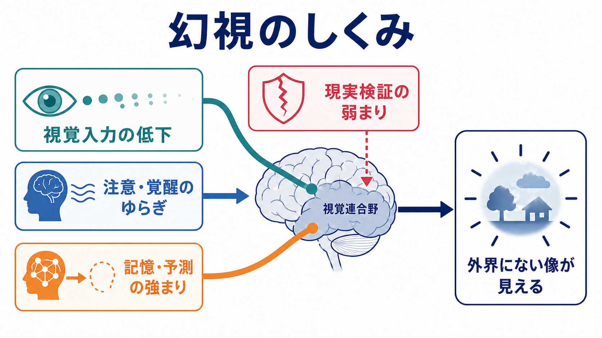

# 幻視とは何か

## 要点

- 幻視とは、外界に対応する視覚刺激がないにもかかわらず、形・光・人物・動物・情景などが「見える」体験である[1]。
- 幻視は一次性の精神疾患だけを意味しない。高齢者や身体疾患の文脈では、[[せん妄とは何か]]、Lewy小体型認知症、Parkinson病、視覚障害、薬剤・物質、睡眠関連現象、てんかん、片頭痛などを広く考える[1][2]。
- 急性発症で日内変動があり、[[意識障害とは何か|意識]]・注意・見当識の変動を伴う場合は、まずせん妄を疑う[2][3]。
- 繰り返す具体的な人物・動物などの幻視に、認知の変動、REM睡眠行動障害、パーキンソニズムが重なる場合は、Lewy小体病の重要な手がかりになる[4]。
- 視力低下があり、意識が清明で、見えている像が現実ではないと理解できる場合は、Charles Bonnet症候群を考える[5]。
- 本記事は教育・研究目的の概説であり、個別の診断や治療指示ではない。

## この記事で答える問い

- 幻視は、幻覚・錯覚・妄想とどう違うのか。
- 幻視を見たとき、なぜせん妄や神経疾患の評価が重要なのか。
- 視覚入力、注意・覚醒、記憶・予測、現実検証はどのように関わるのか。
- 臨床・研究で、どのような情報を整理すると鑑別に役立つのか。

## まず結論

幻視は「脳が壊れているから見える」という単純な現象ではなく、視覚入力の不足、視覚連合野の興奮性、注意・覚醒のゆらぎ、記憶や予測の強まり、現実検証の弱まりが重なったときに生じやすい知覚体験である[1][6]。そのため、幻視を聞いたらすぐに「統合失調症かどうか」と考えるより、発症の速さ、意識・注意の状態、認知変動、視覚障害、薬剤、睡眠、神経症状を順に確認する。

## 背景

幻覚は、外界に対応する刺激がないにもかかわらず知覚が生じる現象であり、幻視はその視覚版である[1]。幻視には、閃光・色・幾何学模様のような単純幻視と、人物・動物・風景・小さな人影のような複雑幻視がある。複雑幻視は、神経変性疾患、視覚障害、せん妄、薬剤性の状態で重要な診断手がかりになる[1][6]。

臨床上の落とし穴は、幻視を「精神病性の症状」とだけ見なすことである。幻視は、眼科疾患や神経疾患でもよくみられ、特に高齢者では認知症、Parkinson病、せん妄、薬剤、視覚障害が重なりやすい[1][6]。したがって、[[MSEで知覚異常をどう聞くか]]の一部として聞く場合でも、精神症状だけでなく身体・神経・視覚の文脈を同時に見る必要がある。

## 基本概念

### 幻視、錯視、妄想

幻視は、外界に対象がないのに見える体験である。錯視は、外界に実在する刺激を別のものとして見間違える体験である。たとえば、暗い部屋のコートを人影と見間違える場合は錯視であり、何もない場所に人影が見える場合は幻視に近い。

妄想は知覚そのものではなく、根拠が乏しいにもかかわらず強く確信される信念である。幻視から「誰かが部屋に侵入した」と確信するように、幻視に二次的な妄想的解釈がつくことはあるが、幻視と妄想は同じものではない[6]。

### 病識の有無

幻視では、本人が「これは現実ではない」と理解している場合も、体験中には現実だと感じる場合もある。Charles Bonnet症候群では、視覚障害に伴う反復性の幻視があり、説明後にそれが現実ではないと理解できることが重要な特徴とされる[5]。一方、せん妄や認知症では、注意・意識・記憶の変動により、病識が不安定になりやすい[2][4]。

### 鑑別の軸

幻視を整理するときは、内容よりも経過と背景が重要である。急に出たのか、変動するのか、夜間や入眠時に多いのか、[[意識障害とは何か|意識]]・注意が保たれているのか、[[認知機能障害とは何か]]があるのか、視力低下や眼疾患があるのか、薬剤・アルコール・離脱・感染・代謝異常があるのかを確認する[1][2][3]。

## 仕組み

視覚は、眼から入った情報をそのまま写す過程ではない。脳は、入力された情報と、記憶・予測・注意・文脈を統合して「見えている世界」を構成している。幻視は、この統合過程のバランスが崩れたときに生じやすい。

代表的な機序は三つに整理できる。第一に、視覚入力が減ると、視覚系が自発的に活動しやすくなる。これはCharles Bonnet症候群で想定される「脱入力」や解放現象に近い[5][6]。第二に、視覚連合野や関連ネットワークの興奮性・結合が変化すると、内的な像が知覚として立ち上がりやすくなる[1][6]。第三に、注意・覚醒が不安定になったり、トップダウンの予測が強すぎたりすると、弱い入力や曖昧な刺激が「実在する像」として解釈されやすくなる[6]。

このため、幻視は単一の疾患に一対一対応しない。せん妄では急性の脳機能不全と注意・覚醒の変動が前景に立つ[2][3]。Lewy小体病では、視覚認知、注意、覚醒、コリン作動性系、後頭葉・視覚連合野などの変化が関わると考えられる[4][6]。Parkinson病では、疾患進行、認知機能、睡眠、薬剤、ドパミン系治療などが複合的に関与する[6][7]。

## 図解

| 観察する軸 | 典型的に考える状態 | 確認したいこと |
|---|---|---|
| 急性発症・数時間から数日の変動 | せん妄 | 注意低下、見当識障害、睡眠覚醒リズム、感染・代謝・薬剤 |
| 繰り返す具体的な人物・動物の幻視 | Lewy小体型認知症、Parkinson病関連 | 認知変動、パーキンソニズム、REM睡眠行動障害、抗精神病薬過敏性 |
| 視力低下があり意識は清明 | Charles Bonnet症候群 | 眼疾患、視野障害、病識、他の感覚の幻覚がないか |
| 閃光・ジグザグ・一過性 | 片頭痛、てんかん、眼科疾患など | 持続時間、頭痛、発作性、視野、神経症状 |
| 入眠時・覚醒時 | 睡眠関連幻覚 | 睡眠不足、ナルコレプシー症状、薬剤、生活リズム |
| 薬剤変更・物質使用・離脱 | 薬剤性・物質関連 | 抗コリン薬、ドパミン作動薬、鎮静薬、アルコール離脱など |

## 臨床・研究との接続

臨床では、幻視の内容を詳しく聞くだけでなく、時間経過を家族・支援者からも確認する。せん妄では、本人の説明が断片的になりやすく、日中と夜間で状態が大きく変わることがある[2][3]。NICEのせん妄ガイドラインでも、数時間から数日の変化や変動、認知機能、知覚、身体機能、社会的行動の変化を観察することが推奨されている[2]。

Lewy小体型認知症では、反復する複雑な幻視は中核的な臨床特徴の一つである。人物、子ども、動物などのよく形づくられた幻視が、認知の変動やパーキンソニズム、REM睡眠行動障害と組み合わさると、診断上の重みが増す[4]。

Charles Bonnet症候群は、視覚障害に伴う幻視として重要である。精神疾患と誤解される不安から本人が話さないこともあり、視覚障害のある人には、脅かさない聞き方で「実際にはない像が見えることがあるか」を確認する価値がある[5][6]。

研究上は、幻視を疾患別に分けるだけでなく、視覚入力、視覚連合野、注意・覚醒、予測、現実検証、情動反応を横断的に見る方向が重要である。眼疾患、認知症、Parkinson病をまたいだ管理枠組みを提案するレビューでは、同定後に身体、認知、眼科的健康を見直し、教育とセルフヘルプ、介護者支援を含めて考える必要が述べられている[6]。

## よくある誤解

### 幻視があれば統合失調症である

誤りである。幻視は統合失調症でも起こりうるが、高齢者や身体疾患の文脈では、せん妄、認知症、Parkinson病、視覚障害、薬剤・物質、睡眠関連現象などの鑑別が欠かせない[1][2][6]。

### 幻視の内容が鮮明なら重い精神病である

そうとは限らない。Charles Bonnet症候群では、視覚障害がある人に鮮明で反復的な幻視が生じることがあり、意識や認知が保たれている場合もある[5]。

### 本人が「現実ではない」と分かっていれば問題ない

病識があることは重要な情報だが、それだけで安全とは言えない。転倒、不眠、不安、服薬ミス、介護者負担、背景疾患の悪化があれば評価が必要である[6]。

### 幻視を否定すればよい

体験を頭ごなしに否定すると、本人が話さなくなることがある。臨床面接では「見えている感じは本人にとって現実的である」ことを受け止めつつ、いつ、どこで、どのくらい続き、怖かったか、行動に影響したかを具体的に聞く。

## 関連ノート

- [[精神症候学とは何か]]
- [[MSEで知覚異常をどう聞くか]]
- [[せん妄とは何か]]
- [[意識障害とは何か]]
- [[認知機能障害とは何か]]
- [[失認とは何か]]
- [[視覚ネットワークはどのように階層的に情報処理するのか]]
- [[幻覚は脳内でどのように生じるのか]]
- [[レビー小体型認知症は神経回路にどのような影響を与えるのか]]

## 関連ノート候補

- 「Charles Bonnet症候群とは何か」
- 「Lewy小体型認知症とは何か」
- 「Parkinson病精神病とは何か」
- 「錯視とは何か」
- 「睡眠関連幻覚とは何か」

## MOC更新候補

- `content/00_MOC/` 配下の精神医学・症候学関連MOCに `[[幻視とは何か]]` を追加する候補。
- 並列生成ジョブとの競合を避けるため、本記事作成時点ではMOC本体は更新しない。

## 理解チェック

1. 幻視と錯視の違いを、外界刺激の有無から説明できるか。
2. 急性発症で注意・意識の変動を伴う幻視で、なぜせん妄を優先して考えるのか。
3. Lewy小体型認知症で幻視と一緒に確認したい中核的特徴を三つ挙げられるか。
4. 視覚障害を背景にした幻視で、Charles Bonnet症候群を考える手がかりは何か。
5. 幻視の機序を、視覚入力、注意・覚醒、記憶・予測、現実検証の語を使って説明できるか。

## 未解決問題

- 幻視に共通する機序と、疾患ごとに異なる機序をどこまで分けられるかは未解決である[6]。
- 幻視を主要アウトカムにしたランダム化比較試験は限られており、治療・支援のエビデンスは疾患ごとに偏りがある[6][7]。
- 体験の苦痛、病識、介護者負担、文化的解釈をどう標準化して評価するかには課題が残る。

## 参考文献

[1] Teeple, R. C., Caplan, J. P., & Stern, T. A. (2009). Visual hallucinations: differential diagnosis and treatment. *Primary Care Companion to The Journal of Clinical Psychiatry*, 11(1), 26-32. https://pmc.ncbi.nlm.nih.gov/articles/PMC2660156/

[2] National Institute for Health and Care Excellence. (2023). *Delirium: prevention, diagnosis and management in hospital and long-term care* (NICE guideline CG103). https://www.nice.org.uk/guidance/cg103/chapter/1-recommendations

[3] Inouye, S. K., Westendorp, R. G. J., & Saczynski, J. S. (2014). Delirium in elderly people. *The Lancet*, 383(9920), 911-922. https://doi.org/10.1016/S0140-6736(13)60688-1

[4] McKeith, I. G., Boeve, B. F., Dickson, D. W., et al. (2017). Diagnosis and management of dementia with Lewy bodies: Fourth consensus report of the DLB Consortium. *Neurology*, 89(1), 88-100. https://pmc.ncbi.nlm.nih.gov/articles/PMC5496518/

[5] Menon, G. J. (2005). Complex visual hallucinations in the visually impaired: the Charles Bonnet Syndrome. *Survey of Ophthalmology*, 50(3), 239-249. https://doi.org/10.1016/j.survophthal.2005.02.004

[6] O'Brien, J., Taylor, J. P., Ballard, C., et al. (2020). Visual hallucinations in neurological and ophthalmological disease: pathophysiology and management. *Journal of Neurology, Neurosurgery & Psychiatry*, 91(5), 512-519. https://jnnp.bmj.com/content/91/5/512

[7] Seppi, K., Weintraub, D., Coelho, M., et al. (2011). The Movement Disorder Society Evidence-Based Medicine Review Update: Treatments for the non-motor symptoms of Parkinson's disease. *Movement Disorders*, 26(S3), S42-S80. https://pmc.ncbi.nlm.nih.gov/articles/PMC4020145/
