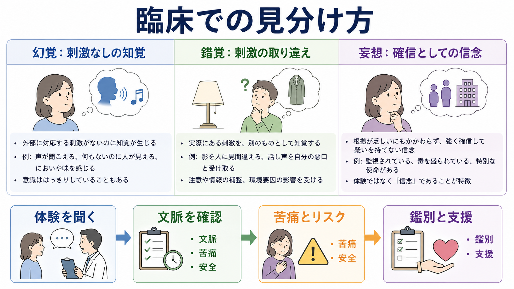
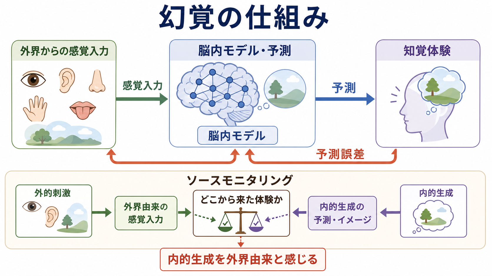
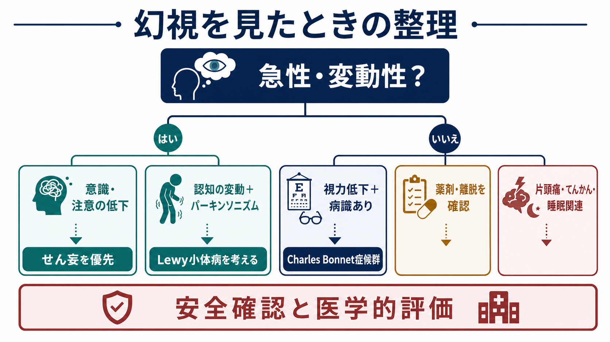

# 幻覚とは何か

## 要点

- 幻覚とは、対応する外部刺激がない、またはその体験を十分に説明できる外部刺激がないにもかかわらず、見る・聞く・におう・味わう・触れられるなどの知覚体験が生じる症候である[1][2]。
- 幻覚はそれ自体が診断名ではない。統合失調症スペクトラム、気分障害、せん妄、神経疾患、感覚障害、物質・薬剤、睡眠移行期、強いストレスや悲嘆など、複数の文脈で起こりうる[2][3]。
- 評価では「あるかないか」だけでなく、感覚様式、内容、頻度、持続、現実検討、苦痛、生活機能への影響、安全性、身体・薬剤・物質要因を具体的に確認する[6]。
- 機序は単一ではない。幻聴では内的音声・記憶・情動・注意・ソースモニタリング・抑制制御が関わり、予測処理の観点では強い事前予測が感覚入力より優位になることで、刺激なしの知覚が生じると考えられている[4][5]。
- 本稿は教育・研究目的の整理であり、個別の診断や治療指示ではない。急性発症、意識変容、命令性の内容、自傷他害リスク、物質・薬剤・神経症状を伴う場合は専門的評価が必要である[6][7]。

## この記事で答える問い

1. 幻覚は、錯覚・妄想・イメージ・侵入思考と何が違うのか。
2. 幻聴、幻視、幻嗅、幻味、幻触はどのように整理できるのか。
3. なぜ外部刺激がないのに「知覚として」体験されるのか。
4. 臨床や研究では、幻覚をどのように聞き、記述し、解釈するのか。

## まず結論

幻覚は「外界に存在しないものを信じている」ことではなく、「外界から来たように感じられる知覚体験」が生じることである。したがって、幻覚は[[妄想は予測誤差処理の異常として説明できるのか|妄想]]とは区別される。妄想は主に信念の問題であり、幻覚は主に知覚体験の問題である。ただし、実際には「声が聞こえる」という幻聴に「誰かが監視している」という妄想的解釈が結びつくこともあり、両者は独立ではない[3][5]。

また、幻覚は[[精神疾患とは何か|精神疾患]]だけに限定されない。たとえば、せん妄、てんかん、パーキンソン病、レビー小体型認知症、視覚・聴覚障害、薬剤、物質使用、睡眠不足、入眠時・覚醒時体験、強い悲嘆でも幻覚様体験は起こりうる[2][6]。そのため、[[精神状態診察MSEとは何か|精神状態診察MSE]]では、症候名を付ける前に、体験の性質と文脈を丁寧に記述する。

## 背景

幻覚は、精神医学の症候学で長く中心的に扱われてきた。DSMやICDでは、幻覚は精神病性症状の一部として重要だが、特定の診断に固有の所見ではない。ICD-11 CDDRも、診断を臨床的に信頼できる形で同定するためには、症状を文脈、経過、機能障害、文化的背景と合わせて評価することを重視している[1]。

近年の研究では、幻覚は疾患横断的な現象として扱われることが増えている。統合失調症だけでなく、気分障害、神経疾患、感覚障害、非臨床群にも幻覚様体験はみられるため、「どの診断か」だけでなく、「どのような知覚体験が、どの条件で、どれほど苦痛や障害につながっているか」が重要になる[3]。

## 基本概念

### 定義

幻覚は、対応する外部刺激がないにもかかわらず、知覚に似た体験が生じる現象である[2]。ここで重要なのは、本人が「考えた」「想像した」だけではなく、声、姿、におい、味、触覚、身体感覚などとして体験する点である。

ただし、幻覚の現実検討は一様ではない。本人が「本当に外から来ている」と確信する場合もあれば、「脳やストレスのせいかもしれない」と距離を取っている場合もある。したがって、幻覚の有無と病識の有無は分けて記述する。

### 感覚様式による分類

| 種類 | 体験の例 | 評価で見る点 |
|---|---|---|
| 幻聴 | 声、音、呼びかけ、命令、会話 | 内容、人数、位置、命令性、苦痛、安全性 |
| 幻視 | 人影、動物、光、模様、場面 | 視力、意識変容、神経疾患、薬剤、せん妄 |
| 幻嗅 | においがする | てんかん、片頭痛、鼻腔・嗅覚系、記憶・情動 |
| 幻味 | 味がする | 口腔・薬剤・感染・神経疾患 |
| 幻触 | 触られる、虫が這う、電気が走る | 物質、離脱、皮膚疾患、神経障害 |
| 体感幻覚 | 体内に何かがある、臓器が動く | 身体疾患、妄想的解釈、苦痛、受診行動 |

幻聴は統合失調症スペクトラムでよく注目されるが、幻視はせん妄や神経疾患、感覚障害で重要になることがある[2][6]。この違いは[[MSEで知覚異常をどう聞くか]]で確認する項目とも重なる。

### 錯覚・妄想・イメージとの違い

錯覚は、実際にある刺激を別のものとして知覚することである。暗い部屋のコートを人影に見間違える場合、外部刺激は存在している。幻覚では、その体験を説明する外部刺激がない。

妄想は、反証に抵抗する確信的な信念である。幻覚は「声が聞こえる」「見える」という知覚体験であり、妄想は「その声は国家機関から送られている」といった解釈や信念として現れることがある[2][5]。侵入思考や鮮明なイメージは、本人が内的な思考・想像として捉えられることが多いが、幻覚では外界由来の知覚に近く感じられる。

## 仕組み

幻覚の機序は、感覚様式、疾患、状態、発達歴、薬剤、環境によって異なる。したがって「幻覚の原因はこれ一つ」と考えるより、複数の過程が重なって知覚体験が生じると考える方が実用的である。

### 予測処理として見る

脳は感覚入力を受け取るだけでなく、過去の経験や文脈から「何が起こっているはずか」を予測しながら知覚を構成する。予測処理の考え方では、感覚入力と予測のずれが予測誤差として扱われ、知覚はそのバランスから生まれる[5]。

幻覚では、外からの証拠が弱い、曖昧、または遮断されているときに、強すぎる事前予測や記憶・期待が知覚を形づくる場合がある。たとえば暗所、静かな環境、睡眠不足、感覚障害、強い不安、悲嘆、薬剤や物質の影響は、外界からの信号と内的予測のバランスを変えうる[5][6]。

### ソースモニタリングとして見る

ソースモニタリングとは、ある体験が「外から来たのか」「自分の内側で生じたのか」を判断する過程である。幻聴研究では、内的音声、記憶、情動的に意味のある言語内容、注意の偏り、抑制制御の弱まりが組み合わさることで、内的に生成されたものが外的な声として体験される可能性が検討されてきた[4]。

この説明は、幻聴を「本人の作り話」とみなすものではない。むしろ、本人には実際に知覚として体験されていることを前提に、その知覚がどのような認知・神経過程から生じるのかを考える枠組みである。

### 情動と意味づけ

幻覚の苦痛は、知覚内容そのものだけで決まらない。声が批判的・命令的である、本人が声を強い存在と感じる、過去の外傷体験や孤立と結びつく、眠れない、逃げ場がない、といった条件で苦痛や危険性が高まる[4][7]。逆に、幻覚様体験が一過性で、本人が距離を取れ、生活機能が保たれている場合には、臨床的意味は大きく異なる。

## 図解

1枚目は、幻覚を錯覚・妄想と比べ、体験を聞き、文脈、苦痛、安全、鑑別、支援へつなげる見取り図である。2枚目は、感覚入力、脳内モデル、予測、予測誤差、ソースモニタリングの関係を示している。3枚目は、幻視を例に、急性・変動性、意識・注意、視力低下、薬剤、神経疾患などを確認する臨床的な流れを示している。

## 臨床・研究との接続

### 面接で何を聞くか

[[MSEで知覚異常をどう聞くか]]では、幻覚を直接否定せず、本人の言葉で体験を具体化する。たとえば次の軸を確認する。

| 軸 | 聞く内容 |
|---|---|
| 感覚様式 | 声、音、映像、におい、味、触覚、体内感覚のどれか |
| 内容 | 何が聞こえる・見える・感じられるのか |
| 位置 | 頭の中、耳元、部屋の外、身体の表面、体内など |
| 頻度と持続 | いつ、どのくらい、どんな状況で起こるか |
| 現実検討 | 本人はどの程度「外から来ている」と感じるか |
| 苦痛と機能 | 睡眠、対人関係、仕事・学業、セルフケアへの影響 |
| 安全性 | 命令性、自傷他害、逃避行動、危険な対処 |
| 鑑別 | 意識変容、薬剤、物質、神経症状、感覚障害、発熱、睡眠 |

特に命令性幻聴では、「命令の内容」だけでなく、声をどのくらい強い存在と感じるか、過去に従ったことがあるか、従わないと何が起こると感じるか、物質使用や衝動性、現在の手段へのアクセスを確認する必要がある[7]。

### 鑑別診断との関係

幻覚は[[鑑別診断とは何か]]の入り口になるが、幻覚だけで診断は決まらない。急に出現した幻視、意識・注意の変動、発熱、脱水、感染、低酸素、薬剤変更を伴う場合は[[せん妄とは何か]]が重要になる。薬剤開始・増量・中止、抗コリン作用、ドパミン作動薬、ステロイド、アルコール・物質使用が関わる場合は[[薬剤性精神症状とは何か]]や物質関連の評価につなげる。

また、幻覚が精神病性障害の一部として現れる場合でも、気分エピソードとの時間関係、トラウマ関連症状、解離、睡眠、感覚障害、神経疾患、文化的・宗教的文脈を分けて考える。これは[[精神科診断における除外診断とは何か]]とも直結する。

### 研究では何が問題になるか

研究では、幻覚を単一カテゴリとして扱うと情報が粗くなる。幻聴、幻視、幻嗅では関わる感覚系が異なり、同じ幻聴でも、批判的な声、命令する声、会話する声、名前を呼ぶ声、音楽、雑音では認知過程や苦痛が異なる[3][4]。したがって、研究では感覚様式、内容、現実検討、苦痛、頻度、併存症状、薬剤、感覚障害、文化的文脈を明示する必要がある。

## よくある誤解

### 誤解1: 幻覚があれば統合失調症である

誤りである。幻覚は統合失調症スペクトラムで重要な症状だが、気分障害、せん妄、神経疾患、感覚障害、薬剤・物質、睡眠移行期、強いストレスでも生じうる[2][3][6]。診断には経過、他の症状、機能障害、身体要因、薬剤、文化的背景を合わせて考える。

### 誤解2: 幻覚は本人が作っている

誤りである。幻覚は本人にとって知覚として体験される。作為性を決めつけると、苦痛や安全性の確認が難しくなる。臨床では「本当にあるか」を争うより、「どのように体験され、どれほどつらく、何に影響しているか」を聞く。

### 誤解3: 幻覚と妄想は同じである

異なる。幻覚は知覚体験、妄想は信念である。ただし、幻覚に妄想的解釈が付くことはある。たとえば「声が聞こえる」は幻聴であり、「その声は特定組織が送っている」は妄想的信念として評価される場合がある[2][5]。

### 誤解4: 幻覚は常に危険である

幻覚そのものが常に危険というわけではない。一方で、命令性、強い苦痛、自傷他害への内容、現実検討の低下、物質使用、衝動性、手段へのアクセスがある場合はリスク評価が必要である[7]。

## 関連ノート

既存ノート:

- [[精神症候学とは何か]]
- [[MSEで知覚異常をどう聞くか]]
- [[精神状態診察MSEとは何か]]
- [[せん妄とは何か]]
- [[鑑別診断とは何か]]
- [[精神科診断における除外診断とは何か]]
- [[薬剤性精神症状とは何か]]
- [[精神疾患とは何か]]
- [[妄想は予測誤差処理の異常として説明できるのか]]
- [[ドパミン仮説は統合失調症をどこまで説明できるのか]]
- [[グルタミン酸仮説は統合失調症をどう説明するのか]]

今後の作成候補:

- 幻聴とは何か
- 幻視とは何か
- 錯覚とは何か
- 命令性幻聴をどう評価するか
- Charles Bonnet症候群とは何か
- ソースモニタリングとは何か
- 予測処理モデルから見た幻覚

MOC更新候補:

- `content/00_MOC/` 配下の精神医学・症候学・精神状態診察関連MOCに、本記事へのリンクを追加する候補。ただし本ジョブでは並列編集衝突を避けるため、MOC本体は更新しない。

## 理解チェック

1. 幻覚と錯覚の違いを、外部刺激の有無という観点から説明できるか。
2. 幻覚と妄想を、知覚体験と信念の違いとして説明できるか。
3. 幻聴を聞くとき、内容以外に確認すべき項目を5つ挙げられるか。
4. 幻視が急に出現したとき、せん妄、薬剤、神経疾患、視覚障害を確認すべき理由を説明できるか。
5. 予測処理とソースモニタリングは、幻覚のどの側面を説明しようとしているか。

## 未解決問題

- 幻覚の発生機序は、感覚様式や疾患ごとにどこまで共通で、どこから異なるのか。
- 強い事前予測、感覚入力の低下、注意・情動・記憶の影響を、個人レベルでどう測定できるのか。
- 非臨床的な幻覚様体験と、苦痛や機能障害を伴う臨床的幻覚の境界を、どのように連続的に記述できるのか。
- 命令性幻聴のリスク評価で、声の内容、声への信念、衝動性、物質使用、環境要因をどのように統合するのが最も妥当か。

## 参考文献

[1] World Health Organization. (2024). *Clinical descriptions and diagnostic requirements for ICD-11 mental, behavioural and neurodevelopmental disorders*. WHO. https://www.who.int/publications/i/item/9789240077263

[2] Calabrese, J., & Al Khalili, Y. (2023). Psychosis. *StatPearls*. NCBI Bookshelf. https://www.ncbi.nlm.nih.gov/books/NBK546579/

[3] Waters, F., & Fernyhough, C. (2017). Hallucinations: A systematic review of points of similarity and difference across diagnostic classes. *Schizophrenia Bulletin, 43*(1), 32-43. https://doi.org/10.1093/schbul/sbw132

[4] Waters, F., Allen, P., Aleman, A., Fernyhough, C., Woodward, T. S., Badcock, J. C., Barkus, E., Johns, L., Varese, F., Menon, M., Vercammen, A., & Laroi, F. (2012). Auditory hallucinations in schizophrenia and nonschizophrenia populations: A review and integrated model of cognitive mechanisms. *Schizophrenia Bulletin, 38*(4), 683-693. https://doi.org/10.1093/schbul/sbs045

[5] Corlett, P. R., Horga, G., Fletcher, P. C., Alderson-Day, B., Schmack, K., & Powers, A. R. (2019). Hallucinations and strong priors. *Trends in Cognitive Sciences, 23*(2), 114-127. https://doi.org/10.1016/j.tics.2018.12.001

[6] Thakur, T., & Gupta, V. (2023). Auditory Hallucinations. *StatPearls*. NCBI Bookshelf. https://www.ncbi.nlm.nih.gov/books/NBK557633/

[7] Dugre, J. R., Guay, J.-P., & Dumais, A. (2018). Risk factors of compliance with self-harm command hallucinations in individuals with affective and non-affective psychosis. *Schizophrenia Research, 195*, 115-121. https://doi.org/10.1016/j.schres.2017.09.001
