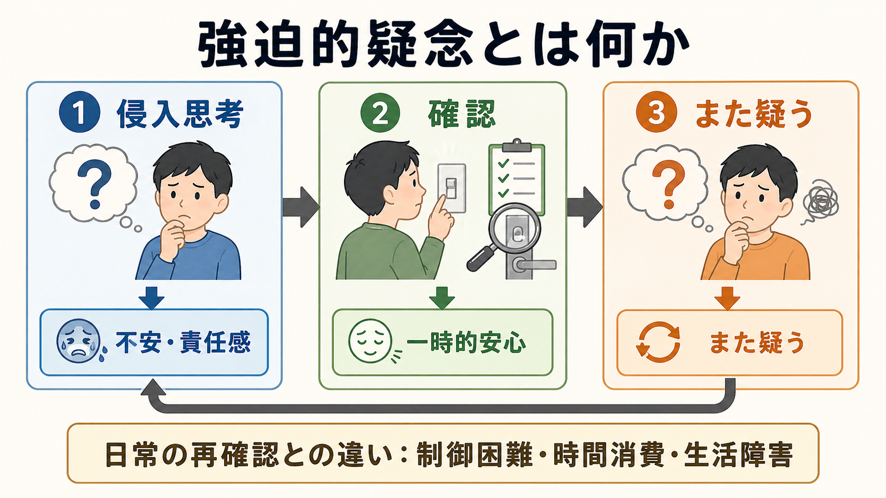
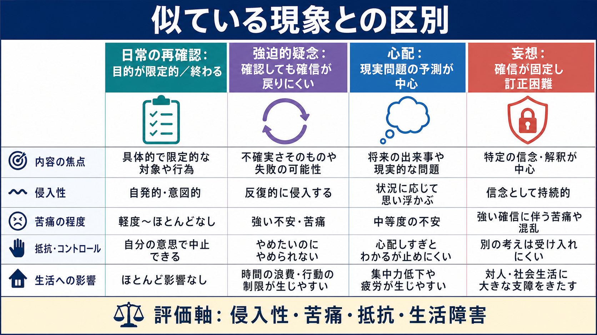

# 強迫的疑念とは何か

## 要点

- 強迫的疑念とは、確認・反すう・安心希求をしても「本当に大丈夫か」という不確実感が残り続け、再び確認へ戻る疑念の反復である。
- 強迫症では、侵入的で望まない[[強迫観念とは何か|強迫観念]]と、それを中和しようとする[[強迫行為とは何か|強迫行為]]が中心になり、疑念は確認型の強迫症状を動かす重要な体験になる[1][2]。
- 日常の再確認との違いは、疑念の内容そのものよりも、制御困難さ、苦痛、時間消費、生活障害、そして「確認しても終われない」構造にある[1][2]。
- 反復確認は短期的には[[不安とは何か|不安]]を下げるが、長期的には記憶や知覚への確信を下げ、疑念を保つことがある[5][6][8]。
- これは教育・研究目的の症候学的整理であり、個別の診断や治療指示ではない。

## この記事で答える問い

1. 強迫的疑念は、ふつうの「念のための確認」と何が違うのか。
2. なぜ確認すればするほど、安心ではなく疑念が残ることがあるのか。
3. [[侵入思考とは何か|侵入思考]]、心配、[[妄想とは何か|妄想]]、優柔不断とはどう区別できるのか。
4. 臨床評価や研究では、どのような観点で扱われるのか。

## まず結論

強迫的疑念は、「情報が足りないから合理的に確認する」という単純な状態ではない。むしろ、危険・責任・失敗の可能性が過大に意味づけられ、完全な確信を得るまで終われない感覚が続く状態である。たとえば鍵を閉めたかを一度確認して終われる場合は日常的な再確認でありうる。しかし、何度見ても「見落としたかもしれない」「確認した記憶が信用できない」「もし火事になったら自分の責任だ」という疑念が戻り、生活や時間を奪うなら、強迫的疑念として評価する価値がある[1][4][5]。

この疑念は、本人が望んでいる信念とは限らない。強迫症の強迫観念は、多くの場合、侵入的で不快で、本人が抵抗したいものとして体験される[1][2]。そのため、強迫的疑念は「本当はそう信じている」よりも、「そうであっては困る可能性を消しきれない」と表現した方が近い。

## 背景

強迫症 obsessive-compulsive disorder: OCD は、反復的で侵入的な思考・衝動・イメージである強迫観念と、それに反応して行われる反復行動または心的行為である強迫行為によって特徴づけられる[1][2]。NIMH は、OCD では望まない反復思考や反復行動が制御しにくく、時間を費やし、苦痛や日常生活上の問題をもたらしうると説明している[1]。ICD-11 でも、強迫観念・強迫行為が時間消費的であるか、著しい苦痛や機能障害をもたらすことが診断上重要になる[2]。

疑念は古くから強迫症の中核的特徴の一つとして扱われてきた。確認型の強迫症状では、「汚れているか」「火を消したか」「人を傷つけたか」「重大なミスをしたか」といった疑念が、確認、質問、検索、記憶の再点検、安心希求を誘発する。Rachman は、強迫的確認を、危害を防ぐ特別な責任を感じる人が、脅威が除去されたと確信できないときに生じやすいものとして理論化した[5]。

## 基本概念

### 強迫的疑念

強迫的疑念とは、十分な確認の後にも「まだ確実ではない」という感覚が残り、疑念を消すための行為が反復される状態である。ここでいう疑念は、現実的な検討そのものではなく、不確実性への耐えがたさ、責任感、失敗や危害の過大評価、記憶や知覚への不信と結びつく[4][5][7]。

典型例は次のように整理できる。

| 場面 | 疑念 | 確認・中和 | 残る感覚 |
|---|---|---|---|
| 外出前 | 鍵を閉めたか | 何度も戻って見る | 見た記憶が信用できない |
| 料理後 | 火を消したか | コンロ、写真、家族への確認 | まだ危険かもしれない |
| 仕事後 | 重大なミスをしたか | メール・記録の再読 | 見落とした可能性が残る |
| 対人場面 | 傷つけたか | 会話の反すう、謝罪、相手への確認 | 反応が少しでも曖昧だと疑念が戻る |

### 強迫観念・強迫行為との関係

強迫的疑念は、強迫観念と強迫行為のあいだをつなぐ体験として理解しやすい。まず、侵入的な「もしかしたら」が浮かぶ。次に、それを重大な危険や責任のサインとして評価する。すると不安や罪責感が高まり、確認や中和が起きる。確認は一時的な安心をもたらすが、完全な確信を要求するほど、少しの曖昧さが再び疑念になる[4][5]。

ここで重要なのは、強迫行為が外から見える行動だけではないことである。頭の中で記憶を再生する、言葉を反復する、確信が得られるまで検索する、他者の表情を読む、過去の出来事を細部まで検討する、といった心的行為も確認として働くことがある[1][2]。

## 仕組み

### 1. 不確実性を危険として読む

強迫的疑念では、不確実性そのものが危険信号のように扱われる。「確実に安全だと感じない」ことが、「安全ではない」ことに近く感じられる。Tolin らは、OCD、とくに確認強迫をもつ群で不確実性不耐性が関連しうることを示し、病的疑念は知識の不足だけでなく、不確実な感覚への情動反応としても理解できると論じた[7]。

### 2. 責任感が確認を強める

Salkovskis の認知行動モデルでは、侵入思考そのものよりも、それを「自分や他者への危害を防ぐ責任」と結びつけて評価することが問題を維持しやすい[4]。疑念が「もし確認しなければ自分の責任になる」と意味づけられると、確認は合理的な安全行動に見える。しかし、確認に頼るほど「確認しなければ危険」という学習が強まり、疑念が自動的に立ち上がりやすくなる。

### 3. 反復確認が記憶確信を下げる

反復確認の逆説は、確認が確信を増やすとは限らない点にある。van den Hout と Kindt は、反復確認が記憶の正確性そのものよりも、記憶の鮮明さ・詳細感・確信を低下させ、記憶不信を生みうることを実験的に示した[6]。つまり「何度も見たから大丈夫」ではなく、「何度も見すぎて、さっき見た記憶がぼやける」という経路がありうる。

### 4. 知覚への不信と確認の循環

近年のメタ分析では、OCD 群はとくに知覚判断を要する課題で確認が増えやすく、脅威内容だけでなく、感覚・知覚への不信や自動処理への干渉が確認循環に関わる可能性が示されている[8]。この見方では、強迫的疑念は「危険が大きいから確認する」だけでなく、「見た・触れた・覚えているという感覚が信用できないから確認する」現象でもある。

## 図解

| 図 | 読み方 |
|---|---|
| 図1 | 強迫的疑念を、侵入思考、不安・責任感、確認、一時的安心、再疑念の循環として読む |
| 図2 | 確認が安心を与える一方で、記憶確信や知覚確信を下げ、疑念を保つ仕組みを読む |
| 図3 | 日常の再確認、強迫的疑念、心配、妄想を、侵入性・苦痛・抵抗・生活障害で区別する |

## 臨床・研究との接続

臨床評価では、疑念の内容だけでなく、頻度、持続時間、抵抗感、確信度、確認行為、安心希求、[[回避行動とは何か|回避行動]]、生活障害を確認する。たとえば「鍵が心配」という訴えだけでは、日常的な慎重さ、全般的な心配、強迫的疑念、妄想的確信のどれにも見える。評価では、本人が疑念をどの程度不合理または過剰と感じているか、確認をやめようとしてもやめられないか、安心がどれほど短いか、仕事・学業・家庭生活にどれほど影響しているかを分けて聞く必要がある[1][2]。

治療研究との接続では、認知行動療法、とくに曝露反応妨害法 exposure and response prevention: ERP が重要である。NICE は OCD に対する心理的介入として CBT と ERP を中核的に位置づけている[3]。ただし、本記事の目的は治療手順の提示ではない。症候学的には、ERP が「疑念を完全に消してから行動する」のではなく、「疑念が残ったまま確認を減らし、不安と予測が時間とともにどう変化するかを学ぶ」枠組みと関係する点が重要である。

研究では、強迫的疑念は単一の症状名というより、確認、責任評価、不確実性不耐性、記憶確信、知覚確信、脅威評価、習慣化といった複数の構成概念の交点として扱われる。したがって、同じ「疑う」でも、危害責任が中心の人、記憶不信が中心の人、対人場面で安心希求が中心の人、過去の出来事を反すうする人では、観察すべき維持要因が異なる。

## よくある誤解

### 誤解1: 強迫的疑念は慎重な性格の延長である

慎重さは、情報を確認して判断を終える能力を含む。強迫的疑念では、判断を終えることが難しく、確認がかえって疑念の次の材料になる。性格傾向だけでなく、苦痛、制御困難、時間消費、生活障害を見る必要がある[1][2]。

### 誤解2: 何度も確認すれば、いつか完全に安心できる

反復確認は短期的な安心を与えるが、記憶や知覚への確信を下げることがある[6]。そのため「あと一回だけ」は、疑念の解決ではなく循環の入口になる場合がある。

### 誤解3: 強迫的疑念は妄想と同じである

強迫的疑念では、本人が「過剰かもしれない」「ばかげているかもしれない」と感じながら抵抗していることが多い。一方、妄想では確信が固定し、反証で訂正されにくい。もちろん洞察の程度には幅があるため、[[精神症候学とは何か|精神症候学]]的には確信度、抵抗感、現実検討、行動への影響を丁寧に評価する。

### 誤解4: 確認行為が見えなければ強迫的疑念ではない

確認は外的行動に限られない。記憶の再点検、内的な言葉の反復、検索、安心を得るための質問、過去場面の反すうも、疑念を中和する行為として働くことがある[1][2]。

## 関連ノート

既存ノート候補:

- [[強迫観念とは何か]]
- [[強迫行為とは何か]]
- [[侵入思考とは何か]]
- [[不安とは何か]]
- [[回避行動とは何か]]
- [[妄想とは何か]]
- [[精神症候学とは何か]]

今後の作成候補:

- 強迫症とは何か
- 曝露反応妨害法とは何か
- 安心希求とは何か
- 不確実性不耐性とは何か
- 記憶確信とは何か

MOC更新候補:

- `content/00_MOC/` 配下の精神医学・症候学・強迫症関連 MOC に、バッチ統合時に追加する。

## 理解チェック

1. 日常的な再確認と強迫的疑念を分ける評価軸は何か。
2. なぜ反復確認は、記憶への確信を下げることがあるのか。
3. 強迫的疑念と妄想を区別するとき、確信度以外に何を見るべきか。
4. 「不確実感が残る」ことと「危険が実際に高い」ことを混同すると、どのような確認循環が生じるか。

## 参考文献

[1] National Institute of Mental Health. (2023). *Obsessive-Compulsive Disorder: When Unwanted Thoughts or Repetitive Behaviors Take Over*. https://www.nimh.nih.gov/health/publications/obsessive-compulsive-disorder-when-unwanted-thoughts-or-repetitive-behaviors-take-over

[2] World Health Organization. (2024). *ICD-11 for Mortality and Morbidity Statistics: Obsessive-compulsive disorder*. https://icd.who.int/browse/2024-01/mms/en#1582744333

[3] National Institute for Health and Care Excellence. (2005, last reviewed 2024). *Obsessive-compulsive disorder and body dysmorphic disorder: treatment* (Clinical guideline CG31). https://www.nice.org.uk/guidance/cg31

[4] Salkovskis, P. M. (1985). Obsessional-compulsive problems: A cognitive-behavioural analysis. *Behaviour Research and Therapy, 23*(5), 571-583. https://doi.org/10.1016/0005-7967(85)90105-6

[5] Rachman, S. (2002). A cognitive theory of compulsive checking. *Behaviour Research and Therapy, 40*(6), 625-639. https://doi.org/10.1016/S0005-7967(01)00028-6

[6] van den Hout, M., & Kindt, M. (2003). Repeated checking causes memory distrust. *Behaviour Research and Therapy, 41*(3), 301-316. https://doi.org/10.1016/S0005-7967(02)00012-8

[7] Tolin, D. F., Abramowitz, J. S., Brigidi, B. D., & Foa, E. B. (2003). Intolerance of uncertainty in obsessive-compulsive disorder. *Journal of Anxiety Disorders, 17*(2), 233-242. https://doi.org/10.1016/S0887-6185(02)00182-2

[8] Strauss, A. Y., Fradkin, I., McNally, R. J., Linkovski, O., Anholt, G. E., & Huppert, J. D. (2020). Why check? A meta-analysis of checking in obsessive-compulsive disorder: Threat vs. distrust of senses. *Clinical Psychology Review, 75*, 101807. https://doi.org/10.1016/j.cpr.2019.101807
