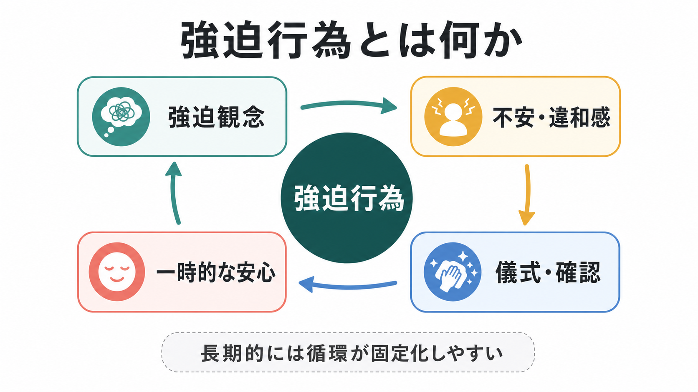
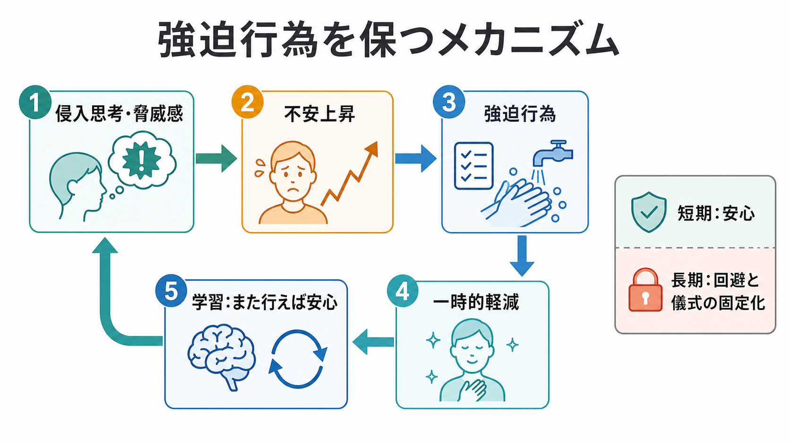
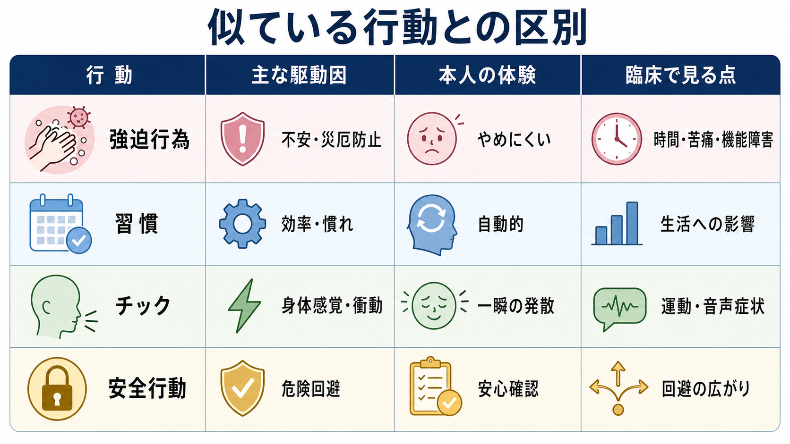

# 強迫行為とは何か

## 要点

- 強迫行為とは、不安・嫌悪感・「完全でない感じ」を下げるため、または災厄を防ぐために、本人が駆り立てられて行う反復行動や心的行為である[1][2]。
- 典型例には、手洗い、確認、数える、並べる、祈る、言葉を心の中で反復することがある[3]。
- 強迫行為は快楽を得る行動というより、苦痛を一時的に下げる行動として理解しやすい。短期的な安心が、長期的には回避と儀式を固定化しうる[3][4]。
- 臨床では、行動の内容だけでなく、目的、主観的切迫感、抵抗の有無、時間消費、苦痛、生活機能への影響を確認する。
- これは教育・研究目的の概説であり、個別の診断や治療指示ではない。

## この記事で答える問い

1. 強迫行為は、単なる習慣や心配性と何が違うのか。
2. なぜ強迫行為は「一時的に楽になる」のに、長期的には続きやすいのか。
3. 強迫観念、儀式、安全行動、チック、習慣とはどう区別するのか。
4. 臨床評価や研究では、強迫行為をどのように扱うのか。

## まず結論

強迫行為は、「不安を下げるための反復行動」とだけ捉えると狭すぎる。実際には、汚染や加害の不安を中和する、確認によって責任感を下げる、対称性や完全性の違和感を整える、頭の中で言葉や数を反復するなど、身体行動と心的行為の両方を含む[1][2]。

重要なのは、行動の見た目ではなく、その行動が何に駆動され、本人にどのような苦痛や切迫感をもたらし、生活の自由度をどの程度狭めているかである。手洗いそのものは日常的な衛生行動にもなりうるが、「やめたいのにやめられない」「しないと重大なことが起こる感じがする」「時間を大きく奪われる」なら、[[精神症候学とは何か|精神症候学]]上は強迫行為として記述する価値がある。

## 背景

強迫行為は、強迫症における主要な症状の一つである。DSM-5-TRでは、強迫行為は、強迫観念への反応として、または厳格な規則に従って行われる反復行動または心的行為として整理される[1]。ICD-11 CDDRでも、強迫症は持続する強迫観念または強迫行為、しばしばその両方によって特徴づけられ、強迫行為は反復行動や心的行為を含むものとして説明される[2]。

ただし、強迫行為は診断名そのものではない。[[DSMとICDは何が違うのか|DSMやICD]]の診断基準では、症状の持続、苦痛、時間消費、機能障害、他の疾患や物質・身体疾患との関係を合わせて判断する。したがって、強迫行為を見たらすぐ強迫症と決めるのではなく、症状の文脈を丁寧に記述する必要がある。

## 基本概念

### 強迫観念と強迫行為

強迫観念は、反復して侵入する思考、イメージ、衝動であり、多くの場合、不安や嫌悪感を伴う[1][3]。強迫行為は、その不安や違和感を下げるため、または恐れている出来事を防ぐために行われる反復行動や心的行為である[1][2]。

例として、汚染の強迫観念に対する過剰な手洗い、火事や施錠忘れへの不安に対する確認、対称性への違和感に対する並べ直し、頭の中で特定の言葉を繰り返す心的儀式がある[3]。

### 行動と心的行為

強迫行為は、外から見える行動だけではない。確認、洗浄、整列のような行動に加えて、数える、祈る、言葉を反復する、頭の中で「打ち消す」などの心的行為も含む[1][3]。したがって、面接では「何をしているか」だけでなく、「頭の中で何かを繰り返していないか」「安心するまで確認していないか」を尋ねる必要がある。

### 快楽ではなく軽減

強迫行為は、依存行動や趣味のように快楽を得るための行動とは限らない。NIMHは、強迫行為は快楽をもたらすというより、不安の一時的軽減をもたらすことが多いと説明している[3]。この点は[[オペラント条件づけとは何か|オペラント条件づけ]]の負の強化として理解しやすい。

## 仕組み

### 負の強化としての循環

典型的な循環は、次のように整理できる。

| 段階 | 起こること | 学習されやすいこと |
|---|---|---|
| 1 | 侵入思考や脅威感が生じる | 「危険かもしれない」 |
| 2 | 不安、嫌悪感、責任感が上がる | 「すぐ下げたい」 |
| 3 | 洗浄、確認、数える、祈るなどを行う | 「この行動が必要だ」 |
| 4 | 一時的に安心する | 「行えば楽になる」 |
| 5 | 次回も同じ行動に頼りやすくなる | 回避と儀式が固定化する |

この循環では、強迫行為が短期的には苦痛を下げるため、次に同じ不安が出たときにも同じ行動が選ばれやすくなる。これが「やめたいのにやめにくい」構造である[4]。

### 目標志向行動と習慣

強迫行為は、初期には「不安を下げる」「災厄を防ぐ」という目標に向けた行動として始まることがある。しかし反復されるうちに、目標への有効性を本人が疑っていても、行動そのものが自動化しやすくなる。この観点から、強迫症研究では目標志向制御と習慣制御のバランスが重要視されている[6][7]。

この見方は、[[習慣形成にはどのような条件が必要なのか|習慣形成]]や[[抑制制御とは何か|抑制制御]]とも接続する。ただし、強迫行為を「悪い習慣」とだけ呼ぶと、本人の苦痛、侵入思考、責任感、災厄防止感を見落とす。習慣の要素はあっても、症候学的には不安・違和感・中和・回避との結びつきを見る必要がある。

### 神経回路との接続

神経科学的には、強迫症は前頭前野、線条体、視床を含む皮質線条体視床皮質回路との関連で研究されてきた[5]。この回路は、行動選択、誤り検出、価値づけ、反復的な行動パターンと関わる。詳細は[[強迫症では皮質線条体視床回路に何が起きているのか]]に接続できる。

ただし、神経回路モデルは「脳のある場所が壊れている」という単純な説明ではない。症状、学習、環境、発達、遺伝、認知制御の相互作用として読む方がよい[5]。

## 図解

3枚目の図は、似ている行動との区別を示す。強迫行為、習慣、チック、安全行動は外から見ると反復的に見えることがあるが、駆動因と本人の体験が異なる。

| 行動 | 主な駆動因 | 本人の体験 | 臨床で見る点 |
|---|---|---|---|
| 強迫行為 | 不安、災厄防止、完全性の違和感 | やめにくい、安心するまで終われない | 時間消費、苦痛、生活機能、抵抗、洞察 |
| 習慣 | 効率、慣れ、報酬履歴 | 自動的だが必ずしも苦痛ではない | 生活への影響、変更可能性 |
| チック | 身体感覚、前駆衝動 | 一瞬の発散、運動・音声症状 | 運動症状、音声症状、前駆感覚 |
| 安全行動 | 危険回避、安心確認 | 不安場面をしのぐための行動 | 回避の広がり、不安維持への寄与 |

## 臨床・研究との接続

### 評価で確認すること

強迫行為を評価するときは、次の観点を分けて聞くと整理しやすい。

- 内容: 洗浄、確認、整列、数える、祈る、反復、心的中和など。
- 引き金: 何を見たとき、考えたとき、感じたときに始まるか。
- 目的: 不安軽減、災厄防止、責任回避、完全性の回復、違和感の解消。
- 抵抗と洞察: 本人は過剰だと思っているか、やめようとしたか。
- 時間と機能: 1日の時間、仕事・学業・家事・対人関係への影響。
- 併存と鑑別: 抑うつ、不安症、チック、発達特性、物質使用、身体疾患との関係。

これは[[ケースフォーミュレーションとは何か|ケースフォーミュレーション]]の材料にもなる。行動のラベルだけでなく、どの文脈で強まり、何によって維持され、どの生活領域を狭めているかを整理する。

### 治療研究との接続

強迫行為をめぐる代表的な治療原理は、認知行動療法、とくに曝露反応妨害法である。ERPでは、不安を引き起こす状況に段階的に接近し、通常の強迫行為を行わずに過ごす練習を通じて、強迫行為なしでも不安が変化しうることを学習する[4][8]。NICEは、強迫症への心理的介入としてCBTとERPを中核的に位置づけている[4]。

ただし、ERPは単なる「我慢訓練」ではない。本人の理解、治療同盟、段階づけ、リスク評価、家族や周囲の巻き込まれ方、併存症の評価が必要である。臨床的には[[心理教育とは何か|心理教育]]や[[行動変容はどのように起こるのか|行動変容]]の観点も重要になる。

## よくある誤解

### 誤解1: 何度も確認する人は全員、強迫症である

反復確認は誰にでもある。臨床的に問題になるのは、本人が駆り立てられており、やめにくく、苦痛や時間消費が大きく、生活機能を妨げる場合である[1][3]。

### 誤解2: 強迫行為は本人が好きでやっている

多くの場合、本人はやりたくて行っているというより、不安や違和感を下げるために行っている。安心は得られても一時的であり、長期的には循環が強まることがある[3][4]。

### 誤解3: 手洗いや整理整頓だけが強迫行為である

強迫行為には、確認、数える、祈る、心の中で言葉を繰り返す、頭の中で「打ち消す」なども含まれる[1][3]。外から見えにくい心的儀式を見落とさないことが重要である。

### 誤解4: 強迫行為をなくせば、強迫観念もすぐ消える

強迫行為は強迫観念を短期的に和らげるが、症状の背景には不安、責任感、危険評価、習慣化、神経回路、生活環境が関わる。したがって、行動だけを切り取らず、全体の維持要因を評価する必要がある[5][6]。

## 関連ノート

既存ノート:

- [[精神症候学とは何か]]
- [[DSMとICDは何が違うのか]]
- [[強迫症では皮質線条体視床回路に何が起きているのか]]
- [[オペラント条件づけとは何か]]
- [[習慣形成にはどのような条件が必要なのか]]
- [[抑制制御とは何か]]
- [[ケースフォーミュレーションとは何か]]
- [[心理教育とは何か]]
- [[行動変容はどのように起こるのか]]

関連ノート候補:

- 強迫観念とは何か
- 強迫症とは何か
- 強迫的疑念とは何か
- 曝露反応妨害法とは何か
- チックと強迫行為はどう違うのか
- 安全行動とは何か
- 強迫症と強迫性パーソナリティ障害はどう違うのか

MOC更新候補:

- `content/00_MOC/MOC｜精神医学.md` に症候学・強迫症関連ノートとして追加。
- `content/00_MOC/MOC｜臨床実践・治療.md` にERP・心理教育・行動変容との接続として追加。
- `content/00_MOC/MOC｜学習・行動・動機づけ.md` に負の強化・習慣形成との接続として追加。

## 理解チェック

1. 強迫行為を「ただの習慣」と区別するために、どの情報を確認する必要があるか。
2. 強迫行為が短期的には安心をもたらすのに、長期的には固定化しやすい理由は何か。
3. 外から見えない心的強迫行為には、どのような例があるか。
4. ERPで「反応妨害」が重要になるのは、どの維持メカニズムに働きかけるためか。

## 未解決問題

- 強迫行為のうち、どの部分が不安軽減で、どの部分が習慣化や完全性の違和感に支えられているのかを、個人ごとにどう見分けるか。
- 強迫症の神経回路モデルを、日常生活の症状変動や治療反応の予測にどこまで使えるか。
- 心的儀式や確認のような見えにくい強迫行為を、臨床面接やデジタル計測でどのように妥当に評価するか。

## 参考文献

[1] American Psychiatric Association. (2022). *Diagnostic and Statistical Manual of Mental Disorders, Fifth Edition, Text Revision (DSM-5-TR)*. American Psychiatric Association Publishing. https://doi.org/10.1176/appi.books.9780890425787

[2] World Health Organization. (2024). *Clinical descriptions and diagnostic requirements for ICD-11 mental, behavioural and neurodevelopmental disorders*. WHO. https://www.who.int/publications/i/item/9789240077263

[3] National Institute of Mental Health. (2023). *Obsessive-Compulsive Disorder: When Unwanted Thoughts or Repetitive Behaviors Take Over*. https://www.nimh.nih.gov/health/publications/obsessive-compulsive-disorder-when-unwanted-thoughts-or-repetitive-behaviors-take-over

[4] National Institute for Health and Care Excellence. (2005, updated evidence 2013). *Obsessive-compulsive disorder: core interventions in the treatment of obsessive-compulsive disorder and body dysmorphic disorder*. https://www.ncbi.nlm.nih.gov/books/n/nicecg31eud/

[5] Pauls, D. L., Abramovitch, A., Rauch, S. L., & Geller, D. A. (2014). Obsessive-compulsive disorder: an integrative genetic and neurobiological perspective. *Nature Reviews Neuroscience, 15*, 410-424. https://doi.org/10.1038/nrn3746

[6] Gillan, C. M., & Robbins, T. W. (2014). Goal-directed learning and obsessive-compulsive disorder. *Philosophical Transactions of the Royal Society B, 369*(1655), 20130475. https://doi.org/10.1098/rstb.2013.0475

[7] Gillan, C. M., Robbins, T. W., Sahakian, B. J., van den Heuvel, O. A., & van Wingen, G. (2016). The role of habit in compulsivity. *European Neuropsychopharmacology, 26*(5), 828-840. https://doi.org/10.1016/j.euroneuro.2015.12.033

[8] Mao, L., Hu, M., Luo, L., Wu, Y., Lu, Z., & Zou, J. (2022). The effectiveness of exposure and response prevention combined with pharmacotherapy for obsessive-compulsive disorder: A systematic review and meta-analysis. *Frontiers in Psychiatry, 13*, 973838. https://doi.org/10.3389/fpsyt.2022.973838
