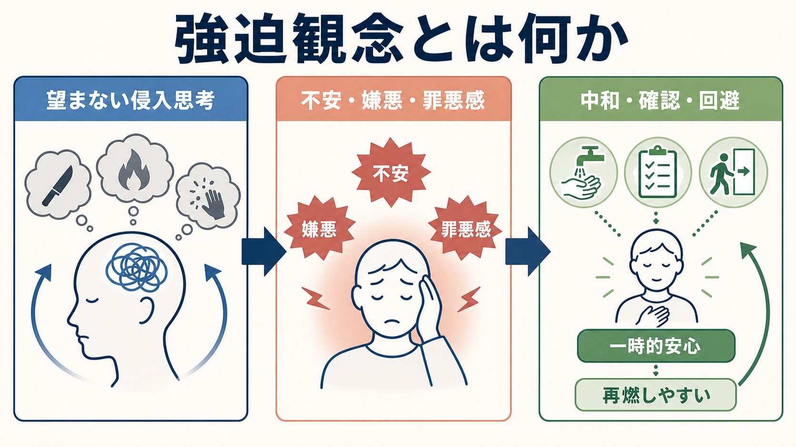
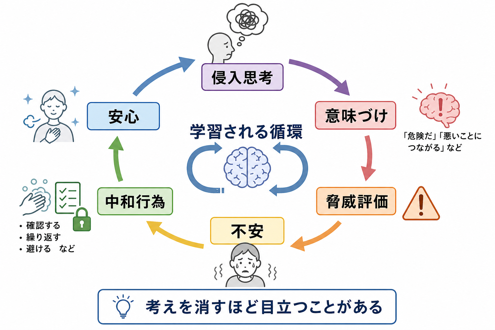
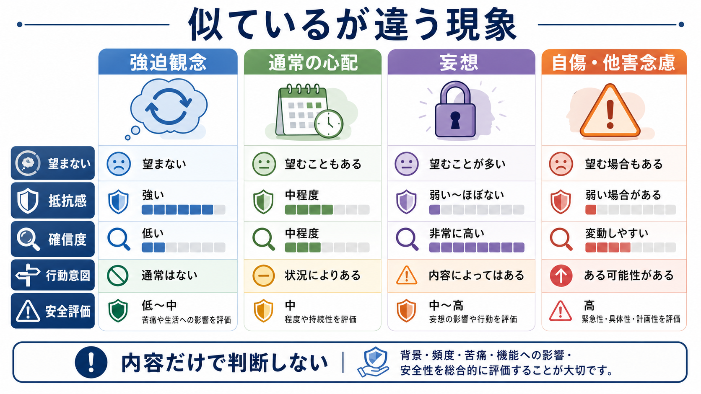

# 強迫観念とは何か

## 要点

- 強迫観念とは、反復的・持続的に浮かび、本人には侵入的で望ましくないものとして体験され、不安、嫌悪、罪悪感、恐怖を引き起こす思考・衝動・イメージである[1][2]。
- 内容だけで強迫観念かどうかは決まらない。重要なのは、自我異和性、抵抗感、苦痛、確信度、現実検討、中和行為、回避、生活機能への影響である[2][3]。
- 多くの人に侵入思考は起こりうるが、臨床的な強迫観念では頻度、持続、苦痛、意味づけ、行動への影響が強くなる[4]。
- 強迫観念は[[MSEで思考内容をどう評価するか|精神状態診察における思考内容]]の重要項目であり、[[病識とは何か|病識]]や[[鑑別診断とは何か|鑑別診断]]と合わせて評価する必要がある。
- この記事は教育・研究目的の整理であり、個別診断や治療指示ではない。

## この記事で答える問い

1. 強迫観念は、普通の心配や反すうと何が違うのか。
2. なぜ「考えを消そうとするほど気になる」という循環が起きるのか。
3. 強迫観念、強迫行為、妄想、自傷・他害念慮をどう区別するのか。
4. 臨床・研究では、強迫観念をどのような評価軸で扱うのか。

## まず結論

強迫観念は「変な考え」そのものではなく、「望まない侵入思考が、重大な危険や責任を示すものとして意味づけられ、不安を下げるための確認・回避・中和行為を呼び込み、かえって反復しやすくなる現象」と理解するとよい。NIMH は OCD を、制御しにくく反復する思考である強迫観念、反復行動である強迫行為、またはその両方によって特徴づけられる状態として説明している[1]。ICD-11 でも、強迫観念と強迫行為は、反復性、苦痛、時間消費、機能障害をもとに整理される[2]。

ただし、強迫観念があることと、強迫症という診断が成立することは同じではない。診断では、持続期間、苦痛、生活機能への影響、他の精神疾患・身体疾患・薬物の影響、文化的文脈を含めて評価する[2][3]。また、加害に関する強迫観念は、内容だけを見ると他害念慮に似るが、本人にとって望まない恐ろしい侵入思考であり、実行したい意図ではないことが多い。このため、内容だけで判断せず、意図、抵抗感、回避、確信度、安全評価を分けて聞く必要がある。

## 背景

強迫観念は、強迫症 obsessive-compulsive disorder: OCD の中心症状の一つである。典型的には、汚染への恐れ、鍵や火元を確認し忘れたかもしれないという考え、誰かを傷つけてしまうのではないかという恐怖、性的・宗教的に禁忌的なイメージ、対称性や正確性への強いこだわりなどとして現れる[1][7]。

しかし、強迫観念を「内容が奇妙な思考」とだけ考えると見誤る。Rachman と de Silva の古典的研究は、非臨床群にも強迫観念に似た侵入思考が広く見られることを示した。一方で、臨床的な強迫観念では、頻度、持続時間、強度、不快感、生活への影響が大きくなる[4]。つまり、誰にでも一瞬浮かびうる考えが、どのように評価され、どのような行動と結びつき、どの程度生活を支配するかが重要になる。

精神医学的には、強迫観念は[[精神状態診察MSEとは何か|精神状態診察]]の「思考内容」で扱われる。そこで見るのは、「何を考えているか」だけではない。本人がその考えを自分のものとして感じているか、望まないものとして抵抗しているか、不合理さをどの程度認識しているか、別の考えや行為で中和しようとしているか、どの程度生活を妨げているかを記述する[2][3]。

## 基本概念

### 強迫観念

強迫観念は、反復的・持続的な思考、衝動、イメージであり、侵入的で望まないものとして体験され、強い不安や苦痛を引き起こす[1][2]。本人はそれを無視したり、抑えたり、別の思考や行為で中和しようとすることが多い。ここでいう「思考」は言語的な心配だけではなく、映像的イメージ、身体感覚への疑い、衝動のような体験も含む。

強迫観念にはしばしば自我異和性がある。自我異和性とは、その考えが本人の価値観や望みと合わず、「自分らしくない」「考えたくない」と感じられる性質である。たとえば、子どもを大切に思っている人が「傷つけてしまったらどうしよう」というイメージに強い恐怖を抱く場合、その恐怖は内容への賛同ではなく、内容が本人の価値観に反するからこそ強まることがある。

### 強迫行為と中和

強迫行為は、強迫観念による不安や苦痛を下げるため、または恐れている出来事を防ぐために行われる反復行動または心の中の行為である[1][2]。手洗い、確認、数える、並べる、祈る、言葉を反復する、安心を求める、記憶を何度も点検する、危険そうな場所を避けるなどが含まれる。

ここで重要なのは、強迫行為が必ず目に見える行動とは限らないことである。外からは静かに見えても、頭の中で反証を探し続ける、特定の言葉で打ち消す、過去の記憶を何度も再生する、身体感覚を点検するなどの「精神的儀式」が行われることがある。

### 通常の心配・反すうとの違い

通常の心配は、現実の課題や将来の不確実性について考える形をとることが多い。反すうは、過去の失敗や自己評価を繰り返し考える傾向として現れやすい。これに対して強迫観念では、内容が本人にとって望ましくなく、浮かぶこと自体が重大な意味を持つように感じられ、確認や中和で「完全に安心しなければならない」という形になりやすい[5][6]。

ただし、境界は常に明瞭ではない。心配、反すう、強迫観念、過価値観念、妄想は、確信度、抵抗感、現実検討、行動支配性の連続体として評価する必要がある。この点は[[MSEで思考内容をどう評価するか]]と直接つながる。

## 仕組み

強迫観念を理解する一つの枠組みは、侵入思考そのものよりも、それをどう意味づけるかに注目する認知行動モデルである。Salkovskis は、侵入思考が「危険を引き起こす責任」「自分や他人への害」「道徳的な失敗」と結びつけて評価されると、中和行為が起こりやすくなり、問題が維持されると論じた[5]。

たとえば、「鍵を閉め忘れたかもしれない」という考えが浮かぶだけなら、多くの場合は一度確認して終わる。しかし、それが「もし火事になれば自分の責任だ」「完全に確信できない限り危険だ」と意味づけられると、確認は一度では終わりにくい。確認によって一時的に不安は下がるが、その安心は短く、次の疑いが生じる。こうして、確認は不安を短期的に下げる一方で、「確認しないと耐えられない」という学習を強める。

この循環は[[強化とは何か|負の強化]]として理解できる。不安という不快な状態が、確認・回避・中和によって一時的に軽くなると、その行動は次にも起こりやすくなる。短期的には合理的に見えるが、長期的には「確認しないままでも危険は起きない」「不安は自然に下がる」という学習機会を減らす。

神経科学的には、強迫症では前頭前野、線条体、視床を結ぶ皮質-線条体-視床-皮質 cortico-striato-thalamo-cortical: CSTC 回路が重要な仮説として扱われてきた[8]。この回路は、危険評価、エラー検出、行動選択、習慣化、抑制制御と関わる。強迫観念を「意志が弱いから止められない」と見るのではなく、脅威評価、注意、行動選択、安心学習が組み合わさった循環として見る点が重要である。詳しくは[[強迫症では皮質線条体視床回路に何が起きているのか]]を参照。

## 図解

| 図 | 読み方 |
|---|---|
| 図1 | 強迫観念を、侵入思考、苦痛、中和、再燃しやすさの全体像として読む |
| 図2 | 侵入思考が脅威評価を経て不安を高め、中和行為による一時的安心が循環を維持する流れとして読む |
| 図3 | 強迫観念、通常の心配、妄想、自傷・他害念慮を、内容ではなく評価軸で区別する |

## 臨床・研究との接続

臨床では、強迫観念を聞くときに、いきなり「それは本当ではない」と説得するより、体験の構造を丁寧に確認する。具体的には、どのような考え・イメージ・衝動が浮かぶのか、どのくらい頻繁に起こるのか、本人はそれを望んでいるのか恐れているのか、どの程度確信しているのか、何をすると一時的に安心するのか、生活・学業・仕事・対人関係にどの程度影響しているのかを整理する[1][2][3]。

研究では、強迫観念は単一の症状ではなく、汚染・洗浄、確認、対称性・順序、禁忌的思考、ためこみなど複数の症状次元として検討されてきた[7]。この次元的理解は、[[精神疾患の次元的理解とは何か]]や[[カテゴリ診断と次元診断は何が違うのか]]とも接続する。同じ「強迫観念」でも、汚染恐怖と加害恐怖では、関連する感情、回避、確認行為、家族や生活への影響が異なる。

治療研究との接続では、認知行動療法、特に曝露反応妨害法 exposure and response prevention: ERP が重要である。NICE は OCD に対して、CBT と ERP、SSRI などを症状の重症度や希望に応じて用いる介入として位置づけている[3]。ただし、本記事は治療選択を指示するものではない。ここで押さえるべき点は、ERP が「怖いことを無理にさせる方法」ではなく、強迫観念が浮かんでも中和せずに不安の変化と予測の修正を学ぶ枠組みだということである。

## よくある誤解

### 強迫観念は「本当はそうしたい願望」である

必ずしもそうではない。強迫観念は多くの場合、本人にとって望まない侵入思考であり、強い抵抗感と苦痛を伴う[1][2]。加害に関する内容では、本人がその内容を恐れ、避け、確認し続けていることがある。もちろん安全評価は必要だが、内容だけを見て実行意図とみなすのは不正確である。

### 強迫観念は「考えすぎ」や「性格の細かさ」である

強迫観念は単なる几帳面さではない。強迫行為から快感を得るというより、不安や緊張が一時的に下がるため続いてしまうことが多い[1]。また、本人が不合理さに気づいていても止めにくい点が重要である。

### 侵入思考があるなら強迫症である

侵入思考は非臨床群にも見られる[4]。診断上問題になるのは、思考が反復し、強い苦痛や時間消費、機能障害を引き起こし、中和や回避によって生活が狭まる場合である[1][2]。したがって、単発の不快な考えや一時的な心配だけで強迫症とは判断しない。

### 強迫観念は妄想と同じである

強迫観念では、本人が「ばかげているかもしれない」「そう考えたくない」と感じ、抵抗することが多い。一方、妄想では確信度が高く、反証で変わりにくい信念として体験されることが多い。ただし、病識の程度には幅があるため、[[病識とは何か|病識]]、確信度、現実検討、生活への影響を具体的に見る必要がある。

## 関連ノート

既存ノート:

- [[MSEで思考内容をどう評価するか]]
- [[MSEで思考過程をどう評価するか]]
- [[病識とは何か]]
- [[鑑別診断とは何か]]
- [[精神科診断における除外診断とは何か]]
- [[強迫症では皮質線条体視床回路に何が起きているのか]]
- [[認知的柔軟性とは何か]]
- [[習慣学習とは何か]]
- [[強化とは何か]]
- [[恐怖条件づけとは何か]]
- [[価値学習とは何か]]

今後の作成候補:

- 強迫行為とは何か
- 曝露反応妨害法ERPとは何か
- 加害強迫とは何か
- 侵入思考とは何か
- 強迫観念と妄想はどう違うのか
- Y-BOCSとは何か

MOC更新候補:

- `content/00_MOC/MOC｜精神医学.md` の症候学または強迫症関連項目に追加する。
- 神経科学側では、[[強迫症では皮質線条体視床回路に何が起きているのか]]との相互リンクを整理する。

## 理解チェック

1. 強迫観念を、内容の奇妙さだけで判断してはいけない理由は何か。
2. 「誰かを傷つけてしまうかもしれない」という考えを、強迫観念と他害念慮のどちらとして評価するかを決めるために、何を確認する必要があるか。
3. 中和行為はなぜ短期的には安心をもたらし、長期的には循環を維持しうるのか。
4. 通常の心配、強迫観念、妄想を区別するとき、確信度、抵抗感、現実検討はどのように役立つか。
5. 強迫観念を神経回路だけで説明し切れない理由は何か。

## 未解決問題

- 強迫観念の内容次元ごとに、認知評価、情動、神経回路、治療反応がどの程度異なるのか。
- 侵入思考が多くの人に生じる一方で、一部の人で強い苦痛と機能障害に発展する分岐点は何か。
- 強迫観念と反すう、不安性心配、過価値観念、妄想の境界を、臨床的にどこまで安定して記述できるのか。
- ERP、認知再構成、薬物療法、家族支援、デジタル介入が、どの症状次元にどの程度有効か。

## 参考文献

[1] National Institute of Mental Health. (n.d.). *Obsessive-Compulsive Disorder: When Unwanted Thoughts or Repetitive Behaviors Take Over*. https://www.nimh.nih.gov/health/publications/obsessive-compulsive-disorder-when-unwanted-thoughts-or-repetitive-behaviors-take-over

[2] World Health Organization. (2024). *ICD-11 for Mortality and Morbidity Statistics: Obsessive-compulsive disorder*. https://icd.who.int/browse/2024-01/mms/en#1582744333

[3] National Institute for Health and Care Excellence. (2005). *Obsessive-compulsive disorder and body dysmorphic disorder: treatment* (Clinical guideline CG31). NCBI Bookshelf. https://www.ncbi.nlm.nih.gov/books/n/nicecg31/ch10/

[4] Rachman, S., & de Silva, P. (1978). Abnormal and normal obsessions. *Behaviour Research and Therapy*, 16(4), 233-248. https://doi.org/10.1016/0005-7967(78)90022-0

[5] Salkovskis, P. M. (1985). Obsessional-compulsive problems: A cognitive-behavioural analysis. *Behaviour Research and Therapy*, 23(5), 571-583. https://doi.org/10.1016/0005-7967(85)90105-6

[6] Salkovskis, P. M. (1989). Cognitive-behavioural factors and the persistence of intrusive thoughts in obsessional problems. *Behaviour Research and Therapy*, 27(6), 677-682. https://doi.org/10.1016/0005-7967(89)90152-6

[7] Mataix-Cols, D., do Rosario-Campos, M. C., & Leckman, J. F. (2005). A multidimensional model of obsessive-compulsive disorder. *American Journal of Psychiatry*, 162(2), 228-238. https://doi.org/10.1176/appi.ajp.162.2.228

[8] Pauls, D. L., Abramovitch, A., Rauch, S. L., & Geller, D. A. (2014). Obsessive-compulsive disorder: An integrative genetic and neurobiological perspective. *Nature Reviews Neuroscience*, 15, 410-424. https://doi.org/10.1038/nrn3746
