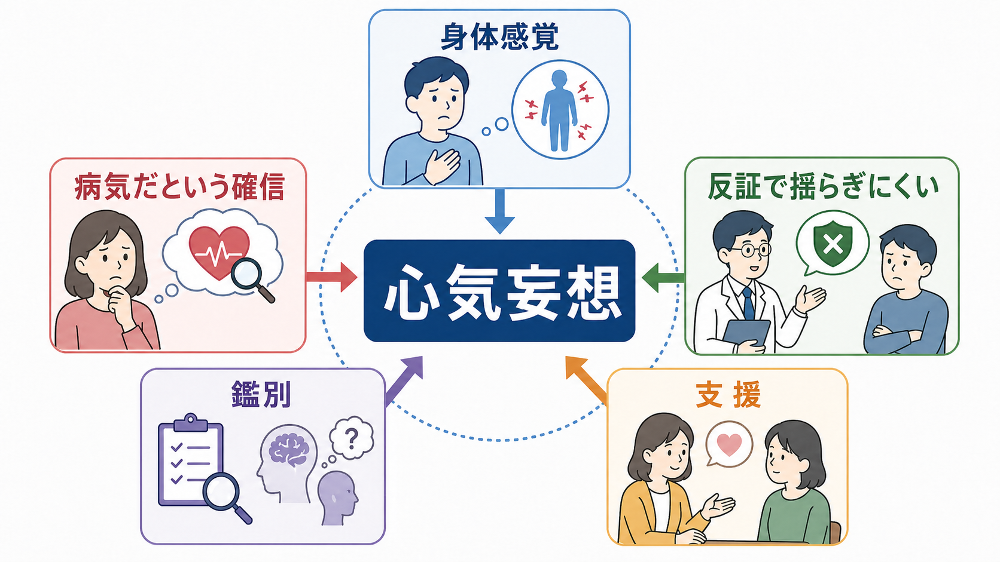
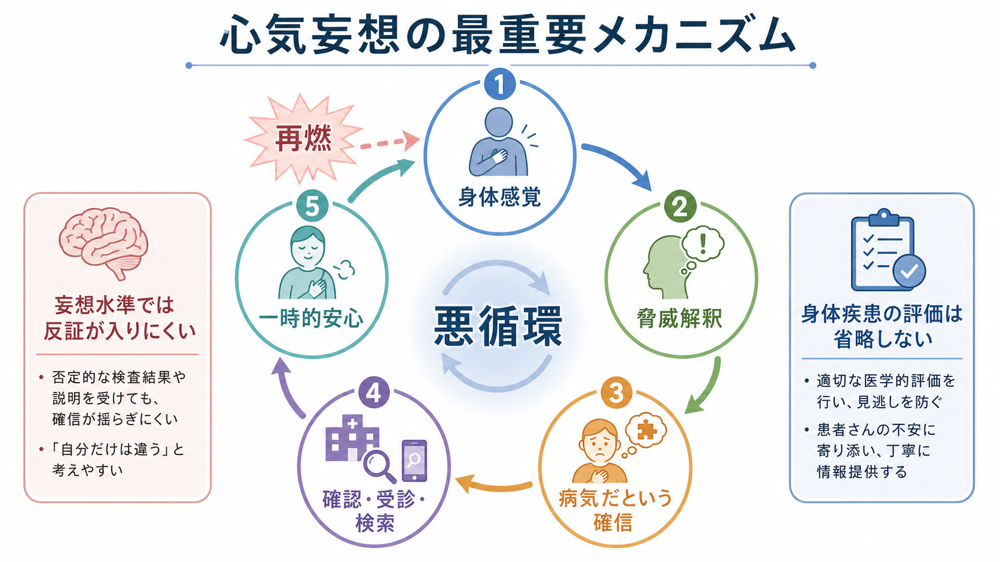
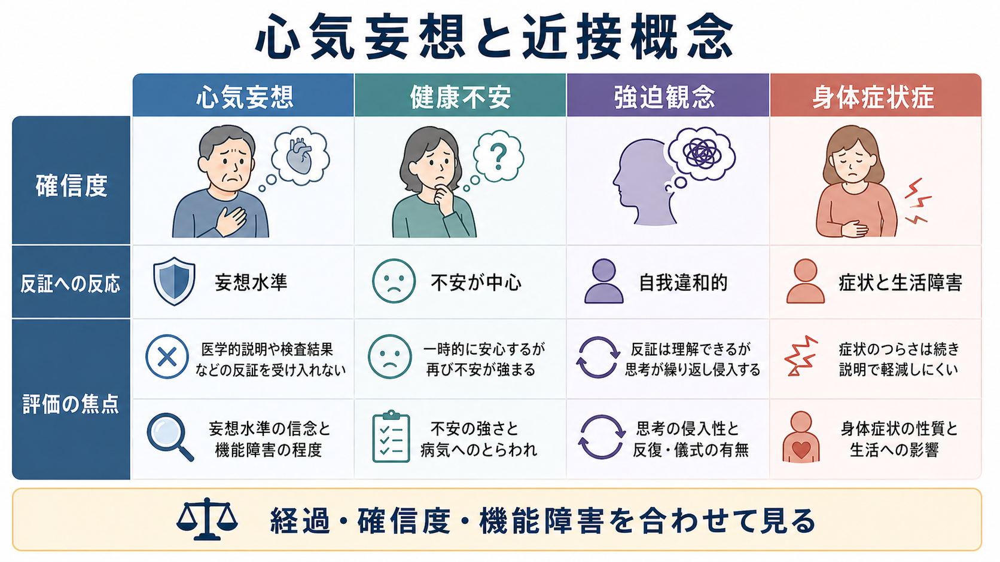

# 心気妄想とは何か

## 要点

- 心気妄想とは、重大な病気にかかっている、身体が損なわれている、または自分の身体に重大な異常があるという確信が、医学的説明や検査結果によっても容易には修正されない状態を指す。
- これは単なる心配や健康不安ではなく、[[妄想とは何か|妄想]]としての確信度、反証への反応、生活機能への影響を合わせて評価する必要がある[1][2]。
- 鑑別では、健康不安、強迫観念、身体症状症、うつ病の精神病性特徴、統合失調症スペクトラム、物質・薬剤、身体疾患を分けて考える[1][3]。
- 臨床では「病気ではない」と押し切るより、身体評価を省略せず、安全、苦痛、確信度、行動、支援資源を丁寧に見ることが重要である[3][4]。
- 本稿は教育・研究目的の概説であり、個別の診断や治療指示ではない。

## この記事で答える問い

1. 心気妄想は、健康不安や身体症状への心配と何が違うのか。
2. なぜ身体感覚が「重大な病気だ」という確信へ固定されるのか。
3. 臨床や研究では、心気妄想をどのような軸で評価するのか。
4. 本人を否定せず、かつ身体疾患の見逃しを避けるには何に注意するのか。

## まず結論

心気妄想は、「身体が気になる」ことではなく、「重大な病気である」という解釈が現実検討の余地を失い、反証によっても揺らぎにくくなった状態である。検査で異常がない、医師が説明した、家族が安心させた、という情報があっても、それが本人の確信を十分に弱めない点が中心である[1][3]。

ただし、身体症状を訴える人をすぐに心気妄想とみなしてはいけない。実際の身体疾患、薬剤・物質の影響、神経疾患、内分泌疾患、疼痛、睡眠不足、うつ病、不安症、トラウマ関連症状などは、いずれも身体への注意と病気への心配を強めうる。評価では、内容の真偽だけでなく、確信度、反証への反応、経過、文化的背景、苦痛、生活機能、安全リスクを合わせて見る。

## 背景

DSM-5-TRでは、妄想は反対証拠があっても変わりにくい固定した信念として扱われる。内容が身体機能や身体感覚に関する場合、妄想性障害の身体型、気分障害の精神病性特徴、統合失調症スペクトラムなどの文脈で現れることがある[1]。ICD-11でも、持続する妄想を中心とする障害群では、統合失調症の中核症状がそろわない場合でも、固定した妄想が生活に影響することが重視される[2]。

心気妄想は古典的には「心気的内容をもつ妄想」として記述されてきた。たとえば「癌が全身に広がっている」「内臓が腐っている」「感染して周囲に迷惑をかけている」と確信するような形をとることがある。ただし、実際の訴えは人によって異なり、文化、医療経験、メディア情報、過去の病気体験、家族歴によって内容が変わる。

## 基本概念

### 心気妄想

心気妄想の中核は、身体に関する解釈が「可能性」や「不安」ではなく、「事実としての確信」として体験されることである。本人にとっては、病気の存在は疑いではなく現実に近い。そのため、説明や検査結果が一時的な安心をもたらしても、すぐに「検査では見つからないだけだ」「自分だけは例外だ」「医師が見落としている」と再解釈されることがある。

### 健康不安との違い

健康不安では、「病気かもしれない」という不安が中心であり、情報提供や検査結果によって一定の安心が得られることが多い。もちろん健康不安でも再確認や検索が反復され、生活に支障が出ることはある。しかし妄想水準では、反証を検討する余地が狭まり、病気であるという信念がより固定的になる[1][3]。

### 強迫観念との違い

[[強迫観念とは何か|強迫観念]]は、多くの場合「自分でも不合理だと思うが頭から離れない」という自我違和性を伴う。心気妄想では、本人は内容を不合理な考えとしてではなく、現実の危険として体験しやすい。この違いは絶対的ではないが、評価では「その考えをどの程度自分のものとして信じているか」「反証をどの程度受け取れるか」が重要になる。

### 身体症状症との違い

身体症状症では、身体症状そのものと、それに関連する苦痛、過度な思考・感情・行動、生活機能への影響が焦点になる。心気妄想では、身体症状の有無よりも、病気であるという確信の固定性と現実検討の障害が中心になる[1]。

## 仕組み

心気妄想を単一の原因で説明することはできない。ここでは、臨床理解に役立つ作業仮説として、身体感覚、脅威解釈、確信形成、確認行動の循環として整理する。

### 1. 身体感覚への注意が高まる

疲労、痛み、動悸、胃腸症状、しびれ、皮膚感覚などは、健康な人にも起こりうる。ところが不安、睡眠不足、抑うつ、ストレス、過去の病気体験が重なると、身体感覚が強く目立つようになる。[[不安とは何か|不安]]は注意を脅威へ向けるため、身体の小さな変化が「危険のサイン」として読まれやすくなる。

### 2. 脅威解釈が固定される

身体感覚に対して「これは重大な病気だ」という説明が与えられると、以後の情報処理はその説明を中心に回りやすい。妄想一般の研究では、異常なサリエンス、結論への飛躍、反証より支持証拠を重視する傾向、予測処理の異常などが信念固定に関与する可能性が論じられている[5][6][7]。

### 3. 確認行動が一時的安心と再燃を生む

検査、受診、検索、身体チェック、家族への確認は、短期的には安心をもたらす。しかし安心が短時間で薄れると、さらに詳細な確認が必要に感じられる。健康不安の研究では、このような確認と再安心の循環が症状の維持に関わることが示されており、心気妄想でも類似の循環が臨床的に問題になることがある[8]。

### 4. 関係性と生活機能が巻き込まれる

本人が確信している内容を周囲が否定し続けると、本人は「理解されない」「見捨てられた」と感じやすい。一方で、周囲が無制限に確認行動へ巻き込まれると、生活の中心が病気確認に移ってしまう。臨床支援では、本人の苦痛を認めつつ、危険の評価、身体疾患の確認、日常機能の回復を同時に扱う必要がある。

## 図解

次の図は、心気妄想と近接概念を、確信度、反証への反応、評価の焦点から比較したものである。境界は実際には連続的であり、単独の所見だけで診断を決めるものではない。

| 概念 | 中心にある体験 | 反証への反応 | 評価の焦点 |
|---|---|---|---|
| 心気妄想 | 重大な病気だという確信 | 説明や検査で揺らぎにくい | 妄想水準の確信、苦痛、機能障害、安全 |
| 健康不安 | 病気かもしれないという不安 | 一時的に安心するが再燃しやすい | 不安の強さ、確認行動、回避、生活への影響 |
| 強迫観念 | 侵入的で不快な考え | 不合理と理解できることが多い | 自我違和性、反復、儀式、抵抗感 |
| 身体症状症 | 身体症状とそれに伴う苦痛 | 症状のつらさが続きやすい | 症状、苦痛、過度な思考・感情・行動 |

## 臨床・研究との接続

### 面接で見る軸

[[MSEで思考内容をどう評価するか]]では、思考内容を「何を信じているか」だけでなく、確信度、訂正可能性、苦痛、行動化、安全、文化的背景、身体疾患との関連として見る。心気妄想でも同じであり、次のような軸が役に立つ。

- どの病気を、どの程度確信しているか。
- どの情報が確信を強め、どの情報が一時的に弱めるか。
- 検査、受診、検索、身体チェック、回避がどの程度反復されるか。
- 抑うつ、希死念慮、自傷、他害、セルフネグレクトがないか。
- 身体疾患、薬剤、物質、認知機能、せん妄、神経疾患の可能性は評価されているか。
- 家族や医療者との関係が、安心にも対立にもなっていないか。

### 身体疾患を省略しない

心気妄想という表現は、身体疾患が存在しないことを意味しない。精神症状として妄想水準の確信があっても、身体疾患、疼痛、薬剤副作用、物質使用、神経疾患、内分泌疾患が併存することはありうる。したがって、[[器質性精神障害を見逃さないためには何を見るべきか]]と接続して、身体評価と精神症候学的評価を並行して行う必要がある。

### 研究上の位置づけ

研究では、心気妄想は「身体に関する妄想内容」としてだけでなく、信念形成、予測誤差、サリエンス、身体内受容感覚、健康不安、再確認行動の問題として検討できる。特に、身体感覚をどう重みづけるか、反証をどう取り込むか、安心がなぜ持続しにくいかは、認知モデルや予測処理モデルと接続しやすい[6][7][8]。

## よくある誤解

### 誤解1: 心気妄想は「気にしすぎ」である

誤りである。本人にとっては、身体の異常や病気の存在が強い現実感をもって迫っている。単なる性格傾向や弱さとして扱うと、苦痛と孤立を強める。

### 誤解2: 検査で異常がなければ心気妄想である

誤りである。検査で異常が見つからないことは、心気妄想の十分条件ではない。重要なのは、病気であるという確信がどの程度固定し、反証をどう扱い、生活や安全にどう影響しているかである。

### 誤解3: 説得すれば治る

誤りである。妄想水準の信念は、論理的説明だけでは変化しにくい。支援では、本人の苦痛を認め、対立を減らし、身体評価と安全確認を行い、治療関係を維持することが重要になる[3][4]。

### 誤解4: 身体の訴えはすべて精神症状として処理してよい

誤りである。身体症状の訴えが妄想的に語られていても、身体疾患が併存する可能性は残る。見逃しを防ぐため、必要な医学的評価とフォローアップを省略しない。

## 関連ノート

既存ノート:

- [[妄想とは何か]]
- [[不安とは何か]]
- [[強迫観念とは何か]]
- [[精神症候学とは何か]]
- [[MSEで思考内容をどう評価するか]]
- [[器質性精神障害を見逃さないためには何を見るべきか]]

今後の作成候補:

- 健康不安とは何か
- 身体症状症とは何か
- 妄想性障害とは何か
- うつ病の精神病性特徴とは何か
- 身体内受容感覚と精神症状はどう関係するか

MOC更新候補:

- content/00_MOC/MOC_精神医学.md
- content/00_MOC/MOC_症候学.md

## 理解チェック

1. 心気妄想と健康不安を分けるとき、確信度以外にどのような点を見るべきか。
2. 検査で異常がないことだけで心気妄想と判断できないのはなぜか。
3. 確認行動は、短期的な安心と長期的な維持にどのように関わるか。
4. 心気妄想を疑う場面で、身体疾患や薬剤・物質の評価を省略してはいけないのはなぜか。

## 参考文献

[1] American Psychiatric Association. (2022). *Diagnostic and Statistical Manual of Mental Disorders, Fifth Edition, Text Revision (DSM-5-TR).* American Psychiatric Association Publishing. https://doi.org/10.1176/appi.books.9780890425787

[2] World Health Organization. (2024). *ICD-11 for Mortality and Morbidity Statistics.* https://icd.who.int/browse/2024-01/mms/en

[3] Munro, A. (2019更新版). Delusional Disorder. *StatPearls / NCBI Bookshelf.* https://www.ncbi.nlm.nih.gov/books/NBK539855/

[4] National Institute for Health and Care Excellence. (2014, updated). *Psychosis and schizophrenia in adults: prevention and management (CG178).* https://www.nice.org.uk/guidance/cg178

[5] Kapur, S. (2003). Psychosis as a state of aberrant salience: a framework linking biology, phenomenology, and pharmacology in schizophrenia. *American Journal of Psychiatry, 160*(1), 13-23. https://doi.org/10.1176/appi.ajp.160.1.13

[6] Garety, P. A., & Freeman, D. (2013). The past and future of delusions research: from the inexplicable to the treatable. *British Journal of Psychiatry, 203*(5), 327-333. https://doi.org/10.1192/bjp.bp.113.126953

[7] Sterzer, P., Adams, R. A., Fletcher, P., Frith, C., Lawrie, S. M., Muckli, L., Petrovic, P., Uhlhaas, P., Voss, M., & Corlett, P. R. (2018). The predictive coding account of psychosis. *Biological Psychiatry, 84*(9), 634-643. https://doi.org/10.1016/j.biopsych.2018.05.015

[8] Barsky, A. J., & Ahern, D. K. (2004). Cognitive behavior therapy for hypochondriasis: a randomized controlled trial. *JAMA, 291*(12), 1464-1470. https://doi.org/10.1001/jama.291.12.1464

## 未解決問題

- 心気妄想と健康不安の境界は連続的であり、面接者間でどの程度一致して評価できるかは課題が残る。
- 身体内受容感覚、予測処理、妄想形成の関係は有望な研究テーマだが、個別症例の診断や治療方針へ直結させるには慎重さが必要である。
- 医学的検査をどこまで行うか、再確認をどこで制限するかは、身体リスクと精神的苦痛の双方を見て個別に判断する必要がある。
