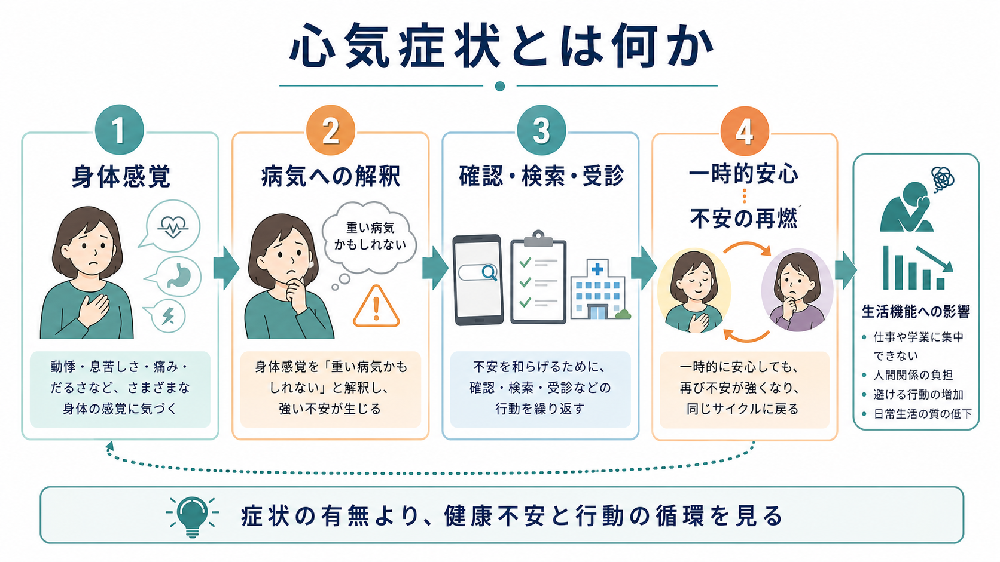
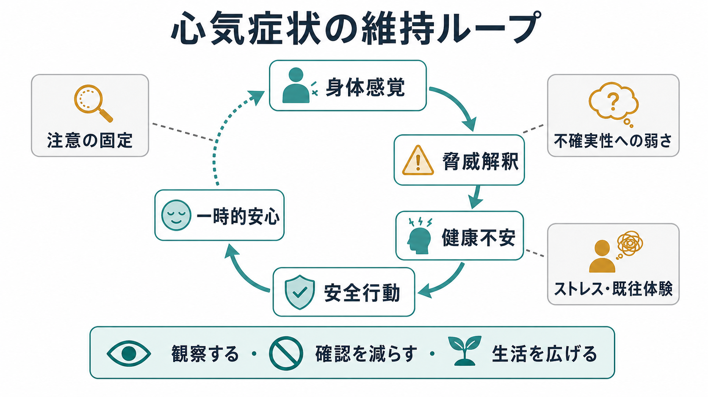
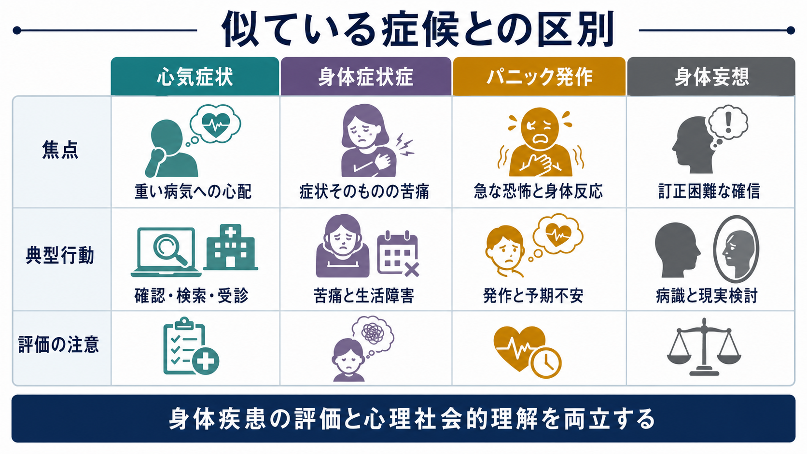

# 心気症状とは何か

## 要点

- 心気症状とは、身体感覚や軽い症状を「重大な病気の徴候かもしれない」と解釈し、その心配や確信が持続する状態である。現代の診断分類では、強い健康不安が中心で身体症状が少ない場合は illness anxiety disorder、身体症状そのものへの苦痛や過度な思考・行動が中心なら身体症状症に近づく [1][6]。
- 重要なのは「身体疾患があるかないか」だけではない。身体疾患の評価を行いながら、健康不安、身体への注意、確認行動、受診回避、生活機能障害を同時に見る必要がある [1][2]。
- 典型的には、身体感覚への注意、破局的解釈、インターネット検索、繰り返しの受診・検査、または医療回避が循環し、一時的な安心のあとに不安が再燃する [3][4]。
- 心気症状は「気にしすぎ」や「仮病」ではない。本人にとっては現実の苦痛であり、[[不安とは何か]]、[[身体化とは何か]]、[[強迫的疑念とは何か]]、[[心気妄想とは何か]]と重なるが、それぞれ評価の焦点が異なる。
- 本記事は教育・研究目的の整理であり、個別の診断や治療指示ではない。急な痛み、神経症状、発熱、意識障害、体重減少などの危険サインがある場合は、精神医学的説明に先立って身体医学的評価が優先される。

## この記事で答える問い

1. 心気症状は、通常の健康への心配と何が違うのか。
2. illness anxiety disorder、身体症状症、心気妄想、パニック発作とはどう区別するのか。
3. なぜ検査や reassurance で一時的に安心しても、不安が戻ることがあるのか。
4. 臨床・研究では、どのような観点から評価すればよいのか。

## まず結論

心気症状は、身体疾患への心配が「持続する注意と行動のパターン」になった状態として理解するとわかりやすい。ある身体感覚が生じる。本人はそれを「重い病気かもしれない」と解釈する。不安が高まる。安心を得るために検索、自己チェック、受診、検査、家族への確認を行う。あるいは、怖くて医療機関を避ける。その結果、不安は一時的に下がるが、「確認しなければ危険」「見落としたら大変」という学習が残り、次の身体感覚がさらに目立つ [3][4]。

したがって、心気症状の評価では「検査で異常がないから精神症状である」と短絡しない。むしろ、身体医学的な見逃しを避ける評価、本人の健康不安の意味づけ、生活上の影響、確認・回避行動の循環を並べて見る。これは[[鑑別診断とは何か]]や[[身体合併症は精神科診療でなぜ重要なのか]]とも接続する。

## 背景

古典的な「心気症」や hypochondriasis という語は、身体疾患への過度な恐れ、身体感覚の誤解釈、医療者の説明を受けても続く心配を指してきた。ただし、この語には否定的な響きがあり、DSM-5 以降では大きく再編された。DSM-5-TR では、身体症状が乏しく健康不安が中心の場合に illness anxiety disorder、苦痛を伴う身体症状とそれに関する過度な思考・感情・行動が中心の場合に somatic symptom disorder が考えられる [1][6]。

ICD-11 では、hypochondriasis は強迫症および関連症群に位置づけられ、重大な疾患への持続的なとらわれ、身体徴候への過覚醒、反復的な確認や医療利用、または医療回避を含む臨床像として整理されている [2]。この分類上の違いは、心気症状が身体症状、[[不安とは何か|不安]]、[[強迫観念とは何か|強迫観念]]、[[妄想とは何か|妄想]]の交差点にあることを示している。

## 基本概念

### 心気症状

心気症状とは、身体疾患への心配や確信が、本人の注意、感情、行動、生活機能を持続的に占める症候である。たとえば、動悸を心疾患、胃部不快感をがん、しびれを神経疾患の徴候として繰り返し解釈し、検索や確認を止めにくくなる。身体症状が軽微でも健康不安が強いことがあり、逆に実際の身体疾患があっても、その心配の強度や行動パターンが生活を狭めることがある [1][3]。

### illness anxiety disorder

illness anxiety disorder は、重大な病気にかかっている、または今後かかるというとらわれが中心で、身体症状はないか軽微である場合に近い概念である。DSM-5-TR に基づく臨床解説では、少なくとも6か月以上の持続、高い健康不安、自己チェックや医療回避などの行動、他の精神疾患でよりよく説明されないことが重視される [1]。

### 身体症状症との違い

身体症状症では、身体症状そのものの苦痛と、それに関連する過度な思考・感情・行動が中心になる。心気症状では、症状そのものよりも「この症状が重大疾患を意味するのではないか」という意味づけが前景化しやすい。ただし実際には両者は連続的で、DSM-5 の illness anxiety disorder と身体症状症は、旧来の hypochondriasis を完全に一対一で分けるものではない [6]。この点は[[身体化とは何か]]の理解とも重なる。

### 心気妄想との違い

心気症状では、本人が「考えすぎかもしれない」「検査では異常がないと言われたが不安が残る」と揺れを持つことが多い。一方、[[心気妄想とは何か|心気妄想]]では、身体が腐っている、臓器が失われた、重篤な病気が確実にあるなどの確信が訂正困難で、現実検討の障害がより前景に出る。境界は連続的なことがあるため、確信度、反証への反応、病識、他の精神病症状、気分症状を丁寧に見る。

## 仕組み

### 1. 身体感覚への注意が高まる

心気症状では、身体内部への注意が固定されやすい。心拍、胃腸の動き、皮膚の違和感、疲労、しびれのような感覚は、誰にでも起こりうる。しかし、それらを危険信号として監視し続けると、通常なら背景に退く感覚まで前景化する。これは[[パニック発作とは何か]]や[[予期不安とは何か]]にも見られる身体感覚への警戒と近い。

### 2. 破局的解釈が不安を増幅する

身体感覚は、それ自体が心気症状を作るわけではない。「これは重い病気の徴候だ」「医師が見落としたのではないか」「いま気づかなければ手遅れになる」という解釈が加わると、不安が増幅する。認知行動モデルでは、このような疾患信念、身体感覚の誤解釈、注意の固定、安全行動が健康不安を維持すると考える [4]。

### 3. 確認行動が一時的安心と長期的維持を生む

検索、自己触診、鏡での確認、体温・脈拍の反復測定、家族への質問、複数医療機関の受診は、短期的には安心をもたらす。しかし確認が不安を下げる経験が繰り返されると、「確認しないと危険」という学習が強まり、次の不安が起きたときに確認への依存が強くなる [3][4]。これは[[強迫的疑念とは何か]]で扱う「確認しても確信が安定しない」構造に似ている。

### 4. 医療回避も同じ循環に入る

心気症状は、頻回受診だけでなく受診回避としても現れる。悪い結果を聞くのが怖くて受診を避ける、検診通知を見ない、病院の近くを避けるといった行動である。回避は不安を一時的に下げるが、身体状態を現実的に評価する機会を減らし、「病気かもしれない」という不確実性を残す [1][2]。これは[[回避行動とは何か]]と直接つながる。

## 図解

| 観点 | 心気症状で見ること | 臨床的な意味 |
|---|---|---|
| 焦点 | 重い病気にかかっている、またはかかるかもしれないという心配 | 症状の強さだけでなく、病気の意味づけを見る |
| 身体症状 | ない、軽い、または実在する身体疾患と併存する | 「身体疾患なし」と決めつけない |
| 認知 | 破局的解釈、見落としへの恐れ、不確実性への耐えにくさ | 説明だけで不安が消えない理由になる |
| 行動 | 検索、自己チェック、頻回受診、医療回避、安心要求 | 短期的安心と長期的維持を分けて評価する |
| 生活機能 | 仕事・学業・家事・対人関係の縮小 | 症状名よりも支援目標を決める情報になる |

## 臨床・研究との接続

### 評価で確認すること

心気症状の評価では、まず身体医学的な安全確認が必要である。新規発症、急速な悪化、神経脱落症状、発熱、体重減少、出血、意識変容、強い疼痛などがあれば、精神症状として説明する前に身体疾患の評価を優先する。そのうえで、心配の対象、持続期間、確信度、確認行動、受診回避、医療利用、生活障害、併存する不安・抑うつ・強迫症状を確認する [1][2]。

### 尺度と研究

研究では、健康不安を連続量として測るために Health Anxiety Inventory などが用いられる。Salkovskis らは、軽い健康への心配から臨床的な hypochondriasis までを測定でき、身体疾患があっても過度な健康不安と区別しやすい尺度を開発した [5]。このような尺度は、診断名だけでなく、健康不安、身体感覚への注意、確認行動、生活機能の変化を追うために役立つ。

### 支援の方向性

認知行動療法は、心気症状・健康不安に対して一定の有効性が示されている。メタ解析では、CBT は対照条件よりも治療後の健康不安を改善し、フォローアップでも効果が残ることが報告されている [7]。JAMA のランダム化比較試験でも、hypochondriasis に対する CBT は通常ケアと比べて症状改善を示した [8]。ただし本記事は治療マニュアルではない。実践では、身体医学的評価を粗末にせず、安心を無限に供給するのでもなく、本人が確認・回避の循環を観察し、生活を広げる方向で支援することが重要である [3][7]。

### 医療者との関係

心気症状では、医療者が「異常なしです」と繰り返すだけでは、本人の不安が十分に下がらないことがある。逆に、毎回広範な検査を追加すると「検査しないと危険」という学習が強まる場合もある。Scarella らは、健康不安をもつ人との治療同盟、過剰検査を避ける協働、医療者間の連携の重要性を強調している [3]。ここでは[[精神科初診で何を確認するべきか]]や[[精神科面接とは何か]]の面接技法が土台になる。

## よくある誤解

### 誤解1: 心気症状は身体疾患がない人だけに起こる

実際には、身体疾患がある人にも心気症状は起こる。問題は、身体疾患の有無そのものではなく、症状への注意、破局的解釈、確認・回避、生活機能障害がどの程度持続しているかである [1][6]。

### 誤解2: 検査で異常がなければ「気のせい」である

検査で重大な異常が見つからないことは重要な情報だが、本人の苦痛が存在しないことを意味しない。身体感覚は実際に感じられており、不安や注意の固定によって強く、長く、脅威的に経験されうる [3][4]。

### 誤解3: 何度も説明すれば安心できる

説明や reassurance は必要な場面があるが、反復確認が不安の維持要因になる場合もある。大切なのは、説明を拒むことではなく、確認がどのくらい短期的安心と長期的再燃につながっているかを一緒に観察することである [4][7]。

### 誤解4: 心気症状は妄想と同じである

心気症状では、確信に揺れがあり、安心を求める行動が目立つことが多い。[[心気妄想とは何か|心気妄想]]では確信がより固定し、反証が効きにくく、他の精神病症状や重い気分症状との関連を評価する必要がある。両者は連続的に見えることもあるため、病識と現実検討を丁寧に見る。

## 関連ノート

- [[精神症候学とは何か]]
- [[不安とは何か]]
- [[予期不安とは何か]]
- [[パニック発作とは何か]]
- [[身体化とは何か]]
- [[心気妄想とは何か]]
- [[強迫的疑念とは何か]]
- [[回避行動とは何か]]
- [[身体合併症は精神科診療でなぜ重要なのか]]
- [[鑑別診断とは何か]]
- [[DSMとICDは何が違うのか]]

MOC 更新候補: `content/00_MOC/` 配下の精神医学・症候学・身体症状関連 MOC に、バッチ統合時に `[[心気症状とは何か]]` を追加する。

今後の作成候補: `身体症状症とは何か`, `健康不安とは何か`, `安心要求とは何か`, `医療回避とは何か`, `疾病不安症とは何か`。

## 理解チェック

1. 心気症状を「身体疾患がないこと」と定義すると、どのような見落としが起こるか。
2. illness anxiety disorder と身体症状症を分けるとき、身体症状の有無以外に何を見るべきか。
3. 検索や受診が短期的には安心を生み、長期的には不安を維持する理由を説明できるか。
4. 心気症状と心気妄想を区別するとき、確信度、病識、反証への反応をどのように見るか。
5. 本人の健康不安を尊重しながら、身体疾患の評価と心理社会的理解を両立する説明はどのようなものか。

## 未解決問題

- DSM-5-TR の illness anxiety disorder、身体症状症、ICD-11 の hypochondriasis の境界は完全には一致せず、研究知見の比較に注意が必要である [2][6]。
- 健康不安の維持に、内受容感覚、注意制御、インターネット検索、医療制度、文化的な病気理解がどの程度寄与するかは、個人差が大きい。
- 安心提供、検査、フォローアップ間隔をどのように設計すれば、身体疾患の見逃しを避けつつ確認行動の固定化も避けられるかは、臨床上の重要課題である。

## 参考文献

[1] Merck Manual Professional Version. (2024, reviewed/revised). *Illness Anxiety Disorder*. https://www.merckmanuals.com/professional/psychiatric-disorders/somatic-symptom-and-related-disorders/illness-anxiety-disorder

[2] World Health Organization. (2024). *Clinical descriptions and diagnostic requirements for ICD-11 mental, behavioural and neurodevelopmental disorders*. World Health Organization. https://iris.who.int/handle/10665/375767

[3] Scarella, T. M., Boland, R. J., & Barsky, A. J. (2019). Illness anxiety disorder: Psychopathology, epidemiology, clinical characteristics, and treatment. *Psychosomatic Medicine, 81*(5), 398-407. https://doi.org/10.1097/PSY.0000000000000691

[4] Warwick, H. M., & Salkovskis, P. M. (1990). Hypochondriasis. *Behaviour Research and Therapy, 28*(2), 105-117. https://doi.org/10.1016/0005-7967(90)90023-C

[5] Salkovskis, P. M., Rimes, K. A., Warwick, H. M. C., & Clark, D. M. (2002). The Health Anxiety Inventory: Development and validation of scales for the measurement of health anxiety and hypochondriasis. *Psychological Medicine, 32*(5), 843-853. https://doi.org/10.1017/S0033291702005822

[6] Newby, J. M., Hobbs, M. J., Mahoney, A. E. J., Wong, S. K., & Andrews, G. (2017). DSM-5 illness anxiety disorder and somatic symptom disorder: Comorbidity, correlates, and overlap with DSM-IV hypochondriasis. *Journal of Psychosomatic Research, 101*, 31-37. https://doi.org/10.1016/j.jpsychores.2017.07.010

[7] Olatunji, B. O., Kauffman, B. Y., Meltzer, S., Davis, M. L., Smits, J. A. J., & Powers, M. B. (2014). Cognitive-behavioral therapy for hypochondriasis/health anxiety: A meta-analysis of treatment outcome and moderators. *Behaviour Research and Therapy, 58*, 65-74. https://doi.org/10.1016/j.brat.2014.05.002

[8] Barsky, A. J., & Ahern, D. K. (2004). Cognitive behavior therapy for hypochondriasis: A randomized controlled trial. *JAMA, 291*(12), 1464-1470. https://doi.org/10.1001/jama.291.12.1464
