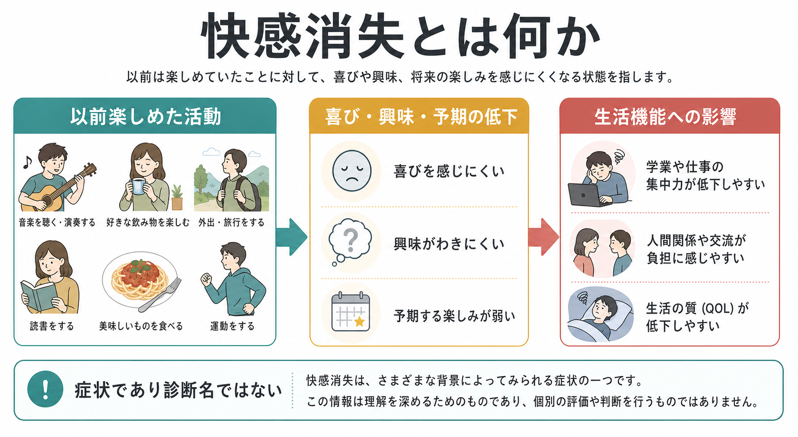
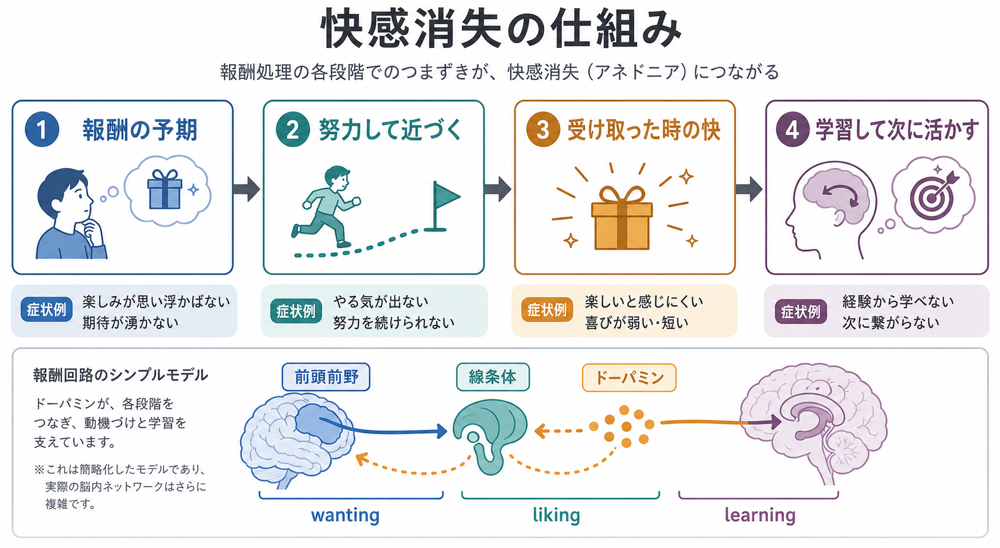
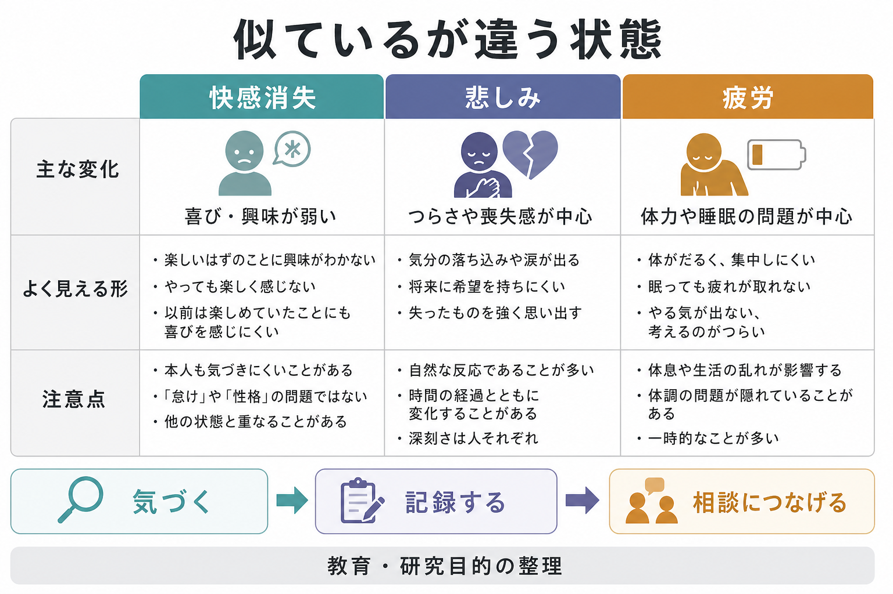

# 快感消失とは何か

## 要点

- 快感消失は、以前なら楽しい・意味がある・やってみたいと感じられた活動に対して、喜びや興味が弱くなる状態を指す。
- 抑うつ症状の一部として有名だが、それ自体は診断名ではなく、[[精神症候学とは何か|精神症候]]として観察・聴取される。
- 「楽しいと感じない」だけでなく、「楽しみを予期できない」「始める気力が出ない」「報酬から学びにくい」といった報酬処理の複数段階に分けて理解すると見通しがよい。
- 悲しみ、疲労、アパシー、陰性症状とは重なりうるが、同じものではない。

## この記事で答える問い

1. 快感消失とは、日常のどのような変化を指すのか。
2. 快感消失は、抑うつ症状や[[気分とは何か|気分]]の変化とどう関係するのか。
3. 報酬系・ドーパミン・予期・学習の観点から、どのように説明できるのか。
4. 臨床や研究では、どのように評価されるのか。

## まず結論

快感消失とは、単に「楽しくない気分」ではなく、以前は報酬になっていた活動への興味、期待、接近、体験時の快、経験後の学習が弱まる症状である。DSM-5-TR や ICD-11 の抑うつエピソードでは、抑うつ気分と並ぶ中心的な症状として「興味または喜びの低下」が扱われるが、快感消失だけで特定の疾患を診断するわけではない[1][2]。

研究上は、快感消失を「快を感じる能力の低下」とだけ見るより、報酬の予期、努力して近づくこと、受け取った時の快、報酬から次の行動を学ぶことに分ける理解が有用である[3][4]。この分解によって、[[報酬系とは何か|報酬系]]、[[快感と欲求は何が違うのか|快感と欲求]]、[[報酬予測誤差とは何か|報酬予測誤差]]といった既存概念と接続しやすくなる。

## 背景

快感消失は、英語では anhedonia と呼ばれる。語感としては「快がない」だが、臨床的には「以前なら楽しめた活動に対して、興味や喜びが著しく低下すること」として扱われる。たとえば、音楽、食事、読書、人との交流、趣味、学業、仕事、運動などに対して、「嫌いになった」というより「楽しみが浮かばない」「やっても響かない」「始める理由が見えない」と表現されることがある。

重要なのは、快感消失が本人の怠けや性格だけで説明できる現象ではないという点である。[[症状と徴候は何が違うのか|症状]]としての快感消失は、主観的なつらさ、生活機能、周囲から見える行動変化を合わせて理解する必要がある。本人が「楽しめない」と訴えることもあれば、周囲が「以前より活動しなくなった」「誘っても反応が薄い」と気づくこともある。

抑うつとの関係は強い。DSM-5-TR の大うつ病エピソードでは、抑うつ気分または興味・喜びの低下のいずれかが中核症状として必要になる[1]。ICD-11 でも、抑うつエピソードは抑うつ気分または活動への興味低下を中心に記述される[2]。ただし、快感消失は統合失調症の陰性症状、物質使用、神経疾患、慢性疼痛、強いストレス、薬剤の影響などとも関連しうるため、単独で疾患名に直結させない。

## 基本概念

### 「快」だけでなく「興味」と「予期」も弱くなる

快感消失を理解する第一歩は、「今この瞬間に楽しいか」と「未来の楽しみを思い浮かべられるか」を分けることである。食べ物を口にした瞬間の快が弱い場合もあれば、食べる前に「食べたい」「楽しみだ」と思いにくい場合もある。前者は消費的快感、後者は予期的快感や接近動機づけに近い。

Treadway と Zald は、従来の快感消失概念が「快の低下」と「動機づけの低下」を十分に分けていなかったと整理し、動機づけ的快感消失、消費的快感消失、意思決定に関わる快感消失を区別する必要を論じた[3]。この整理は、[[報酬系の異常はうつ病をどう説明するのか|うつ病における報酬系の異常]]を考える際にも重要である。

### wanting, liking, learning

報酬研究では、報酬を少なくとも次の3要素に分けることが多い。

| 要素 | 日本語での目安 | 快感消失での見え方 |
|---|---|---|
| wanting | 欲しい、近づきたい、努力して取りに行きたい | 誘われても動き出せない、期待が湧かない |
| liking | 受け取った時に心地よい、楽しい | やっても楽しくない、味気ない |
| learning | 報酬経験から次の選択を変える | 良い経験が次の意欲につながらない |

Romer Thomsen らは、快感消失を wanting, liking, learning の一部または複数の障害として捉えることで、従来の「快の欠如」より精密に説明できると論じている[5]。つまり、快感消失は一枚岩ではなく、どの段階が弱いかによって日常での見え方が変わる。

## 仕組み

### 報酬処理の流れとして見る

快感消失は、次のような流れのどこかで滞ると考えられる。

1. 報酬を予期する  
   「これをやったら楽しいかもしれない」と思い浮かべる。
2. コストを見積もる  
   時間、疲労、不安、失敗可能性などと報酬を比べる。
3. 近づく行動を始める  
   外出する、連絡する、作業に着手する。
4. 報酬を受け取る  
   楽しい、うれしい、満足するなどの体験が生じる。
5. 経験から学ぶ  
   「またやってみよう」という次の予測や習慣が作られる。

この流れは、NIMH の RDoC における Positive Valence Systems とよく対応する。RDoC では、報酬反応性、報酬学習、報酬価値づけが区別され、価値づけには確率、遅延、努力コストなどが含まれる[6]。快感消失をこの枠組みで見ると、「楽しめない」という主観報告だけでなく、努力コストの過大評価、報酬予測の弱さ、報酬学習の鈍さも検討対象になる。

### 脳内メカニズムは単純な「ドーパミン不足」ではない

快感消失はしばしばドーパミンと結びつけて語られるが、「ドーパミンが少ないから快感がない」と単純化すると不正確である。ドーパミンは、快そのものだけでなく、報酬の予期、接近行動、努力の配分、報酬予測誤差、学習に関わる[3][6]。したがって、[[ドパミンは報酬だけの物質なのか|ドーパミン]]は重要な手がかりだが、快感消失全体を一つの神経伝達物質だけで説明することはできない。

神経画像研究では、うつ病における快感消失と線条体・前頭前野を含む前頭線条体ネットワークの反応低下が関連することが報告されてきた。Admon と Pizzagalli は、うつ病の報酬処理障害を、動機づけ、強化学習、快感容量に分けて整理している[4]。ただし、報酬処理は複数の心理過程と神経回路からなるため、単一の脳部位だけに還元しない理解が必要である[6][7]。

### アパシーや疲労との重なり

快感消失は、アパシー、疲労、陰性症状と重なることがある。アパシーは「目標に向かう行動や自発性の低下」に焦点があり、快感消失は「報酬・快・興味の低下」に焦点がある。両者は努力に見合う報酬をどう評価するかという点で交差する。Husain と Roiser は、アパシーと快感消失を、努力に基づく報酬意思決定という横断的枠組みで理解できると論じている[7]。

臨床的には、疲労が強いために活動できないのか、活動しても報酬価値を感じにくいのか、対人不安や回避が強いのか、薬剤や身体疾患が関係しているのかを分けて見る必要がある。これは、[[MSEで気分と感情をどう区別するか|精神状態診察]]で主観的体験と外から観察される行動を分ける作業にも近い。

## 図解

3枚の図は、快感消失を「全体像」「報酬処理の段階」「似ている状態との違い」に分けて整理したものである。図は診断や治療方針を示すものではなく、教育・研究目的の概念整理として読む。

## 臨床・研究との接続

### 面接で確認すること

快感消失を確認するときは、「何が楽しくないか」だけでなく、時間軸と生活上の意味を確認する。

- 以前は楽しめた活動は何か。
- いつ頃から楽しみや興味が弱くなったか。
- 始める前の期待が弱いのか、やっている最中の快が弱いのか。
- できなくなった活動は、学業、仕事、家事、対人関係、セルフケアに影響しているか。
- 睡眠、食欲、疲労、疼痛、不安、薬剤、物質使用、身体疾患の影響はないか。
- 希死念慮や安全上の問題があるか。

この確認は、個別の診断や治療指示ではなく、症状を精密に記述するための観点である。安全に関わる訴えがある場合は、一般論として早めに専門職や地域の相談先につなぐ必要がある。

### 評価尺度

研究や臨床評価では、Snaith-Hamilton Pleasure Scale（SHAPS）がよく用いられる。SHAPS は、日常的に快を感じる状況への反応を尋ねる自己記入式尺度として開発され、文化・年齢・性別に強く依存しにくい項目を目指した[8]。

ただし、尺度得点は本人の主観報告であり、行動課題、生活記録、面接、周囲からの情報と同じものではない。快感消失は多面的なので、自己報告だけで「快の低下」なのか「努力コストの問題」なのか「報酬学習の問題」なのかを完全に切り分けることは難しい。

### 研究での意義

快感消失は、診断カテゴリを横断する症状として研究されている。うつ病、統合失調症、双極症、物質使用症、神経疾患などで現れるが、同じ「快感消失」という言葉でも、どの報酬過程が障害されるかは異なりうる。したがって、今後の研究では、診断名だけで群を分けるのではなく、報酬反応性、報酬価値づけ、努力、学習などの次元で評価することが重要になる[5][6][7]。

## よくある誤解

### 誤解1: 快感消失は「悲しいこと」と同じである

悲しみは喪失感、つらさ、涙もろさ、落ち込みとして現れやすい。一方、快感消失では「つらい」というより「楽しいはずのことが響かない」「興味が動かない」と表現されることがある。両者は重なりうるが、同じではない。

### 誤解2: 快感消失は怠けや甘えである

快感消失では、報酬を予期すること、努力コストを越えて近づくこと、経験から次の動機づけを作ることが弱くなる。これは、単なる意志の弱さではなく、報酬処理と生活機能に関わる症状として理解する必要がある[3][7]。

### 誤解3: 好きなことが一つでもできれば快感消失ではない

快感消失は全か無かではない。音楽は少し楽しめるが人付き合いはまったく楽しめない、食事の快は残るが将来の楽しみを予期できない、始めるまでが極端に難しいなど、領域や段階によって異なる。

### 誤解4: 快感消失があれば必ずうつ病である

快感消失は抑うつで重要な症状だが、統合失調症の陰性症状、神経疾患、慢性疼痛、疲労、薬剤、ストレス、社会的孤立などとも関連しうる。[[陰性症状は報酬系や認知制御の障害と関係するのか|陰性症状]]やアパシーとの区別も、背景疾患や経過を含めて検討する必要がある。

## 関連ノート

- [[精神症候学とは何か]]
- [[症状と徴候は何が違うのか]]
- [[気分とは何か]]
- [[MSEで気分と感情をどう区別するか]]
- [[報酬系とは何か]]
- [[快感と欲求は何が違うのか]]
- [[報酬予測誤差とは何か]]
- [[ドパミンは報酬だけの物質なのか]]
- [[報酬系の異常はうつ病をどう説明するのか]]
- [[陰性症状は報酬系や認知制御の障害と関係するのか]]

## MOC更新候補

- [[MOC｜精神医学]]
- [[MOC｜計算論的精神医学]]

## 理解チェック

1. 快感消失が「診断名」ではなく「症状」とされる理由を説明できるか。
2. 予期的快感と消費的快感の違いを、日常例で説明できるか。
3. wanting, liking, learning のどれが弱いかによって、見え方がどう変わるか説明できるか。
4. 快感消失、悲しみ、疲労、アパシーの違いと重なりを説明できるか。
5. SHAPS のような自己記入尺度だけでは捉えにくい側面を挙げられるか。

## 未解決問題

- 快感消失の下位タイプを、臨床面接、自己記入尺度、行動課題、神経画像でどこまで一貫して測定できるか。
- うつ病、統合失調症、双極症、神経疾患で、同じ「快感消失」がどの程度共通の機序を持つか。
- 報酬価値づけ、努力コスト、報酬学習のどの側面が治療反応や回復に強く関わるか。
- 文化、年齢、生活環境によって「楽しみ」の表現や報告がどう変わるか。

## 参考文献

[1] American Psychiatric Association. (2022). *Diagnostic and Statistical Manual of Mental Disorders, Fifth Edition, Text Revision (DSM-5-TR).* American Psychiatric Association Publishing. https://doi.org/10.1176/appi.books.9780890425787

[2] World Health Organization. (2024). *ICD-11 for Mortality and Morbidity Statistics: Depressive disorders / Single episode depressive disorder.* https://icd.who.int/browse/2024-01/mms/en#578635574

[3] Treadway, M. T., & Zald, D. H. (2011). Reconsidering anhedonia in depression: Lessons from translational neuroscience. *Neuroscience & Biobehavioral Reviews, 35*(3), 537-555. https://doi.org/10.1016/j.neubiorev.2010.06.006

[4] Admon, R., & Pizzagalli, D. A. (2015). Dysfunctional reward processing in depression. *Current Opinion in Psychology, 4*, 114-118. https://doi.org/10.1016/j.copsyc.2014.12.011

[5] Romer Thomsen, K., Whybrow, P. C., & Kringelbach, M. L. (2015). Reconceptualizing anhedonia: Novel perspectives on balancing the pleasure networks in the human brain. *Frontiers in Behavioral Neuroscience, 9*, 49. https://doi.org/10.3389/fnbeh.2015.00049

[6] National Institute of Mental Health. (n.d.). *Positive Valence Systems.* Research Domain Criteria (RDoC). https://www.nimh.nih.gov/research/research-funded-by-nimh/rdoc/constructs/positive-valence-systems

[7] Husain, M., & Roiser, J. P. (2018). Neuroscience of apathy and anhedonia: A transdiagnostic approach. *Nature Reviews Neuroscience, 19*, 470-484. https://doi.org/10.1038/s41583-018-0029-9

[8] Snaith, R. P., Hamilton, M., Morley, S., Humayan, A., Hargreaves, D., & Trigwell, P. (1995). A scale for the assessment of hedonic tone: The Snaith-Hamilton Pleasure Scale. *The British Journal of Psychiatry, 167*(1), 99-103. https://doi.org/10.1192/bjp.167.1.99
