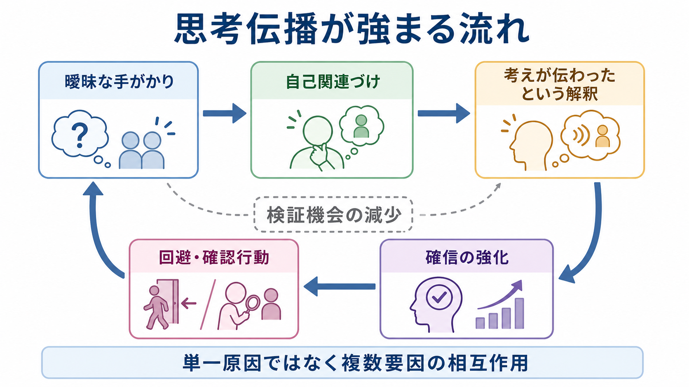

# 思考伝播とは何か

## 要点

- 思考伝播とは、自分の考えが外へ漏れ、周囲の人に知られている、共有されている、または何らかの媒体を通じて伝わっていると確信される体験である。古典的には Schneider の一級症状に含まれ、[[妄想とは何か|妄想]]や作為体験に近い症状として扱われてきた[1][2]。
- 「人に見られている気がする」「何となく気まずい」だけでは思考伝播とはいわない。重要なのは、本人が「自分の思考内容そのものが他者に知られている」と受け取り、その確信が苦痛、回避、確認行動、生活上の支障につながるかどうかである[1][3]。
- 思考伝播は診断名ではない。統合失調症スペクトラム、気分障害の精神病症状、物質・身体疾患に関連する精神病症状など、複数の文脈で評価されうるため、単独で診断を決めない[2][4]。
- 用語の定義には幅がある。文献上は「考えが声のように聞こえ、それを他人も聞く」「考えが無音で外へ漏れる」「他者が自分の考えに直接参加する」という複数の定義が混在しており、臨床記録では具体的な体験を記述することが重要である[1]。
- 本稿は教育・研究目的の整理であり、個別の診断や治療指示ではない。

## この記事で答える問い

1. 思考伝播は、どのような主観的体験を指すのか。
2. [[関係妄想とは何か|関係妄想]]、[[注察妄想とは何か|注察妄想]]、[[幻聴とは何か|幻聴]]、侵入思考とは何が違うのか。
3. なぜ「考えが伝わっている」という確信が強まり、保たれるのか。
4. [[MSEで思考内容をどう評価するか|MSEで思考内容]]を評価するとき、何を丁寧に聞くべきか。

## まず結論

思考伝播は、「自分の考えが他者に知られる」という内容をもつ精神病性体験である。本人にとっては単なる比喩ではなく、私的な思考の境界が破られ、周囲に露出しているように感じられる。そのため、羞恥、不安、警戒、外出回避、会話回避、SNSやテレビへの過敏な反応などが生じることがある。

ただし、思考伝播を理解するときは「奇妙な考え」とだけ見ない方がよい。臨床的には、確信度、反証への開かれ、発症時期、苦痛、生活への影響、他の[[精神症候学とは何か|精神症候]]との組み合わせ、文化的背景、物質使用、身体疾患、睡眠不足などを合わせて評価する[3][4]。

## 背景

思考伝播は、英語では thought broadcasting または thought broadcast と呼ばれる。古典的には、思考吹入、思考奪取、作為体験、被影響体験などとともに、自己の思考や行為の主体感が揺らぐ現象として記述されてきた[1][2]。DSM-5-TR では妄想の主題の一つとして扱われ、ICD-11 の臨床記述でも、思考・感情・衝動・行為が自分由来ではない、または他者により置かれる・抜き取られる・伝えられるという「影響、受動性、制御の体験」に近い位置づけで整理される[3][4]。

歴史的には診断上の重みが強調された時期があったが、現在では「思考伝播があるから統合失調症である」と単純化しない。Cochrane の診断精度レビューでは、一級症状は統合失調症の可能性を高めるが、感度・特異度には限界があり、他の精神病性障害との鑑別には不十分であることが示されている[2]。

## 基本概念

### 思考伝播の中核

思考伝播の中核は、次の3点にある。

| 観点 | 見ること |
|---|---|
| 思考の私秘性 | 「自分だけが知っているはずの考え」が、外へ出ている・共有されていると感じる |
| 他者への到達 | 周囲の人、特定の相手、テレビ、ネット、機械などが考えを知っていると受け取る |
| 確信と影響 | その解釈がどれほど確信され、苦痛・回避・確認行動・生活制限につながるか |

文献上の定義が揺れるため、面接では「思考伝播あり」とだけ書くよりも、「考えが声として聞こえるのか」「無音で漏れる感じなのか」「他人が同じ考えを共有していると感じるのか」「どのような根拠でそう思うのか」を記述した方がよい[1]。

### 似ている症状との違い

| 体験 | 中心となる内容 | 思考伝播との違い |
|---|---|---|
| 思考伝播 | 自分の考えが他者に知られる・伝わる | 思考の内容が他者へ到達する点が中心 |
| 思考吹入 | 自分のものではない考えが外から入れられる | 思考の出所が「外から」と感じられる |
| 思考奪取 | 自分の考えが抜き取られる | 思考がなくなる・奪われる感覚が中心 |
| [[関係妄想とは何か|関係妄想]] | 出来事や言葉が自分への合図だと確信する | 外界の出来事の意味づけが中心 |
| [[注察妄想とは何か|注察妄想]] | 見られている・監視されていると確信する | 観察・監視が中心で、思考内容の共有とは限らない |
| [[幻聴とは何か|幻聴]] | 声や音として聞こえる | 知覚体験が中心。思考伝播と併存することはある |
| [[侵入思考とは何か|侵入思考]] | 不快な考えが勝手に浮かぶ | 通常は「自分の考えだが望まない」と体験され、他者に伝わる確信とは異なる |

## 仕組み

思考伝播の仕組みは、単一の脳部位や単一の心理過程だけで説明できない。研究上は、異常なサリエンス、自己モニタリング、予測処理、認知バイアス、対人不安、トラウマ、睡眠不足、物質使用、社会的孤立などが複合的に関与しうると考えられる[5][6]。

### 1. 曖昧な手がかりが強く意味づけられる

Kapur の異常サリエンス仮説では、通常なら中立的な刺激に過剰な重要性が付与され、それを説明するために妄想的な解釈が形成される可能性が論じられている[5]。思考伝播では、相手の表情、沈黙、笑い声、テレビの言葉、SNSの反応などが「自分の考えが伝わった証拠」として結びつけられることがある。

### 2. 自己と他者の境界づけが揺らぐ

自分の内的な思考を「自分の中で起きたもの」として保持する感覚が揺らぐと、考えが外へ漏れた、誰かと共有された、あるいは外部の力が思考に関与しているという解釈が生じやすくなる。これは作為体験や受動体験とも重なるが、思考伝播では「考えが他者に知られる」という私秘性の喪失が特に前景化する[1][6]。

### 3. 確認行動と回避が確信を保つ

「考えが伝わったかもしれない」と感じた人は、相手の反応を過剰に確認したり、人と会う場面を避けたりすることがある。短期的には不安が下がっても、別の説明を試す機会が減り、確信が保たれやすくなる。被害妄想の認知モデルでは、不安、低い自己評価、睡眠、対人不信、推論バイアスなどが妄想の形成・維持に関与することが整理されており、思考伝播にも参考になる[6][7]。

### 4. 診断より先に安全と苦痛を見る

思考伝播が語られるとき、本人は強い羞恥や恐怖を抱いていることがある。まず確認すべきなのは、症状名を当てることではなく、苦痛の強さ、希死念慮、攻撃される恐怖、外出・就労・学業・対人関係への影響、睡眠や物質使用、現実のハラスメントやストーキングの可能性である。NICE の精神病・統合失調症ガイドラインも、本人の希望、心理社会的支援、身体健康、家族支援を含む包括的な評価と支援を重視している[8]。

## 図解

この記事では、画像リンクを実ファイルの存在確認後に挿入している。

| 図 | 役割 |
|---|---|
| 図1 | 曖昧な手がかり、自己関連づけ、確信、回避・確認行動が循環しうることを示す |
| 図2 | 思考伝播、思考吹入、思考奪取、関係妄想、幻聴の違いを比較する |

画像生成では「記事全体の概念地図」も試作したが、生成結果が思考吹入に寄ったため本文には採用しなかった。必要なら、次回は「画像内文字なし」または「日本語ラベルを後から人手で追加するラスター図」として作る方がよい。

## 臨床・研究との接続

### MSEでの聞き方

[[MSEで思考内容をどう評価するか|精神状態診察で思考内容を評価する]]ときは、本人の語りを否定せず、次の点を具体的に確認する。

- どのような考えが伝わると感じるのか。
- 誰に、どの範囲まで、どの方法で伝わると感じるのか。
- それは声として聞こえるのか、無音で伝わる感覚なのか。
- どの程度確信しているのか。別の説明は考えられるのか。
- その体験により、会話、外出、仕事、学業、SNS利用、睡眠がどう変わったのか。
- [[幻覚とは何か|幻覚]]、[[被害妄想とは何か|被害妄想]]、[[関係妄想とは何か|関係妄想]]、気分症状、物質使用、身体疾患、トラウマ、現実の対人被害が関係していないか。

### 研究上の注意

思考伝播は、研究でも測定が難しい症状である。Pawar と Spence は、思考伝播の定義が文献や臨床家の間で複数に分かれることを示し、研究や臨床記録では現象を細かく記述する必要があると述べている[1]。したがって、自然言語処理、質問紙、面接データで扱う場合も、「thought broadcasting」という単語だけでなく、本人が語る体験の構造を区別する必要がある。

## よくある誤解

### 誤解1: 「人に読まれている気がする」はすべて思考伝播である

そうではない。緊張、恥、対人不安、[[過覚醒とは何か|過覚醒]]、疲労、睡眠不足、SNSでの炎上経験などでも「見透かされている感じ」は起こりうる。思考伝播では、思考内容が実際に他者へ知られているという確信、反証への反応、苦痛や行動変化が問題になる。

### 誤解2: 思考伝播があれば統合失調症である

そうとは限らない。思考伝播は統合失調症スペクトラムで重要な症状として評価されるが、気分障害の精神病症状、物質関連、身体疾患、急性ストレス、その他の精神病性状態でも検討が必要である[2][4]。

### 誤解3: 本人を論破すればよい

強い確信を正面から否定すると、孤立や不信が強まることがある。臨床的には、本人の苦痛を認めつつ、確信度、根拠、別の説明、安全、生活への影響を一緒に扱う姿勢が有用である[7][8]。

### 誤解4: 画像や用語だけで評価できる

できない。思考伝播は、言葉だけでは似た症状と混同しやすい。実際の評価では、本人の体験の質、時間経過、併存症状、文化的背景、現実の環境要因を確認する必要がある。

## 関連ノート

既存ノート:

- [[精神症候学とは何か]]
- [[妄想とは何か]]
- [[関係妄想とは何か]]
- [[注察妄想とは何か]]
- [[幻聴とは何か]]
- [[幻覚とは何か]]
- [[被害妄想とは何か]]
- [[侵入思考とは何か]]
- [[MSEで思考内容をどう評価するか]]

今後の作成候補:

- 思考吹入とは何か
- 思考奪取とは何か
- 作為体験とは何か
- 一級症状とは何か
- 異常サリエンスとは何か
- 精神病症状をどう評価するか

MOC更新候補:

- `content/00_MOC/` 配下の精神医学・症候学・精神病症状関連 MOC に、バッチ統合時に本記事を追加する。

## 理解チェック

1. 思考伝播と「人に見られている気がする」体験を分けるには、どの観点を確認すればよいか。
2. 思考伝播と幻聴が併存する場合、どのように体験を分けて聞けるか。
3. 思考伝播を診断名として扱わず、症状記述として扱う利点は何か。
4. 回避・確認行動は、なぜ確信の維持に関わりうるのか。
5. 研究で thought broadcasting を扱うとき、定義の揺れがなぜ問題になるのか。

## 参考文献

[1] Pawar, A. V., & Spence, S. A. (2003). Defining thought broadcast: Semi-structured literature review. *The British Journal of Psychiatry, 183*(4), 287-291. https://doi.org/10.1192/bjp.183.4.287

[2] Soares-Weiser, K., Maayan, N., Bergman, H., Davenport, C., Kirkham, A. J., Grabowski, S., & Adams, C. E. (2015). First rank symptoms for schizophrenia. *Cochrane Database of Systematic Reviews, 2015*(1), CD010653. https://doi.org/10.1002/14651858.CD010653.pub2

[3] American Psychiatric Association. (2022). *Diagnostic and Statistical Manual of Mental Disorders, Fifth Edition, Text Revision (DSM-5-TR).* American Psychiatric Association Publishing. https://doi.org/10.1176/appi.books.9780890425787

[4] World Health Organization. (2024). *Clinical descriptions and diagnostic requirements for ICD-11 mental, behavioural and neurodevelopmental disorders.* https://iris.who.int/bitstream/handle/10665/375767/9789240077263-eng.pdf

[5] Kapur, S. (2003). Psychosis as a state of aberrant salience: A framework linking biology, phenomenology, and pharmacology in schizophrenia. *American Journal of Psychiatry, 160*(1), 13-23. https://doi.org/10.1176/appi.ajp.160.1.13

[6] Garety, P. A., Kuipers, E., Fowler, D., Freeman, D., & Bebbington, P. E. (2001). A cognitive model of the positive symptoms of psychosis. *Psychological Medicine, 31*(2), 189-195. https://doi.org/10.1017/S0033291701003312

[7] Freeman, D., & Garety, P. (2014). Advances in understanding and treating persecutory delusions: A review. *Social Psychiatry and Psychiatric Epidemiology, 49*, 1179-1189. https://doi.org/10.1007/s00127-014-0928-7

[8] National Institute for Health and Care Excellence. (2014, updated). *Psychosis and schizophrenia in adults: prevention and management (NICE guideline CG178).* https://www.nice.org.uk/guidance/cg178

## 未解決問題

- 思考伝播、思考吹入、思考奪取をどの程度独立した症状次元として測定できるか。
- 自己モニタリング、異常サリエンス、予測処理、対人不安のどの要素が、どの時期に強く関与するか。
- SNS、監視技術、AIなどの現代的環境が、思考伝播の内容や確信形成にどのように影響するか。
- 日本語臨床記録で「思考伝播」「思考拡散」「考想伝播」などの用語をどう統一するか。
