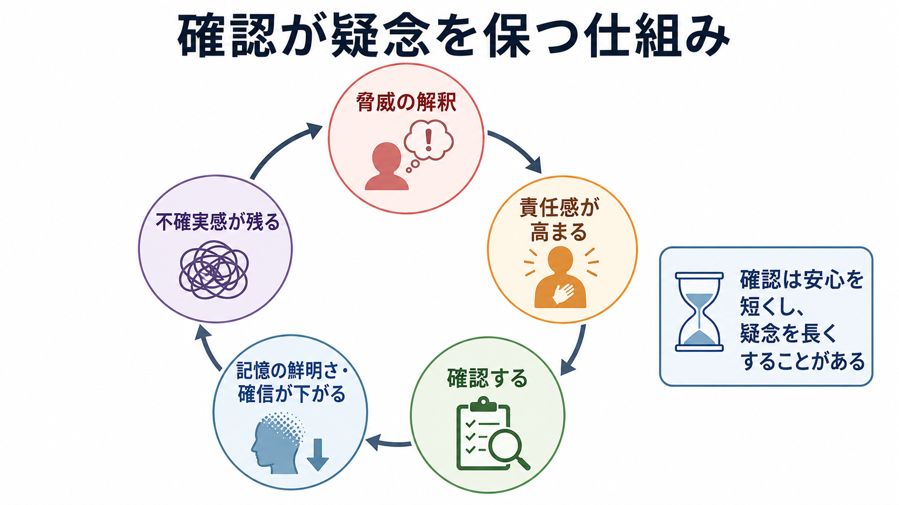
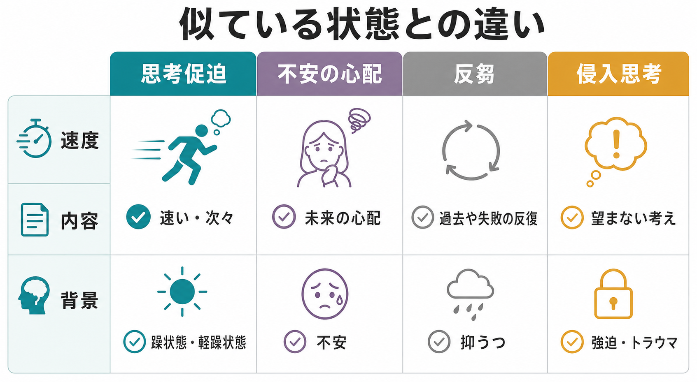
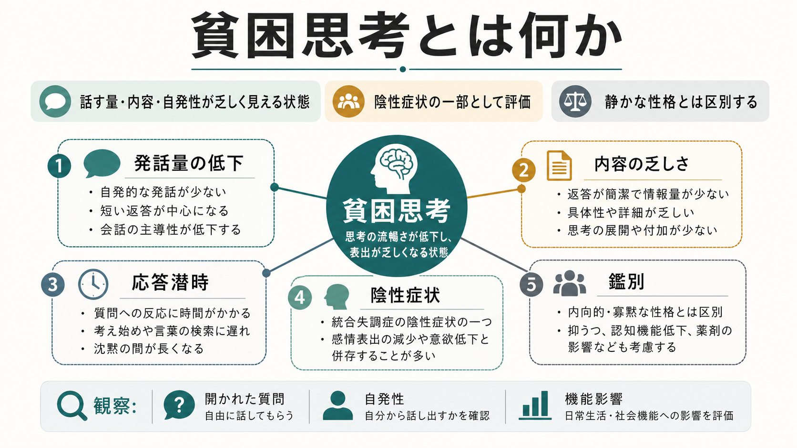

# 思考促迫とは何か

## 要点

- 思考促迫とは、考えが速く、量も多く、次々に浮かんで止まりにくい主観的体験である。発話として観察されると、話題が次々に飛ぶ「観念奔逸」として記述されやすい。
- [[躁状態とは何か]]や[[軽躁状態とは何か]]では、思考促迫は多弁、睡眠欲求低下、注意散漫、活動性上昇とまとまって現れやすい[1][2]。
- ただし、思考促迫は双極性障害だけに限られない。不安、混合状態、抑うつ、ADHD、不眠などでも「頭が止まらない」と表現されることがある[3][4][5]。
- 臨床的には「考えが速い」という一語だけで判断せず、気分、エネルギー、睡眠、発話、注意、判断、生活への影響を一緒に見る必要がある。
- 本記事は教育・研究目的の整理であり、個別の診断や治療指示ではない。

## この記事で答える問い

1. 思考促迫は、単に「頭の回転が速い」ことと何が違うのか。
2. なぜ[[躁状態とは何か]]や[[軽躁状態とは何か]]で重要な症状になるのか。
3. [[不安とは何か]]、[[侵入思考とは何か]]、[[強迫観念とは何か]]、反芻とはどう区別するのか。
4. 臨床・研究では、思考促迫をどのような観点で評価するのか。

## まず結論

思考促迫は、「考えが速い」という能力の高さではなく、思考の速度・量・切り替わりが本人の制御を超えて高まり、会話、注意、睡眠、判断、生活機能に影響する状態として理解するとよい。躁状態や軽躁状態では、思考促迫は多弁、観念奔逸、睡眠欲求低下、活動性上昇、誇大性、リスク行動などと一緒に現れやすく、診断分類上も重要な症状として扱われる[1][2]。

一方で、思考促迫に似た「頭が止まらない」体験は、不安や抑うつでも起こる。不安では未来の危険や失敗についての心配が反復しやすく、抑うつでは過去の失敗や自己評価に関する反芻が続きやすい[7][8]。したがって、鑑別の鍵は「速いかどうか」だけではなく、気分の高揚・易怒性、主観的エネルギー、睡眠欲求、発話の圧力、注意散漫、本人にとって快か苦痛か、周囲から見た変化である。

## 背景

英語圏の精神医学では、思考促迫に近い語として *racing thoughts* が使われる。これは主観的には「思考が加速し、過剰に産出される」体験を指す。発話に現れると *flight of ideas*、すなわち観念奔逸として観察される[3]。

DSM-5 系の整理を踏まえた CANMAT/ISBD ガイドラインでは、躁病エピソードにおいて「観念奔逸または思考が駆け巡る主観的体験」は、睡眠欲求低下、多弁、注意散漫、目標志向性活動の増加、リスクの高い活動などと並ぶ症状として扱われている[1]。ICD-11 でも、躁病・軽躁病では気分の変化と活動性またはエネルギーの増加を入口に、観念奔逸、睡眠欲求低下、多弁、注意散漫などを組み合わせて評価する[2]。

つまり、思考促迫は単独の「診断名」ではない。[[精神症候学とは何か]]の観点では、気分、思考、発話、行動、睡眠、注意の複数領域をつなぐ症候として読む必要がある。

## 基本概念

### 思考促迫

思考促迫は、考えが次々に浮かび、連想が速く、ひとつの考えに留まりにくい状態である。本人は「頭の中が忙しい」「考えが走る」「話したいことが多すぎる」「寝ようとしても考えが止まらない」と表現することがある。

重要なのは、思考促迫が主観的体験である点である。本人が「頭の中ではすごい速さで考えが動いている」と感じても、外からは必ずしも発話の乱れが見えないことがある。

### 観念奔逸

観念奔逸は、思考の加速が発話に表れ、話題が連想に沿って急速に移り変わる状態である。聞き手からは、話が途切れず、次々に別の話題へ飛び、中心テーマに戻りにくいように見える。思考促迫が「内側の速度」だとすれば、観念奔逸は「外に出た連想の飛び方」と言える。

### 多弁・談話圧迫との関係

[[躁状態とは何か]]や[[軽躁状態とは何か]]では、思考促迫が多弁や談話圧迫と結びつきやすい。話す量が増えるだけでなく、話し続けたい内的圧力が強く、相手が割り込んでも止まりにくいことがある[1]。ただし、多弁だけで思考促迫と決めることはできない。社交性、緊張、文化的背景、発達特性、薬物・物質、睡眠不足なども確認する。

## 仕組み

思考促迫は、単一の脳部位や単一の神経伝達物質だけで説明できる現象ではない。実用的には、次の複数の層が重なった状態として理解しやすい。

1つ目は、覚醒とエネルギーの上昇である。躁状態・軽躁状態では、主観的エネルギーが高まり、睡眠欲求が低下し、行動や発話が増える。この流れの中で、思考の速度と量も増えやすい[1][2]。

2つ目は、注意のフィルタリング低下である。周囲の刺激、連想、記憶、計画、欲求が同時に入り込み、どれを捨てるかの選択が難しくなると、考えが次々に切り替わる。これは[[注意障害とは何か]]や[[焦燥とは何か]]とも接続する。

3つ目は、睡眠と概日リズムの乱れである。睡眠欲求低下や不眠は、気分、注意、実行機能、情動調整を不安定にし、思考の過活動を強める可能性がある。不眠研究でも、racing thoughts は気分と睡眠の接点として注目されている[6]。

4つ目は、情動の方向づけである。躁的な文脈では、思考促迫が「アイデアが湧く」「頭が冴える」と快く感じられることがある。一方、不安や抑うつの文脈では、「嫌な考えが止まらない」「心配が連鎖する」と苦痛を伴いやすい[3][7][8]。

## 図解

思考促迫を見分けるときは、次のように「速度」だけでなく、内容、背景、外から見える変化を分けると整理しやすい。

| 観点 | 思考促迫 | 不安の心配 | 反芻 | 侵入思考 |
|---|---|---|---|---|
| 主な体験 | 考えが速く次々に浮かぶ | 未来の危険や失敗を心配する | 過去の失敗や自己評価を反復する | 望まない考えが突然浮かぶ |
| 情動 | 高揚、易怒性、焦燥、苦痛など | 緊張、警戒、落ち着かなさ | 抑うつ、後悔、無力感 | 不快感、恐怖、違和感 |
| 関連しやすい状態 | 躁状態、軽躁状態、混合状態、ADHD、不眠 | [[不安とは何か]]、全般不安、パニック関連 | [[抑うつ気分とは何か]]、反復的否定思考 | [[侵入思考とは何か]]、[[強迫観念とは何か]]、トラウマ関連 |
| 見るポイント | 睡眠欲求、活動性、多弁、観念奔逸 | 心配の対象、制御困難、身体緊張 | 過去志向、自己批判、停滞感 | 自我違和感、回避、儀式行為 |

## 臨床・研究との接続

### 躁状態・軽躁状態との接続

思考促迫が最も古典的に問題になるのは、躁状態・軽躁状態である。躁病エピソードでは、気分の高揚または易怒性、活動性やエネルギーの増加に加えて、睡眠欲求低下、多弁、観念奔逸、注意散漫、目標志向性活動の増加、リスク行動などがまとまって評価される[1][2]。

このとき、本人は「頭がよく回る」と感じるかもしれない。しかし周囲から見ると、話題が飛ぶ、判断が粗くなる、予定を詰め込みすぎる、支出や対人行動が増える、睡眠が短くても疲れを訴えない、といった変化として現れることがある。本人の主観だけでなく、家族、同僚、記録、睡眠パターンなどの情報が重要になる。

### 不安との接続

不安でも「頭が止まらない」という訴えはよくある。NIMH は全般不安症の特徴として、日常的な事柄への過剰な心配、心配の制御困難、落ち着かなさ、集中困難、睡眠困難などを挙げている[7]。この場合、思考の中心は「将来の危険」「失敗したらどうなるか」「安全を確認したい」という方向に偏りやすい。

研究上も、racing thoughts の尺度得点は不安症状と関連することが示されている[4]。したがって、不安があるから思考促迫ではない、とは言えない。むしろ、思考の速度、心配の反復、身体的過覚醒、睡眠困難が重なっている可能性を考える。

### 反芻・心配との接続

心配と反芻は、反復的否定思考として横断診断的に研究されている。心配は未来志向、反芻は過去や現在の苦痛・失敗・自己評価に向きやすいが、どちらも不安症や抑うつの併存と関連する[8]。

思考促迫との違いは、反復の質にある。反芻や心配は同じテーマに戻り続けることが多い。一方、躁的な思考促迫では、アイデアや連想が広がり、テーマが速く切り替わることがある。ただし混合状態や不眠では、速さと苦痛、広がりと反復が混ざるため、きれいに分けられないことも多い。

### ADHD・不眠との接続

成人ADHDでも、内的落ち着かなさや racing thoughts に似た体験が報告される。ADHD を対象にした研究では、racing thoughts は情動調整、循環気質、不安、不眠と関連し、双極性障害との鑑別を単独で決める指標にはなりにくいとされる[5]。

この点は実践的に重要である。思考促迫らしい訴えがあっても、エピソード性の気分変化があるのか、幼少期から持続する注意・多動性の特徴なのか、睡眠不足や不安で増悪しているのかを分けて聞く必要がある。

## よくある誤解

### 「頭の回転が速い人」は思考促迫である

違う。創造性、知的処理速度、話好き、仕事の多忙さは、それだけでは症状ではない。症状として問題になるのは、本人の制御を超え、睡眠、注意、判断、会話、対人関係、仕事や学業に影響する場合である。

### 思考促迫があれば必ず双極性障害である

違う。思考促迫は躁状態・軽躁状態で重要だが、抑うつ、混合状態、不安、ADHD、不眠、物質使用、薬剤、身体疾患などでも似た訴えが起こりうる[3][5][6]。診断名ではなく、症候として文脈の中で読む。

### 思考促迫はいつも本人にとって苦痛である

必ずしもそうではない。躁的な文脈では快い、創造的、冴えていると感じられることがある。一方、抑うつや不安の文脈では苦痛、疲労、眠れなさ、制御不能感として現れやすい[3]。

### 観念奔逸と思考促迫は同じである

重なるが、完全には同じではない。思考促迫は主観的な思考の加速を指し、観念奔逸はそれが発話や会話の流れとして観察される場合に使われやすい。臨床では、本人の訴えと観察可能な発話の両方を見る。

## 関連ノート

- [[躁状態とは何か]]
- [[軽躁状態とは何か]]
- [[不安とは何か]]
- [[過覚醒とは何か]]
- [[焦燥とは何か]]
- [[注意障害とは何か]]
- [[侵入思考とは何か]]
- [[強迫観念とは何か]]
- [[抑うつ気分とは何か]]
- [[精神症候学とは何か]]

### MOC更新候補

- `content/00_MOC/` 配下の精神医学・症候学関連 MOC に、本記事 `[[思考促迫とは何か]]` を追加する候補。
- 並列ジョブとの競合を避けるため、本記事作成時点では MOC ファイルは更新しない。

### 今後の作成候補

- 観念奔逸とは何か
- 多弁とは何か
- 談話圧迫とは何か
- 反芻とは何か
- racing thoughts と crowded thoughts は何が違うのか

## 理解チェック

1. 思考促迫を評価するとき、なぜ「考えが速い」だけでなく睡眠、活動性、発話、注意を見る必要があるのか。
2. 躁状態・軽躁状態での思考促迫と、不安による心配の反復は、どの観点で区別できるか。
3. 思考促迫が本人にとって快く感じられる場合、臨床的に見落としやすいリスクは何か。
4. ADHD や不眠で racing thoughts に似た訴えが出る場合、双極性障害との鑑別で何を確認すべきか。

## 未解決問題

- 思考促迫、観念奔逸、反芻、心配、マインドワンダリングを、主観報告・行動課題・生理指標でどこまで分けられるか。
- racing thoughts と crowded thoughts の区別が、混合状態や抑うつ状態の評価にどれほど役立つか。
- 睡眠介入、気分安定化、注意制御、反復的否定思考への介入が、思考促迫のどの側面に効くのか。
- 日本語の「思考促迫」「観念奔逸」「頭が回る」「考えが止まらない」という表現の臨床的対応関係。

## 参考文献

[1] Yatham LN, Kennedy SH, Parikh SV, et al. (2018). Canadian Network for Mood and Anxiety Treatments and International Society for Bipolar Disorders 2018 guidelines for the management of patients with bipolar disorder. *Bipolar Disorders*, 20(2), 97-170. https://pmc.ncbi.nlm.nih.gov/articles/PMC5947163/

[2] Reed GM, First MB, Kogan CS, et al. (2019). Innovations and changes in the ICD-11 classification of mental, behavioural and neurodevelopmental disorders. *World Psychiatry*, 18(1), 3-19. https://doi.org/10.1002/wps.20611

[3] Piguet C, Dayer A, Kosel M, Desseilles M, Vuilleumier P, Bertschy G. (2010). Phenomenology of racing and crowded thoughts in mood disorders: a theoretical reappraisal. *Journal of Affective Disorders*, 121(3), 189-198. https://doi.org/10.1016/j.jad.2009.05.006

[4] Weiner L, Ossola P, Causin JB, et al. (2019). Racing thoughts revisited: A key dimension of activation in bipolar disorder. *Journal of Affective Disorders*, 255, 69-76. https://doi.org/10.1016/j.jad.2019.05.033

[5] Martz E, Bertschy G, Kraemer C, Weibel S, Weiner L. (2021). Beyond motor hyperactivity: Racing thoughts are an integral symptom of adult attention deficit hyperactivity disorder. *Psychiatry Research*, 301, 113988. https://doi.org/10.1016/j.psychres.2021.113988

[6] Weiner L, Martz E, Kilic-Huck U, et al. (2021). Investigating racing thoughts in insomnia: A neglected piece of the mood-sleep puzzle? *Comprehensive Psychiatry*, 111, 152271. https://doi.org/10.1016/j.comppsych.2021.152271

[7] National Institute of Mental Health. Generalized Anxiety Disorder: What You Need to Know. https://www.nimh.nih.gov/health/publications/generalized-anxiety-disorder-gad

[8] McEvoy PM, Watson H, Watkins ER, Nathan P. (2013). The relationship between worry, rumination, and comorbidity: evidence for repetitive negative thinking as a transdiagnostic construct. *Journal of Affective Disorders*, 151(1), 313-320. https://doi.org/10.1016/j.jad.2013.06.014
