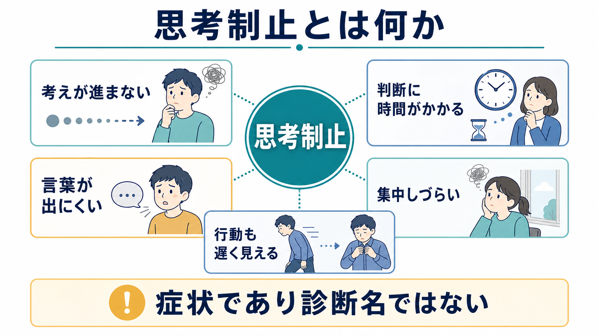
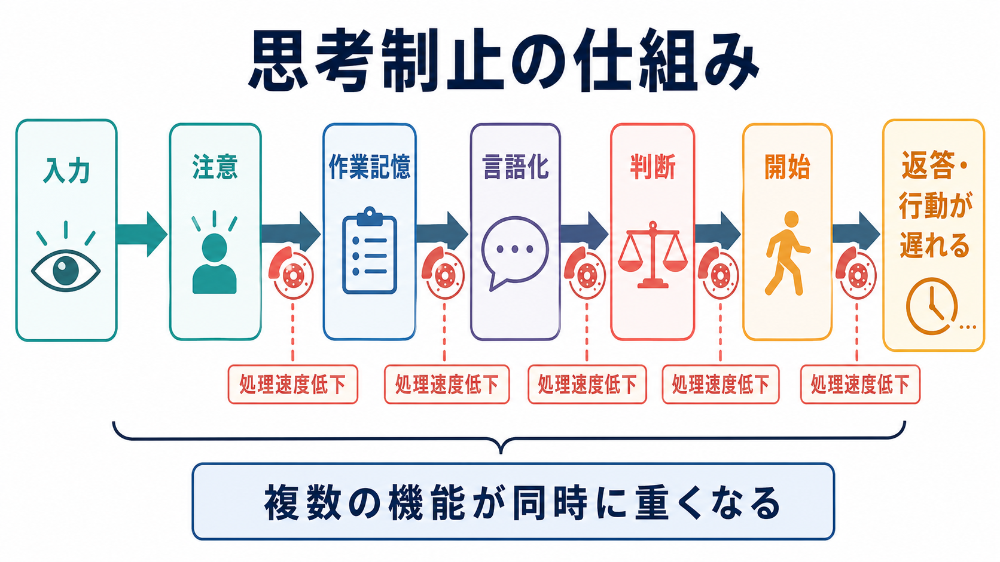
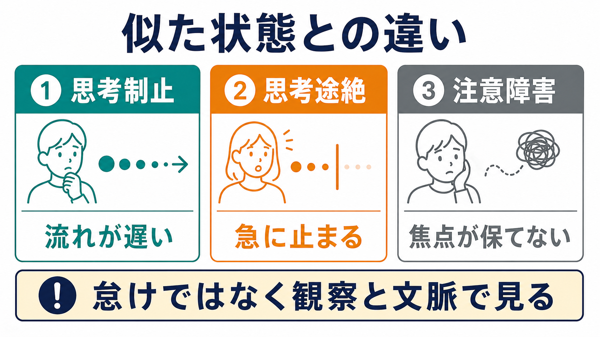

# 思考制止とは何か

## 要点

- 思考制止とは、考えの速度や流れが遅くなり、質問に答える、判断する、言葉にする、行動を始めるまでに時間がかかる状態を指す。
- それ自体は診断名ではなく、[[精神症候学とは何か]]で観察・記述される症候である。
- うつ病圏の[[精神運動制止とは何か|精神運動制止]]と重なりやすく、DSM-5系の大うつ病エピソード基準にも「考える・集中する能力の低下」や精神運動性の制止が含まれる[1]。
- ただし、[[思考途絶とは何か|思考途絶]]、[[注意障害とは何か|注意障害]]、せん妄、薬剤・身体疾患、強い不安、強迫的な反復思考とは区別して評価する必要がある[2][3]。
- 本稿は教育・研究目的の整理であり、個別の診断や治療指示ではない。

## この記事で答える問い

1. 思考制止とは、日常的な「頭が回らない」と何が違うのか。
2. なぜ思考・発話・行動が一緒に遅く見えることがあるのか。
3. 臨床面接や研究では、どのような観察点につなげて考えるのか。
4. 似た状態とどう区別するのか。

## まず結論

思考制止は、「考える内容がない」状態ではなく、考えを進める速度、切り替え、言語化、判断、行動開始が重くなる状態である。本人は「頭に霧がかかった」「考えがまとまらない」「答えたいのに出てこない」と感じることがあり、面接者からは返答潜時の延長、短い返答、声量低下、表情や動作の少なさとして見えることがある。

重要なのは、これを「怠け」「意志の弱さ」「性格」と短絡しないことである。精神運動制止のレビューでは、制止は運動、精神活動、発話を含む広い行為全体の遅さとして整理され、抑うつの重症度、メランコリー性、双極性うつ病、治療経過の評価とも関連して検討されてきた[4][5]。

## 背景

精神科の面接では、何を話したかだけでなく、どの速度で、どのような間を置き、どの程度まとまって話したかを観察する。[[MSEで思考過程をどう評価するか]]や[[MSEで話し方から何がわかるのか]]では、思考過程、発話量、速度、返答潜時、話題の連続性、注意・集中、意識水準を合わせて見る[3]。

うつ病では、気分の落ち込みや興味の低下だけでなく、疲労感、集中困難、決断困難、動作・発話の遅さが生じうる。NIMH は、うつ病の症状として「集中・記憶・意思決定の困難」や「エネルギー低下・遅くなった感じ」を挙げている[6]。DSM-5系の大うつ病エピソード基準でも、精神運動性の焦燥または制止は「他者から観察可能」な変化として扱われ、考える・集中する能力の低下や決断困難も主要症状の一つに含まれる[1]。

## 基本概念

### 思考制止

思考制止は、思考の流れが遅くなり、次の考えに進む、複数の情報を保持する、意味をまとめる、返答を選ぶといった過程が滞る状態である。本人の内的体験としては「考えたいのに進まない」が中心で、外からは返答の遅さや発話量の減少として見える。

この点で、思考制止は[[認知機能障害とは何か]]や[[実行機能障害とは何か]]と接点をもつ。ただし、思考制止という用語は、神経心理検査で測られる単一の認知領域名というより、面接場面で見える「考えの進みにくさ」を記述する症候学的な言葉である。

### 精神運動制止との関係

思考制止は、しばしば精神運動制止の一部として理解できる。精神運動制止は、動作、表情、発話、反応、精神活動が全体として遅くなる状態であり、抑うつ症候群の中で古くから重視されてきた[4][5]。思考制止だけを切り出して見ると「頭の中の遅さ」に見えるが、実際の面接では声、表情、姿勢、行動開始、生活機能の低下と一緒に現れることが多い。

### 診断名ではなく観察所見

思考制止は「うつ病そのもの」ではない。抑うつ状態でよく見られるが、睡眠不足、せん妄、認知症、脳血管障害、甲状腺機能低下、薬剤、物質使用、強い不安、慢性疼痛などでも似た遅さは生じうる。したがって、[[抑うつ気分とは何か]]、[[意識障害とは何か]]、[[せん妄とは何か]]、身体症状、服薬歴、生活史を合わせて評価する。

## 仕組み

思考制止を一つの原因で説明するのは難しい。臨床的には、少なくとも次の機能が同時に重くなると考えると理解しやすい。

| 機能 | 思考制止で起きやすい変化 | 面接で見える例 |
|---|---|---|
| 注意 | 質問に焦点を合わせ続けにくい | 質問を聞き返す、途中で止まる |
| 作業記憶 | 質問内容や自分の答えを保持しにくい | 返答を作る前に沈黙が長くなる |
| 言語化 | 考えを言葉へ変換しにくい | 短い返答、語数の減少 |
| 判断 | 選択肢を決めにくい | 「わからない」が増える、決断が遅い |
| 開始 | 発話や行動を始めにくい | 促されても開始まで時間がかかる |

レビュー研究では、抑うつにおける精神運動制止は、前頭前野、基底核、ドパミン系、運動・報酬・認知制御ネットワークなどとの関連が検討されている[4][5]。ただし、これらは「この回路が悪いから思考制止が起きる」と単純に診断するための知識ではない。面接所見、生活機能、身体疾患、薬剤、時間経過を統合して読むための作業仮説である。

## 図解

上の図では、思考制止を「入力から返答・行動までの連鎖が全体に遅くなる状態」として示した。日常会話では、相手の質問を聞き、注意を向け、短時間保持し、意味を探し、言葉にし、返答を始める。この各段階のどこか一つだけでなく、複数の段階が同時に重くなると、本人には「考えが進まない」、周囲には「反応が遅い」と見える。

似た状態との違いは次のように整理できる。

| 状態 | 中心になる特徴 | 区別のポイント |
|---|---|---|
| 思考制止 | 流れが遅い | 発話・判断・行動開始が全体に遅い |
| 思考途絶 | 途中で急に止まる | ある時点で文脈が切れ、再開が難しい |
| 注意障害 | 焦点が保てない | 意識水準、せん妄、睡眠、薬剤を確認する |
| 強迫的な反復思考 | 同じ内容が反復する | 速度低下より、反復性・侵入性・不安低減行動を見る |
| 意欲低下 | 始める力が落ちる | 「考えられない」のか「やる意味が持てない」のかを分ける |

## 臨床・研究との接続

### 面接での観察

臨床では、思考制止を「本人の訴え」だけでなく「観察できる変化」として記録する。たとえば、質問から返答までの時間、返答の長さ、声の大きさ、話題の切り替え、表情、姿勢、身振り、入退室や着席動作、生活行為の開始困難を合わせて見る[3]。

記載例としては、「質問への返答潜時が長く、短句で答える。話題理解は保たれるが、考えをまとめるまでに時間を要する。表情・身振りは乏しく、精神運動制止を伴う」のように、観察事実と解釈を分けるとよい。

### うつ病・メランコリー性との関係

精神運動制止は、メランコリー性うつ病や精神病性うつ病の評価でとくに注目されてきた。CORE 尺度は、精神運動性の障害を観察する代表的な尺度として用いられ、制止、非相互性、焦燥などの側面を測る研究に使われている[7][8]。ただし、尺度は補助であり、診断や重症度判断は症状のまとまり、持続、生活機能、リスク、身体・薬剤要因を含めて行う。

### 安全性と機能評価

思考制止が強いと、食事、服薬、受診、連絡、金銭管理、危険回避などの生活行為が遅れやすい。[[希死念慮とは何か]]や自殺リスクが疑われる場合には、思考が遅いから危険が低いとは考えない。返答が遅い人ほど、苦痛や危険を言語化できていない可能性もあるため、状況確認と支援資源の確保が重要になる。

## よくある誤解

### 誤解1: 「黙っているなら考えていない」

思考制止では、考えが完全にないのではなく、考えを進め、まとめ、言語化する過程が遅くなる。本人は強い努力感を伴っていることがある。

### 誤解2: 「思考制止があれば、うつ病で決まり」

思考制止はうつ病で重要だが、診断名ではない。[[意識障害とは何か]]、[[せん妄とは何か]]、身体疾患、薬剤、物質、睡眠不足、強い不安、神経認知障害を鑑別する。

### 誤解3: 「本人のやる気を出させれば解決する」

思考制止は、意志の問題として扱うと見誤りやすい。精神運動制止の研究は、制止が運動、認知、発話、神経回路、抑うつ重症度と結びつく現象であることを示している[4][5]。

### 誤解4: 「主観だけを聞けば十分」

本人の「頭が回らない」という訴えは重要だが、観察所見も必要である。返答潜時、発話量、行動開始、表情、注意、意識水準、生活機能を合わせて記録する[3]。

## 関連ノート

既存ノート:

- [[精神症候学とは何か]]
- [[精神運動制止とは何か]]
- [[思考途絶とは何か]]
- [[抑うつ気分とは何か]]
- [[注意障害とは何か]]
- [[実行機能障害とは何か]]
- [[認知機能障害とは何か]]
- [[せん妄とは何か]]
- [[意識障害とは何か]]
- [[強迫観念とは何か]]
- [[MSEで思考過程をどう評価するか]]
- [[MSEで話し方から何がわかるのか]]

今後の作成候補:

- 反芻思考とは何か
- 決断困難とは何か
- うつ病の認知症状とは何か
- 精神運動制止をどう観察するか

MOC更新候補:

- `content/00_MOC/` 配下の精神医学・症候学関連 MOC に `[[思考制止とは何か]]` を追加する候補。並列生成ジョブとの競合を避けるため、本タスクでは MOC 本体は更新しない。

## 理解チェック

1. 思考制止が「診断名」ではなく「症候」であると言える理由は何か。
2. 思考制止と[[思考途絶とは何か|思考途絶]]を区別するとき、どのような時間的パターンを見るか。
3. 思考制止を「怠け」とみなすと、臨床的にどのような見落としが起こりうるか。
4. 面接で思考制止を記録するとき、主観的訴え以外にどの観察項目を入れるとよいか。
5. せん妄、薬剤、身体疾患を鑑別に入れる理由は何か。

## 未解決問題

- 思考制止を、発話解析、反応時間、行動センサー、神経心理検査でどこまで再現性高く測定できるか。
- 抑うつの精神運動制止、神経認知障害、薬剤性の遅さを、短時間の面接でどの程度区別できるか。
- 文化、年齢、言語、教育歴によって「返答が遅い」と判断される基準がどう変わるか。
- 研究で得られた前頭前野・基底核・ドパミン系の知見を、個別の臨床評価へどう慎重に接続するか。

## 参考文献

[1] Endotext. Table 1, DSM-5 "Major" Depressive Episode. NCBI Bookshelf. https://www.ncbi.nlm.nih.gov/books/NBK498652/table/depress-diab.T.dsm5__major_depressive_ep/

[2] World Health Organization. (2024). *Clinical descriptions and diagnostic requirements for ICD-11 mental, behavioural and neurodevelopmental disorders*. WHO. https://www.who.int/publications/i/item/9789240077263

[3] Voss, R. M., & Das, J. M. (2024). Mental Status Examination. *StatPearls*. NCBI Bookshelf. https://www.ncbi.nlm.nih.gov/books/NBK546682/

[4] Buyukdura, J. S., McClintock, S. M., & Croarkin, P. E. (2011). Psychomotor retardation in depression: biological underpinnings, measurement, and treatment. *Progress in Neuro-Psychopharmacology & Biological Psychiatry, 35*(2), 395-409. https://doi.org/10.1016/j.pnpbp.2010.10.019

[5] Bennabi, D., Vandel, P., Papaxanthis, C., Pozzo, T., & Haffen, E. (2013). Psychomotor retardation in depression: a systematic review of diagnostic, pathophysiologic, and therapeutic implications. *BioMed Research International, 2013*, 158746. https://doi.org/10.1155/2013/158746

[6] National Institute of Mental Health. (2024). *Depression*. https://www.nimh.nih.gov/health/publications/depression

[7] Parker, G., Hadzi-Pavlovic, D., Wilhelm, K., Hickie, I., Brodaty, H., Boyce, P., Mitchell, P., & Eyers, K. (1994). Defining melancholia: properties of a refined sign-based measure. *British Journal of Psychiatry, 164*(3), 316-326. https://doi.org/10.1192/bjp.164.3.316

[8] Bingham, K. S., Neufeld, N. H., Alexopoulos, G. S., Marino, P., Mulsant, B. H., Rothschild, A. J., Voineskos, A. N., Whyte, E. M., Meyers, B. S., & Flint, A. J. (2022). Factor analysis of the CORE measure of psychomotor disturbance in psychotic depression: Findings from the STOP-PD II study. *Psychiatry Research, 314*, 114648. https://doi.org/10.1016/j.psychres.2022.114648
