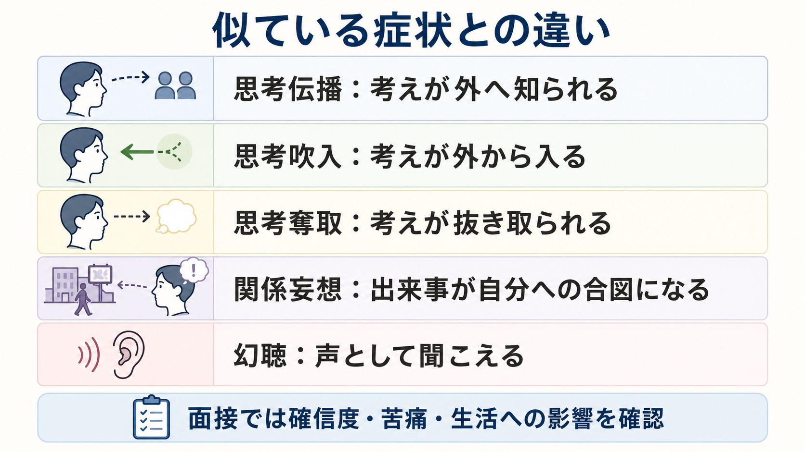
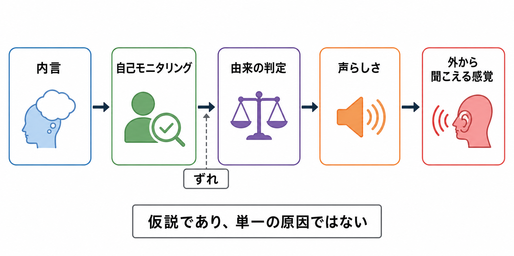
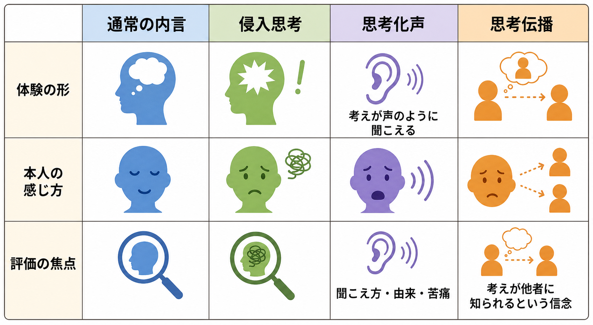

# 思考化声とは何か

## 要点

- 思考化声とは、自分の考えが「声」として聞こえる、または考えが声に変わって響くように体験される症状である。英語では thought echo や audible thoughts と呼ばれ、広くは「自分の思考を聞く」体験を指す[1]。
- 歴史的には Schneider の第一級症状の一つとして、統合失調症の診断で重視されてきた。ただし、第一級症状は現在では「それだけで診断を決める所見」ではなく、他の症状、経過、機能低下、物質・身体疾患、文化的文脈と合わせて評価する[2][3]。
- 体験の中心は、[[幻聴とは何か|幻聴]]に近い「聞こえ方」と、[[精神症候学とは何か|精神症候学]]でいう思考の自我障害に近い「自分の考えなのに自分の内側に収まらない感じ」の交差点にある。
- 機序としては、内言、音声イメージ、自己モニタリング、ソースモニタリング、予測処理のずれが検討されている。ただし、単一のメカニズムで説明しきれるとは限らない[4][5][6][7]。
- 本稿は教育・研究目的の整理であり、個別の診断や治療指示ではない。苦痛、安全上の懸念、生活への影響がある場合は、専門家による評価が必要である[8]。

## この記事で答える問い

1. 思考化声は、通常の内言や[[侵入思考とは何か|侵入思考]]と何が違うのか。
2. 思考化声は、[[幻聴とは何か|幻聴]]なのか、思考の自我障害なのか。
3. 「自分の考えが声になる」という体験を、臨床・研究ではどの軸で整理すればよいのか。
4. 思考化声を、思考伝播、思考吹入、思考奪取、[[妄想とは何か|妄想]]とどう区別するのか。

## まず結論

思考化声は、「考えの内容」だけでなく、「その考えがどのような感覚形式で現れるか」が問題になる症状である。普通の内言では、言葉は頭の中で自分が考えているものとして保たれる。思考化声では、その言葉が声として聞こえる、耳元や頭の中で響く、少し遅れて反響する、誰かに読まれているように感じる、という形をとることがある[1][2]。

そのため、思考化声は[[幻覚とは何か|幻覚]]の一種としての側面と、思考が「自分のもの」としてまとまらない自我障害の側面をまたいでいる。聞こえる位置、声らしさ、本人の確信度、苦痛、他者に知られるという信念の有無を分けて聞くと、[[幻聴とは何か|幻聴]]、通常の内言、[[侵入思考とは何か|侵入思考]]、思考伝播との違いが見えやすい。

## 背景

思考化声は古典的精神病理学で重視されてきた症状である。Schneider の第一級症状では、「考えが声に出て聞こえる」体験が、声が自分を三人称で論評する体験、複数の声が会話する体験、思考吹入、思考奪取、思考伝播などと並べられた[2]。

ただし、現代の診断では、こうした症状を単独で「統合失調症に特異的」とは扱わない。ICD-11 でも、診断は幻覚、妄想、思考・行動のまとまり、陰性症状、経過、生活機能、除外すべき身体・物質要因を組み合わせて行う[3]。思考化声があるかどうかより、「どのような体験が、どのくらい持続し、どれほど本人を困らせ、どの文脈で生じているか」が重要である。

## 基本概念

### 思考化声の定義

狭くいえば、思考化声は「自分の考えが声として聞こえる」体験である。NCBI MedGen は thought echo を、考えが反響し、自分の思考を内的に経験しているときにそれを聞いているように感じる体験として定義している[1]。

古典的には、考えた直後に自分の思考が反響して聞こえる thought echo と、考えている同時に思考が音声化して聞こえる Gedankenlautwerden を区別する説明もある。ただし実際の面接では、本人の言葉がこの区別にきれいに収まらないことも多い。したがって、最初から専門用語に当てはめるより、本人が「声」「音」「頭の中の言葉」「外から来る感じ」をどう表現しているかを聞く必要がある。

### 通常の内言との違い

内言は、多くの人が経験する「頭の中で言葉を使って考える」働きである。通常は、自分が考えている、意図すれば止めたり変えたりできる、耳で聞く声とは違う、と感じられやすい。思考化声では、この内言に声らしさ、聞こえ方、反響、外部性、制御しにくさが加わる。

重要なのは、思考化声を「内言が少し強いだけ」と単純化しないことである。幻聴研究では、内言や音声イメージの自己モニタリング障害が有力な仮説として検討されてきた一方、典型的な幻聴は声色、位置、二人称・三人称性、感情的意味をもち、通常の内言とは現象学的に異なる点も多い[4][5]。

### 思考伝播との違い

思考伝播は「自分の考えが他者に知られている、伝わっている」という信念が中心である。思考化声は、まず「自分の考えが声として聞こえる」という知覚様式が中心になる。両者は重なることがあるが、評価では分けて聞く。

たとえば「考えが声として聞こえる」は思考化声に近い。一方、「声として聞こえるわけではないが、周囲の人が自分の考えを知っていると確信する」は思考伝播に近い。声として聞こえ、その声を通して他者に知られると感じる場合は、両方の要素が併存している可能性がある。

## 仕組み

思考化声の仕組みは、まだ一つの答えにまとまっていない。代表的には、次のような説明が検討されている。

1. 内言・音声イメージの外在化  
頭の中の言語活動や音声イメージが、自分で作ったものとして感じられず、声として経験されるという説明である。内言モデルは、聴覚性幻聴研究で広く検討されてきた[4][5]。

2. 自己モニタリングとソースモニタリングのずれ  
自分が作った思考・言葉・行為を「自分由来」と判定する仕組みが不安定になると、内的に生成された言葉が外から来たもののように感じられる可能性がある[5][6]。

3. 予測処理の不均衡  
脳は入力を受け取るだけでなく、何が聞こえるはずかを予測している。強い予測、注意、感情的意味づけ、曖昧な感覚入力が組み合わさると、内的な言語活動が声として経験されやすくなるという説明がある[7]。

4. 文脈と意味づけ  
同じ「声らしさ」でも、疲労、睡眠不足、孤立、ストレス、トラウマ、物質使用、文化的・宗教的文脈によって意味が変わる。本人にとって支配的で脅威的な体験か、距離を取れる体験かも臨床的には重要である[8]。

## 図解

上の図では、思考化声を「内的な言語活動が、自己モニタリングと由来の判定を経て、声らしい体験として現れる」という仮説で示した。これは便利な説明図であるが、「この順番で必ず起きる」という意味ではない。研究上も、内言、記憶、感情、注意、聴覚皮質、言語ネットワーク、社会的意味づけが複数の水準で関わると考えられている[4][6][7]。

次の比較表では、思考化声を通常の内言、侵入思考、思考伝播と分けている。実際には混在することがあるため、表は診断表ではなく、聞き取りの補助として使う。

## 臨床・研究との接続

### 面接で確認する軸

[[MSEで知覚異常をどう聞くか|MSEで知覚異常を聞く]]ときは、思考化声を単に「幻聴あり」と書くより、以下の軸に分けて記述するとよい。

| 軸 | 確認したいこと |
|---|---|
| 聞こえ方 | 声として聞こえるのか、頭の中の言葉なのか、音量・声色・位置はあるのか |
| 時間関係 | 考える前、同時、直後、少し遅れて反響するのか |
| 由来の感じ | 自分の考えだと分かるのか、誰かに言われているのか、外部から来る感じか |
| 確信度 | 「そう感じる」程度か、「実際に外から聞こえる」と確信しているか |
| 関連する信念 | 他者に知られる、吹き込まれる、抜き取られる、操作されるという信念があるか |
| 苦痛と機能 | 不安、恐怖、集中困難、睡眠障害、対人回避、生活機能低下があるか |
| 安全性 | 命令性、自己傷害・他害に関わる内容、衝動性、支援者の有無 |
| 背景 | 睡眠、物質・薬剤、身体疾患、ストレス、気分症状、トラウマ、文化的文脈 |

### 研究での位置づけ

思考化声は、[[幻聴とは何か|聴覚性幻聴]]研究、内言研究、自己感・主体感の研究、計算論的精神医学の予測処理モデルをつなぐ症状である。自己モニタリング仮説では、自分で作った言語活動の結果を予測し、その由来を自分に帰属する仕組みが問題になる[5][6]。予測処理の観点では、内的予測が感覚入力や注意をどのように重みづけるかが問題になる[7]。

一方で、思考化声をすべて「内言の誤帰属」として説明すると、声の人格性、感情的意味、対人関係、過去の経験、文化的文脈が抜け落ちやすい。研究でも臨床でも、機構仮説と現象学的記述の両方を保つ必要がある。

## よくある誤解

### 誤解1: 思考化声があれば統合失調症である

誤りである。思考化声は統合失調症スペクトラムで重要な症状になりうるが、単独で診断は決まらない。古典的な第一級症状は診断上重視されてきたが、現代の評価では経過、他の症状、生活機能、身体・物質要因、文化的文脈を合わせる[2][3]。

### 誤解2: 「自分の考え」なら幻聴ではない

単純には言えない。思考化声では、内容は自分の考えに近くても、形式は「声として聞こえる」ことがある。知覚様式、声らしさ、外部性、本人の確信度を分けて評価する。

### 誤解3: 思考化声はただの独り言である

独り言は実際に発声する行為である。思考化声は、発声していないのに考えが声として聞こえる体験である。本人が口に出しているか、周囲に音が聞こえるか、本人がどのように聞いているかを分ける。

### 誤解4: 内容だけを聞けば十分である

不十分である。内容が同じでも、本人がそれを自分の考えと感じるのか、外からの声と感じるのか、他者に知られていると確信するのかで臨床的意味は変わる。内容、聞こえ方、由来、確信度、苦痛、行動への影響を分けて聞く。

## 関連ノート

既存ノート:

- [[幻聴とは何か]]
- [[幻覚とは何か]]
- [[侵入思考とは何か]]
- [[妄想とは何か]]
- [[精神症候学とは何か]]
- [[MSEで知覚異常をどう聞くか]]
- [[MSEで思考内容をどう評価するか]]
- [[MSEで思考過程をどう評価するか]]
- [[DSMとICDは何が違うのか]]

今後の作成候補:

- 思考伝播とは何か
- 思考吹入とは何か
- 思考奪取とは何か
- Schneiderの第一級症状とは何か
- 内言とは何か
- ソースモニタリングとは何か

MOC更新候補:

- `content/00_MOC/MOC｜精神医学.md`
- `content/00_MOC/MOC｜神経科学と精神疾患.md`
- `content/00_MOC/MOC｜計算論的精神医学.md`

並列ジョブとの競合を避けるため、本タスクでは MOC 本体は更新していない。

## 理解チェック

1. 思考化声と通常の内言の違いを、「聞こえ方」と「由来の感じ」から説明できるか。
2. 思考化声と思考伝播の違いを、知覚様式と信念内容に分けて説明できるか。
3. 思考化声を評価するとき、内容以外に確認すべき軸を5つ以上挙げられるか。
4. 思考化声があっても、それだけで診断を決めてはいけない理由を説明できるか。
5. 内言モデル、自己モニタリング仮説、予測処理モデルが、それぞれ何を説明しようとしているかを区別できるか。

## 参考文献

[1] National Center for Biotechnology Information. (2026). *Thought echo (Concept Id: C0423997)*. MedGen. https://www.ncbi.nlm.nih.gov/medgen/602788

[2] Soares-Weiser, K., Maayan, N., Bergman, H., Davenport, C., Kirkham, A. J., Grabowski, S., & Adams, C. E. (2015). First rank symptoms for schizophrenia. *Cochrane Database of Systematic Reviews*. https://pmc.ncbi.nlm.nih.gov/articles/PMC7079421/

[3] World Health Organization. (2024). *Clinical descriptions and diagnostic requirements for ICD-11 mental, behavioural and neurodevelopmental disorders*. WHO. https://www.who.int/publications/i/item/9789240077263

[4] Waters, F., Allen, P., Aleman, A., Fernyhough, C., Woodward, T. S., Badcock, J. C., Barkus, E., Johns, L., Varese, F., Menon, M., Vercammen, A., & Laroi, F. (2012). Auditory hallucinations in schizophrenia and nonschizophrenia populations: A review and integrated model of cognitive mechanisms. *Schizophrenia Bulletin, 38*(4), 683-693. https://doi.org/10.1093/schbul/sbs045

[5] Allen, P., Aleman, A., & McGuire, P. K. (2007). Inner speech models of auditory verbal hallucinations: Evidence from behavioural and neuroimaging studies. *International Review of Psychiatry, 19*(4), 407-415. https://doi.org/10.1080/09540260701486498

[6] Barber, L., Reniers, R., & Upthegrove, R. (2021). A review of functional and structural neuroimaging studies to investigate the inner speech model of auditory verbal hallucinations in schizophrenia. *Translational Psychiatry, 11*, 582. https://doi.org/10.1038/s41398-021-01670-7

[7] Wilkinson, S., & Fernyhough, C. (2017). Auditory verbal hallucinations and inner speech: A predictive processing perspective. In Z. Radman (Ed.), *Before Consciousness: In Search of the Fundamentals of Mind*. NCBI Bookshelf. https://www.ncbi.nlm.nih.gov/books/NBK447654/

[8] National Institute for Health and Care Excellence. (2014, updated). *Psychosis and schizophrenia in adults: prevention and management* (NICE guideline CG178). https://www.nice.org.uk/guidance/cg178
